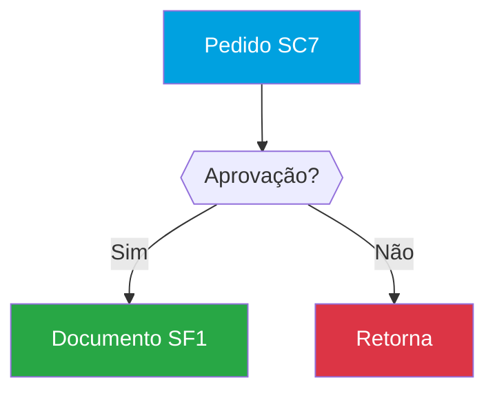

# UX Redesign Implementation Plan

> **For agentic workers:** REQUIRED: Use superpowers:subagent-driven-development (if subagents available) or superpowers:executing-plans to implement this plan. Steps use checkbox (`- [ ]`) syntax for tracking.

**Goal:** Redesign the ExtraiRPO frontend with TOTVS visual identity, premium markdown rendering with Mermaid flowcharts, and markdown export functionality.

**Architecture:** Replace the hand-coded HTML/CSS frontend with PrimeVue 4.x (Aura theme, TOTVS colors), swap `marked` for `markdown-it` with plugins (anchor, TOC, container, Mermaid, highlight.js), and add export endpoint in the existing `docs.py` router.

**Tech Stack:** Vue 3, PrimeVue 4 (Aura), markdown-it, Mermaid.js, highlight.js, file-saver, pyyaml (backend)

**Spec:** `docs/superpowers/specs/2026-03-18-ux-redesign-design.md`

---

## File Structure

### New Files (Frontend)

| File | Responsibility |
|------|---------------|
| `frontend/src/components/MarkdownViewer.vue` | Reusable markdown renderer: markdown-it, highlight.js, Mermaid, Accordion sections, TOC, search |
| `frontend/src/components/FlowDiagram.vue` | Generates Mermaid diagrams from YAML frontmatter (ia layer) |
| `frontend/src/components/ExportDialog.vue` | Modal for export options (layer, selection) |
| `frontend/src/composables/useMermaid.js` | Mermaid initialization + render helper |
| `frontend/src/composables/useMarkdown.js` | markdown-it setup with all plugins + ADVPL highlight |
| `frontend/src/assets/theme.css` | TOTVS design tokens + global overrides |

### Modified Files (Frontend)

| File | Changes |
|------|---------|
| `frontend/src/main.js` | PrimeVue plugin setup, theme import, ToastService |
| `frontend/index.html` | Title, Inter font link |
| `frontend/src/App.vue` | PrimeVue PanelMenu sidebar, Breadcrumb, Toast, TOTVS colors |
| `frontend/src/router.js` | Add route meta for breadcrumb labels |
| `frontend/src/views/PadraoView.vue` | 3-column layout, MarkdownViewer component |
| `frontend/src/views/ClienteView.vue` | 3-column layout, MarkdownViewer, FlowDiagram, TabView, export |
| `frontend/src/views/ChatView.vue` | MarkdownViewer for assistant output, TOTVS styling |
| `frontend/src/views/GerarDocsView.vue` | PrimeVue DataTable, Tag, Card components |
| `frontend/src/views/SetupView.vue` | PrimeVue Steps, Card, ProgressBar, DataTable |
| `frontend/src/views/ConfigView.vue` | PrimeVue form components, Card sections |

### Modified Files (Backend)

| File | Changes |
|------|---------|
| `backend/routers/docs.py` | Add `POST /api/docs/export`, modify `GET /api/docs/cliente/ia/{slug}` to return parsed frontmatter |
| `backend/services/doc_pipeline.py` | Add Mermaid flowchart instruction to DOC_GENERATION_PROMPT |
| `requirements.txt` | Add `pyyaml` |

---

## Chunk 1: Foundation — PrimeVue Setup + Theme + App Shell

### Task 1: Install Frontend Dependencies

**Files:**
- Modify: `frontend/package.json`

- [ ] **Step 1: Install PrimeVue and theme packages**

```bash
cd frontend && npm install primevue @primeuix/themes primeicons
```

- [ ] **Step 2: Install markdown-it and plugins**

```bash
cd frontend && npm install markdown-it markdown-it-anchor markdown-it-toc-done-right markdown-it-container
```

- [ ] **Step 3: Install Mermaid, highlight.js, file-saver**

```bash
cd frontend && npm install mermaid highlight.js file-saver
```

- [ ] **Step 4: Remove marked**

```bash
cd frontend && npm uninstall marked
```

- [ ] **Step 5: Verify package.json**

Run: `cd frontend && cat package.json`
Expected: `primevue`, `markdown-it`, `mermaid`, `highlight.js`, `file-saver` in dependencies. No `marked`.

- [ ] **Step 6: Commit**

```bash
git add frontend/package.json frontend/package-lock.json
git commit -m "chore: swap marked for markdown-it, add PrimeVue + Mermaid + highlight.js"
```

---

### Task 2: Create TOTVS Theme CSS

**Files:**
- Create: `frontend/src/assets/theme.css`

- [ ] **Step 1: Create theme file with TOTVS design tokens**

```css
/* TOTVS Design Tokens for ExtraiRPO */
@import url('https://fonts.googleapis.com/css2?family=Inter:wght@400;500;600;700&display=swap');
@import url('https://fonts.googleapis.com/css2?family=JetBrains+Mono:wght@400;500&display=swap');

:root {
  /* TOTVS Brand */
  --totvs-primary: #00a1e0;
  --totvs-primary-dark: #0080b3;
  --totvs-secondary: #f47920;
  --totvs-secondary-dark: #d4681a;

  /* Backgrounds */
  --bg-page: #f5f7fa;
  --bg-card: #ffffff;
  --bg-sidebar: #1e2a3a;
  --bg-sidebar-hover: #2a3a4e;
  --bg-sidebar-active: #0080b3;

  /* Text */
  --text-primary: #333333;
  --text-secondary: #666666;
  --text-muted: #999999;
  --text-on-primary: #ffffff;

  /* Status */
  --color-success: #28a745;
  --color-danger: #dc3545;
  --color-warning: #ffc107;

  /* Sizing */
  --sidebar-width: 240px;
  --doc-list-width: 220px;
  --toc-width: 180px;
}

/* Global resets */
* { margin: 0; padding: 0; box-sizing: border-box; }

body {
  font-family: 'Inter', -apple-system, BlinkMacSystemFont, 'Segoe UI', sans-serif;
  font-size: 14px;
  color: var(--text-primary);
  background: var(--bg-page);
}

code, pre {
  font-family: 'JetBrains Mono', 'Consolas', monospace;
  font-size: 13px;
}

/* PrimeVue token overrides */
.p-panelmenu .p-panelmenu-header-action {
  color: #ccc !important;
}

.p-panelmenu .p-panelmenu-header-action:hover {
  background: var(--bg-sidebar-hover) !important;
  color: white !important;
}

/* Markdown table styling (applied via post-process) */
.md-content table {
  width: 100%;
  border-collapse: collapse;
  margin: 1rem 0;
  font-size: 0.9rem;
}

.md-content table th {
  background: var(--totvs-primary);
  color: white;
  padding: 0.6rem 0.8rem;
  text-align: left;
  font-weight: 600;
}

.md-content table td {
  padding: 0.5rem 0.8rem;
  border-bottom: 1px solid #e0e0e0;
}

.md-content table tr:hover td {
  background: #f0f8ff;
}

/* Markdown code blocks */
.md-content pre {
  background: #1e2a3a;
  color: #e0e0e0;
  padding: 1rem;
  border-radius: 6px;
  overflow-x: auto;
  margin: 0.8rem 0;
  position: relative;
}

.md-content pre .copy-btn {
  position: absolute;
  top: 0.5rem;
  right: 0.5rem;
  background: rgba(255,255,255,0.1);
  color: #ccc;
  border: none;
  padding: 0.3rem 0.6rem;
  border-radius: 4px;
  cursor: pointer;
  font-size: 0.75rem;
}

.md-content pre .copy-btn:hover {
  background: rgba(255,255,255,0.2);
}

/* Mermaid diagram container */
.mermaid-diagram {
  background: white;
  border: 1px solid #e0e0e0;
  border-radius: 8px;
  padding: 1rem;
  margin: 1rem 0;
  text-align: center;
  cursor: pointer;
}

.mermaid-diagram:hover {
  border-color: var(--totvs-primary);
  box-shadow: 0 2px 8px rgba(0,161,224,0.1);
}

/* Custom markdown containers */
.md-content .custom-block {
  padding: 0.8rem 1rem;
  border-radius: 6px;
  margin: 0.8rem 0;
  border-left: 4px solid;
}

.md-content .custom-block.dica {
  background: #e8f5e9;
  border-color: var(--color-success);
}

.md-content .custom-block.alerta {
  background: #fff3e0;
  border-color: var(--color-warning);
}

.md-content .custom-block.aviso {
  background: #fce4ec;
  border-color: var(--color-danger);
}

/* Highlight.js theme override for dark blocks */
.hljs { background: transparent !important; }

/* Accordion sections in markdown */
.md-section-header {
  display: flex;
  align-items: center;
  gap: 0.5rem;
  font-size: 1.1rem;
  font-weight: 600;
  color: var(--text-primary);
}

/* TOC sidebar */
.toc-sidebar {
  position: sticky;
  top: 0;
  max-height: calc(100vh - 4rem);
  overflow-y: auto;
  padding: 1rem;
  font-size: 0.82rem;
}

.toc-sidebar a {
  display: block;
  color: var(--text-secondary);
  text-decoration: none;
  padding: 0.3rem 0.5rem;
  border-left: 2px solid transparent;
  border-radius: 2px;
  margin-bottom: 0.2rem;
}

.toc-sidebar a:hover {
  color: var(--totvs-primary);
}

.toc-sidebar a.active {
  color: var(--totvs-primary);
  border-left-color: var(--totvs-primary);
  font-weight: 600;
}

/* Search highlight in markdown */
.search-highlight {
  background: #fff176;
  padding: 0 2px;
  border-radius: 2px;
}
```

- [ ] **Step 2: Commit**

```bash
git add frontend/src/assets/theme.css
git commit -m "feat: add TOTVS design tokens and global theme CSS"
```

---

### Task 3: Setup PrimeVue in main.js

**Files:**
- Modify: `frontend/src/main.js` (currently 5 lines)
- Modify: `frontend/index.html` (update title)

- [ ] **Step 1: Rewrite main.js with PrimeVue setup**

Replace entire `frontend/src/main.js` with:

```javascript
import { createApp } from 'vue'
import PrimeVue from 'primevue/config'
import Aura from '@primeuix/themes/aura'
import ToastService from 'primevue/toastservice'
import 'primeicons/primeicons.css'
import './assets/theme.css'

import App from './App.vue'
import router from './router'

const app = createApp(App)

app.use(PrimeVue, {
  theme: {
    preset: Aura,
    options: {
      prefix: 'p',
      darkModeSelector: false,
      cssLayer: false
    }
  }
})

app.use(ToastService)
app.use(router)
app.mount('#app')
```

- [ ] **Step 2: Update index.html title**

In `frontend/index.html`, change:
```html
<title>Vite + Vue</title>
```
to:
```html
<title>ExtraiRPO — Documentação Inteligente Protheus</title>
```

- [ ] **Step 3: Verify build compiles**

Run: `cd frontend && npm run build`
Expected: Build succeeds with no errors.

- [ ] **Step 4: Commit**

```bash
git add frontend/src/main.js frontend/index.html
git commit -m "feat: setup PrimeVue 4 with Aura theme and ToastService"
```

---

### Task 4: Rewrite App.vue Shell

**Files:**
- Modify: `frontend/src/App.vue` (currently 54 lines)
- Modify: `frontend/src/router.js` (add route meta for breadcrumb)

- [ ] **Step 1: Update router.js with meta labels**

Replace entire `frontend/src/router.js` with:

```javascript
import { createRouter, createWebHistory } from 'vue-router'
import SetupView from './views/SetupView.vue'
import ChatView from './views/ChatView.vue'
import PadraoView from './views/PadraoView.vue'
import ClienteView from './views/ClienteView.vue'
import ConfigView from './views/ConfigView.vue'
import GerarDocsView from './views/GerarDocsView.vue'

const routes = [
  { path: '/', redirect: '/setup' },
  { path: '/setup', component: SetupView, meta: { label: 'Setup', icon: 'pi pi-cog' } },
  { path: '/chat', component: ChatView, meta: { label: 'Chat', icon: 'pi pi-comments' } },
  { path: '/gerar', component: GerarDocsView, meta: { label: 'Gerar Docs', icon: 'pi pi-file-edit' } },
  { path: '/padrao', component: PadraoView, meta: { label: 'Base Padrão', icon: 'pi pi-book' } },
  { path: '/cliente', component: ClienteView, meta: { label: 'Base Cliente', icon: 'pi pi-folder-open' } },
  { path: '/config', component: ConfigView, meta: { label: 'Configurações', icon: 'pi pi-sliders-h' } },
]

export default createRouter({ history: createWebHistory(), routes })
```

- [ ] **Step 2: Rewrite App.vue with PrimeVue sidebar**

Replace entire `frontend/src/App.vue` with:

```vue
<template>
  <div class="app-layout">
    <aside class="sidebar">
      <div class="sidebar-header">
        <div class="logo">ExtraiRPO</div>
        <div v-if="activeClient" class="client-badge">
          <i class="pi pi-building"></i>
          {{ activeClient }}
        </div>
      </div>
      <nav class="sidebar-nav">
        <router-link
          v-for="route in navRoutes"
          :key="route.path"
          :to="route.path"
          class="nav-item"
        >
          <i :class="route.meta.icon"></i>
          <span>{{ route.meta.label }}</span>
        </router-link>
      </nav>
    </aside>
    <div class="main-area">
      <header class="topbar">
        <Breadcrumb :model="breadcrumbItems" />
      </header>
      <main class="content">
        <router-view />
      </main>
    </div>
    <Toast position="bottom-right" />
  </div>
</template>

<script setup>
import { ref, computed, onMounted } from 'vue'
import { useRoute } from 'vue-router'
import Breadcrumb from 'primevue/breadcrumb'
import Toast from 'primevue/toast'
import api from './api'
import router from './router'

const route = useRoute()
const activeClient = ref('')

const navRoutes = computed(() =>
  router.getRoutes().filter(r => r.meta?.label)
)

const breadcrumbItems = computed(() => {
  const items = [{ label: 'Home', icon: 'pi pi-home', url: '/' }]
  if (route.meta?.label) {
    items.push({ label: route.meta.label })
  }
  return items
})

async function loadStatus() {
  try {
    const { data } = await api.get('/status')
    activeClient.value = data.active_client || ''
  } catch {}
}

onMounted(loadStatus)
</script>

<style>
.app-layout {
  display: flex;
  height: 100vh;
}

.sidebar {
  width: var(--sidebar-width, 240px);
  background: var(--bg-sidebar, #1e2a3a);
  color: white;
  display: flex;
  flex-direction: column;
  flex-shrink: 0;
}

.sidebar-header {
  padding: 1.2rem 1rem;
  border-bottom: 1px solid rgba(255,255,255,0.1);
}

.logo {
  font-size: 1.4rem;
  font-weight: 700;
  color: var(--totvs-primary, #00a1e0);
  letter-spacing: -0.5px;
}

.client-badge {
  margin-top: 0.6rem;
  background: rgba(0,161,224,0.15);
  color: var(--totvs-primary, #00a1e0);
  font-size: 0.75rem;
  font-weight: 600;
  padding: 0.35rem 0.6rem;
  border-radius: 4px;
  text-transform: uppercase;
  letter-spacing: 0.5px;
  display: flex;
  align-items: center;
  gap: 0.4rem;
}

.sidebar-nav {
  flex: 1;
  padding: 0.8rem 0.5rem;
  display: flex;
  flex-direction: column;
  gap: 0.2rem;
}

.nav-item {
  display: flex;
  align-items: center;
  gap: 0.7rem;
  padding: 0.65rem 0.8rem;
  color: #b0b8c4;
  text-decoration: none;
  border-radius: 6px;
  font-size: 0.9rem;
  font-weight: 500;
  transition: all 0.15s;
}

.nav-item:hover {
  background: var(--bg-sidebar-hover, #2a3a4e);
  color: white;
}

.nav-item.router-link-active {
  background: var(--totvs-primary, #00a1e0);
  color: white;
  font-weight: 600;
}

.nav-item i {
  font-size: 1rem;
  width: 20px;
  text-align: center;
}

.main-area {
  flex: 1;
  display: flex;
  flex-direction: column;
  overflow: hidden;
}

.topbar {
  padding: 0.6rem 1.5rem;
  background: var(--bg-card, #ffffff);
  border-bottom: 1px solid #e0e0e0;
}

.content {
  flex: 1;
  overflow-y: auto;
  padding: 1.5rem;
  background: var(--bg-page, #f5f7fa);
}
</style>
```

- [ ] **Step 3: Verify build and visual**

Run: `cd frontend && npm run build`
Expected: Build succeeds. Sidebar renders with TOTVS blue, navigation works, breadcrumb shows.

- [ ] **Step 4: Commit**

```bash
git add frontend/src/App.vue frontend/src/router.js
git commit -m "feat: App.vue shell with PrimeVue sidebar, breadcrumb, TOTVS theme"
```

---

## Chunk 2: Core Components — MarkdownViewer + Composables

### Task 5: Create useMarkdown Composable

**Files:**
- Create: `frontend/src/composables/useMarkdown.js`

- [ ] **Step 1: Create markdown-it setup with all plugins and ADVPL highlight**

```javascript
import MarkdownIt from 'markdown-it'
import anchor from 'markdown-it-anchor'
import tocPlugin from 'markdown-it-toc-done-right'
import container from 'markdown-it-container'
import hljs from 'highlight.js/lib/core'
import javascript from 'highlight.js/lib/languages/javascript'
import sql from 'highlight.js/lib/languages/sql'
import json from 'highlight.js/lib/languages/json'
import xml from 'highlight.js/lib/languages/xml'

// Register standard languages
hljs.registerLanguage('javascript', javascript)
hljs.registerLanguage('sql', sql)
hljs.registerLanguage('json', json)
hljs.registerLanguage('xml', xml)

// ADVPL/TLPP custom grammar (xBase-like)
hljs.registerLanguage('advpl', function () {
  return {
    case_insensitive: true,
    keywords: {
      keyword: 'function user static return local private public if else elseif endif do while enddo for to next step begin end sequence class method endclass endmethod data from of default as new self',
      built_in: 'MsgAlert MsgInfo MsgYesNo MsgStop DbSelectArea DbSetOrder DbSeek DbSkip DbGoTop DbGoBottom RecLock MsUnlock Replace Conout FwAlertSuccess RetSqlName GetNextAlias ExecAuto AllTrim cValToChar Str Val PadR PadL Iif Empty Len Upper Lower Substr At Alltrim',
      literal: '.T. .F. NIL',
    },
    contains: [
      { scope: 'comment', begin: '//', end: '$' },
      { scope: 'comment', begin: '/\\*', end: '\\*/' },
      { scope: 'string', begin: '"', end: '"' },
      { scope: 'string', begin: "'", end: "'" },
      { scope: 'number', begin: '\\b\\d+(\\.\\d+)?\\b' },
    ],
  }
})

function createCustomContainer(md, name) {
  container(md, name, {
    render(tokens, idx) {
      if (tokens[idx].nesting === 1) {
        return `<div class="custom-block ${name}">\n`
      }
      return '</div>\n'
    },
  })
}

/**
 * Creates a configured markdown-it instance.
 * Returns { md, hljs } for use in components.
 */
export function useMarkdown() {
  const md = new MarkdownIt({
    html: true,
    linkify: true,
    typographer: false,
    highlight(str, lang) {
      // Mermaid blocks: output as-is for later Mermaid.js processing
      if (lang === 'mermaid') {
        return `<pre class="mermaid-block"><code class="language-mermaid">${md.utils.escapeHtml(str)}</code></pre>`
      }
      if (lang && hljs.getLanguage(lang)) {
        try {
          return hljs.highlight(str, { language: lang }).value
        } catch {}
      }
      // Auto-detect for unlabeled blocks
      try {
        return hljs.highlightAuto(str).value
      } catch {}
      return ''
    },
  })

  md.use(anchor, {
    permalink: false,
    slugify: (s) => s.toLowerCase().replace(/[^\w]+/g, '-').replace(/(^-|-$)/g, ''),
  })

  // Custom containers: ::: dica, ::: alerta, ::: aviso
  createCustomContainer(md, 'dica')
  createCustomContainer(md, 'alerta')
  createCustomContainer(md, 'aviso')

  return { md, hljs }
}

/**
 * Splits rendered HTML at <h2> boundaries into sections.
 * Returns Array<{ id: string, title: string, html: string }>
 */
export function splitIntoSections(html) {
  const regex = /<h2[^>]*id="([^"]*)"[^>]*>(.*?)<\/h2>/gi
  const sections = []
  let lastIndex = 0
  let match

  // Content before first h2 (intro)
  const firstH2 = html.search(/<h2/i)
  if (firstH2 > 0) {
    sections.push({ id: '_intro', title: '', html: html.slice(0, firstH2) })
    lastIndex = firstH2
  }

  const matches = [...html.matchAll(regex)]
  for (let i = 0; i < matches.length; i++) {
    match = matches[i]
    const nextStart = i + 1 < matches.length ? matches[i + 1].index : html.length
    sections.push({
      id: match[1],
      title: match[2].replace(/<[^>]+>/g, ''), // strip inner HTML tags
      html: html.slice(match.index + match[0].length, nextStart),
    })
  }

  // If no h2 found, return the whole thing as one section
  if (sections.length === 0) {
    sections.push({ id: '_all', title: '', html })
  }

  return sections
}
```

- [ ] **Step 2: Commit**

```bash
git add frontend/src/composables/useMarkdown.js
git commit -m "feat: useMarkdown composable with markdown-it, ADVPL highlight, section splitter"
```

---

### Task 6: Create useMermaid Composable

**Files:**
- Create: `frontend/src/composables/useMermaid.js`

- [ ] **Step 1: Create Mermaid initialization and render helper**

```javascript
import mermaid from 'mermaid'

let initialized = false

function ensureInit() {
  if (initialized) return
  mermaid.initialize({
    startOnLoad: false,
    theme: 'base',
    themeVariables: {
      primaryColor: '#00a1e0',
      primaryTextColor: '#fff',
      primaryBorderColor: '#0080b3',
      secondaryColor: '#f47920',
      tertiaryColor: '#f5f7fa',
      lineColor: '#666666',
      fontFamily: 'Inter, sans-serif',
    },
  })
  initialized = true
}

/**
 * Finds all mermaid code blocks in a container and renders them as SVG.
 * Call this after Vue renders markdown HTML (in nextTick or onUpdated).
 */
export async function renderMermaidBlocks(container) {
  if (!container) return
  ensureInit()

  const blocks = container.querySelectorAll('pre.mermaid-block')
  for (const block of blocks) {
    const code = block.querySelector('code')
    if (!code) continue

    const id = `mermaid-${Math.random().toString(36).slice(2, 10)}`
    try {
      const { svg } = await mermaid.render(id, code.textContent.trim())
      const wrapper = document.createElement('div')
      wrapper.className = 'mermaid-diagram'
      wrapper.innerHTML = svg
      block.replaceWith(wrapper)
    } catch (err) {
      // Leave the code block as-is if Mermaid can't parse it
      console.warn('Mermaid render failed:', err.message)
    }
  }
}

/**
 * Generates Mermaid flowchart syntax from ia layer frontmatter data.
 */
export function generateFlowFromYaml(frontmatter) {
  if (!frontmatter) return null

  const lines = ['flowchart TD']
  const tabelas = frontmatter.tabelas || []
  const relacionamentos = frontmatter.relacionamentos || []
  const gatilhos = frontmatter.gatilhos || []
  const fontes = frontmatter.fontes_custom || []
  const pes = frontmatter.pontos_entrada || []

  if (tabelas.length === 0 && fontes.length === 0) return null

  // Table nodes (blue)
  tabelas.forEach((t, i) => {
    lines.push(`    T${i}["${t}"]`)
  })

  // Relationships as edges
  relacionamentos.forEach((r) => {
    const fromIdx = tabelas.indexOf(r.de || r.from || r.origem)
    const toIdx = tabelas.indexOf(r.para || r.to || r.destino)
    if (fromIdx >= 0 && toIdx >= 0) {
      const label = r.campo || r.label || ''
      lines.push(`    T${fromIdx} -->|${label}| T${toIdx}`)
    }
  })

  // Triggers as dashed edges
  gatilhos.forEach((g) => {
    const tabIdx = tabelas.indexOf(g.tabela || g.table)
    if (tabIdx >= 0) {
      const label = g.campo || g.field || 'trigger'
      lines.push(`    T${tabIdx} -.->|${label}| T${tabIdx}`)
    }
  })

  // Custom fontes as orange nodes
  fontes.forEach((f, i) => {
    const name = typeof f === 'string' ? f : f.arquivo || f.name || `fonte_${i}`
    lines.push(`    F${i}([${name}])`)
  })

  // Pontos de entrada as hexagons
  pes.forEach((pe, i) => {
    const name = typeof pe === 'string' ? pe : pe.nome || pe.name || `PE_${i}`
    lines.push(`    PE${i}{{${name}}}`)
  })

  // Style nodes
  tabelas.forEach((_, i) => {
    lines.push(`    style T${i} fill:#00a1e0,color:#fff,stroke:#0080b3`)
  })
  fontes.forEach((_, i) => {
    lines.push(`    style F${i} fill:#f47920,color:#fff,stroke:#d4681a`)
  })
  pes.forEach((_, i) => {
    lines.push(`    style PE${i} fill:#28a745,color:#fff,stroke:#1e7e34`)
  })

  return lines.join('\n')
}
```

- [ ] **Step 2: Commit**

```bash
git add frontend/src/composables/useMermaid.js
git commit -m "feat: useMermaid composable with render helper and YAML-to-flowchart generator"
```

---

### Task 7: Create MarkdownViewer Component

**Files:**
- Create: `frontend/src/components/MarkdownViewer.vue`

- [ ] **Step 1: Create the component**

```vue
<template>
  <div class="markdown-viewer">
    <!-- Search bar -->
    <div v-if="showSearch" class="md-search">
      <span class="p-input-icon-left">
        <i class="pi pi-search" />
        <InputText v-model="searchTerm" placeholder="Buscar no documento..." size="small" />
      </span>
      <small v-if="searchTerm && searchCount >= 0" class="search-count">
        {{ searchCount }} resultado(s)
      </small>
    </div>

    <div class="md-body">
      <!-- Main content -->
      <div class="md-main" ref="contentRef">
        <!-- Intro section (before first h2) -->
        <div
          v-if="sections.length && sections[0].id === '_intro'"
          class="md-content md-intro"
          v-html="applySearchHighlight(sections[0].html)"
        ></div>

        <!-- Accordion sections -->
        <Accordion v-if="collapsible" :multiple="true" :activeIndex="activeIndices">
          <AccordionTab
            v-for="(section, idx) in namedSections"
            :key="section.id"
            :header="section.title"
          >
            <div
              class="md-content"
              v-html="applySearchHighlight(section.html)"
              :data-section-id="section.id"
            ></div>
          </AccordionTab>
        </Accordion>

        <!-- Non-collapsible fallback -->
        <div v-if="!collapsible" class="md-content" v-html="applySearchHighlight(renderedHtml)"></div>
      </div>

      <!-- TOC sidebar -->
      <aside v-if="showToc && tocItems.length" class="toc-sidebar">
        <div class="toc-title">Neste documento</div>
        <a
          v-for="item in tocItems"
          :key="item.id"
          :href="'#' + item.id"
          :class="{ active: item.id === activeHeading }"
          @click.prevent="scrollToSection(item.id)"
        >
          {{ item.title }}
        </a>
      </aside>
    </div>
  </div>
</template>

<script setup>
import { ref, computed, watch, nextTick, onMounted, onBeforeUnmount } from 'vue'
import Accordion from 'primevue/accordion'
import AccordionTab from 'primevue/accordiontab'
import InputText from 'primevue/inputtext'
import { useMarkdown, splitIntoSections } from '../composables/useMarkdown'
import { renderMermaidBlocks } from '../composables/useMermaid'

const props = defineProps({
  content: { type: String, default: '' },
  showToc: { type: Boolean, default: true },
  showSearch: { type: Boolean, default: true },
  collapsible: { type: Boolean, default: true },
})

const { md } = useMarkdown()
const contentRef = ref(null)
const searchTerm = ref('')
const searchCount = ref(0)
const activeHeading = ref('')

// Render markdown
const renderedHtml = computed(() => md.render(props.content || ''))

// Split into sections
const sections = computed(() => splitIntoSections(renderedHtml.value))

const namedSections = computed(() =>
  sections.value.filter((s) => s.id !== '_intro' && s.id !== '_all')
)

// All sections open by default
const activeIndices = computed(() =>
  namedSections.value.map((_, i) => i)
)

// TOC items from sections
const tocItems = computed(() =>
  namedSections.value.map((s) => ({ id: s.id, title: s.title }))
)

// Search highlight
function applySearchHighlight(html) {
  if (!searchTerm.value || searchTerm.value.length < 2) {
    searchCount.value = 0
    return html
  }
  const escaped = searchTerm.value.replace(/[.*+?^${}()|[\]\\]/g, '\\$&')
  const regex = new RegExp(`(${escaped})`, 'gi')

  // Only highlight text outside HTML tags
  let count = 0
  const result = html.replace(/>([^<]+)</g, (match, text) => {
    const highlighted = text.replace(regex, (m) => {
      count++
      return `<span class="search-highlight">${m}</span>`
    })
    return `>${highlighted}<`
  })
  searchCount.value = count
  return result
}

// Post-process: highlight.js already applied in markdown-it, just need Mermaid + copy buttons
async function postProcess() {
  await nextTick()
  if (!contentRef.value) return

  // Render Mermaid blocks
  await renderMermaidBlocks(contentRef.value)

  // Add copy buttons to code blocks
  const pres = contentRef.value.querySelectorAll('pre:not(.mermaid-block)')
  pres.forEach((pre) => {
    if (pre.querySelector('.copy-btn')) return
    const btn = document.createElement('button')
    btn.className = 'copy-btn'
    btn.textContent = 'Copiar'
    btn.onclick = () => {
      const code = pre.querySelector('code')
      navigator.clipboard.writeText(code?.textContent || '')
      btn.textContent = 'Copiado!'
      setTimeout(() => (btn.textContent = 'Copiar'), 1500)
    }
    pre.appendChild(btn)
  })
}

watch(() => props.content, postProcess)
onMounted(postProcess)

// Scroll-spy with IntersectionObserver
let observer = null

function setupScrollSpy() {
  if (observer) observer.disconnect()
  if (!contentRef.value) return

  const headings = contentRef.value.querySelectorAll('[id]')
  if (!headings.length) return

  observer = new IntersectionObserver(
    (entries) => {
      for (const entry of entries) {
        if (entry.isIntersecting) {
          activeHeading.value = entry.target.id
        }
      }
    },
    { rootMargin: '-20% 0px -70% 0px' }
  )

  headings.forEach((h) => observer.observe(h))
}

watch(() => props.content, () => nextTick(setupScrollSpy))
onMounted(() => nextTick(setupScrollSpy))
onBeforeUnmount(() => observer?.disconnect())

function scrollToSection(id) {
  const el = contentRef.value?.querySelector(`#${id}`)
  if (el) el.scrollIntoView({ behavior: 'smooth', block: 'start' })
}
</script>

<style scoped>
.markdown-viewer {
  display: flex;
  flex-direction: column;
  height: 100%;
}

.md-search {
  padding: 0.5rem 0;
  display: flex;
  align-items: center;
  gap: 0.8rem;
  border-bottom: 1px solid #e0e0e0;
  margin-bottom: 0.8rem;
}

.search-count {
  color: var(--text-muted, #999);
}

.md-body {
  display: flex;
  flex: 1;
  overflow: hidden;
}

.md-main {
  flex: 1;
  overflow-y: auto;
  padding-right: 1rem;
}

.md-intro {
  margin-bottom: 1rem;
}

.toc-sidebar {
  width: var(--toc-width, 180px);
  flex-shrink: 0;
  position: sticky;
  top: 0;
  max-height: 100%;
  overflow-y: auto;
  padding: 0 0.5rem;
  border-left: 1px solid #e0e0e0;
  margin-left: 1rem;
}

.toc-title {
  font-size: 0.75rem;
  font-weight: 700;
  text-transform: uppercase;
  color: var(--text-muted, #999);
  padding: 0.5rem;
  margin-bottom: 0.3rem;
}
</style>
```

- [ ] **Step 2: Verify build**

Run: `cd frontend && npm run build`
Expected: Build succeeds.

- [ ] **Step 3: Commit**

```bash
git add frontend/src/components/MarkdownViewer.vue
git commit -m "feat: MarkdownViewer component with Accordion, TOC, search, Mermaid, highlight"
```

---

### Task 8: Create FlowDiagram Component

**Files:**
- Create: `frontend/src/components/FlowDiagram.vue`

- [ ] **Step 1: Create the component**

```vue
<template>
  <div class="flow-diagram">
    <div v-if="!mermaidSyntax" class="no-data">
      <i class="pi pi-info-circle"></i>
      Dados insuficientes para gerar fluxograma
    </div>
    <div v-else>
      <div class="diagram-toolbar">
        <Button icon="pi pi-expand" label="Fullscreen" severity="secondary" size="small" @click="showFullscreen = true" />
        <Button icon="pi pi-download" label="PNG" severity="secondary" size="small" @click="exportPng" />
      </div>
      <div ref="diagramRef" class="diagram-container"></div>
    </div>

    <Dialog v-model:visible="showFullscreen" header="Fluxograma do Processo" :modal="true" :maximizable="true" style="width: 90vw; height: 85vh;">
      <div ref="fullscreenRef" class="diagram-fullscreen"></div>
    </Dialog>
  </div>
</template>

<script setup>
import { ref, watch, nextTick, onMounted } from 'vue'
import Button from 'primevue/button'
import Dialog from 'primevue/dialog'
import { generateFlowFromYaml, renderMermaidBlocks } from '../composables/useMermaid'
import mermaid from 'mermaid'

const props = defineProps({
  yamlData: { type: Object, default: null },
})

const diagramRef = ref(null)
const fullscreenRef = ref(null)
const showFullscreen = ref(false)

const mermaidSyntax = ref(null)

async function renderDiagram(container) {
  if (!container || !mermaidSyntax.value) return
  const id = `flow-${Math.random().toString(36).slice(2, 10)}`
  try {
    const { svg } = await mermaid.render(id, mermaidSyntax.value)
    container.innerHTML = `<div class="mermaid-diagram">${svg}</div>`
  } catch (err) {
    container.innerHTML = `<pre style="color: #dc3545; font-size: 0.85rem;">Erro ao renderizar: ${err.message}</pre>`
  }
}

watch(
  () => props.yamlData,
  (data) => {
    mermaidSyntax.value = generateFlowFromYaml(data)
    nextTick(() => renderDiagram(diagramRef.value))
  },
  { immediate: true }
)

watch(showFullscreen, (visible) => {
  if (visible) nextTick(() => renderDiagram(fullscreenRef.value))
})

function exportPng() {
  const svg = diagramRef.value?.querySelector('svg')
  if (!svg) return
  const canvas = document.createElement('canvas')
  const bbox = svg.getBoundingClientRect()
  canvas.width = bbox.width * 2
  canvas.height = bbox.height * 2
  const ctx = canvas.getContext('2d')
  ctx.scale(2, 2)
  const data = new XMLSerializer().serializeToString(svg)
  const img = new Image()
  img.onload = () => {
    ctx.drawImage(img, 0, 0)
    const link = document.createElement('a')
    link.download = 'fluxograma.png'
    link.href = canvas.toDataURL('image/png')
    link.click()
  }
  img.src = 'data:image/svg+xml;base64,' + btoa(unescape(encodeURIComponent(data)))
}
</script>

<style scoped>
.flow-diagram {
  padding: 0.5rem 0;
}

.no-data {
  color: var(--text-muted, #999);
  font-style: italic;
  padding: 1rem;
  display: flex;
  align-items: center;
  gap: 0.5rem;
}

.diagram-toolbar {
  display: flex;
  gap: 0.5rem;
  margin-bottom: 0.5rem;
}

.diagram-container {
  min-height: 200px;
}

.diagram-fullscreen {
  height: 100%;
  overflow: auto;
}
</style>
```

- [ ] **Step 2: Commit**

```bash
git add frontend/src/components/FlowDiagram.vue
git commit -m "feat: FlowDiagram component with YAML-to-Mermaid, fullscreen, PNG export"
```

---

### Task 9: Create ExportDialog Component

**Files:**
- Create: `frontend/src/components/ExportDialog.vue`

- [ ] **Step 1: Create the component**

```vue
<template>
  <Dialog
    v-model:visible="visible"
    header="Exportar Documentos"
    :modal="true"
    style="width: 420px;"
  >
    <div class="export-form">
      <div class="field">
        <label>Camada</label>
        <div class="radio-group">
          <div class="radio-item">
            <RadioButton v-model="layer" inputId="layer-humano" value="humano" />
            <label for="layer-humano">Humano</label>
          </div>
          <div class="radio-item">
            <RadioButton v-model="layer" inputId="layer-ia" value="ia" />
            <label for="layer-ia">IA</label>
          </div>
          <div class="radio-item">
            <RadioButton v-model="layer" inputId="layer-ambos" value="ambos" />
            <label for="layer-ambos">Ambos</label>
          </div>
        </div>
      </div>

      <div class="field">
        <div class="checkbox-item">
          <Checkbox v-model="includeMermaid" inputId="mermaid" :binary="true" />
          <label for="mermaid">Incluir fluxogramas Mermaid</label>
        </div>
      </div>

      <div class="export-summary">
        <Tag severity="info" :value="`${slugs.length} documento(s)`" />
      </div>
    </div>

    <template #footer>
      <Button label="Cancelar" severity="secondary" @click="visible = false" />
      <Button label="Exportar" icon="pi pi-download" @click="doExport" :loading="exporting" />
    </template>
  </Dialog>
</template>

<script setup>
import { ref } from 'vue'
import Dialog from 'primevue/dialog'
import Button from 'primevue/button'
import RadioButton from 'primevue/radiobutton'
import Checkbox from 'primevue/checkbox'
import Tag from 'primevue/tag'
import { saveAs } from 'file-saver'
import api from '../api'

const props = defineProps({
  slugs: { type: Array, default: () => [] },
})

const visible = defineModel('visible', { type: Boolean, default: false })
const layer = ref('humano')
const includeMermaid = ref(true)
const exporting = ref(false)

async function doExport() {
  exporting.value = true
  try {
    const response = await api.post('/docs/export', {
      slugs: props.slugs,
      layer: layer.value,
      include_mermaid: includeMermaid.value,
    }, { responseType: 'blob' })

    const contentType = response.headers['content-type'] || ''
    const ext = contentType.includes('zip') ? '.zip' : '.md'
    const filename = props.slugs.length === 1 ? `${props.slugs[0]}${ext}` : `extrairpo-export${ext}`
    saveAs(response.data, filename)
    visible.value = false
  } catch (err) {
    console.error('Export failed:', err)
  }
  exporting.value = false
}
</script>

<style scoped>
.export-form {
  display: flex;
  flex-direction: column;
  gap: 1rem;
}

.field label {
  display: block;
  font-weight: 600;
  font-size: 0.85rem;
  margin-bottom: 0.4rem;
}

.radio-group {
  display: flex;
  gap: 1.2rem;
}

.radio-item, .checkbox-item {
  display: flex;
  align-items: center;
  gap: 0.4rem;
}

.radio-item label, .checkbox-item label {
  font-weight: normal;
  margin-bottom: 0;
  cursor: pointer;
}

.export-summary {
  padding-top: 0.5rem;
}
</style>
```

- [ ] **Step 2: Commit**

```bash
git add frontend/src/components/ExportDialog.vue
git commit -m "feat: ExportDialog component with layer selection and download"
```

---

## Chunk 3: Views Redesign — PadraoView + ClienteView

### Task 10: Rewrite PadraoView with MarkdownViewer

**Files:**
- Modify: `frontend/src/views/PadraoView.vue` (currently 43 lines)

- [ ] **Step 1: Rewrite PadraoView**

Replace entire `frontend/src/views/PadraoView.vue` with:

```vue
<template>
  <div class="padrao-view">
    <h1>Base Padrão Protheus</h1>
    <div class="three-col">
      <!-- Left: Doc list -->
      <div class="doc-list-panel">
        <span class="p-input-icon-left search-field">
          <i class="pi pi-search" />
          <InputText v-model="filter" placeholder="Filtrar..." size="small" class="w-full" />
        </span>
        <ul class="doc-list">
          <li
            v-for="doc in filteredDocs"
            :key="doc.slug"
            @click="select(doc.slug)"
            :class="{ active: selected === doc.slug }"
          >
            <span class="doc-name">{{ doc.slug }}</span>
            <Tag v-if="doc.modulo" :value="doc.modulo" severity="info" class="doc-tag" />
          </li>
          <li v-if="!filteredDocs.length" class="empty">
            {{ filter ? 'Nenhum resultado' : 'Nenhum template carregado' }}
          </li>
        </ul>
      </div>

      <!-- Center: Content -->
      <div class="content-panel">
        <MarkdownViewer
          v-if="rawContent"
          :content="rawContent"
          :showToc="true"
          :showSearch="true"
          :collapsible="true"
        />
        <div v-else class="placeholder">
          <i class="pi pi-book" style="font-size: 2rem; color: #ccc;"></i>
          <p>Selecione um processo padrão</p>
        </div>
      </div>
    </div>
  </div>
</template>

<script setup>
import { ref, computed, onMounted } from 'vue'
import InputText from 'primevue/inputtext'
import Tag from 'primevue/tag'
import MarkdownViewer from '../components/MarkdownViewer.vue'
import api from '../api'

const docs = ref([])
const selected = ref('')
const rawContent = ref('')
const filter = ref('')

const filteredDocs = computed(() => {
  if (!filter.value) return docs.value
  const q = filter.value.toLowerCase()
  return docs.value.filter((d) => d.slug.toLowerCase().includes(q))
})

onMounted(async () => {
  try {
    const { data } = await api.get('/docs/padrao')
    docs.value = data
  } catch {}
})

async function select(slug) {
  selected.value = slug
  const { data } = await api.get(`/docs/padrao/${slug}`)
  rawContent.value = data.content
}
</script>

<style scoped>
.padrao-view { height: calc(100vh - 6rem); display: flex; flex-direction: column; }
.padrao-view h1 { margin-bottom: 1rem; font-size: 1.3rem; }

.three-col {
  display: flex;
  flex: 1;
  gap: 0;
  overflow: hidden;
  background: var(--bg-card, white);
  border-radius: 8px;
  border: 1px solid #e0e0e0;
}

.doc-list-panel {
  width: var(--doc-list-width, 220px);
  border-right: 1px solid #e0e0e0;
  display: flex;
  flex-direction: column;
  flex-shrink: 0;
}

.search-field { padding: 0.6rem; }
.search-field .w-full { width: 100%; }

.doc-list {
  flex: 1;
  overflow-y: auto;
  list-style: none;
  padding: 0;
  margin: 0;
}

.doc-list li {
  padding: 0.55rem 0.8rem;
  cursor: pointer;
  display: flex;
  align-items: center;
  justify-content: space-between;
  font-size: 0.85rem;
  border-bottom: 1px solid #f0f0f0;
}

.doc-list li:hover { background: #f5f7fa; }
.doc-list li.active { background: #e3f2fd; border-left: 3px solid var(--totvs-primary, #00a1e0); }
.doc-list .empty { color: #999; font-style: italic; padding: 1rem; }

.doc-tag { font-size: 0.65rem; }

.content-panel {
  flex: 1;
  overflow: hidden;
  padding: 1rem;
  display: flex;
  flex-direction: column;
}

.placeholder {
  flex: 1;
  display: flex;
  flex-direction: column;
  align-items: center;
  justify-content: center;
  gap: 0.5rem;
  color: #999;
}
</style>
```

- [ ] **Step 2: Verify build**

Run: `cd frontend && npm run build`
Expected: Build succeeds.

- [ ] **Step 3: Commit**

```bash
git add frontend/src/views/PadraoView.vue
git commit -m "feat: PadraoView with 3-column layout and MarkdownViewer"
```

---

### Task 11: Rewrite ClienteView with MarkdownViewer + FlowDiagram + Export

**Files:**
- Modify: `frontend/src/views/ClienteView.vue` (currently 84 lines)

- [ ] **Step 1: Rewrite ClienteView**

Replace entire `frontend/src/views/ClienteView.vue` with:

```vue
<template>
  <div class="cliente-view">
    <h1>Base do Cliente</h1>
    <div class="three-col">
      <!-- Left: Doc list with selection -->
      <div class="doc-list-panel">
        <TabView v-model:activeIndex="tabIndex" @tab-change="onTabChange">
          <TabPanel header="Humano" />
          <TabPanel header="IA" />
        </TabView>
        <div class="list-toolbar">
          <span class="p-input-icon-left search-field">
            <i class="pi pi-search" />
            <InputText v-model="filter" placeholder="Filtrar..." size="small" class="w-full" />
          </span>
        </div>
        <ul class="doc-list">
          <li v-for="doc in filteredDocs" :key="doc.slug" :class="{ active: selected === doc.slug }">
            <Checkbox
              v-model="exportSelection"
              :value="doc.slug"
              :inputId="'sel-' + doc.slug"
              class="doc-checkbox"
            />
            <span class="doc-name" @click="select(doc.slug)">{{ doc.slug }}</span>
            <div class="doc-actions">
              <Button icon="pi pi-refresh" severity="secondary" text rounded size="small" @click.stop="regenerar(doc.slug)" :loading="regenerating === doc.slug" title="Regenerar" />
              <Button icon="pi pi-times" severity="danger" text rounded size="small" @click.stop="deletar(doc.slug)" title="Excluir" />
            </div>
          </li>
          <li v-if="!filteredDocs.length" class="empty">
            {{ filter ? 'Nenhum resultado' : 'Nenhum documento gerado' }}
          </li>
        </ul>
      </div>

      <!-- Center: Content -->
      <div class="content-panel">
        <Toolbar v-if="selected" class="content-toolbar">
          <template #start>
            <span class="toolbar-title">{{ selected }}</span>
          </template>
          <template #end>
            <Button icon="pi pi-refresh" label="Regenerar" severity="secondary" size="small" @click="regenerar(selected)" :loading="regenerating === selected" />
            <SplitButton
              label="Exportar"
              icon="pi pi-download"
              size="small"
              @click="exportCurrent"
              :model="exportItems"
            />
          </template>
        </Toolbar>

        <!-- Humano tab: MarkdownViewer -->
        <MarkdownViewer
          v-if="rawContent && currentTab === 'humano'"
          :content="rawContent"
          :showToc="true"
          :showSearch="true"
          :collapsible="true"
        />

        <!-- IA tab: MarkdownViewer + FlowDiagram -->
        <div v-if="rawContent && currentTab === 'ia'" class="ia-content">
          <FlowDiagram v-if="frontmatter" :yamlData="frontmatter" />
          <MarkdownViewer
            :content="rawContent"
            :showToc="true"
            :showSearch="true"
            :collapsible="true"
          />
        </div>

        <div v-if="!rawContent && !statusMsg" class="placeholder">
          <i class="pi pi-folder-open" style="font-size: 2rem; color: #ccc;"></i>
          <p>Selecione um documento</p>
        </div>

        <div v-if="statusMsg" class="status-msg" :class="statusClass">{{ statusMsg }}</div>
      </div>
    </div>

    <ExportDialog
      v-model:visible="showExport"
      :slugs="exportSlugs"
    />
  </div>
</template>

<script setup>
import { ref, computed, onMounted } from 'vue'
import TabView from 'primevue/tabview'
import TabPanel from 'primevue/tabpanel'
import InputText from 'primevue/inputtext'
import Checkbox from 'primevue/checkbox'
import Button from 'primevue/button'
import Toolbar from 'primevue/toolbar'
import SplitButton from 'primevue/splitbutton'
import { useToast } from 'primevue/usetoast'
import MarkdownViewer from '../components/MarkdownViewer.vue'
import FlowDiagram from '../components/FlowDiagram.vue'
import ExportDialog from '../components/ExportDialog.vue'
import api from '../api'

const toast = useToast()
const tabIndex = ref(0)
const docs = ref([])
const selected = ref('')
const rawContent = ref('')
const frontmatter = ref(null)
const filter = ref('')
const regenerating = ref('')
const statusMsg = ref('')
const statusClass = ref('')
const exportSelection = ref([])
const showExport = ref(false)

const currentTab = computed(() => (tabIndex.value === 0 ? 'humano' : 'ia'))

const filteredDocs = computed(() => {
  if (!filter.value) return docs.value
  const q = filter.value.toLowerCase()
  return docs.value.filter((d) => d.slug.toLowerCase().includes(q))
})

const exportSlugs = computed(() => {
  if (exportSelection.value.length) return exportSelection.value
  if (selected.value) return [selected.value]
  return []
})

const exportItems = [
  { label: 'Este documento', icon: 'pi pi-file', command: () => exportCurrent() },
  { label: 'Seleção', icon: 'pi pi-check-square', command: () => { if (exportSelection.value.length) showExport.value = true; else toast.add({ severity: 'warn', summary: 'Selecione documentos na lista', life: 2000 }) } },
  { label: 'Todos', icon: 'pi pi-folder', command: () => { exportSelection.value = docs.value.map(d => d.slug); showExport.value = true } },
]

function exportCurrent() {
  if (!selected.value) return
  exportSelection.value = [selected.value]
  showExport.value = true
}

async function loadDocs() {
  try {
    const { data } = await api.get('/docs/cliente')
    docs.value = data[currentTab.value] || []
  } catch {}
}

function onTabChange() {
  selected.value = ''
  rawContent.value = ''
  frontmatter.value = null
  loadDocs()
}

onMounted(loadDocs)

async function select(slug) {
  selected.value = slug
  statusMsg.value = ''
  frontmatter.value = null
  const { data } = await api.get(`/docs/cliente/${currentTab.value}/${slug}`)
  rawContent.value = data.content
  if (data.frontmatter) frontmatter.value = data.frontmatter
}

async function regenerar(slug) {
  regenerating.value = slug
  statusMsg.value = 'Regenerando com 3 agentes... Pode levar 1-2 minutos.'
  statusClass.value = 'info'
  try {
    await api.post(`/docs/cliente/${slug}/regenerar`)
    toast.add({ severity: 'success', summary: 'Documento regenerado', life: 3000 })
    await select(slug)
    statusMsg.value = ''
  } catch (e) {
    const msg = e.response?.data?.detail || 'Erro ao regenerar'
    statusMsg.value = msg
    statusClass.value = 'error'
  }
  regenerating.value = ''
}

async function deletar(slug) {
  if (!confirm(`Excluir documento "${slug}"?`)) return
  try {
    await api.post(`/knowledge/excluir/${slug}`)
    toast.add({ severity: 'success', summary: 'Documento excluído', life: 2000 })
    if (selected.value === slug) { selected.value = ''; rawContent.value = '' }
    await loadDocs()
  } catch {
    toast.add({ severity: 'error', summary: 'Erro ao excluir', life: 3000 })
  }
}
</script>

<style scoped>
.cliente-view { height: calc(100vh - 6rem); display: flex; flex-direction: column; }
.cliente-view h1 { margin-bottom: 1rem; font-size: 1.3rem; }

.three-col {
  display: flex;
  flex: 1;
  overflow: hidden;
  background: var(--bg-card, white);
  border-radius: 8px;
  border: 1px solid #e0e0e0;
}

.doc-list-panel {
  width: var(--doc-list-width, 220px);
  border-right: 1px solid #e0e0e0;
  display: flex;
  flex-direction: column;
  flex-shrink: 0;
}

.list-toolbar { padding: 0.5rem; }
.search-field { width: 100%; }
.search-field .w-full { width: 100%; }

.doc-list {
  flex: 1;
  overflow-y: auto;
  list-style: none;
  padding: 0;
  margin: 0;
}

.doc-list li {
  padding: 0.4rem 0.6rem;
  display: flex;
  align-items: center;
  gap: 0.4rem;
  font-size: 0.85rem;
  border-bottom: 1px solid #f0f0f0;
}

.doc-list li:hover { background: #f5f7fa; }
.doc-list li.active { background: #e3f2fd; border-left: 3px solid var(--totvs-primary, #00a1e0); }
.doc-list .empty { color: #999; font-style: italic; padding: 1rem; }

.doc-checkbox { flex-shrink: 0; }
.doc-name { flex: 1; cursor: pointer; overflow: hidden; text-overflow: ellipsis; white-space: nowrap; }
.doc-actions { display: flex; gap: 0; flex-shrink: 0; }

.content-panel {
  flex: 1;
  overflow: hidden;
  padding: 1rem;
  display: flex;
  flex-direction: column;
}

.content-toolbar { margin-bottom: 0.8rem; }
.toolbar-title { font-weight: 600; font-size: 0.95rem; }

.ia-content { flex: 1; overflow-y: auto; display: flex; flex-direction: column; gap: 1rem; }

.placeholder {
  flex: 1;
  display: flex;
  flex-direction: column;
  align-items: center;
  justify-content: center;
  gap: 0.5rem;
  color: #999;
}

.status-msg { padding: 0.8rem; border-radius: 6px; font-size: 0.85rem; margin-top: 0.5rem; }
.status-msg.info { background: #fff3cd; color: #856404; }
.status-msg.error { background: #f8d7da; color: #721c24; }
</style>
```

- [ ] **Step 2: Verify build**

Run: `cd frontend && npm run build`
Expected: Build succeeds.

- [ ] **Step 3: Commit**

```bash
git add frontend/src/views/ClienteView.vue
git commit -m "feat: ClienteView with TabView, MarkdownViewer, FlowDiagram, export"
```

---

## Chunk 4: Remaining Views Redesign

### Task 12: Rewrite ChatView

**Files:**
- Modify: `frontend/src/views/ChatView.vue` (currently 128 lines)

- [ ] **Step 1: Rewrite ChatView with MarkdownViewer and TOTVS styling**

Replace entire `frontend/src/views/ChatView.vue` with:

```vue
<template>
  <div class="chat-layout">
    <div class="chat-main">
      <div class="messages" ref="messagesEl">
        <div v-for="(msg, i) in messages" :key="i" :class="['message', msg.role]">
          <div class="bubble" v-if="msg.role === 'user'">{{ msg.content }}</div>
          <div class="bubble assistant-bubble" v-else>
            <MarkdownViewer :content="msg.content" :showToc="false" :showSearch="false" :collapsible="false" />
          </div>
        </div>
        <div v-if="streaming" class="message assistant">
          <div class="bubble assistant-bubble">
            <MarkdownViewer :content="streamContent" :showToc="false" :showSearch="false" :collapsible="false" />
          </div>
        </div>
      </div>
      <form @submit.prevent="send" class="input-area">
        <InputText v-model="input" placeholder="Pergunte sobre o ambiente do cliente..." :disabled="streaming" class="chat-input" />
        <Button type="submit" icon="pi pi-send" :disabled="streaming || !input.trim()" />
      </form>
    </div>
    <aside class="sidebar-right" v-if="currentSources">
      <div class="sources-title">Fontes consultadas</div>
      <div v-if="currentSources.tabelas?.length" class="source-group">
        <div class="source-label">Tabelas</div>
        <Tag v-for="t in currentSources.tabelas" :key="t" :value="t" severity="info" class="source-tag" />
      </div>
      <div v-if="currentSources.fontes?.length" class="source-group">
        <div class="source-label">Fontes</div>
        <Tag v-for="f in currentSources.fontes" :key="f" :value="f" severity="warning" class="source-tag" />
      </div>
    </aside>
  </div>
</template>

<script setup>
import { ref, nextTick, onMounted, onBeforeUnmount } from 'vue'
import InputText from 'primevue/inputtext'
import Button from 'primevue/button'
import Tag from 'primevue/tag'
import MarkdownViewer from '../components/MarkdownViewer.vue'
import api from '../api'

const messages = ref([])
const input = ref('')
const streaming = ref(false)
const streamContent = ref('')
const currentSources = ref(null)
const messagesEl = ref(null)
let abortController = null

function scrollBottom() {
  nextTick(() => {
    if (messagesEl.value) messagesEl.value.scrollTop = messagesEl.value.scrollHeight
  })
}

onMounted(async () => {
  try {
    const { data } = await api.get('/chat/history')
    messages.value = data
  } catch {}
})

async function send() {
  const msg = input.value.trim()
  if (!msg) return
  messages.value.push({ role: 'user', content: msg })
  input.value = ''
  streaming.value = true
  streamContent.value = ''
  currentSources.value = null
  scrollBottom()

  abortController = new AbortController()
  const response = await fetch('/api/chat', {
    method: 'POST',
    headers: { 'Content-Type': 'application/json' },
    body: JSON.stringify({ message: msg }),
    signal: abortController.signal,
  })

  const reader = response.body.getReader()
  const decoder = new TextDecoder()
  let buffer = ''
  let docUpdated = null
  let eventType = ''

  while (true) {
    const { done, value } = await reader.read()
    if (done) break
    buffer += decoder.decode(value, { stream: true })
    const lines = buffer.split('\n')
    buffer = lines.pop() || ''
    for (const line of lines) {
      if (line.startsWith('event: ')) { eventType = line.slice(7).trim() }
      else if (line.startsWith('data: ') && eventType) {
        try {
          const data = JSON.parse(line.slice(6))
          if (eventType === 'sources') { currentSources.value = data }
          else if (eventType === 'token') { streamContent.value += data.content; scrollBottom() }
          else if (eventType === 'doc_updated') { docUpdated = data.slug }
        } catch {}
        eventType = ''
      }
    }
  }

  messages.value.push({ role: 'assistant', content: streamContent.value, doc_updated: docUpdated })
  streaming.value = false
  streamContent.value = ''
  abortController = null
  scrollBottom()
}

onBeforeUnmount(() => {
  if (abortController) {
    abortController.abort()
    abortController = null
  }
})
</script>

<style scoped>
.chat-layout { display: flex; height: calc(100vh - 6rem); }

.chat-main { flex: 1; display: flex; flex-direction: column; }

.messages { flex: 1; overflow-y: auto; padding: 1rem; }

.message { margin-bottom: 1rem; display: flex; }
.message.user { justify-content: flex-end; }
.message.assistant { justify-content: flex-start; }

.bubble {
  padding: 0.8rem 1rem;
  border-radius: 12px;
  max-width: 80%;
  word-wrap: break-word;
}

.message.user .bubble {
  background: var(--totvs-primary, #00a1e0);
  color: white;
  border-bottom-right-radius: 4px;
}

.assistant-bubble {
  background: var(--bg-card, white);
  border: 1px solid #e0e0e0;
  border-bottom-left-radius: 4px;
}

.input-area {
  display: flex;
  gap: 0.5rem;
  padding: 1rem;
  border-top: 1px solid #e0e0e0;
  background: var(--bg-card, white);
}

.chat-input { flex: 1; }

.sidebar-right {
  width: 220px;
  padding: 1rem;
  border-left: 1px solid #e0e0e0;
  background: var(--bg-card, white);
  overflow-y: auto;
}

.sources-title { font-weight: 700; font-size: 0.85rem; margin-bottom: 0.8rem; color: var(--text-primary); }
.source-group { margin-bottom: 0.8rem; }
.source-label { font-size: 0.75rem; color: var(--text-secondary); margin-bottom: 0.3rem; font-weight: 600; }
.source-tag { margin: 0.15rem; }
</style>
```

- [ ] **Step 2: Commit**

```bash
git add frontend/src/views/ChatView.vue
git commit -m "feat: ChatView with MarkdownViewer and TOTVS styling"
```

---

### Task 13: Rewrite GerarDocsView

**Files:**
- Modify: `frontend/src/views/GerarDocsView.vue` (currently 286 lines)

- [ ] **Step 1: Rewrite GerarDocsView with PrimeVue components**

Replace entire `frontend/src/views/GerarDocsView.vue` with:

```vue
<template>
  <div class="gerar-docs">
    <h1>Gerar Documentação</h1>

    <!-- Summary cards -->
    <div v-if="summary" class="summary-cards">
      <Card class="summary-card">
        <template #content>
          <div class="card-stat">
            <i class="pi pi-table"></i>
            <div>
              <strong>{{ summary.total_tables }}</strong>
              <small>tabelas</small>
            </div>
          </div>
        </template>
      </Card>
      <Card class="summary-card">
        <template #content>
          <div class="card-stat">
            <i class="pi pi-pencil"></i>
            <div>
              <strong>{{ summary.custom_fields }}</strong>
              <small>campos custom</small>
            </div>
          </div>
        </template>
      </Card>
      <Card class="summary-card">
        <template #content>
          <div class="card-stat">
            <i class="pi pi-bolt"></i>
            <div>
              <strong>{{ summary.triggers }}</strong>
              <small>gatilhos</small>
            </div>
          </div>
        </template>
      </Card>
      <Card class="summary-card">
        <template #content>
          <div class="card-stat">
            <i class="pi pi-file"></i>
            <div>
              <strong>{{ summary.fontes }}</strong>
              <small>fontes</small>
            </div>
          </div>
        </template>
      </Card>
    </div>

    <div class="gerar-layout">
      <!-- Left: Search + Selection -->
      <Card class="selection-card">
        <template #content>
          <span class="p-input-icon-left search-field">
            <i class="pi pi-search" />
            <InputText v-model="searchQuery" @input="onSearch" placeholder="Buscar tabela ou fonte..." class="w-full" />
          </span>

          <!-- Top Tables -->
          <div v-if="!searchQuery && summary">
            <div class="section-label">Top Tabelas Customizadas</div>
            <DataTable :value="summary.top_tables" selectionMode="multiple" v-model:selection="selectedTableRows" dataKey="codigo" size="small" :rows="15" scrollable scrollHeight="350px">
              <Column selectionMode="multiple" headerStyle="width: 3rem" />
              <Column field="codigo" header="Código" sortable style="width: 80px;">
                <template #body="{ data }">
                  <strong>{{ data.codigo }}</strong>
                </template>
              </Column>
              <Column field="nome" header="Nome" sortable />
              <Column field="custom_count" header="Custom" sortable style="width: 80px;">
                <template #body="{ data }">
                  <Tag :value="data.custom_count + ' custom'" severity="danger" />
                </template>
              </Column>
            </DataTable>
          </div>

          <!-- Search Results: Tables -->
          <div v-if="searchQuery && searchResults">
            <div v-if="searchResults.tabelas.length">
              <div class="section-label">Tabelas</div>
              <DataTable :value="searchResults.tabelas" selectionMode="multiple" v-model:selection="selectedTableRows" dataKey="codigo" size="small" scrollable scrollHeight="250px">
                <Column selectionMode="multiple" headerStyle="width: 3rem" />
                <Column field="codigo" header="Código" sortable style="width: 80px;">
                  <template #body="{ data }">
                    <strong>{{ data.codigo }}</strong>
                  </template>
                </Column>
                <Column field="nome" header="Nome" sortable />
                <Column field="campos_custom" header="Custom" sortable style="width: 80px;">
                  <template #body="{ data }">
                    <Tag v-if="data.campos_custom" :value="data.campos_custom + ' custom'" severity="danger" />
                  </template>
                </Column>
              </DataTable>
            </div>
            <div v-if="searchResults.fontes.length">
              <div class="section-label">Fontes</div>
              <DataTable :value="searchResults.fontes" selectionMode="multiple" v-model:selection="selectedFonteRows" dataKey="arquivo" size="small" scrollable scrollHeight="250px">
                <Column selectionMode="multiple" headerStyle="width: 3rem" />
                <Column field="arquivo" header="Arquivo" sortable />
                <Column field="tipo" header="Tipo" sortable style="width: 80px;">
                  <template #body="{ data }">
                    <Tag :value="data.tipo" />
                  </template>
                </Column>
              </DataTable>
            </div>
            <div v-if="!searchResults.tabelas.length && !searchResults.fontes.length">
              <p class="no-results">Nenhum resultado para "{{ searchQuery }}"</p>
            </div>
          </div>

          <!-- Selected summary -->
          <div v-if="selectedTables.length || selectedFontes.length" class="selected-summary">
            <div class="section-label">Selecionados</div>
            <div class="selected-tags">
              <Tag v-for="t in selectedTables" :key="t" :value="t" severity="info" removable @remove="removeTable(t)" />
              <Tag v-for="f in selectedFontes" :key="f" :value="f" severity="warning" removable @remove="removeFonte(f)" />
            </div>
          </div>
        </template>
      </Card>

      <!-- Right: Generate Form -->
      <Card class="generate-card">
        <template #content>
          <div class="form-group">
            <label>Slug do Documento</label>
            <InputText v-model="slug" placeholder="ex: cadastro-cliente" class="w-full" />
            <small>Identificador único do documento</small>
          </div>

          <div class="form-group">
            <label>Módulo (opcional)</label>
            <Dropdown v-model="modulo" :options="modulos" optionLabel="label" optionValue="value" placeholder="Auto-detectar" class="w-full" />
          </div>

          <Button
            label="Gerar Documento"
            icon="pi pi-file-edit"
            class="w-full"
            @click="generate"
            :disabled="generating || (!selectedTables.length && !selectedFontes.length) || !slug"
            :loading="generating"
          />

          <!-- Status -->
          <Message v-if="generating" severity="warn" :closable="false" class="mt-1">
            Gerando documentação... (pode levar 30-60s)
          </Message>
          <Message v-if="result && result.status === 'ok'" severity="success" :closable="false" class="mt-1">
            <p><strong>Documento gerado!</strong></p>
            <ul>
              <li>Tabelas: {{ result.tables_analyzed }}</li>
              <li>Campos custom: {{ result.custom_fields }}</li>
              <li>Gatilhos: {{ result.triggers }}</li>
              <li>Fontes: {{ result.sources }}</li>
            </ul>
            <router-link to="/cliente" class="link-cliente">Ver na Base Cliente</router-link>
          </Message>
          <Message v-if="result && result.status === 'error'" severity="error" :closable="false" class="mt-1">
            {{ result.error }}
          </Message>

          <div class="padrao-section">
            <div class="section-label">Base Padrão</div>
            <small>Ingere processos padrão no ChromaDB para referência.</small>
            <Button
              label="Ingerir Processos Padrão"
              icon="pi pi-database"
              severity="secondary"
              size="small"
              class="mt-05"
              @click="ingestPadrao"
              :loading="ingesting"
            />
            <Message v-if="padraoResult" severity="success" :closable="false" class="mt-05">
              Padrão: {{ padraoResult.padrao.docs }} docs, {{ padraoResult.padrao.chunks }} chunks |
              TDN: {{ padraoResult.tdn.docs }} docs, {{ padraoResult.tdn.chunks }} chunks
            </Message>
          </div>
        </template>
      </Card>
    </div>
  </div>
</template>

<script setup>
import { ref, computed, onMounted, watch } from 'vue'
import Card from 'primevue/card'
import InputText from 'primevue/inputtext'
import Dropdown from 'primevue/dropdown'
import DataTable from 'primevue/datatable'
import Column from 'primevue/column'
import Tag from 'primevue/tag'
import Button from 'primevue/button'
import Message from 'primevue/message'
import api from '../api'

const searchQuery = ref('')
const searchResults = ref(null)
const selectedTableRows = ref([])
const selectedFonteRows = ref([])
const slug = ref('')
const modulo = ref('')
const generating = ref(false)
const result = ref(null)
const summary = ref(null)
const ingesting = ref(false)
const padraoResult = ref(null)

const modulos = [
  { label: 'Auto-detectar', value: '' },
  { label: 'Faturamento (SIGAFAT)', value: 'faturamento' },
  { label: 'Compras (SIGACOM)', value: 'compras' },
  { label: 'Financeiro (SIGAFIN)', value: 'financeiro' },
  { label: 'Estoque (SIGAEST)', value: 'estoque' },
  { label: 'Fiscal (SIGAFIS)', value: 'fiscal' },
  { label: 'Contabilidade (SIGACTB)', value: 'contabilidade' },
  { label: 'PCP (SIGAPCP)', value: 'pcp' },
  { label: 'RH (SIGARH)', value: 'rh' },
]

const selectedTables = computed(() => selectedTableRows.value.map((r) => r.codigo))
const selectedFontes = computed(() => selectedFonteRows.value.map((r) => r.arquivo))

// Auto-slug
watch([selectedTables, selectedFontes], () => {
  if (!slug.value) {
    if (selectedTables.value.length) {
      slug.value = `processo-${selectedTables.value.join('-').toLowerCase()}`
    } else if (selectedFontes.value.length) {
      slug.value = `fonte-${selectedFontes.value[0].replace(/\.\w+$/, '').toLowerCase()}`
    }
  }
})

function removeTable(codigo) {
  selectedTableRows.value = selectedTableRows.value.filter((r) => r.codigo !== codigo)
}

function removeFonte(arquivo) {
  selectedFonteRows.value = selectedFonteRows.value.filter((r) => r.arquivo !== arquivo)
}

let searchTimeout = null
function onSearch() {
  clearTimeout(searchTimeout)
  if (!searchQuery.value || searchQuery.value.length < 2) {
    searchResults.value = null
    return
  }
  searchTimeout = setTimeout(async () => {
    try {
      const { data } = await api.get('/generate/search', { params: { q: searchQuery.value } })
      searchResults.value = data
    } catch {}
  }, 300)
}

async function generate() {
  generating.value = true
  result.value = null
  try {
    const { data } = await api.post('/generate/run', {
      tables: selectedTables.value,
      fontes: selectedFontes.value,
      slug: slug.value,
      modulo: modulo.value,
    })
    result.value = data
  } catch (e) {
    result.value = { status: 'error', error: e.message }
  }
  generating.value = false
}

async function ingestPadrao() {
  ingesting.value = true
  padraoResult.value = null
  try {
    const { data } = await api.post('/padrao/ingest')
    padraoResult.value = data
  } catch {}
  ingesting.value = false
}

async function loadSummary() {
  try {
    const { data } = await api.get('/generate/summary')
    summary.value = data
  } catch {}
}

onMounted(loadSummary)
</script>

<style scoped>
.gerar-docs { max-width: 1200px; }
.gerar-docs h1 { font-size: 1.3rem; margin-bottom: 1rem; }

.summary-cards {
  display: flex;
  gap: 1rem;
  margin-bottom: 1rem;
}

.summary-card { flex: 1; }

.card-stat {
  display: flex;
  align-items: center;
  gap: 0.8rem;
}

.card-stat i {
  font-size: 1.5rem;
  color: var(--totvs-primary, #00a1e0);
}

.card-stat strong {
  display: block;
  font-size: 1.4rem;
  line-height: 1;
}

.card-stat small {
  color: var(--text-secondary, #666);
  font-size: 0.8rem;
}

.gerar-layout { display: flex; gap: 1rem; }

.selection-card { flex: 1; }
.generate-card { width: 350px; flex-shrink: 0; }

.search-field { width: 100%; margin-bottom: 0.8rem; }
.w-full { width: 100%; }

.section-label {
  font-size: 0.8rem;
  font-weight: 700;
  text-transform: uppercase;
  color: var(--text-muted, #999);
  margin: 1rem 0 0.5rem;
}

.selected-summary { border-top: 1px solid #eee; margin-top: 1rem; padding-top: 0.5rem; }
.selected-tags { display: flex; flex-wrap: wrap; gap: 0.3rem; }

.form-group { margin-bottom: 1rem; }
.form-group label { display: block; font-weight: 600; font-size: 0.85rem; margin-bottom: 0.3rem; }
.form-group small { color: var(--text-muted, #999); font-size: 0.75rem; }

.mt-1 { margin-top: 1rem; }
.mt-05 { margin-top: 0.5rem; }

.link-cliente {
  display: inline-block;
  margin-top: 0.5rem;
  color: var(--totvs-primary, #00a1e0);
  font-weight: 600;
  text-decoration: none;
}

.padrao-section { border-top: 1px solid #eee; margin-top: 1.5rem; padding-top: 1rem; }
.padrao-section small { color: var(--text-muted, #999); display: block; margin-bottom: 0.5rem; }

.no-results { color: #999; font-style: italic; padding: 1rem; }
</style>
```

- [ ] **Step 2: Commit**

```bash
git add frontend/src/views/GerarDocsView.vue
git commit -m "feat: GerarDocsView with PrimeVue DataTable, Card, Tag, Dropdown"
```

---

### Task 14: Rewrite SetupView

**Files:**
- Modify: `frontend/src/views/SetupView.vue` (currently 179 lines)

- [ ] **Step 1: Rewrite SetupView with PrimeVue components**

Replace entire `frontend/src/views/SetupView.vue` with:

```vue
<template>
  <div class="setup-view">
    <h1>Setup — Novo Cliente</h1>

    <Card v-if="!ingesting" class="setup-card">
      <template #content>
        <form @submit.prevent="startIngestion">
          <div class="form-group">
            <label>Nome do Cliente</label>
            <InputText v-model="form.cliente" required class="w-full" />
          </div>
          <div class="form-group">
            <label>Pasta CSVs Dicionário</label>
            <div class="path-row">
              <InputText v-model="form.csv_dicionario" placeholder="C:/Cliente/dicionario" required class="flex-1" />
              <Button icon="pi pi-folder-open" severity="secondary" @click="browse('csv_dicionario')" />
            </div>
          </div>
          <div class="form-group">
            <label>Pasta Fontes Customizados</label>
            <div class="path-row">
              <InputText v-model="form.fontes_custom" placeholder="C:/Cliente/fontes" required class="flex-1" />
              <Button icon="pi pi-folder-open" severity="secondary" @click="browse('fontes_custom')" />
            </div>
          </div>
          <div class="form-group">
            <label>Pasta Fontes Padrão (opcional)</label>
            <div class="path-row">
              <InputText v-model="form.fontes_padrao" placeholder="C:/Protheus/fontes_padrao" class="flex-1" />
              <Button icon="pi pi-folder-open" severity="secondary" @click="browse('fontes_padrao')" />
            </div>
          </div>
          <div class="checkbox-row">
            <Checkbox v-model="form.skip_fase3" :binary="true" inputId="skip" />
            <label for="skip">Pular análise automática (gerar docs sob demanda)</label>
          </div>
          <Button type="submit" label="Iniciar Ingestão" icon="pi pi-play" :disabled="!iaConfigured" class="w-full" />
          <Message v-if="!iaConfigured" severity="warn" :closable="false" class="mt-05">
            Configure a IA em <router-link to="/config">Configurações</router-link> antes de iniciar.
          </Message>
          <Message v-if="error" severity="error" :closable="false" class="mt-05">{{ error }}</Message>
        </form>
      </template>
    </Card>

    <!-- Ingestion progress -->
    <Card v-if="ingesting" class="progress-card">
      <template #title>Ingestão em andamento</template>
      <template #content>
        <ProgressBar :value="progressPercent" :showValue="true" class="mb-1" />
        <div v-for="(item, i) in progressItems" :key="i" class="progress-item">
          <Tag :severity="statusSeverity(item.status)" :value="item.status" class="status-tag" />
          <span>{{ item.item || '' }}</span>
          <small v-if="item.count" class="count">({{ item.count }} registros)</small>
          <small v-if="item.msg" class="error-msg">{{ item.msg }}</small>
        </div>
        <Message v-if="done" severity="success" :closable="false" class="mt-1">
          Pronto! Redirecionando para o Chat...
        </Message>
      </template>
    </Card>

    <!-- Existing clients -->
    <Card v-if="clients.length && !ingesting" class="clients-card">
      <template #title>Clientes Existentes</template>
      <template #content>
        <DataTable :value="clients" size="small">
          <Column field="nome" header="Nome" />
          <Column header="Status" style="width: 80px;">
            <template #body="{ data }">
              <Tag v-if="data.slug === activeClient" value="ativo" severity="success" />
            </template>
          </Column>
          <Column header="Ações" style="width: 100px;">
            <template #body="{ data }">
              <Button
                v-if="data.slug !== activeClient"
                label="Usar"
                size="small"
                severity="secondary"
                @click="switchClient(data.slug)"
              />
            </template>
          </Column>
        </DataTable>
      </template>
    </Card>
  </div>
</template>

<script setup>
import { ref, computed, onMounted } from 'vue'
import { useRouter } from 'vue-router'
import Card from 'primevue/card'
import InputText from 'primevue/inputtext'
import Checkbox from 'primevue/checkbox'
import Button from 'primevue/button'
import ProgressBar from 'primevue/progressbar'
import DataTable from 'primevue/datatable'
import Column from 'primevue/column'
import Tag from 'primevue/tag'
import Message from 'primevue/message'
import api from '../api'

const router = useRouter()
const form = ref({
  cliente: '', csv_dicionario: '', fontes_custom: '', fontes_padrao: '',
  skip_fase3: false,
})
const clients = ref([])
const activeClient = ref('')
const ingesting = ref(false)
const progressItems = ref([])
const done = ref(false)
const error = ref('')
const keysStatus = ref({})

const iaConfigured = computed(() =>
  keysStatus.value.anthropic === 'ok' || keysStatus.value.openai === 'ok'
)

const progressPercent = computed(() => {
  if (!progressItems.value.length) return 0
  const doneCount = progressItems.value.filter(i => i.status === 'done').length
  return Math.round((doneCount / Math.max(progressItems.value.length, 1)) * 100)
})

function statusSeverity(status) {
  if (status === 'done') return 'success'
  if (status === 'error') return 'danger'
  if (status === 'skipped') return 'warning'
  return 'info'
}

onMounted(async () => {
  try {
    const { data } = await api.get('/config')
    if (data.keys_status) keysStatus.value = data.keys_status
  } catch {}
  try {
    const { data } = await api.get('/clients')
    clients.value = data.clients || []
    activeClient.value = data.active || ''
    if (activeClient.value && data.clients) {
      const active = data.clients.find(c => c.slug === activeClient.value)
      if (active?.paths) {
        form.value.cliente = active.nome || ''
        form.value.csv_dicionario = active.paths.csv_dicionario || ''
        form.value.fontes_custom = active.paths.fontes_custom || ''
        form.value.fontes_padrao = active.paths.fontes_padrao || ''
      }
    }
  } catch {}
})

async function switchClient(slug) {
  try {
    await api.post(`/clients/${slug}/activate`)
    router.push('/chat')
  } catch {}
}

async function browse(field) {
  try {
    const { data } = await api.get('/browse-folder')
    form.value[field] = data.path
  } catch {}
}

async function startIngestion() {
  error.value = ''
  if (!iaConfigured.value) { error.value = 'Configure a IA primeiro'; return }
  try {
    await api.post('/setup', {
      cliente: form.value.cliente,
      paths: {
        csv_dicionario: form.value.csv_dicionario,
        fontes_custom: form.value.fontes_custom,
        fontes_padrao: form.value.fontes_padrao || undefined,
      },
      skip_fase3: form.value.skip_fase3,
    })
    ingesting.value = true
    const es = new EventSource('/api/setup/progress')
    es.addEventListener('progress', (e) => { progressItems.value.push(JSON.parse(e.data)) })
    es.addEventListener('done', () => { es.close(); done.value = true; setTimeout(() => router.push('/chat'), 1500) })
  } catch (e) {
    error.value = e.response?.data?.detail || 'Erro ao iniciar'
  }
}
</script>

<style scoped>
.setup-view { max-width: 600px; }
.setup-view h1 { font-size: 1.3rem; margin-bottom: 1rem; }

.setup-card, .progress-card, .clients-card { margin-bottom: 1rem; }

.form-group { margin-bottom: 1rem; }
.form-group label { display: block; font-weight: 600; font-size: 0.85rem; margin-bottom: 0.3rem; }

.path-row { display: flex; gap: 0.5rem; }
.flex-1 { flex: 1; }
.w-full { width: 100%; }

.checkbox-row {
  display: flex;
  align-items: center;
  gap: 0.5rem;
  margin-bottom: 1rem;
}
.checkbox-row label { font-weight: normal; cursor: pointer; }

.mt-05 { margin-top: 0.5rem; }
.mt-1 { margin-top: 1rem; }
.mb-1 { margin-bottom: 1rem; }

.progress-item {
  display: flex;
  align-items: center;
  gap: 0.5rem;
  padding: 0.3rem 0;
  font-size: 0.9rem;
}

.status-tag { min-width: 60px; text-align: center; }
.count { color: var(--text-muted, #999); }
.error-msg { color: var(--color-danger, #dc3545); }
</style>
```

- [ ] **Step 2: Commit**

```bash
git add frontend/src/views/SetupView.vue
git commit -m "feat: SetupView with PrimeVue Card, ProgressBar, DataTable"
```

---

### Task 15: Rewrite ConfigView

**Files:**
- Modify: `frontend/src/views/ConfigView.vue` (currently 274 lines)

- [ ] **Step 1: Rewrite ConfigView with PrimeVue components**

Replace entire `frontend/src/views/ConfigView.vue` with:

```vue
<template>
  <div class="config-view">
    <h1>Configurações</h1>

    <Card class="config-card">
      <template #title>
        <i class="pi pi-cog"></i> Inteligência Artificial
      </template>
      <template #content>
        <!-- API Keys -->
        <div class="subsection">
          <div class="subsection-title">API Keys</div>
          <div v-for="provider in ['anthropic', 'openai']" :key="provider" class="key-row">
            <span class="key-provider">{{ provider === 'anthropic' ? 'Anthropic' : 'OpenAI' }}</span>
            <Tag :severity="keysStatus[provider] === 'ok' ? 'success' : 'danger'" :value="keysStatus[provider] === 'ok' ? 'Chave OK' : 'Não configurada'" />
            <Password v-model="keys[provider]" :placeholder="provider === 'anthropic' ? 'sk-ant-...' : 'sk-...'" :feedback="false" toggleMask class="key-input" />
            <Button label="Salvar" size="small" severity="secondary" @click="saveKey(provider)" />
          </div>
          <Message v-if="keyMsg" :severity="keyMsgSev" :closable="false" class="mt-05">{{ keyMsg }}</Message>
        </div>

        <Divider />

        <!-- Chat Model -->
        <div class="subsection">
          <div class="subsection-title">Modelo Chat</div>
          <div class="model-form">
            <Dropdown v-model="form.provider" :options="providers" optionLabel="label" optionValue="value" @change="onProviderChange" class="w-half" />
            <Dropdown v-model="form.model" :options="currentModels" optionLabel="name" optionValue="id" class="w-half" />
          </div>
          <small v-if="selectedModel" class="model-desc">{{ selectedModel.desc }}</small>
          <Button label="Salvar Modelo" size="small" @click="saveModel" class="mt-05" />
          <Message v-if="msg" :severity="msgSev" :closable="false" class="mt-05">{{ msg }}</Message>
        </div>

        <Divider />

        <!-- Gen Model -->
        <div class="subsection">
          <div class="subsection-title">Modelo Geração (Agentes)</div>
          <small class="hint">Modelo mais barato para classificação e geração de docs. Recomendado: GPT-4.1 Mini.</small>
          <div class="model-form mt-05">
            <Dropdown v-model="genForm.provider" :options="providers" optionLabel="label" optionValue="value" @change="onGenProviderChange" class="w-half" />
            <Dropdown v-model="genForm.model" :options="genModels" optionLabel="name" optionValue="id" class="w-half" />
          </div>
          <Button label="Salvar Modelo Geração" size="small" @click="saveGenModel" class="mt-05" />
          <Message v-if="genMsg" :severity="genMsgSev" :closable="false" class="mt-05">{{ genMsg }}</Message>
        </div>

        <Divider />

        <!-- Usage -->
        <div class="subsection">
          <div class="subsection-title">Uso da Sessão</div>
          <div v-if="usage" class="usage-grid">
            <div class="usage-item"><span>Chamadas</span><strong>{{ usage.calls }}</strong></div>
            <div class="usage-item"><span>Tokens (input)</span><strong>{{ usage.prompt_tokens.toLocaleString() }}</strong></div>
            <div class="usage-item"><span>Tokens (output)</span><strong>{{ usage.completion_tokens.toLocaleString() }}</strong></div>
            <div class="usage-item"><span>Custo (USD)</span><strong>${{ usage.cost_usd.toFixed(4) }}</strong></div>
            <div class="usage-item highlight"><span>Custo (BRL)</span><strong>R$ {{ usage.cost_brl.toFixed(4) }}</strong></div>
          </div>
          <Button label="Zerar Contador" severity="secondary" size="small" icon="pi pi-refresh" @click="resetUsage" class="mt-05" />
        </div>
      </template>
    </Card>

    <Card class="config-card">
      <template #title>
        <i class="pi pi-users"></i> Clientes
      </template>
      <template #content>
        <DataTable v-if="clients.length" :value="clients" size="small">
          <Column field="nome" header="Nome" />
          <Column header="Status" style="width: 80px;">
            <template #body="{ data }">
              <Tag v-if="data.slug === activeClient" value="ativo" severity="success" />
            </template>
          </Column>
          <Column header="Ações" style="width: 150px;">
            <template #body="{ data }">
              <div class="action-buttons">
                <Button v-if="data.slug !== activeClient" label="Ativar" size="small" severity="secondary" @click="activateClient(data.slug)" />
                <Button icon="pi pi-trash" size="small" severity="danger" text @click="deleteClient(data.slug)" />
              </div>
            </template>
          </Column>
        </DataTable>
        <p v-else class="empty-text">Nenhum cliente. Vá para <router-link to="/setup">Setup</router-link> para adicionar.</p>
      </template>
    </Card>
  </div>
</template>

<script setup>
import { ref, computed, onMounted } from 'vue'
import Card from 'primevue/card'
import Dropdown from 'primevue/dropdown'
import Password from 'primevue/password'
import Button from 'primevue/button'
import Tag from 'primevue/tag'
import Divider from 'primevue/divider'
import DataTable from 'primevue/datatable'
import Column from 'primevue/column'
import Message from 'primevue/message'
import api from '../api'

const modelsMap = {
  anthropic: [
    { id: 'claude-opus-4-20250514', name: 'Claude Opus 4', pricing: '$15 / $75 por 1M tokens', desc: 'Mais inteligente. Ideal para análises complexas.' },
    { id: 'claude-sonnet-4-20250514', name: 'Claude Sonnet 4', pricing: '$3 / $15 por 1M tokens', desc: 'Melhor custo-benefício. Recomendado para uso geral.' },
    { id: 'claude-haiku-3-5-20241022', name: 'Claude Haiku 3.5', pricing: '$0.80 / $4 por 1M tokens', desc: 'Mais rápido e barato. Bom para ingestão em massa.' },
  ],
  openai: [
    { id: 'gpt-4.1', name: 'GPT-4.1', pricing: '$2 / $8 por 1M tokens', desc: 'Modelo mais recente da OpenAI. Boa performance.' },
    { id: 'gpt-4.1-mini', name: 'GPT-4.1 Mini', pricing: '$0.40 / $1.60 por 1M tokens', desc: 'Versão compacta. Bom custo-benefício.' },
    { id: 'gpt-4.1-nano', name: 'GPT-4.1 Nano', pricing: '$0.10 / $0.40 por 1M tokens', desc: 'Mais barato. Ideal para classificação.' },
    { id: 'gpt-4o', name: 'GPT-4o', pricing: '$2.50 / $10 por 1M tokens', desc: 'Modelo multimodal. Boa alternativa geral.' },
    { id: 'gpt-4o-mini', name: 'GPT-4o Mini', pricing: '$0.15 / $0.60 por 1M tokens', desc: 'Compacto e barato. Tarefas leves.' },
  ],
}

const providers = [
  { label: 'Anthropic (Claude)', value: 'anthropic' },
  { label: 'OpenAI (GPT)', value: 'openai' },
]

const form = ref({ provider: 'anthropic', model: 'claude-sonnet-4-20250514' })
const genForm = ref({ provider: 'openai', model: 'gpt-4.1-mini' })
const keys = ref({ anthropic: '', openai: '' })
const keysStatus = ref({ anthropic: 'missing', openai: 'missing' })
const clients = ref([])
const activeClient = ref('')
const msg = ref(''); const msgSev = ref('success')
const genMsg = ref(''); const genMsgSev = ref('success')
const keyMsg = ref(''); const keyMsgSev = ref('success')
const usage = ref(null)

const currentModels = computed(() => modelsMap[form.value.provider] || [])
const selectedModel = computed(() => currentModels.value.find(m => m.id === form.value.model))
const genModels = computed(() => modelsMap[genForm.value.provider] || [])

function onProviderChange() {
  const list = modelsMap[form.value.provider]
  form.value.model = form.value.provider === 'anthropic' ? list[1].id : list[0].id
}

function onGenProviderChange() {
  const list = modelsMap[genForm.value.provider]
  genForm.value.model = list[0].id
}

async function loadData() {
  try {
    const { data } = await api.get('/config')
    if (data.llm) {
      form.value.provider = data.llm.provider || 'anthropic'
      form.value.model = data.llm.model || 'claude-sonnet-4-20250514'
      genForm.value.provider = data.llm.gen_provider || 'openai'
      genForm.value.model = data.llm.gen_model || 'gpt-4.1-mini'
    }
    if (data.keys_status) keysStatus.value = data.keys_status
  } catch {}
  try {
    const { data } = await api.get('/clients')
    clients.value = data.clients || []
    activeClient.value = data.active || ''
  } catch {}
  try {
    const { data } = await api.get('/usage')
    usage.value = data
  } catch {}
}

onMounted(loadData)

async function saveKey(provider) {
  const key = keys.value[provider]
  if (!key) { keyMsg.value = 'Digite a chave'; keyMsgSev.value = 'error'; return }
  try {
    await api.put('/config', { llm: { provider, api_key: key } })
    keysStatus.value[provider] = 'ok'
    keys.value[provider] = ''
    keyMsg.value = `Chave ${provider} salva!`; keyMsgSev.value = 'success'
  } catch {
    keyMsg.value = 'Erro ao salvar chave'; keyMsgSev.value = 'error'
  }
}

async function saveModel() {
  try {
    await api.put('/config', { llm: { provider: form.value.provider, model: form.value.model } })
    msg.value = 'Modelo salvo!'; msgSev.value = 'success'
  } catch (e) {
    msg.value = e.response?.data?.detail || 'Erro ao salvar'; msgSev.value = 'error'
  }
}

async function saveGenModel() {
  try {
    await api.put('/config', { llm: { gen_provider: genForm.value.provider, gen_model: genForm.value.model } })
    genMsg.value = 'Modelo de geração salvo!'; genMsgSev.value = 'success'
  } catch {
    genMsg.value = 'Erro ao salvar'; genMsgSev.value = 'error'
  }
}

async function resetUsage() {
  try {
    await api.post('/usage/reset')
    const { data } = await api.get('/usage')
    usage.value = data
  } catch {}
}

async function activateClient(slug) {
  try {
    await api.post(`/clients/${slug}/activate`)
    activeClient.value = slug
  } catch {}
}

async function deleteClient(slug) {
  const nome = clients.value.find(c => c.slug === slug)?.nome || slug
  if (!confirm(`Excluir cliente "${nome}" e todos os dados?`)) return
  try {
    const { data } = await api.delete(`/clients/${slug}`)
    activeClient.value = data.active || ''
    await loadData()
  } catch {}
}
</script>

<style scoped>
.config-view { max-width: 650px; }
.config-view h1 { font-size: 1.3rem; margin-bottom: 1rem; }

.config-card { margin-bottom: 1rem; }

.subsection { margin-bottom: 0.5rem; }
.subsection-title { font-weight: 700; font-size: 0.95rem; margin-bottom: 0.5rem; }

.key-row {
  display: flex;
  align-items: center;
  gap: 0.5rem;
  margin-bottom: 0.5rem;
  flex-wrap: wrap;
}

.key-provider { font-weight: 600; min-width: 80px; font-size: 0.9rem; }
.key-input { flex: 1; min-width: 150px; }

.model-form { display: flex; gap: 0.5rem; }
.w-half { flex: 1; }

.model-desc { color: var(--text-secondary, #666); display: block; margin-top: 0.3rem; }
.hint { color: var(--text-muted, #999); display: block; }

.mt-05 { margin-top: 0.5rem; }

.usage-grid {
  display: grid;
  grid-template-columns: 1fr 1fr;
  gap: 0.5rem;
  background: var(--bg-page, #f5f7fa);
  padding: 0.8rem;
  border-radius: 6px;
}

.usage-item {
  display: flex;
  justify-content: space-between;
  font-size: 0.9rem;
}

.usage-item.highlight {
  grid-column: 1 / -1;
  border-top: 1px solid #e0e0e0;
  padding-top: 0.5rem;
  font-size: 1rem;
}

.usage-item.highlight strong { color: var(--totvs-primary, #00a1e0); }

.action-buttons { display: flex; gap: 0.3rem; }

.empty-text { color: #999; font-style: italic; }
.empty-text a { color: var(--totvs-primary, #00a1e0); }
</style>
```

- [ ] **Step 2: Commit**

```bash
git add frontend/src/views/ConfigView.vue
git commit -m "feat: ConfigView with PrimeVue Card, Password, Dropdown, DataTable"
```

---

## Chunk 5: Backend Changes — Export Endpoint + Mermaid Prompt + YAML Parsing

### Task 16: Add pyyaml to requirements

**Files:**
- Modify: `requirements.txt`

- [ ] **Step 1: Add pyyaml**

Append `pyyaml==6.0.2` to `requirements.txt`.

- [ ] **Step 2: Install**

Run: `cd d:/IA/Projetos/Protheus && .venv/Scripts/pip install pyyaml`
Expected: Successfully installed.

- [ ] **Step 3: Commit**

```bash
git add requirements.txt
git commit -m "chore: add pyyaml for YAML frontmatter parsing"
```

---

### Task 17: Add Mermaid instruction to DOC_GENERATION_PROMPT

**Files:**
- Modify: `backend/services/doc_pipeline.py` (line ~80, inside the "Fluxo do Processo" section of DOC_GENERATION_PROMPT)

- [ ] **Step 1: Read the current prompt section**

Read `backend/services/doc_pipeline.py` lines 75-95 to find the exact "Fluxo do Processo" reference.

- [ ] **Step 2: Add Mermaid instruction**

In the DOC_GENERATION_PROMPT string, after the "Fluxo do Processo" section reference, add:

```
Na seção "Fluxo do Processo", inclua um bloco Mermaid (flowchart TD) mostrando o fluxo entre tabelas.
Use os nomes das tabelas como nós. Indique aprovações com nós diamond {{}}.
Cores: style para início fill:#00a1e0, conclusão fill:#28a745, rejeição fill:#dc3545.
Exemplo:

```

- [ ] **Step 3: Commit**

```bash
git add backend/services/doc_pipeline.py
git commit -m "feat: add Mermaid flowchart instruction to DOC_GENERATION_PROMPT"
```

---

### Task 18: Add YAML frontmatter parsing + export endpoint to docs.py

**Files:**
- Modify: `backend/routers/docs.py` (currently 164 lines)

- [ ] **Step 1: Read current docs.py**

Read `backend/routers/docs.py` to see the exact endpoint for `/api/docs/cliente/{tipo}/{slug}`.

- [ ] **Step 2: Add yaml import and modify the ia endpoint to return parsed frontmatter**

At the top of `docs.py`, add:
```python
import yaml
import zipfile
import io
```

Modify the `GET /api/docs/cliente/{tipo}/{slug}` endpoint to parse and return YAML frontmatter when `tipo == "ia"`:

```python
# After loading content, before returning:
frontmatter = None
if tipo == "ia" and content.startswith("---"):
    parts = content.split("---", 2)
    if len(parts) >= 3:
        try:
            frontmatter = yaml.safe_load(parts[1])
            content = parts[2].strip()
        except yaml.YAMLError:
            pass

return {"slug": slug, "content": content, "frontmatter": frontmatter}
```

- [ ] **Step 3: Add POST /api/docs/export endpoint**

Add to `docs.py`:

```python
from fastapi.responses import StreamingResponse

@router.post("/docs/export")
async def export_docs(body: dict):
    """Export selected client docs as .md or .zip"""
    config = load_config()
    if not config.active_client:
        raise HTTPException(400, "Nenhum cliente ativo")

    client = config.clients[config.active_client]
    knowledge_dir = f"workspace/clients/{config.active_client}/knowledge"

    slugs = body.get("slugs", [])
    layer = body.get("layer", "humano")
    include_mermaid = body.get("include_mermaid", True)

    if slugs == ["*"]:
        # Get all docs
        from backend.services.doc_generator import list_docs
        slugs = [d["slug"] for d in list_docs(knowledge_dir, "humano")]

    layers = ["humano", "ia"] if layer == "ambos" else [layer]

    # Collect files
    files = {}
    for l in layers:
        for slug in slugs:
            path = os.path.join(knowledge_dir, l, f"{slug}.md")
            if os.path.exists(path):
                with open(path, "r", encoding="utf-8") as f:
                    content = f.read()
                if not include_mermaid:
                    # Strip mermaid blocks
                    import re
                    content = re.sub(r'```mermaid\n.*?```', '', content, flags=re.DOTALL)
                key = f"{l}/{slug}.md" if layer == "ambos" else f"{slug}.md"
                files[key] = content

    if not files:
        raise HTTPException(404, "Nenhum documento encontrado")

    # Single file: return as .md
    if len(files) == 1:
        content = list(files.values())[0]
        filename = list(files.keys())[0]
        return StreamingResponse(
            io.BytesIO(content.encode("utf-8")),
            media_type="text/markdown",
            headers={"Content-Disposition": f'attachment; filename="{filename}"'}
        )

    # Multiple files: return as .zip
    zip_buffer = io.BytesIO()
    with zipfile.ZipFile(zip_buffer, "w", zipfile.ZIP_DEFLATED) as zf:
        for name, content in files.items():
            zf.writestr(name, content)
    zip_buffer.seek(0)

    return StreamingResponse(
        zip_buffer,
        media_type="application/zip",
        headers={"Content-Disposition": 'attachment; filename="extrairpo-export.zip"'}
    )
```

- [ ] **Step 4: Verify backend starts**

Run: `cd d:/IA/Projetos/Protheus && python -c "from backend.routers.docs import router; print('OK')"`
Expected: `OK`

- [ ] **Step 5: Commit**

```bash
git add backend/routers/docs.py
git commit -m "feat: add YAML frontmatter parsing + POST /api/docs/export endpoint"
```

---

## Chunk 6: Build and Verify

### Task 19: Frontend Production Build

**Files:**
- No new files

- [ ] **Step 1: Build frontend**

Run: `cd d:/IA/Projetos/Protheus/frontend && npm run build`
Expected: Build succeeds with no errors.

- [ ] **Step 2: If build errors, fix them**

Fix any import or syntax errors flagged by Vite.

- [ ] **Step 3: Commit build output**

```bash
git add frontend/dist/
git commit -m "feat: frontend production build with PrimeVue UX redesign"
```

---

### Task 20: Run Backend Tests

**Files:**
- No new files

- [ ] **Step 1: Run existing tests**

Run: `cd d:/IA/Projetos/Protheus && python -m pytest tests/ -v`
Expected: All existing tests pass (or only unrelated failures).

- [ ] **Step 2: Fix any test failures caused by our changes**

The only backend changes are in `docs.py` (new endpoint + yaml import) and `doc_pipeline.py` (prompt change). Fix if tests reference these.

- [ ] **Step 3: Commit fixes if any**

```bash
git add -A
git commit -m "fix: resolve test failures from UX redesign backend changes"
```

---

### Task 21: Final Integration Verification

- [ ] **Step 1: Start the full app**

Run: `cd d:/IA/Projetos/Protheus && python run.py`

- [ ] **Step 2: Manually verify each view loads without console errors**

Check in browser:
- `/setup` — Card layout, DataTable of clients
- `/chat` — Message bubbles with TOTVS blue
- `/gerar` — Summary cards, DataTable for tables
- `/padrao` — 3-column layout, MarkdownViewer renders
- `/cliente` — TabView, MarkdownViewer, export button
- `/config` — PrimeVue forms, usage grid

- [ ] **Step 3: Commit any final fixes**

```bash
git add -A
git commit -m "fix: final integration polish for UX redesign"
```
