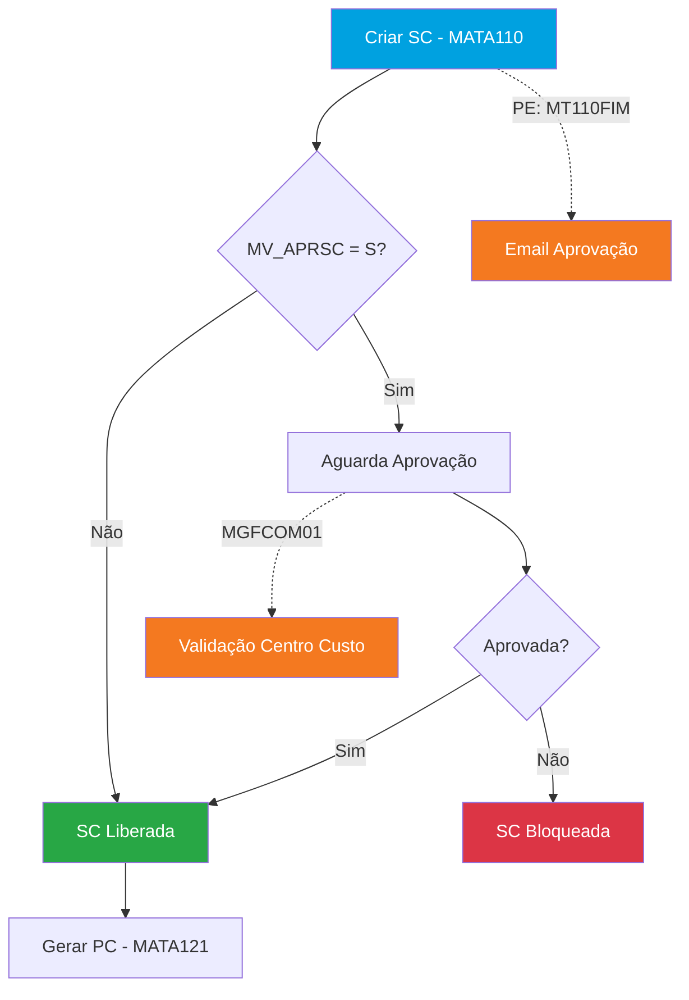
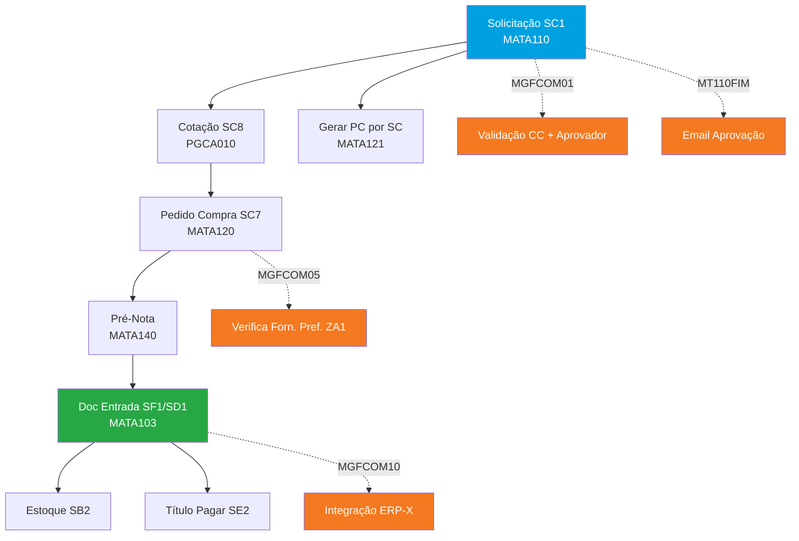
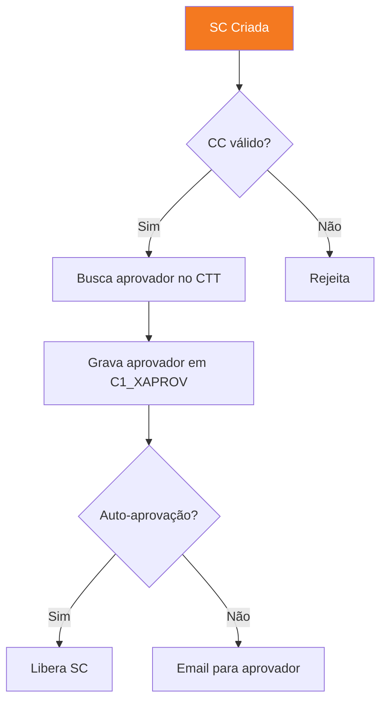
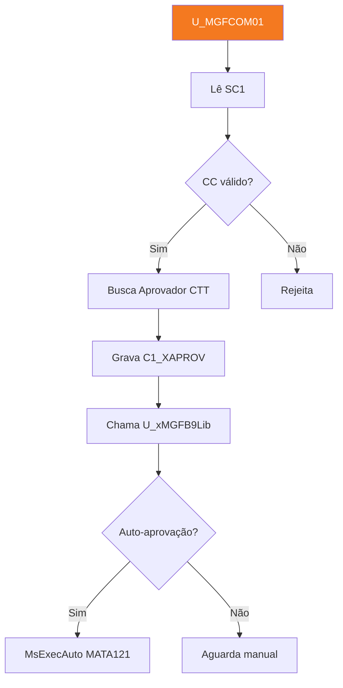
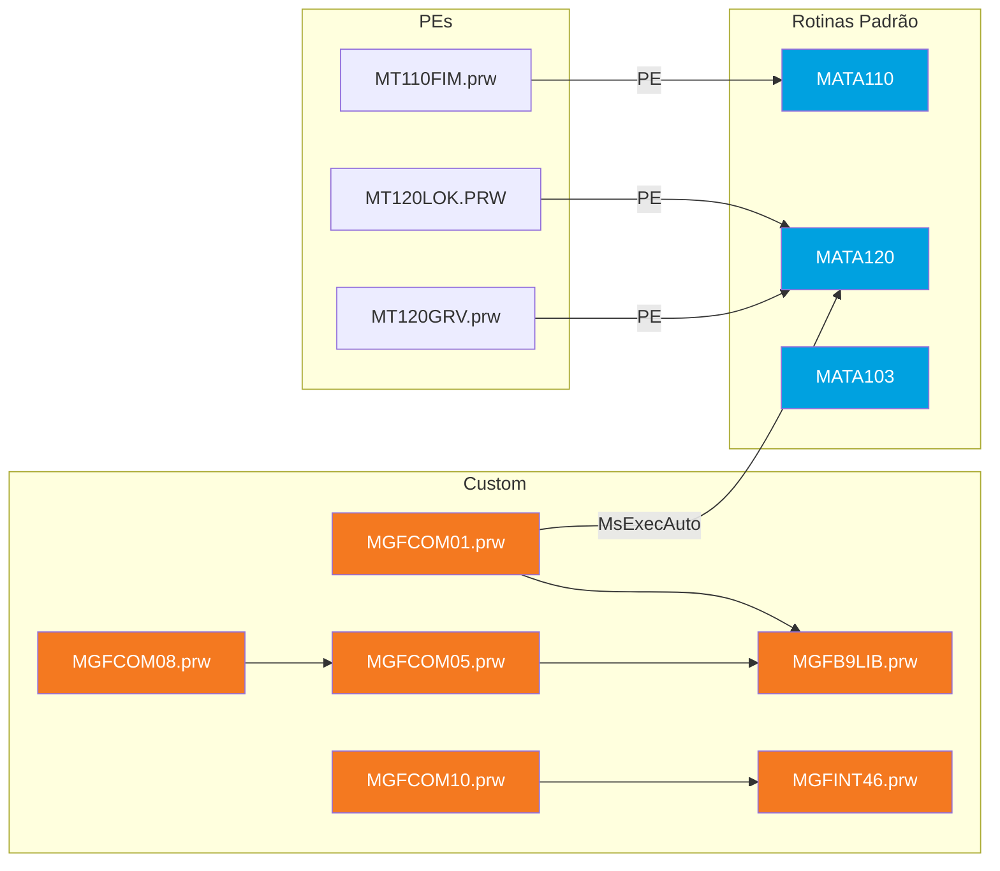
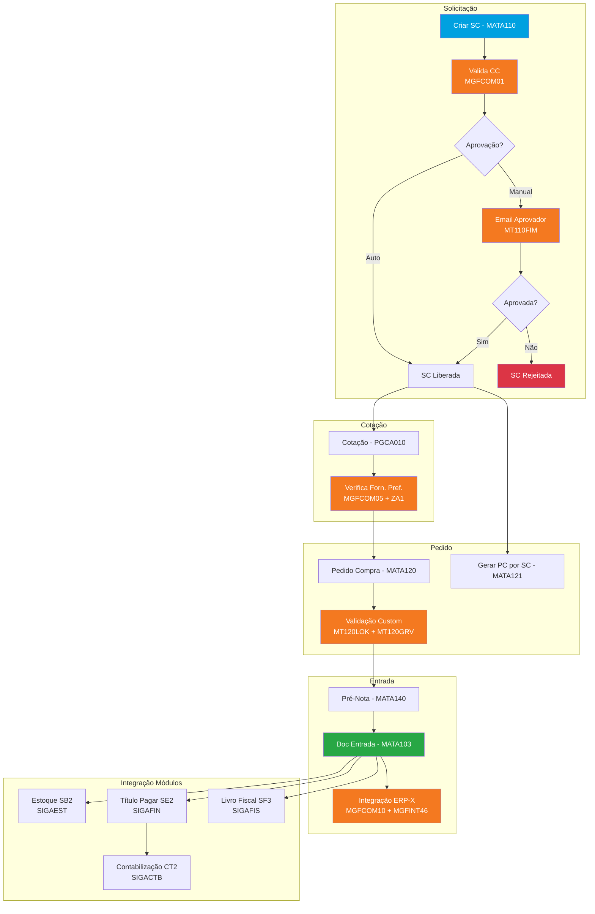

# Template — Base Cliente Protheus (Módulo)

> Este documento define a estrutura padrão que todo `.md` de módulo na Base do Cliente deve seguir.
> **Seções 1-14 espelham o Template Base Padrão** para permitir comparação 1:1.
> **Seções 15-19 são exclusivas do cliente** — vínculos, dependências, fontes, comparativo, fluxo customizado.
> A IA gera estes docs automaticamente a partir dos dados extraídos (SXs + Fontes + Vínculos).

---

## Regras Gerais

1. **Frontmatter YAML obrigatório** — metadados do cliente e resumo quantitativo
2. **Seções 1-14 na mesma ordem do Template Padrão** — permite merge direto
3. **Seções 15-19 exclusivas** — vínculos, fontes, dependências, comparativo, fluxo custom
4. **Foco em customizações** — documentar o que é DIFERENTE do padrão, não repetir o padrão
5. **Classificação obrigatória** — todo campo, gatilho, fonte deve ser classificado como `padrão` ou `custom`
6. **Vínculos explícitos** — campo → função, gatilho → função, PE → rotina (seção 16)
7. **Mermaid obrigatório** — toda rotina com fluxo, fluxo geral (seção 8), fluxo custom (seção 19), grafo de dependências (seção 17)
8. **Sem informação inventada** — se a IA não consegue determinar, marca `> ⚠️ A verificar`
9. **Mesmas convenções** — monospace para nomes técnicos, tabelas markdown, Mermaid para fluxos
10. **Customizações em laranja** — nos diagramas Mermaid, nós custom usam `fill:#f47920,color:#fff`

---

## Estrutura do Arquivo

### Frontmatter YAML

```yaml
---
tipo: cliente
cliente: "Marfrig"
modulo: SIGACOM
nome: Compras
sigla: COM
gerado_em: "2026-03-20"
versao_protheus: "12.1.2x"
# Resumo quantitativo
tabelas_envolvidas: [SC1, SC7, SC8, SF1, SD1, SA2, ZA1]
tabelas_custom: [ZA1]
total_campos: 2340
total_campos_custom: 87
total_indices_custom: 12
total_gatilhos_custom: 34
total_fontes_custom: 15
total_pontos_entrada: 8
parametros_alterados: 23
# Vínculos
rotinas_afetadas: [MATA110, MATA120, MATA103]
fontes_por_rotina:
  MATA110: [MGFCOM01.prw, MT110FIM.prw]
  MATA120: [MGFCOM05.prw, MT120PE.prw]
  MATA103: [MGFCOM10.prw]
integra_com: [SIGAEST, SIGAFIN, SIGAFIS, SIGACTB]
tem_contabilizacao_custom: false
tem_integracoes_externas: true
---
```

---

## Seções 1-14 (Espelhando o Padrão)

---

### Seção 1: Objetivo do Módulo no Cliente

```markdown
## 1. Objetivo do Módulo no Cliente

Resumo executivo: o que o módulo faz **neste cliente** e o que foi customizado.

**Módulo:** SIGACOM — Compras
**Cliente:** Marfrig
**Nível de customização:** Alto / Médio / Baixo

### Resumo Quantitativo

| Item | Padrão | Custom | Total |
|------|--------|--------|-------|
| Campos | 2253 | 87 | 2340 |
| Índices | 180 | 12 | 192 |
| Gatilhos | 120 | 34 | 154 |
| Fontes custom | — | 15 | 15 |
| Pontos de Entrada | — | 8 | 8 |
| Parâmetros alterados | — | 23 | 23 |

### Tabelas Custom (novas)

| Tabela | Nome | Campos | Finalidade |
|--------|------|--------|------------|
| `ZA1` | Fornecedores Preferenciais | 12 | Controle de fornecedores por produto |
```

---

### Seção 2: Parametrização do Cliente

```markdown
## 2. Parametrização do Cliente

Parâmetros MV_ que o cliente **alterou** em relação ao padrão.

| Parâmetro | Valor Padrão | Valor Cliente | Tipo | Impacto |
|-----------|-------------|---------------|------|---------|
| `MV_APRSC` | N | **S** | L | Ativou aprovação de SC por alçada |
| `MV_REQPC` | N | **S** | L | Todo PC obriga ter SC prévia |

> **Nota:** Apenas parâmetros com valor diferente do padrão são listados.
> Para ver todos os parâmetros do módulo, consultar Base Padrão Seção 2.
```

---

### Seção 3: Cadastros — Campos Customizados

```markdown
## 3. Cadastros — Campos Customizados

### 3.1 Clientes — MATA030/CRMA980 (SA1) — 33 campos custom

#### Campos Customizados

| Campo | Título | Tipo | Tam | Obrig | F3 | VLDUSER | Finalidade |
|-------|--------|------|-----|-------|----|---------|-----------|
| `A1_XBLQREC` | Bloq Receita | C | 1 | Não | — | — | Bloqueio por receita |
| `A1_XENVECO` | Envia E-Comm | C | 1 | Não | — | `U_MGFVAL01()` | Flag integração E-Commerce |

#### Índices Customizados

| Ordem | Chave | Descrição | Finalidade |
|-------|-------|-----------|------------|
| 4 | `A1_FILIAL+A1_XCNAE` | Por CNAE | Busca rápida por CNAE secundário |

#### Gatilhos Customizados

| Campo Origem | Campo Destino | Regra | Descrição |
|-------------|---------------|-------|-----------|
| `A1_CNAE` | `A2_ZAUTAPR` | `U_xMGFB9Lib("SA1")` | Auto-aprovação |

### 3.2 Fornecedores — SA2 — 5 campos custom
(mesma estrutura)
```

---

### Seção 4: Rotinas Customizadas

```markdown
## 4. Rotinas Customizadas

### 4.1 Solicitação de Compras — MATA110

**Customizações:** 3 campos custom, 2 gatilhos, 1 PE, 1 fonte

#### Campos Custom em SC1

| Campo | Título | Tipo | Tam | F3 | VLDUSER | Finalidade |
|-------|--------|------|-----|----|---------|------------|
| `C1_XCENTR` | Centro Req | C | 9 | CTT | — | Centro de custo do requisitante |
| `C1_XAPROV` | Aprovador | C | 6 | SA3 | `U_MGFAPR()` | Código do aprovador |

#### Gatilhos Custom

| Campo Origem | Campo Destino | Regra | Condição |
|-------------|---------------|-------|----------|
| `C1_XCENTR` | `C1_XAPROV` | `U_MGFAPR01(M->C1_XCENTR)` | — |

#### Pontos de Entrada

| PE | Fonte | Momento | O que faz |
|----|-------|---------|-----------|
| `MT110FIM` | MT110FIM.prw | Após gravação | Envia e-mail de aprovação |

#### Fontes que Afetam esta Rotina

| Fonte | Funções | Tabelas que Grava | LOC |
|-------|---------|-------------------|-----|
| MGFCOM01.prw | U_MGFCOM01, U_MGFAPR01 | SC1, ZA1 | 450 |

#### Fluxo Custom da Rotina



> **Legenda:** Nós em laranja = customizações do cliente. Linhas tracejadas = fluxos custom.

### 4.2 Pedido de Compras — MATA120
(mesma estrutura completa para cada rotina com customizações)
```

---

### Seção 5: Contabilização Custom

```markdown
## 5. Contabilização Custom

(Incluir se o cliente alterou LPs ou criou novos)

| LP | Descrição | Padrão? | Alteração |
|----|-----------|---------|-----------|
| 500 | Entrada NF | Sim | Adicionou rateio por centro de custo |
| 900 | Entrada ZA1 | **Novo** | LP custom para tabela de forn. preferenciais |
```

---

### Seção 6: Tipos e Classificações Custom

```markdown
## 6. Tipos e Classificações Custom

### Tabelas Genéricas Custom (SX5)

| Tabela | Chave | Descrição | Usado em |
|--------|-------|-----------|----------|
| ZZ | 01 | Tipo Aprovação A | `C1_XAPROV` |

### CBox Customizados

| Campo | Valores | Descrição |
|-------|---------|-----------|
| `C1_XPRIOR` | 1=Alta;2=Média;3=Baixa | Prioridade da SC |
```

---

### Seção 7: Tabelas do Módulo (com custom)

```markdown
## 7. Tabelas do Módulo

### Tabelas Padrão com Customizações

| Tabela | Nome | Campos Custom | Índices Custom | Gatilhos Custom |
|--------|------|---------------|----------------|-----------------|
| `SC1` | Solicitação Compras | 3 | 1 | 2 |
| `SC7` | Pedido de Compras | 5 | 2 | 3 |
| `SA1` | Clientes | 33 | 4 | 5 |

### Tabelas Novas (Custom)

| Tabela | Nome | Total Campos | Fontes que Usam | Finalidade |
|--------|------|-------------|-----------------|------------|
| `ZA1` | Forn. Preferenciais | 12 | MGFCOM01.prw | Fornecedor preferencial por produto |
```

---

### Seção 8: Fluxo Geral do Módulo

```markdown
## 8. Fluxo Geral do Módulo

Diagrama completo do fluxo padrão + customizações integradas.



**Legenda:**
- Azul: Início do processo padrão
- Verde: Documento final
- **Laranja: Customizações do cliente**
- Linhas tracejadas: fluxos custom
```

---

### Seção 9: Integrações com Outros Módulos

```markdown
## 9. Integrações com Outros Módulos

### Integrações Padrão

| Módulo | Integração | Tabela Ponte | Direção | Momento |
|--------|-----------|-------------|---------|---------|
| SIGAEST | Atualiza saldo estoque | SB2 | COM → EST | Classificação NF |
| SIGAFIN | Gera título a pagar | SE2 | COM → FIN | Classificação NF |

### Integrações Custom (APIs, WS, Arquivos)

| Integração | Fonte | Tipo | Destino | Momento | Tabelas |
|-----------|-------|------|---------|---------|---------|
| E-Commerce | MGFINT17.prw | REST API | Plataforma E-Comm | Inclusão cliente | SA1 |
| ERP-X | MGFINT46.prw | Web Service | Sistema legado | Entrada NF | SF1, SD1 |
```

---

### Seção 10: Controles Especiais Custom

```markdown
## 10. Controles Especiais Custom

(Incluir se o cliente implementou controles além do padrão)

### 10.1 Aprovação Customizada de SC

**Fonte:** MGFCOM01.prw
**Parâmetro:** MV_APRSC = S + lógica custom de CC

Descrição da lógica customizada de aprovação.


```

---

### Seção 11: Consultas e Relatórios Custom

```markdown
## 11. Consultas e Relatórios Custom

| Relatório/Consulta | Fonte | Descrição | Saída |
|-------------------|-------|-----------|-------|
| Mapa Forn. Pref. | MGFCOM90.prw | Lista fornecedores preferenciais por produto | Planilha |
```

---

### Seção 12: Obrigações Acessórias

```markdown
## 12. Obrigações Acessórias

(Manter igual ao padrão se não houver impacto custom. Documentar apenas alterações.)

> Sem alterações nas obrigações acessórias deste módulo.
> Consultar Base Padrão Seção 12 para referência completa.
```

---

### Seção 13: Referências

```markdown
## 13. Referências

| Fonte | Descrição |
|-------|-----------|
| Base Padrão SIGACOM | Seções 1-14 do processo padrão de Compras |
| Fontes custom | 15 arquivos .prw em `d:\Clientes\Customizados\` |
| SQLite | `workspace/clients/marfrig/db/extrairpo.db` |
| Vínculos | 19.637 registros na tabela `vinculos` |
```

---

### Seção 14: Enriquecimentos

```markdown
## 14. Enriquecimentos

Seção reservada para informações adicionadas via consulta ou análise posterior.

(seção preenchida automaticamente — não editar manualmente)
```

---

## Seções 15-19 (Exclusivas do Cliente)

---

### Seção 15: Fontes Custom Detalhados

```markdown
## 15. Fontes Custom Detalhados

Análise completa de cada fonte customizado do módulo.

### 15.1 MGFCOM01.prw — Customizações da SC

**Tipo:** User Function
**Linhas de código:** 450
**Módulo detectado:** SIGACOM

#### Funções

| Função | Tipo | Chamada por | Descrição |
|--------|------|-------------|-----------|
| `U_MGFCOM01` | User Function | Menu custom | Função principal |
| `U_MGFAPR01` | User Function | Gatilho `C1_XCENTR` | Busca aprovador pelo CC |

#### Tabelas Acessadas

| Tabela | Modo | Campos Usados |
|--------|------|---------------|
| SC1 | Leitura/Escrita | C1_NUM, C1_XCENTR, C1_XAPROV |
| CTT | Leitura | CTT_CUSTO, CTT_DESC |
| ZA1 | Escrita | ZA1_COD, ZA1_FORN |

#### Chamadas a Outros Fontes

| Chama | Função | Contexto |
|-------|--------|----------|
| MGFB9LIB.prw | `U_xMGFB9Lib()` | Validação de aprovação |
| — | `MsExecAuto(MATA121)` | Gera PC automático |

#### Fluxo do Fonte



### 15.2 MT110FIM.prw — PE Após Gravação SC
(mesma estrutura para cada fonte)
```

---

### Seção 16: Mapa de Vínculos

```markdown
## 16. Mapa de Vínculos

Conexões entre campos, funções, gatilhos, PEs e rotinas.

### Campos → Funções (validação chama U_xxx)

| Campo | Tipo Validação | Função | Fonte | Rotina |
|-------|---------------|--------|-------|--------|
| `SC5.C5_ZTIPES` | VLDUSER | `U_Z3TVAL()` | MGFFAT03.prw | MATA410 |
| `SA1.A1_XENVECO` | VLDUSER | `U_MGFVAL01()` | MGFVAL01.prw | MATA030 |

### Gatilhos → Funções (regra chama U_xxx)

| Gatilho | Função | Fonte | Tabelas Afetadas |
|---------|--------|-------|-----------------|
| `C1_XCENTR→C1_XAPROV` | `U_MGFAPR01()` | MGFCOM01.prw | SC1, CTT |
| `A1_CNAE→A2_ZAUTAPR` | `U_xMGFB9Lib()` | MGFB9LIB.prw | SA1, SA2 |

### PEs → Rotinas

| PE | Rotina | Fonte | Momento | LOC |
|----|--------|-------|---------|-----|
| `MT110FIM` | MATA110 | MT110FIM.prw | Após gravação | 120 |
| `MT120LOK` | MATA120 | MT120LOK.PRW | Antes confirmação | 85 |
| `MT120GRV` | MATA120 | MT120GRV.prw | Após gravação | 200 |

### Fonte → Fonte (call graph)

| Fonte | Chama | Função | Contexto |
|-------|-------|--------|----------|
| MGFCOM08.prw | MGFCOM15.prw | `U_MGFCOM15()` | Processamento de PC |
| MGFCOM08.prw | MGFCOM03.prw | `U_MGF3Achr()` | Busca SX3 |
| MGFCOM08.prw | MGFCOM17.prw | `U_MGFCOM17()` | Validação NF |
```

---

### Seção 17: Grafo de Dependências

```markdown
## 17. Grafo de Dependências

Mapa visual de como os fontes custom se conectam entre si e com rotinas padrão.



**Legenda:**
- Laranja: Fontes custom
- Azul: Rotinas padrão
- Setas: direção da chamada/dependência
```

---

### Seção 18: Comparativo Padrão × Cliente

```markdown
## 18. Comparativo Padrão × Cliente

Mapa de impacto: quais seções do Base Padrão são afetadas pelas customizações.

| Seção Padrão | Ref | Impacto | Detalhe |
|-------------|-----|---------|---------|
| 3. Cadastros > SA1 | Padrão §3.1 | Alto | 33 campos custom, 5 gatilhos, integração E-Comm |
| 4.1 MATA110 (SC) | Padrão §4.1 | Médio | 3 campos, 1 PE, validação CC |
| 4.2 MATA120 (PC) | Padrão §4.2 | Médio | 5 campos, verificação forn. preferencial |
| 4.4 MATA103 (NF) | Padrão §4.4 | Alto | Integração ERP-X na entrada |
| 2. Parametrização | Padrão §2 | Baixo | 3 parâmetros alterados |

**Impacto:** Alto (>10 customizações) | Médio (3-10) | Baixo (1-2)
```

---

### Seção 19: Fluxo do Processo Customizado

```markdown
## 19. Fluxo do Processo Customizado

Diagrama completo do processo real do cliente — padrão + todas as customizações integradas.
Este é o fluxo que representa como o cliente **realmente opera** hoje.



**Legenda:**
- Azul: Início do processo
- Verde: Documento final
- Vermelho: Rejeição/Erro
- **Laranja: Customizações do cliente**
- Linhas tracejadas: fluxos adicionados pelo cliente
- Subgraphs: agrupamento por etapa do processo
```

---

## Mapa de Seções × Obrigatoriedade

| # | Seção | Obrigatória | Espelha Padrão | Quando incluir |
|---|-------|-------------|----------------|----------------|
| 1 | Objetivo do Módulo no Cliente | **Sim** | §1 | Sempre — resumo quantitativo |
| 2 | Parametrização do Cliente | Condicional | §2 | Se tem parâmetros alterados |
| 3 | Cadastros — Campos Customizados | **Sim** | §3 | Sempre — por tabela |
| 4 | Rotinas Customizadas | **Sim** | §4 | Para cada rotina com customizações |
| 5 | Contabilização Custom | Condicional | §5 | Se alterou LPs |
| 6 | Tipos e Classificações Custom | Condicional | §6 | Se tem SX5 ou CBox custom |
| 7 | Tabelas do Módulo (com custom) | **Sim** | §7 | Sempre — resumo quantitativo |
| 8 | Fluxo Geral do Módulo | **Sim** | §8 | Sempre — Mermaid com custom em laranja |
| 9 | Integrações com Outros Módulos | **Sim** | §9 | Padrão + integrações custom |
| 10 | Controles Especiais Custom | Condicional | §10 | Se tem controles além do padrão |
| 11 | Consultas e Relatórios Custom | Condicional | §11 | Se tem relatórios custom |
| 12 | Obrigações Acessórias | Condicional | §12 | Só se alterou obrigações |
| 13 | Referências | **Sim** | §13 | Sempre |
| 14 | Enriquecimentos | **Sim** | §14 | Sempre (vazia até uso) |
| **15** | **Fontes Custom Detalhados** | **Sim** | — | Análise completa de cada fonte |
| **16** | **Mapa de Vínculos** | **Sim** | — | Tabelas: campo→função, gatilho→função, PE→rotina, fonte→fonte |
| **17** | **Grafo de Dependências** | **Sim** | — | Mermaid: como fontes se conectam |
| **18** | **Comparativo Padrão × Cliente** | **Sim** | — | Mapa de impacto nas seções do padrão |
| **19** | **Fluxo do Processo Customizado** | **Sim** | — | Mermaid: fluxo real do cliente (padrão + custom) |

---

## Naming Convention

**Arquivo:** `{CLIENTE}_{SIGAMODULO}_Customizacoes.md`

Exemplos:
- `Marfrig_SIGACOM_Customizacoes.md`
- `Marfrig_SIGAFAT_Customizacoes.md`
- `Marfrig_SIGAFIN_Customizacoes.md`
- `Marfrig_SIGAEST_Customizacoes.md`

---

## Como a IA usa este Template

### Geração automática
A Fase 3 do pipeline gera o doc completo a partir dos dados:
- **Seções 1-3, 6-7** → dados diretos do SQLite (SX3, SIX, SX7, SX5, SX6)
- **Seção 4** → cruzamento rotina × campos × gatilhos × PEs × fontes (tabela `vinculos`)
- **Seção 8, 17, 19** → LLM gera Mermaid a partir dos vínculos
- **Seção 15** → LLM analisa código dos fonte_chunks
- **Seção 16** → dados diretos da tabela `vinculos`
- **Seção 18** → comparação automática com Base Padrão

### Merge com Base Padrão
As seções 1-14 espelhadas permitem:
- Padrão §4.1 (MATA110) + Cliente §4.1 (MATA110) = visão completa da rotina
- Padrão §2 (MV_ globais) + Cliente §2 (MV_ alterados) = configuração real

### Input para Geração de Projeto
O template de Projeto referencia:
- "Baseado no Cliente §4.2 (customizações MATA120)"
- "Integração existente: ver Cliente §9, linha E-Commerce"
- "Impacto: ver Cliente §18"
- "Fluxo atual: ver Cliente §19"
- "Dependências: ver Cliente §17"

### Checklist de Validação

- [ ] Frontmatter YAML com todos os campos quantitativos
- [ ] Seção 1 — resumo com tabela quantitativa
- [ ] Seção 3 — cada tabela com campos custom, índices, gatilhos
- [ ] Seção 4 — cada rotina com: campos, gatilhos, PEs, fontes, **fluxo Mermaid**
- [ ] Seção 8 — fluxo geral com custom em laranja
- [ ] Seção 15 — cada fonte com funções, tabelas, chamadas, **fluxo Mermaid**
- [ ] Seção 16 — vínculos em tabelas (campo→função, gatilho→função, PE→rotina)
- [ ] Seção 17 — **grafo Mermaid** de dependências entre fontes
- [ ] Seção 18 — comparativo com indicadores de impacto
- [ ] Seção 19 — **fluxo Mermaid completo** do processo customizado
- [ ] Nenhuma informação inventada — marcador `⚠️ A verificar`
- [ ] Nomes técnicos em monospace
- [ ] Customizações em laranja nos diagramas Mermaid
