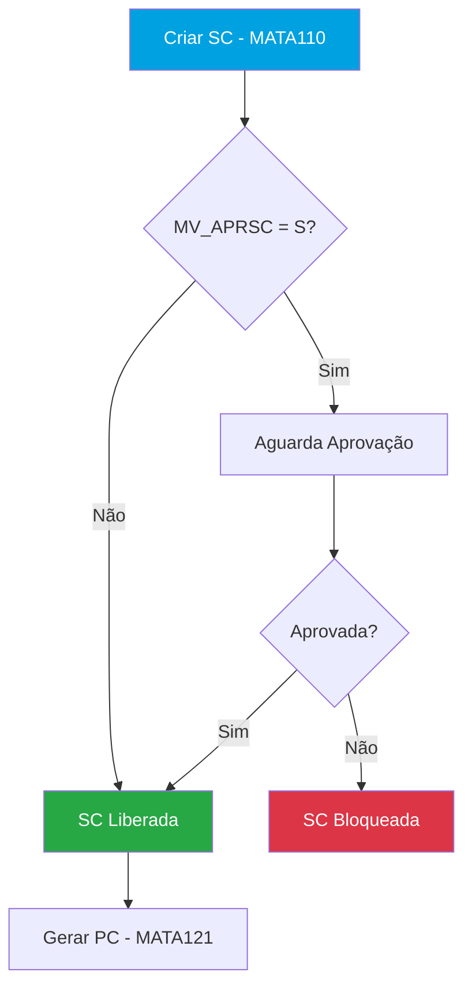
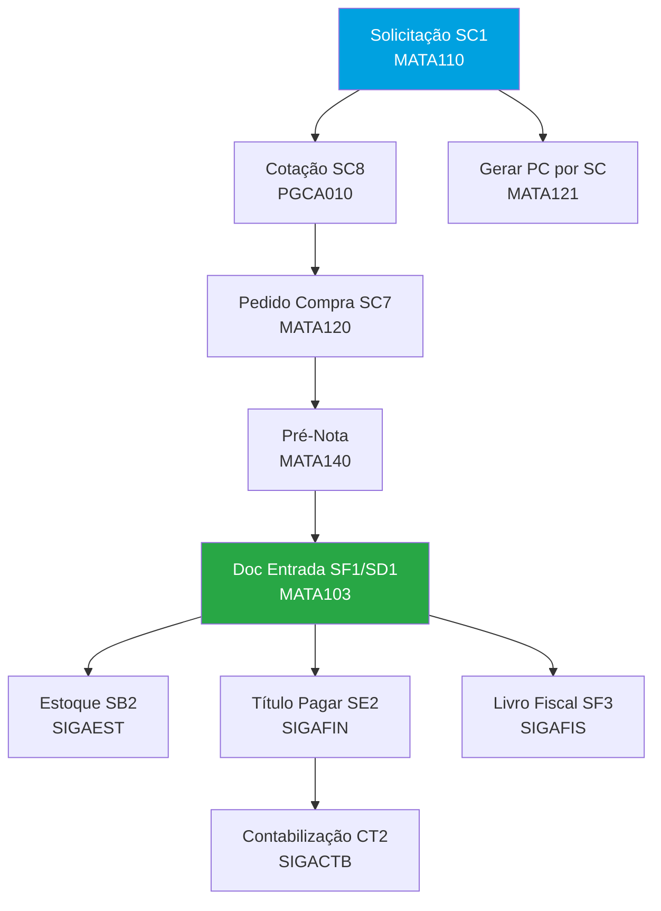

# Template — Base Padrão Protheus (Módulo)

> Este documento define a estrutura padrão que todo `.md` de módulo em `processoPadrao/` deve seguir.
> O objetivo é garantir que a IA consiga parsear qualquer módulo de forma eficiente, sem gastar tokens
> "entendendo" o formato. Também facilita o merge futuro entre Padrão × Cliente × Projeto.

---

## Regras Gerais

1. **Frontmatter YAML obrigatório** — metadados estruturados no topo do arquivo
2. **Seções fixas na ordem definida** — a IA sabe exatamente onde encontrar cada informação
3. **Cada rotina é uma unidade completa** — contém tabelas, campos, MV_, PEs, fluxo dentro dela
4. **Mermaid obrigatório** — toda rotina tem um fluxograma, e o módulo tem um fluxo geral
5. **Tabelas markdown** — usar tabelas para dados tabulares (parâmetros, campos, índices)
6. **Sem informação inventada** — se não souber, não inclui. Marcador `> ⚠️ A verificar` quando incerto
7. **Alertas com blockquote** — usar `> ⚠️` para avisos críticos, `> **Nota:**` para informações importantes
8. **Nomes técnicos em monospace** — campos (`C1_NUM`), rotinas (`MATA110`), tabelas (`SC1`), parâmetros (`MV_APRSC`)
9. **Seções opcionais** — se o módulo não tem a funcionalidade, omitir a seção inteira (não colocar "N/A")

---

## Estrutura do Arquivo

```yaml
---
tipo: padrao
modulo: SIGACOM
nome: Compras
sigla: COM
versao_protheus: "12.1.2x"
atualizado_em: "2026-03-20"
rotinas_principais: [MATA110, MATA120, MATA121, MATA103, MATA140]
tabelas_principais: [SC1, SC7, SC8, SF1, SD1, SA2]
integra_com: [SIGAEST, SIGAFIN, SIGAFIS, SIGACTB]
tem_contabilizacao: true
tem_obrigacoes_acessorias: false
---
```

---

### Seção 1: Objetivo do Módulo

```markdown
## 1. Objetivo do Módulo

Descrição clara e concisa do que o módulo faz no contexto do negócio.
Máximo 5-8 linhas. Foco no "para que serve" e não em detalhes técnicos.

**Sigla:** SIGACOM
**Menu principal:** Atualizações > Compras
**Integra com:** SIGAEST (estoque), SIGAFIN (financeiro), SIGAFIS (fiscal), SIGACTB (contábil)

**Nomenclatura do módulo:**

| Sigla | Significado |
|-------|------------|
| SC | Solicitação de Compras |
| PC | Pedido de Compras |
| NF | Nota Fiscal |
| PE | Ponto de Entrada |
| LP | Lançamento Padrão |
```

---

### Seção 2: Parametrização Geral do Módulo

```markdown
## 2. Parametrização Geral do Módulo

Parâmetros MV_ que afetam o módulo como um todo (não específicos de uma rotina).

| Parâmetro | Descrição | Padrão | Tipo | Impacto |
|-----------|-----------|--------|------|---------|
| MV_ESTADO | UF da empresa | SP | C(2) | Cálculo fiscal em todas as rotinas |
| MV_IPISC | IPI compõe custo | N | L | Afeta custo de todos os itens |
| ... | ... | ... | ... | ... |

> ⚠️ **Atenção:** Alteração de parâmetros globais afeta TODAS as rotinas do módulo.
> Teste em ambiente de homologação antes de alterar em produção.
```

---

### Seção 3: Cadastros Fundamentais

```markdown
## 3. Cadastros Fundamentais

Cadastros que precisam estar preenchidos antes de usar o módulo.

### 3.1 [Nome do Cadastro] — [ROTINA] ([TABELA])

**Menu:** Atualizações > [caminho]
**Tabela:** [código] — [descrição]

Breve descrição do que é e para que serve.

| Campo | Descrição | Tipo | Obrigatório |
|-------|-----------|------|-------------|
| XX_CODIGO | Código | C(6) | Sim |
| XX_NOME | Nome/Descrição | C(40) | Sim |
| ... | ... | ... | ... |

> **Nota:** [observação relevante sobre o cadastro]

### 3.2 [Próximo Cadastro]
(mesma estrutura)
```

---

### Seção 4: Rotinas (uma subseção por rotina)

```markdown
## 4. Rotinas

### 4.1 [ROTINA] — [Nome da Rotina]

**Objetivo:** [o que a rotina faz — 1-2 linhas]
**Menu:** [Atualizações > Módulo > Nome]
**Tipo:** [Inclusão / Manutenção / Processamento / Relatório / Consulta]

#### Tabelas

| Tabela | Alias | Descrição | Tipo |
|--------|-------|-----------|------|
| SC1 | SC1 | Solicitações de Compras | Principal |
| SC2 | SC2 | Cabeçalho da SC | Complementar |

#### Campos Principais

| Campo | Descrição | Tipo | Obrigatório | Validação/Observação |
|-------|-----------|------|-------------|---------------------|
| C1_NUM | Número da SC | C(6) | Sim | Automático (GetSX8Num) |
| C1_PRODUTO | Código do produto | C(15) | Sim | ExistCpo("SB1") |
| C1_QUANT | Quantidade | N(12,2) | Sim | > 0 |
| C1_APROVA | Status aprovação | C(1) | - | L=Liberada, B=Bloqueada, R=Reprovada |
| ... | ... | ... | ... | ... |

#### Status / Tipos

(incluir quando a rotina tem campos de status ou tipo com valores fixos)

| Valor | Descrição | Comportamento |
|-------|-----------|---------------|
| L | Liberada | SC pode ser utilizada para gerar PC |
| B | Bloqueada | Aguardando aprovação |
| R | Reprovada | SC cancelada pela alçada |

#### Índices

| Ordem | Chave | Descrição |
|-------|-------|-----------|
| 1 | C1_FILIAL+C1_NUM+C1_ITEM | Número + Item |
| 2 | C1_FILIAL+C1_PRODUTO+C1_NUM | Produto + Número |
| ... | ... | ... |

#### Gatilhos (SX7)

| Campo Origem | Campo Destino | Regra/Expressão | Descrição |
|-------------|---------------|-----------------|-----------|
| C1_PRODUTO | C1_DESCRI | SB1->B1_DESC | Busca descrição do produto |
| C1_PRODUTO | C1_UM | SB1->B1_UM | Busca unidade de medida |
| ... | ... | ... | ... |

#### Parâmetros MV_ desta Rotina

| Parâmetro | Descrição | Padrão | Tipo | Quando usar |
|-----------|-----------|--------|------|-------------|
| MV_APRSC | Ativa aprovação de SC | N | L | Quando precisa de alçada para SC |
| MV_REQPC | Exige SC amarrada ao PC | N | L | Quando todo PC deve ter SC prévia |
| ... | ... | ... | ... | ... |

#### Pontos de Entrada

| Ponto de Entrada | Momento de Execução | Descrição | Parâmetros |
|-----------------|---------------------|-----------|------------|
| MT110FIM | Após gravação | Executado após salvar a SC | - |
| MT110CAN | Antes exclusão | Validação antes de excluir SC | cNUM (número da SC) |
| ... | ... | ... | ... |

#### Fluxo da Rotina



> ⚠️ **Atenção:** [observações críticas sobre a rotina, se houver]

---

### 4.2 [PRÓXIMA ROTINA] — [Nome]

(repetir a mesma estrutura completa para cada rotina do módulo)
```

---

### Seção 5: Contabilização

(incluir quando o módulo tem integração contábil)

```markdown
## 5. Contabilização

### 5.1 Modo de Contabilização

| Modo | Descrição | Parâmetro |
|------|-----------|-----------|
| On-line | Contabiliza automaticamente ao gravar o documento | MV_CONTAXX=S |
| Off-line | Contabilização em lote posterior | Rotina CTBAYYY |

### 5.2 Lançamentos Padrão (LP)

| Código LP | Descrição | Rotina | Débito | Crédito |
|-----------|-----------|--------|--------|---------|
| 500 | Entrada NF Compras | MATA103 | Estoque (SB2) | Fornecedor (SA2) |
| 510 | Título a Pagar | FINA050 | Fornecedor (SA2) | Banco (SA6) |
| ... | ... | ... | ... | ... |

> **Nota:** LPs são configurados em `CTBA080`. Cada LP pode ter múltiplas linhas
> com fórmulas que referenciam campos do documento.
```

---

### Seção 6: Tipos e Classificações

(incluir quando o módulo tem tipologias importantes — carteiras, tipos de título, TES, etc.)

```markdown
## 6. Tipos e Classificações

### 6.1 [Nome da Classificação]

| Código/Tipo | Descrição | Comportamento | Uso típico |
|-------------|-----------|---------------|------------|
| NF | Nota Fiscal | Gera livro fiscal | Compras normais |
| CT | Conhecimento Transporte | Gera frete | Fretes de compra |
| ... | ... | ... | ... |

### 6.2 [Outra Classificação]
(mesma estrutura)
```

---

### Seção 7: Tabelas do Módulo (consolidado)

```markdown
## 7. Tabelas do Módulo

Visão consolidada de todas as tabelas usadas no módulo.

### Tabelas de Cadastro

| Tabela | Descrição | Rotina Principal | Obs |
|--------|-----------|-----------------|-----|
| SA2 | Fornecedores | MATA020 | Compartilhada com FIN |
| SB1 | Produtos | MATA010 | Compartilhada com EST/FAT |
| ... | ... | ... | ... |

### Tabelas de Movimento

| Tabela | Descrição | Rotina Principal | Volume |
|--------|-----------|-----------------|--------|
| SC1 | Solicitação de Compras | MATA110 | Alto |
| SC7 | Pedido de Compras | MATA120 | Alto |
| SF1 | Cabeçalho NF Entrada | MATA103 | Alto |
| SD1 | Itens NF Entrada | MATA103 | Muito Alto |
| ... | ... | ... | ... |

### Tabelas de Controle

| Tabela | Descrição | Uso |
|--------|-----------|-----|
| SC8 | Cotação de Compras | Cotação de preços |
| SC9 | Liberação de Pedido | Controle de alçadas |
| ... | ... | ... |
```

---

### Seção 8: Fluxo Geral do Módulo

```markdown
## 8. Fluxo Geral do Módulo

Diagrama completo do fluxo do módulo, mostrando como as rotinas se conectam
entre si e com outros módulos.



**Legenda de cores:**
- 🔵 Azul: Início do processo
- 🟢 Verde: Conclusão / Documento final
- 🔴 Vermelho: Rejeição / Erro
- 🟠 Laranja: Integração com outro módulo
```

---

### Seção 9: Integrações com Outros Módulos

```markdown
## 9. Integrações com Outros Módulos

| Módulo | Integração | Tabela Ponte | Direção | Momento |
|--------|-----------|-------------|---------|---------|
| SIGAEST | Atualiza saldo estoque | SB2 | COM → EST | Na classificação da NF |
| SIGAFIN | Gera título a pagar | SE2 | COM → FIN | Na classificação da NF |
| SIGAFIS | Gera livro fiscal | SF3/SFT | COM → FIS | Na classificação da NF |
| SIGACTB | Contabilização via LP | CT2 | COM → CTB | On-line ou Off-line |
| ... | ... | ... | ... | ... |
```

---

### Seção 10: Controles Especiais

(incluir funcionalidades avançadas específicas do módulo)

```markdown
## 10. Controles Especiais

### 10.1 [Nome do Controle] — ex: Controle de Alçadas

**Objetivo:** [o que faz]
**Parâmetro ativador:** `MV_XXXXX`

Descrição detalhada do controle, como funciona, quando usar.

| Parâmetro | Descrição | Padrão |
|-----------|-----------|--------|
| MV_PARAM1 | ... | ... |
| MV_PARAM2 | ... | ... |


### 10.2 [Outro Controle] — ex: MRP, Inventário, Conciliação Bancária

(mesma estrutura)
```

---

### Seção 11: Consultas e Relatórios

(incluir quando o módulo tem relatórios/consultas relevantes)

```markdown
## 11. Consultas e Relatórios

### Relatórios Oficiais

| Relatório | Rotina | Descrição | Saída |
|-----------|--------|-----------|-------|
| Mapa de Cotações | MATR220 | Comparativo de preços | PDF/Planilha |
| Pedidos em Aberto | MATR210 | PC não atendidos | PDF/Planilha |
| ... | ... | ... | ... |

### Consultas

| Consulta | Rotina | Descrição |
|----------|--------|-----------|
| Posição de Compras | MATA130 | Acompanha status de pedidos |
| ... | ... | ... |
```

---

### Seção 12: Obrigações Acessórias

(incluir quando o módulo tem obrigações fiscais/legais — ex: SIGAFIS, SIGACTB)

```markdown
## 12. Obrigações Acessórias

### 12.1 [Nome da Obrigação] — ex: EFD ICMS/IPI (SPED Fiscal)

**Rotina:** FISXXX
**Periodicidade:** Mensal
**Prazo:** Dia XX do mês seguinte

Descrição do que é, quais dados gera, tabelas envolvidas.

| Registro | Descrição | Tabela Fonte |
|----------|-----------|-------------|
| 0000 | Abertura | Empresa |
| C100 | NF Entrada/Saída | SF1/SF2 |
| ... | ... | ... |

### 12.2 [Outra Obrigação]
(mesma estrutura)
```

---

### Seção 13: Referências

```markdown
## 13. Referências

| Fonte | URL | Descrição |
|-------|-----|-----------|
| TDN | https://tdn.totvs.com/... | Documentação oficial do módulo |
| Central de Atendimento | https://centraldeatendimento.totvs.com/... | Artigos de suporte |
| ... | ... | ... |

> **Documento gerado para uso interno como referência técnica de desenvolvimento ADVPL/TLPP.**
> Manter atualizado conforme evolução das releases do Protheus.
```

---

### Seção 14: Enriquecimentos

```markdown
## 14. Enriquecimentos

Seção reservada para informações adicionadas via "Pergunte ao Padrão".
Cada enriquecimento tem marcador de data, fontes e pergunta original.

(seção preenchida automaticamente — não editar manualmente)
```

---

## Mapa de Seções × Obrigatoriedade

| # | Seção | Obrigatória | Quando incluir |
|---|-------|-------------|----------------|
| 1 | Objetivo do Módulo | **Sim** | Sempre |
| 2 | Parametrização Geral | **Sim** | Sempre |
| 3 | Cadastros Fundamentais | **Sim** | Sempre |
| 4 | Rotinas | **Sim** | Sempre — uma subseção por rotina |
| 5 | Contabilização | Condicional | Se `tem_contabilizacao: true` no frontmatter |
| 6 | Tipos e Classificações | Condicional | Se o módulo tem tipologias (carteiras, TES, status) |
| 7 | Tabelas do Módulo | **Sim** | Sempre |
| 8 | Fluxo Geral | **Sim** | Sempre — Mermaid obrigatório |
| 9 | Integrações | **Sim** | Sempre |
| 10 | Controles Especiais | Condicional | Se tem funcionalidades avançadas (alçadas, MRP, etc.) |
| 11 | Consultas e Relatórios | Condicional | Se tem relatórios/consultas relevantes |
| 12 | Obrigações Acessórias | Condicional | Se `tem_obrigacoes_acessorias: true` (SIGAFIS, SIGACTB) |
| 13 | Referências | **Sim** | Sempre |
| 14 | Enriquecimentos | **Sim** | Sempre (vazia até uso) |

---

## Checklist de Validação

Antes de considerar um `.md` de módulo como completo:

- [ ] Frontmatter YAML com todos os campos preenchidos
- [ ] Seção 1 (Objetivo) — claro, conciso, com nomenclatura
- [ ] Seção 2 (Parametrização Geral) — tabela com MV_ globais + tipo + impacto
- [ ] Seção 3 (Cadastros) — cada cadastro com campos principais
- [ ] Seção 4 (Rotinas) — **cada rotina com todas as sub-seções:** objetivo, tabelas, campos, status/tipos, índices, gatilhos, MV_, PEs (com parâmetros), fluxo Mermaid
- [ ] Seção 5 (Contabilização) — se aplicável: modo + tabela de LPs
- [ ] Seção 6 (Tipos) — se aplicável: tabelas de classificação
- [ ] Seção 7 (Tabelas consolidado) — separadas em Cadastro/Movimento/Controle
- [ ] Seção 8 (Fluxo Geral) — diagrama Mermaid completo com legenda
- [ ] Seção 9 (Integrações) — tabela com momento da integração
- [ ] Seção 10 (Controles Especiais) — se aplicável: com parâmetros e fluxo
- [ ] Seção 11 (Consultas/Relatórios) — se aplicável
- [ ] Seção 12 (Obrigações Acessórias) — se aplicável: periodicidade + registros
- [ ] Seção 13 (Referências) — links TDN e Central de Atendimento
- [ ] Seção 14 (Enriquecimentos) — seção vazia
- [ ] Nenhuma informação inventada — marcador `⚠️ A verificar` quando incerto
- [ ] Todos os fluxogramas Mermaid renderizam corretamente
- [ ] Alertas críticos usando `> ⚠️`
- [ ] Nomes técnicos em monospace (campos, rotinas, tabelas, parâmetros)

---

## Naming Convention

**Arquivo:** `SIGA{MODULO}_Fluxo_{NomeDoModulo}.md`

Exemplos:
- `SIGACOM_Fluxo_Compras.md`
- `SIGAFAT_Fluxo_Faturamento.md`
- `SIGAFIN_Fluxo_Financeiro.md`
- `SIGAEST_Fluxo_Estoque_Custos.md`
- `SIGAFIS_Fluxo_Livros_Fiscais.md`
- `SIGACTB_Fluxo_Contabilidade.md`
- `SIGAPCP_Fluxo_PCP.md`
- `SIGAEEC_Fluxo_Engenharia.md`

---

## Como a IA usa este Template

### Parsing rápido
O frontmatter YAML dá contexto imediato (módulo, rotinas, tabelas, flags de contabilização/obrigações) sem ler o doc inteiro.

### Busca direcionada
- Pergunta sobre parâmetros → Seção 2 (global) + Seção 4.X (por rotina)
- Pergunta sobre tabelas → Seção 7 (consolidado) + Seção 4.X (por rotina)
- Pergunta sobre integração → Seção 9
- Pergunta sobre obrigações → Seção 12

### Merge com Base Cliente
As seções numeradas permitem comparação 1:1:
- Rotina `MATA110` no Padrão (Seção 4.1) × customizações do cliente para `MATA110`
- Tabelas padrão (Seção 7) × campos customizados do cliente
- Parâmetros padrão (Seção 2 + 4.X) × parâmetros alterados no cliente

### Geração de Projeto
O template de projeto pode referenciar diretamente:
- "Baseado na Seção 4.2 do Padrão (MATA120 — Pedido de Compras)"
- "Customizações existentes: ver Base Cliente Seção X"
- "Parâmetros a configurar: ver Padrão Seção 2, linha MV_REQPC"

### Enriquecimento controlado
Seção 14 reservada evita poluir as seções originais. Cada enriquecimento tem rastreabilidade (data, fontes, pergunta original).
