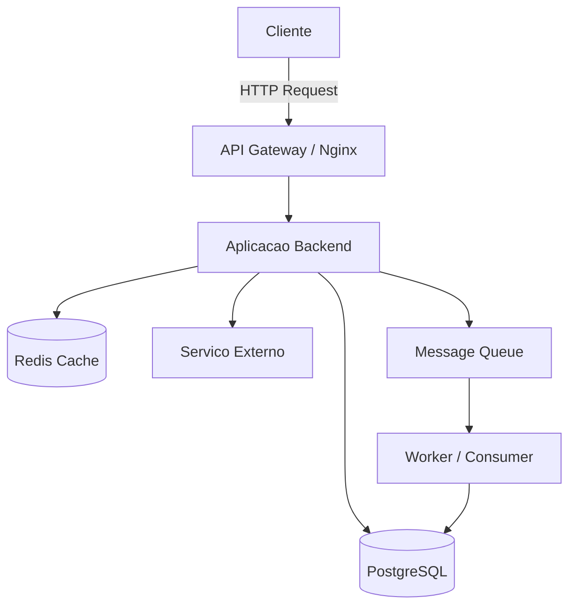

# Diretrizes de Arquitetura e Desenvolvimento de Software

> Documento de referencia para projetos novos ou em andamento.
> Versao: 1.0 | Atualizado em: 2026-03-15

---

## Sumario

1. [Principios Fundamentais](#1-principios-fundamentais)
2. [Arquitetura de Software](#2-arquitetura-de-software)
3. [Linguagens de Programacao — Padroes e Encodings](#3-linguagens-de-programacao--padroes-e-encodings)
4. [Stack Backend](#4-stack-backend)
5. [Stack Frontend](#5-stack-frontend)
6. [Stack FullStack](#6-stack-fullstack)
7. [Banco de Dados](#7-banco-de-dados)
8. [DevOps e CI/CD](#8-devops-e-cicd)
9. [Seguranca (OWASP e alem)](#9-seguranca-owasp-e-alem)
10. [Testes e Qualidade](#10-testes-e-qualidade)
11. [Equipe de Agentes IA para Desenvolvimento](#11-equipe-de-agentes-ia-para-desenvolvimento)
12. [Ferramentas Recomendadas por Categoria](#12-ferramentas-recomendadas-por-categoria)
13. [Controle de Versao e Git Flow](#13-controle-de-versao-e-git-flow)
14. [Documentacao e Comunicacao](#14-documentacao-e-comunicacao)
15. [Observabilidade e OpenTelemetry](#15-observabilidade-e-opentelemetry)
16. [Estrategias de Cache](#16-estrategias-de-cache)
17. [Autenticacao e Autorizacao](#17-autenticacao-e-autorizacao)
18. [Tratamento de Erros por Linguagem](#18-tratamento-de-erros-por-linguagem)
19. [Logging Estruturado](#19-logging-estruturado)
20. [Performance e Otimizacao](#20-performance-e-otimizacao)
21. [Padroes de Resiliencia](#21-padroes-de-resiliencia)
22. [Code Smells e Refactoring](#22-code-smells-e-refactoring)
23. [Metodologias Ageis e Estimativas](#23-metodologias-ageis-e-estimativas)
24. [Acessibilidade (a11y) Aprofundada](#24-acessibilidade-a11y-aprofundada)
25. [Internacionalizacao e Localizacao (i18n/l10n)](#25-internacionalizacao-e-localizacao-i18nl10n)
26. [Licenciamento Open Source](#26-licenciamento-open-source)
27. [Templates de Projeto por Stack](#27-templates-de-projeto-por-stack)
28. [Checklist de Inicio de Projeto](#28-checklist-de-inicio-de-projeto)
29. [Checklist Pre-Deploy](#29-checklist-pre-deploy)
30. [Glossario Tecnico](#30-glossario-tecnico)
31. [Referencias e Leitura Complementar](#31-referencias-e-leitura-complementar)

---

## 1. Principios Fundamentais

### 1.1 SOLID
| Principio | Descricao | Aplicacao Pratica |
|-----------|-----------|-------------------|
| **S** — Single Responsibility | Cada classe/modulo tem uma unica responsabilidade | Um servico de autenticacao nao deve conter logica de envio de e-mail |
| **O** — Open/Closed | Aberto para extensao, fechado para modificacao | Use interfaces e heranca em vez de alterar classes existentes |
| **L** — Liskov Substitution | Subtipos devem ser substituiveis por seus tipos base | Se `Ave` voa, `Pinguim` nao deve herdar de `Ave` diretamente |
| **I** — Interface Segregation | Interfaces especificas sao melhores que uma interface generica | Separe `ILeitor` e `IEscritor` em vez de uma unica `IArquivo` |
| **D** — Dependency Inversion | Dependa de abstracoes, nao de implementacoes concretas | Injete dependencias via construtor, nao instancie dentro da classe |

### 1.2 Clean Code (Robert C. Martin)
- **Nomes significativos**: `calcularImpostoICMS()` em vez de `calc()`.
- **Funcoes pequenas**: cada funcao faz uma unica coisa e faz bem feito.
- **Sem efeitos colaterais**: funcoes nao devem alterar estado global inesperadamente.
- **DRY (Don't Repeat Yourself)**: abstraia codigo duplicado em funcoes reutilizaveis.
- **KISS (Keep It Simple, Stupid)**: a solucao mais simples que funciona e a melhor.
- **YAGNI (You Aren't Gonna Need It)**: nao implemente funcionalidade "para o futuro".

### 1.3 Clean Architecture
```
┌─────────────────────────────────────────┐
│            Frameworks & Drivers         │  ← Web, DB, UI, Dispositivos
├─────────────────────────────────────────┤
│          Interface Adapters             │  ← Controllers, Gateways, Presenters
├─────────────────────────────────────────┤
│           Use Cases (Aplicacao)         │  ← Regras de negocio da aplicacao
├─────────────────────────────────────────┤
│            Entities (Dominio)           │  ← Regras de negocio fundamentais
└─────────────────────────────────────────┘
        Dependencia: de fora → para dentro
```

### 1.4 Twelve-Factor App
Para aplicacoes modernas que rodam em cloud/containers:

1. **Codebase** — Um repositorio, multiplos deploys
2. **Dependencies** — Declare e isole dependencias explicitamente
3. **Config** — Configuracao via variaveis de ambiente (`.env`)
4. **Backing Services** — Trate servicos externos como recursos anexados
5. **Build, Release, Run** — Separe rigorosamente os estagios
6. **Processes** — Execute como processos stateless
7. **Port Binding** — Exporte servicos via binding de porta
8. **Concurrency** — Escale via modelo de processos
9. **Disposability** — Maximize robustez com startup rapido e shutdown graceful
10. **Dev/Prod Parity** — Mantenha dev, staging e producao o mais similares possivel
11. **Logs** — Trate logs como streams de eventos
12. **Admin Processes** — Execute tarefas admin como processos one-off

---

## 2. Arquitetura de Software

### 2.1 Padroes Arquiteturais

#### Monolito Modular
- **Quando usar**: projetos pequenos a medios, equipe reduzida, MVP
- **Vantagem**: simplicidade de deploy e debug
- **Estrutura recomendada**:
```
projeto/
├── modules/
│   ├── auth/
│   │   ├── routes.py
│   │   ├── services.py
│   │   ├── models.py
│   │   └── tests/
│   ├── financeiro/
│   └── estoque/
├── shared/
│   ├── database.py
│   ├── cache.py
│   └── utils.py
├── config/
└── main.py
```

#### Microsservicos
- **Quando usar**: sistemas grandes, equipes multiplas, necessidade de escala independente
- **Comunicacao**: REST, gRPC, mensageria (RabbitMQ, Kafka)
- **Cada servico**: banco proprio, deploy independente, contrato de API definido
- **Cuidado**: evite microsservicos prematuros — comece monolito, extraia quando necessario

#### Event-Driven Architecture (EDA)
- **Quando usar**: sistemas reativos, processamento assincrono, integracao entre sistemas
- **Ferramentas**: Apache Kafka, RabbitMQ, Redis Streams, n8n (workflows)
- **Padrao**: Event Sourcing + CQRS para audibilidade total

#### Serverless / FaaS
- **Quando usar**: funcoes isoladas, processamento sob demanda, APIs leves
- **Provedores**: AWS Lambda, Google Cloud Functions, Azure Functions, Supabase Edge Functions

### 2.2 Design Patterns Essenciais

| Pattern | Categoria | Uso Tipico |
|---------|-----------|------------|
| **Factory** | Criacional | Criar objetos sem expor logica de instanciacao |
| **Singleton** | Criacional | Conexao de banco, logger, configuracao global |
| **Observer** | Comportamental | Sistemas de eventos, notificacoes, pub/sub |
| **Strategy** | Comportamental | Algoritmos intercambiaveis (calculo de imposto, frete) |
| **Repository** | Estrutural | Abstrair acesso a dados do dominio |
| **Adapter** | Estrutural | Integrar sistemas com interfaces incompativeis |
| **Decorator** | Estrutural | Adicionar funcionalidade sem alterar a classe original |
| **Middleware** | Comportamental | Pipeline de processamento (auth, log, validacao) |
| **Circuit Breaker** | Resiliencia | Proteger contra falhas em servicos externos |
| **Saga** | Distribuido | Transacoes distribuidas entre microsservicos |

### 2.3 API Design

#### REST — Convencoes
```
GET    /api/v1/clientes          → listar
GET    /api/v1/clientes/:id      → detalhar
POST   /api/v1/clientes          → criar
PUT    /api/v1/clientes/:id      → atualizar (completo)
PATCH  /api/v1/clientes/:id      → atualizar (parcial)
DELETE /api/v1/clientes/:id      → remover

# Filtros, paginacao e ordenacao
GET /api/v1/clientes?status=ativo&page=1&limit=20&sort=-created_at
```

#### GraphQL — Quando preferir
- Clientes com necessidades de dados variadas (mobile vs. web)
- Evitar over-fetching e under-fetching
- Ferramentas: Apollo Server, Strawberry (Python), Hot Chocolate (.NET)

#### gRPC — Quando preferir
- Comunicacao entre microsservicos (alta performance)
- Streaming bidirecional
- Contratos fortemente tipados via Protocol Buffers

---

## 3. Linguagens de Programacao — Padroes e Encodings

### 3.1 Python

| Aspecto | Padrao |
|---------|--------|
| **Encoding** | `UTF-8` (PEP 3120 — padrao desde Python 3) |
| **Header de arquivo** | Nao necessario em Python 3. Opcional: `# -*- coding: utf-8 -*-` |
| **Style Guide** | PEP 8 |
| **Indentacao** | 4 espacos (nunca tabs) |
| **Line Length** | 79 caracteres (codigo), 72 (docstrings/comentarios) |
| **Naming** | `snake_case` para funcoes/variaveis, `PascalCase` para classes, `UPPER_SNAKE` para constantes |
| **Type Hints** | Obrigatorio em funcoes publicas (PEP 484) |
| **Docstrings** | Google Style ou NumPy Style |
| **Versao minima** | Python 3.10+ (match/case, union types com `\|`) |
| **Gerenciador de pacotes** | `pip` + `venv` (simples), `uv` (rapido), `poetry` (avancado) |

```python
# Exemplo — padrao Python moderno
from dataclasses import dataclass
from typing import Optional


@dataclass
class Cliente:
    """Representa um cliente do sistema."""
    nome: str
    documento: str
    email: Optional[str] = None

    def documento_formatado(self) -> str:
        """Retorna o documento com mascara."""
        if len(self.documento) == 11:
            return f"{self.documento[:3]}.{self.documento[3:6]}.{self.documento[6:9]}-{self.documento[9:]}"
        return self.documento
```

**Ferramentas essenciais**:
- **Linter/Formatter**: `ruff` (substitui flake8 + isort + black — extremamente rapido)
- **Type Checker**: `mypy` ou `pyright`
- **Testes**: `pytest` + `pytest-cov`
- **Frameworks**: Flask (leve), FastAPI (APIs modernas), Django (completo)

---

### 3.2 JavaScript / TypeScript

| Aspecto | Padrao |
|---------|--------|
| **Encoding** | `UTF-8` (ES2015+, padrao universal) |
| **Style Guide** | Airbnb, Standard ou Google |
| **Indentacao** | 2 espacos |
| **Line Length** | 100 caracteres |
| **Naming** | `camelCase` para funcoes/variaveis, `PascalCase` para classes/componentes, `UPPER_SNAKE` para constantes |
| **Ponto e virgula** | Consistente (com ou sem, nunca misture) |
| **Preferencia** | TypeScript sobre JavaScript puro sempre que possivel |
| **Versao minima Node.js** | 20 LTS+ |
| **Gerenciador de pacotes** | `npm` (padrao), `pnpm` (rapido, eficiente em disco) |

```typescript
// Exemplo — padrao TypeScript moderno
interface Cliente {
  id: string;
  nome: string;
  documento: string;
  email?: string;
}

const formatarDocumento = (doc: string): string => {
  if (doc.length === 11) {
    return `${doc.slice(0, 3)}.${doc.slice(3, 6)}.${doc.slice(6, 9)}-${doc.slice(9)}`;
  }
  return doc;
};

// Uso de const assertions e satisfies (TS 4.9+)
const STATUS = {
  ATIVO: "ativo",
  INATIVO: "inativo",
} as const satisfies Record<string, string>;
```

**Ferramentas essenciais**:
- **Linter/Formatter**: `ESLint` (flat config) + `Prettier`, ou `Biome` (all-in-one, muito rapido)
- **Bundler**: `Vite` (frontend), `esbuild`/`tsup` (bibliotecas)
- **Testes**: `Vitest` (rapido, compativel com Jest API)
- **Runtime**: Node.js, Deno, Bun

---

### 3.3 ADVPL / TLPP (TOTVS Protheus)

| Aspecto | Padrao |
|---------|--------|
| **Encoding** | **ANSI (Windows-1252)** — obrigatorio, UTF-8 causa erro no compilador |
| **Line Ending** | CRLF (`\r\n`) |
| **Indentacao** | Tab ou 3 espacos (convencao TOTVS) |
| **Naming** | `PascalCase` para funcoes, prefixo por tipo: `c` (char), `n` (numeric), `l` (logic), `a` (array), `o` (object), `d` (date), `b` (codeblock) |
| **Prefixo funcoes** | Prefixo Z + modulo para customizacoes (ex: `ZDAEDI03`) |
| **Comentarios** | `//` para linha, `/* */` para bloco — sempre em portugues |
| **Max por funcao** | Ideal: ate 200 linhas |

```advpl
// Exemplo — padrao ADVPL/TLPP
#Include "Protheus.ch"
#Include "FWMVCDef.ch"

/*/{Protheus.doc} ZDAEDI03
Rotina de importacao EDI com log timestampado.
@author  Barbito
@since   15/03/2026
@version 1.0
@type    Function
/*/
User Function ZDAEDI03()
    Local cArqEDI  := ""
    Local aItens   := {}
    Local nX       := 0
    Local lRet     := .T.

    // Abertura do arquivo EDI
    cArqEDI := cGetFile("Arquivos EDI|*.txt", "Selecione o arquivo EDI")

    If Empty(cArqEDI)
        MsgAlert("Nenhum arquivo selecionado.", "Atencao")
        Return .F.
    EndIf

    // Processamento com log
    ConOut("[" + DToS(Date()) + " " + Time() + "] Inicio processamento: " + cArqEDI)

    // ... logica de processamento

    ConOut("[" + DToS(Date()) + " " + Time() + "] Fim processamento. Itens: " + cValToChar(Len(aItens)))

Return lRet
```

**Boas praticas ADVPL/TLPP**:
- Sempre declarar variaveis com `Local`, nunca usar `Private` sem necessidade
- Usar `FWBrowse` e `FWFormView` para interfaces (MVC)
- Usar `MsExecAuto` para integracoes automatizadas
- Sequencia fiscal obrigatoria: ICMS, PIS, COFINS, ISS, IPI, ICMS-ST
- Nunca hardcodar filiais ou empresas — usar `FWCodFil()`, `cEmpAnt`
- Tratamento de erro com `BEGIN SEQUENCE ... RECOVER ... ENDSEQUENCE`

**Ferramentas**:
- **IDE**: VS Code + extensao TOTVS Developer Studio (TDS) ou SmartClient
- **Compilacao**: TDS CLI, AppServer via REST
- **Deploy**: RPO hot-swap (Troca Quente), patches .ptm
- **Debug**: SmartClient Debug, ConOut para logs

---

### 3.4 C

| Aspecto | Padrao |
|---------|--------|
| **Encoding** | `UTF-8` (recomendado desde C11, universal em sistemas modernos) |
| **Style Guide** | Linux Kernel Style ou Google C Style |
| **Indentacao** | Tabs (kernel) ou 4 espacos (Google) |
| **Line Length** | 80 caracteres |
| **Naming** | `snake_case` para funcoes/variaveis, `UPPER_SNAKE` para macros e constantes, `tipo_t` para typedefs |
| **Versao minima** | C17 (ISO/IEC 9899:2018) |
| **Compilador** | GCC 12+ ou Clang 15+ |

```c
/* Exemplo — padrao C moderno */
#include <stdio.h>
#include <stdlib.h>
#include <string.h>
#include <stdbool.h>

typedef struct {
    char nome[100];
    char documento[15];
    bool ativo;
} cliente_t;

static bool validar_documento(const char *doc) {
    size_t len = strlen(doc);
    return (len == 11 || len == 14);
}

cliente_t *cliente_criar(const char *nome, const char *doc) {
    if (!validar_documento(doc)) {
        return NULL;
    }

    cliente_t *c = malloc(sizeof(cliente_t));
    if (!c) return NULL;

    strncpy(c->nome, nome, sizeof(c->nome) - 1);
    strncpy(c->documento, doc, sizeof(c->documento) - 1);
    c->ativo = true;

    return c;
}
```

**Ferramentas essenciais**:
- **Build**: `CMake` 3.20+ (padrao de mercado), `Meson` (alternativa moderna)
- **Linter**: `clang-tidy`, `cppcheck`
- **Formatter**: `clang-format`
- **Memory**: `Valgrind`, `AddressSanitizer` (ASan), `LeakSanitizer` (LSan)
- **Testes**: `Unity`, `CMocka`, `Criterion`
- **Debug**: `GDB`, `LLDB`

---

### 3.5 C++

| Aspecto | Padrao |
|---------|--------|
| **Encoding** | `UTF-8` (padrao recomendado, com BOM opcional no Windows) |
| **Style Guide** | Google C++ Style Guide ou C++ Core Guidelines (Stroustrup/Sutter) |
| **Indentacao** | 2 espacos (Google) ou 4 espacos |
| **Line Length** | 80-100 caracteres |
| **Naming** | `snake_case` funcoes/variaveis, `PascalCase` classes/structs, `kConstantName` constantes, `MACRO_NAME` macros |
| **Versao minima** | C++20 (concepts, ranges, coroutines, modules) |
| **Compilador** | GCC 13+ ou Clang 16+ ou MSVC 17.6+ |

```cpp
// Exemplo — padrao C++20 moderno
#include <string>
#include <optional>
#include <format>
#include <concepts>

template<typename T>
concept Documentavel = requires(T t) {
    { t.documento() } -> std::convertible_to<std::string>;
};

class Cliente {
public:
    Cliente(std::string nome, std::string doc)
        : nome_{std::move(nome)}, documento_{std::move(doc)} {}

    [[nodiscard]] auto nome() const -> const std::string& { return nome_; }
    [[nodiscard]] auto documento() const -> const std::string& { return documento_; }

    [[nodiscard]] auto documento_formatado() const -> std::string {
        if (documento_.size() == 11) {
            return std::format("{}.{}.{}-{}",
                documento_.substr(0, 3), documento_.substr(3, 3),
                documento_.substr(6, 3), documento_.substr(9));
        }
        return documento_;
    }

private:
    std::string nome_;
    std::string documento_;
};
```

**Ferramentas essenciais**:
- **Build**: `CMake` 3.20+ com presets, `vcpkg` ou `Conan 2` para dependencias
- **Linter**: `clang-tidy` (indispensavel), `cppcheck`
- **Formatter**: `clang-format`
- **Testes**: `Google Test` (gtest) + `Google Mock`, `Catch2`
- **Profiling**: `perf`, `Valgrind`, `Tracy` (game dev)
- **Package Manager**: `vcpkg` (Microsoft), `Conan 2`

---

### 3.6 C# / .NET

| Aspecto | Padrao |
|---------|--------|
| **Encoding** | `UTF-8 com BOM` (padrao Visual Studio) ou `UTF-8 sem BOM` (multiplataforma) |
| **Style Guide** | Microsoft C# Coding Conventions + .editorconfig |
| **Indentacao** | 4 espacos |
| **Line Length** | 120 caracteres |
| **Naming** | `PascalCase` para publicos, `camelCase` para locais, `_camelCase` para campos privados, `IPrefixo` para interfaces |
| **Versao minima** | .NET 8 LTS (C# 12) |
| **Nullable** | Habilitado (`<Nullable>enable</Nullable>`) |
| **Implicit usings** | Habilitado |

```csharp
// Exemplo — padrao C# 12 / .NET 8 moderno
namespace MeuProjeto.Domain;

public record Cliente(string Nome, string Documento, string? Email = null)
{
    public string DocumentoFormatado => Documento.Length switch
    {
        11 => $"{Documento[..3]}.{Documento[3..6]}.{Documento[6..9]}-{Documento[9..]}",
        14 => $"{Documento[..2]}.{Documento[2..5]}.{Documento[5..8]}/{Documento[8..12]}-{Documento[12..]}",
        _ => Documento
    };
}

// Minimal API (.NET 8)
public static class ClienteEndpoints
{
    public static void MapClienteEndpoints(this WebApplication app)
    {
        var group = app.MapGroup("/api/v1/clientes")
            .WithTags("Clientes")
            .RequireAuthorization();

        group.MapGet("/", async (IClienteRepository repo) =>
            Results.Ok(await repo.ListarAsync()));

        group.MapGet("/{id:guid}", async (Guid id, IClienteRepository repo) =>
            await repo.ObterAsync(id) is { } cliente
                ? Results.Ok(cliente)
                : Results.NotFound());
    }
}
```

**Ferramentas essenciais**:
- **IDE**: Visual Studio 2022, VS Code + C# Dev Kit, Rider (JetBrains)
- **Linter/Formatter**: `.editorconfig` + `dotnet format`, Roslynator, SonarAnalyzer
- **Testes**: `xUnit` + `FluentAssertions` + `NSubstitute`
- **ORM**: Entity Framework Core 8, Dapper (micro-ORM)
- **API**: Minimal APIs (.NET 8+) ou Controllers tradicionais

---

### 3.7 Tabela Comparativa de Encodings

| Linguagem | Encoding Padrao | BOM | Line Ending | Observacao |
|-----------|----------------|-----|-------------|------------|
| **Python** | UTF-8 | Nao | LF (Unix) ou CRLF (Windows) | PEP 3120 define UTF-8 como padrao |
| **JavaScript/TS** | UTF-8 | Nao | LF (preferencial) | ECMAScript spec usa UTF-16 internamente |
| **ADVPL/TLPP** | **ANSI (Windows-1252)** | **Nao** | **CRLF** | **UTF-8 causa erro no compilador Protheus** |
| **C** | UTF-8 | Nao | LF (Unix), CRLF (Windows) | Definir locale para I/O |
| **C++** | UTF-8 | Opcional | LF (Unix), CRLF (Windows) | `char8_t` para strings UTF-8 (C++20) |
| **C#** | UTF-8 com BOM | Sim (VS) | CRLF (Windows), LF (Linux) | `.editorconfig` define por projeto |

> **Dica**: Configure seu `.editorconfig` na raiz do projeto para garantir consistencia automatica entre editores e membros da equipe.

```ini
# .editorconfig — exemplo universal
root = true

[*]
charset = utf-8
end_of_line = lf
indent_style = space
indent_size = 4
insert_final_newline = true
trim_trailing_whitespace = true

[*.{prw,prx,aph,tlpp}]
charset = latin1
end_of_line = crlf
indent_size = 3

[*.{js,ts,jsx,tsx,json,yaml,yml}]
indent_size = 2

[*.{cs,csproj}]
indent_size = 4
end_of_line = crlf

[Makefile]
indent_style = tab
```

---

## 4. Stack Backend

### 4.1 Python Backend

#### Frameworks por Caso de Uso
| Framework | Caso de Uso | Performance |
|-----------|-------------|-------------|
| **FastAPI** | APIs REST/GraphQL, microsservicos, async | Alta (ASGI + uvicorn) |
| **Flask** | APIs simples, prototipagem, monolitos modulares | Media |
| **Django** | Aplicacoes completas com admin, ORM, auth embutidos | Media |
| **Litestar** | Alternativa ao FastAPI com DI nativo e OpenAPI | Alta |

#### Estrutura Recomendada (FastAPI)
```
projeto/
├── app/
│   ├── __init__.py
│   ├── main.py              # FastAPI app factory
│   ├── config.py             # Settings via pydantic-settings
│   ├── dependencies.py       # Dependency injection
│   ├── domain/
│   │   ├── models.py         # Entidades de dominio
│   │   └── exceptions.py     # Excecoes de negocio
│   ├── repositories/
│   │   ├── base.py           # Interface do repositorio
│   │   └── cliente_repo.py
│   ├── services/
│   │   └── cliente_service.py
│   ├── api/
│   │   ├── v1/
│   │   │   ├── routes/
│   │   │   │   └── clientes.py
│   │   │   └── schemas/      # Pydantic schemas (request/response)
│   │   │       └── cliente.py
│   │   └── middleware/
│   │       ├── auth.py
│   │       └── logging.py
│   └── infra/
│       ├── database.py        # Engine, session
│       ├── cache.py           # Redis
│       └── messaging.py       # RabbitMQ/Kafka
├── migrations/                # Alembic
├── tests/
│   ├── unit/
│   ├── integration/
│   └── conftest.py
├── pyproject.toml
├── .env.example
└── Dockerfile
```

### 4.2 Node.js Backend

#### Frameworks por Caso de Uso
| Framework | Caso de Uso | Destaque |
|-----------|-------------|----------|
| **Express** | APIs REST tradicionais, middleware ecosystem | Maior ecossistema |
| **Fastify** | APIs de alta performance | 2-3x mais rapido que Express |
| **NestJS** | Aplicacoes enterprise, DI, modular | Inspirado no Angular |
| **Hono** | Edge computing, serverless, multi-runtime | Ultra leve |

### 4.3 .NET Backend

#### Abordagens por Caso de Uso
| Abordagem | Caso de Uso | Destaque |
|-----------|-------------|----------|
| **Minimal APIs** | APIs REST leves, microsservicos | Menos boilerplate |
| **Controllers** | APIs complexas, enterprise | Convencoes maduras |
| **gRPC** | Comunicacao entre servicos | Alta performance |
| **SignalR** | Real-time (chat, notificacoes) | WebSockets simplificado |

### 4.4 TOTVS Protheus Backend

#### Arquitetura de Servicos REST no Protheus
```advpl
#Include "Protheus.ch"
#Include "RESTFul.ch"

// Definicao do servico REST
WSRESTFUL clientes DESCRIPTION "API de Clientes" FORMAT APPLICATION_JSON

    WSDATA page     AS INTEGER OPTIONAL
    WSDATA limit    AS INTEGER OPTIONAL

    WSMETHOD GET    DESCRIPTION "Listar clientes"    PATH "/"
    WSMETHOD GET    DESCRIPTION "Detalhar cliente"    PATH "/{id}"
    WSMETHOD POST   DESCRIPTION "Criar cliente"       PATH "/"

END WSRESTFUL
```

**Boas praticas Protheus Backend**:
- Use REST nativo do Protheus para exposicao de APIs
- FWAdapterBaseV2 para integracoes entre modulos
- Controle de transacao com `BEGIN TRANSACTION` / `END TRANSACTION`
- Log estruturado com `FWLogMsg()` ou funcao customizada

---

## 5. Stack Frontend

### 5.1 Frameworks e Bibliotecas

| Tecnologia | Caso de Uso | Curva de Aprendizado |
|------------|-------------|---------------------|
| **React** (+ Next.js) | SPAs, SSR, aplicacoes complexas | Media |
| **Vue.js** (+ Nuxt) | SPAs, dashboards, prototipagem rapida | Baixa-Media |
| **Angular** | Aplicacoes enterprise, equipes grandes | Alta |
| **Svelte** (+ SvelteKit) | Performance maxima, apps leves | Baixa |
| **HTMX** | Interatividade em apps server-rendered | Muito baixa |
| **Alpine.js** | Interatividade leve em HTML existente | Muito baixa |

### 5.2 CSS e Design Systems

| Ferramenta | Tipo | Destaque |
|------------|------|----------|
| **Tailwind CSS** | Utility-first | Rapido para prototipar e consistente em design |
| **shadcn/ui** | Component library | Componentes acessiveis, copiaveis, com Tailwind |
| **Radix UI** | Primitivos headless | Acessibilidade sem opiniao visual |
| **CSS Modules** | Escopo local | Zero conflito de nomes |
| **Styled Components** | CSS-in-JS | Dinamico, mas com custo de runtime |

### 5.3 Estrutura Frontend Recomendada (React + Next.js)
```
src/
├── app/                    # App Router (Next.js 14+)
│   ├── (auth)/
│   │   ├── login/
│   │   └── registro/
│   ├── (dashboard)/
│   │   ├── clientes/
│   │   │   ├── page.tsx
│   │   │   ├── loading.tsx
│   │   │   └── error.tsx
│   │   └── layout.tsx
│   ├── api/                # Route handlers
│   ├── layout.tsx
│   └── globals.css
├── components/
│   ├── ui/                 # Componentes base (Button, Input, Modal)
│   └── features/           # Componentes de dominio (ClienteForm, ClienteTable)
├── hooks/                  # Custom hooks
├── lib/                    # Utilidades, API client, formatters
├── types/                  # TypeScript types/interfaces
└── stores/                 # Estado global (Zustand, Jotai)
```

### 5.4 Boas Praticas Frontend

- **Performance**: Lazy loading de rotas, code splitting, image optimization
- **Acessibilidade (a11y)**: WAI-ARIA, semantica HTML, contraste minimo 4.5:1
- **Estado**: Prefira estado local e server state (TanStack Query) sobre estado global
- **Formularios**: React Hook Form + Zod para validacao type-safe
- **Data Fetching**: TanStack Query (cache, retry, invalidation automatica)
- **Componentizacao**: Componentes pequenos, single-purpose, composiveis

---

## 6. Stack FullStack

### 6.1 Meta-Frameworks Recomendados

| Stack | Frontend | Backend | ORM/DB | Deploy |
|-------|----------|---------|--------|--------|
| **Next.js** | React | Node.js (API Routes / Server Actions) | Prisma, Drizzle | Vercel, Docker |
| **Nuxt** | Vue.js | Nitro (Node.js) | Prisma, Drizzle | Node, Edge |
| **SvelteKit** | Svelte | Node/Deno/Bun | Prisma, Drizzle | Vercel, Node |
| **Django** | Templates/HTMX/React | Python | Django ORM | Docker, VPS |
| **Flask + Vite** | React/Vue | Python | SQLAlchemy | Docker, VPS |
| **.NET Blazor** | C# (WASM/Server) | .NET | EF Core | Azure, Docker |

### 6.2 BaaS (Backend as a Service)

| Servico | Destaque | Ideal para |
|---------|----------|------------|
| **Supabase** | PostgreSQL, Auth, Storage, Realtime, Edge Functions | MVPs, startups, projetos rapidos |
| **Firebase** | NoSQL, Auth, Hosting, Cloud Functions | Apps mobile, prototipagem |
| **PocketBase** | SQLite, Auth, Realtime — binario unico em Go | Side projects, apps internas |
| **Appwrite** | Self-hosted, multi-runtime, open source | Quem quer controle total |

---

## 7. Banco de Dados

### 7.1 Escolha por Caso de Uso

| Tipo | Banco | Quando Usar |
|------|-------|-------------|
| **Relacional** | PostgreSQL | Padrao geral — melhor custo-beneficio |
| **Relacional** | SQL Server | Ecosistema Microsoft / Protheus |
| **Relacional** | Oracle | Legado enterprise, RAC, alta disponibilidade |
| **Relacional** | SQLite | Apps desktop, testes, apps embarcadas |
| **Documento** | MongoDB | Esquema flexivel, prototipagem rapida |
| **Chave-Valor** | Redis | Cache, sessoes, filas, rate limiting |
| **Busca** | Elasticsearch/OpenSearch | Full-text search, logs, analytics |
| **Grafo** | Neo4j | Relacionamentos complexos (redes, recomendacoes) |
| **Vetorial** | pgvector, Pinecone | IA/ML — busca semantica, RAG |
| **Time Series** | TimescaleDB, InfluxDB | IoT, metricas, monitoramento |

### 7.2 PostgreSQL — Boas Praticas

```sql
-- Convencoes de nomenclatura
-- Tabelas: snake_case, plural
-- Colunas: snake_case, singular
-- Indices: idx_{tabela}_{coluna(s)}
-- Constraints: pk_{tabela}, fk_{tabela}_{referencia}, uq_{tabela}_{coluna}, ck_{tabela}_{regra}

CREATE TABLE clientes (
    id          UUID PRIMARY KEY DEFAULT gen_random_uuid(),
    nome        VARCHAR(200) NOT NULL,
    documento   VARCHAR(14) NOT NULL,
    email       VARCHAR(255),
    ativo       BOOLEAN NOT NULL DEFAULT true,
    created_at  TIMESTAMPTZ NOT NULL DEFAULT now(),
    updated_at  TIMESTAMPTZ NOT NULL DEFAULT now(),

    CONSTRAINT uq_clientes_documento UNIQUE (documento),
    CONSTRAINT ck_clientes_documento CHECK (LENGTH(documento) IN (11, 14))
);

CREATE INDEX idx_clientes_nome ON clientes USING gin (nome gin_trgm_ops);
CREATE INDEX idx_clientes_ativo ON clientes (ativo) WHERE ativo = true;

-- Trigger para updated_at automatico
CREATE OR REPLACE FUNCTION trigger_set_updated_at()
RETURNS TRIGGER AS $$
BEGIN
    NEW.updated_at = now();
    RETURN NEW;
END;
$$ LANGUAGE plpgsql;

CREATE TRIGGER set_clientes_updated_at
    BEFORE UPDATE ON clientes
    FOR EACH ROW
    EXECUTE FUNCTION trigger_set_updated_at();
```

### 7.3 Migrations

- **Python**: Alembic (SQLAlchemy), Django Migrations
- **Node.js**: Prisma Migrate, Knex Migrations, Drizzle Kit
- **.NET**: EF Core Migrations
- **SQL puro**: Flyway, Liquibase, golang-migrate

**Regras de ouro**:
- Migrations sao imutaveis apos deploy em producao
- Sempre inclua migracao de rollback (`down`)
- Nunca altere dados em migrations de schema (separe schema e data migrations)
- Revise migrations em code review como se fosse codigo critico

---

## 8. DevOps e CI/CD

### 8.1 Pipeline Recomendado

```
┌──────────┐    ┌──────────┐    ┌──────────┐    ┌──────────┐    ┌──────────┐
│  Commit  │───►│  Build   │───►│  Test    │───►│ Quality  │───►│  Deploy  │
│          │    │          │    │          │    │  Gate    │    │          │
└──────────┘    └──────────┘    └──────────┘    └──────────┘    └──────────┘
                 - Compile      - Unit tests    - Code coverage  - Staging
                 - Lint         - Integration   - Security scan  - Smoke tests
                 - Type check   - E2E           - License audit  - Production
                 - Dependencies                 - Performance    - Canary/Blue-Green
```

### 8.2 Containerizacao

```dockerfile
# Dockerfile multi-stage — Python (exemplo)
FROM python:3.12-slim AS builder
WORKDIR /app
COPY requirements.txt .
RUN pip install --no-cache-dir --prefix=/install -r requirements.txt

FROM python:3.12-slim AS runtime
WORKDIR /app
COPY --from=builder /install /usr/local
COPY . .
RUN useradd -r -s /bin/false appuser
USER appuser
EXPOSE 8000
CMD ["uvicorn", "app.main:app", "--host", "0.0.0.0", "--port", "8000"]
```

### 8.3 Ferramentas CI/CD

| Ferramenta | Tipo | Destaque |
|------------|------|----------|
| **GitHub Actions** | Cloud CI/CD | Integracao nativa com GitHub |
| **GitLab CI** | Cloud/Self-hosted | Pipeline as Code completo |
| **Jenkins** | Self-hosted | Flexivel, plugins extensos |
| **ArgoCD** | GitOps | Deploy Kubernetes declarativo |

### 8.4 Infraestrutura como Codigo (IaC)

| Ferramenta | Destaque |
|------------|----------|
| **Terraform** | Multi-cloud, estado declarativo |
| **Pulumi** | IaC com linguagens reais (Python, TS, Go, C#) |
| **Docker Compose** | Desenvolvimento local, ambientes simples |
| **Ansible** | Configuracao de servidores |

---

## 9. Seguranca (OWASP e alem)

### 9.1 OWASP Top 10 — Mitigacoes

| Vulnerabilidade | Mitigacao |
|-----------------|-----------|
| **A01: Broken Access Control** | RBAC/ABAC, principio do menor privilegio, testes de autorizacao |
| **A02: Cryptographic Failures** | TLS 1.3, bcrypt/argon2 para senhas, nunca reinvente criptografia |
| **A03: Injection** | Queries parametrizadas SEMPRE, ORM, validacao de input |
| **A04: Insecure Design** | Threat modeling, abuse cases, design review |
| **A05: Security Misconfiguration** | Headers de seguranca, remover defaults, IaC |
| **A06: Vulnerable Components** | Dependabot, `npm audit`, `pip-audit`, `dotnet list package --vulnerable` |
| **A07: Auth Failures** | MFA, rate limiting, JWT com rotacao, sessoes seguras |
| **A08: Data Integrity Failures** | Verificar assinaturas, CI/CD seguro, SBOMs |
| **A09: Logging Failures** | Log eventos de seguranca, nao logar dados sensiveis |
| **A10: SSRF** | Allowlists de URLs, bloquear metadados cloud, validar redirects |

### 9.2 Checklist de Seguranca por Linguagem

**Python**:
- Use `secrets` para tokens, nunca `random`
- `pip-audit` no CI para vulnerabilidades em dependencias
- `bandit` para analise estatica de seguranca

**JavaScript/TypeScript**:
- Sanitize HTML com `DOMPurify`
- CSP headers restritivos
- `npm audit` automatico no CI

**C/C++**:
- Compile com `-Wall -Wextra -Werror -fsanitize=address,undefined`
- Use `std::string`, `std::vector` em vez de arrays raw (C++)
- Static analysis com `clang-tidy`, `cppcheck`

**C#**:
- `[ValidateAntiForgeryToken]` em formularios
- `SecureString` para dados sensiveis
- Roslyn security analyzers

**ADVPL**:
- Nunca concatenar input do usuario em queries — usar `%Exp:cQuery%`
- Validar permissoes com `FWIsInRole()`
- Nao expor RPO com funcoes sensíveis sem autenticacao

---

## 10. Testes e Qualidade

### 10.1 Piramide de Testes

```
         /\
        /  \        E2E / UI Tests (poucos, lentos, caros)
       /    \       - Playwright, Cypress, Selenium
      /------\
     /        \     Integration Tests (moderados)
    /          \    - TestContainers, supertest, httpx
   /------------\
  /              \  Unit Tests (muitos, rapidos, baratos)
 /                \ - pytest, vitest, xunit, gtest
/──────────────────\
```

### 10.2 Cobertura e Metricas

| Metrica | Alvo Minimo | Ideal |
|---------|------------|-------|
| **Cobertura de codigo** | 70% | 80-90% |
| **Cobertura de branches** | 60% | 75%+ |
| **Mutacao** | N/A | 70%+ (projetos criticos) |

> **Importante**: Cobertura alta sem assertions significativas e cobertura vazia. Foque em testes que validam comportamento, nao apenas executam codigo.

### 10.3 Ferramentas de Qualidade

| Ferramenta | Tipo | Linguagens |
|------------|------|------------|
| **SonarQube/SonarCloud** | Qualidade geral | Multi-linguagem |
| **CodeClimate** | Qualidade + cobertura | Multi-linguagem |
| **Snyk** | Seguranca de dependencias | Multi-linguagem |
| **Trivy** | Seguranca de containers | Docker, K8s |
| **Codacy** | Review automatizado | Multi-linguagem |

---

## 11. Equipe de Agentes IA para Desenvolvimento

### 11.1 Arquitetura da Equipe de Agentes

```
┌─────────────────────────────────────────────────────────────┐
│                    ORQUESTRADOR / TECH LEAD                  │
│         Coordena tarefas, prioriza, revisa decisoes          │
│              Modelo: Claude Opus / GPT-4o                    │
└─────────────────────┬───────────────────────────────────────┘
                      │
        ┌─────────────┼─────────────┐
        │             │             │
   ┌────▼────┐  ┌────▼────┐  ┌────▼────┐
   │BACKEND  │  │FRONTEND │  │  DEVOPS  │
   │ AGENT   │  │ AGENT   │  │  AGENT   │
   └────┬────┘  └────┬────┘  └────┬────┘
        │             │             │
   ┌────▼────┐  ┌────▼────┐  ┌────▼────┐
   │  DB     │  │   UI    │  │SECURITY │
   │ AGENT   │  │ AGENT   │  │ AGENT   │
   └─────────┘  └─────────┘  └─────────┘
```

### 11.2 Definicao dos Agentes

#### Agente 1: Orquestrador / Tech Lead
```yaml
nome: "Tech Lead AI"
modelo: Claude Opus 4 / GPT-4o
responsabilidades:
  - Analisar requisitos e decompor em tarefas
  - Distribuir tarefas para agentes especializados
  - Revisar codigo e arquitetura
  - Tomar decisoes de design e trade-offs
  - Manter consistencia entre os agentes
system_prompt: |
  Voce e o Tech Lead de um projeto de software. Sua funcao e:
  1. Receber requisitos do usuario e decompor em tarefas tecnicas
  2. Delegar tarefas para agentes especializados (Backend, Frontend, DevOps, DB, QA)
  3. Revisar as entregas de cada agente antes de apresentar ao usuario
  4. Garantir que a arquitetura segue os padroes definidos no projeto
  5. Resolver conflitos de design entre agentes
  Sempre pergunte antes de tomar decisoes irreversiveis.
ferramentas:
  - Acesso a todos os arquivos do projeto
  - Capacidade de invocar outros agentes
  - Git operations
```

#### Agente 2: Backend Developer
```yaml
nome: "Backend AI"
modelo: Claude Sonnet 4 / GPT-4o-mini
especialidades:
  - Python (FastAPI, Flask, Django)
  - Node.js (Express, Fastify, NestJS)
  - C# (.NET 8, Minimal APIs)
  - ADVPL/TLPP (Protheus)
  - APIs REST, GraphQL, gRPC
responsabilidades:
  - Implementar logica de negocio
  - Criar e manter APIs
  - Integracoes com servicos externos
  - Queries de banco complexas
  - Tratamento de erros e logging
system_prompt: |
  Voce e um desenvolvedor backend senior. Ao implementar:
  1. Siga os principios SOLID e Clean Architecture
  2. Toda funcao publica deve ter type hints (Python) ou tipos (TS/C#)
  3. Trate erros com excecoes de dominio, nunca retorne null silenciosamente
  4. Log em nivel adequado: ERROR para falhas, INFO para operacoes, DEBUG para detalhes
  5. Queries parametrizadas SEMPRE — nunca concatene input do usuario
  6. Cada endpoint deve validar input (Pydantic, Zod, DataAnnotations)
regras_encoding:
  python: "UTF-8"
  javascript: "UTF-8"
  advpl: "ANSI (Windows-1252)"
  csharp: "UTF-8 com BOM"
```

#### Agente 3: Frontend Developer
```yaml
nome: "Frontend AI"
modelo: Claude Sonnet 4 / GPT-4o-mini
especialidades:
  - React + Next.js + TypeScript
  - Vue.js + Nuxt
  - Tailwind CSS + shadcn/ui
  - HTML/CSS semantico e acessivel
  - Chart.js, D3.js (visualizacoes)
responsabilidades:
  - Implementar interfaces de usuario
  - Componentizacao e reutilizacao
  - Responsividade e acessibilidade
  - Consumo de APIs
  - Performance frontend (Core Web Vitals)
system_prompt: |
  Voce e um desenvolvedor frontend senior. Ao implementar:
  1. Componentes pequenos e composiveis — max 150 linhas
  2. TypeScript strict mode sempre
  3. Acessibilidade: aria-labels, semantica HTML, navegacao por teclado
  4. Mobile-first: comece pelo layout mobile, expanda para desktop
  5. Evite prop drilling: use contexto ou estado server (TanStack Query)
  6. Imagens: sempre use lazy loading e formatos modernos (WebP, AVIF)
  7. Core Web Vitals: LCP < 2.5s, FID < 100ms, CLS < 0.1
```

#### Agente 4: DevOps Engineer
```yaml
nome: "DevOps AI"
modelo: Claude Sonnet 4 / GPT-4o-mini
especialidades:
  - Docker + Docker Compose
  - GitHub Actions / GitLab CI
  - Linux (Ubuntu 24.04)
  - Nginx, Caddy
  - Monitoramento (Grafana, Prometheus)
  - Protheus AppServer (deploy, RPO)
responsabilidades:
  - Configurar pipelines CI/CD
  - Dockerizar aplicacoes
  - Gerenciar deploys e ambientes
  - Monitoramento e alertas
  - Hot-swap de RPO Protheus
system_prompt: |
  Voce e um engenheiro DevOps senior. Ao configurar:
  1. Dockerfiles multi-stage para builds otimizados
  2. Nunca rodar containers como root em producao
  3. Secrets via variaveis de ambiente ou secret managers, nunca no codigo
  4. Healthchecks em todos os servicos
  5. Logs centralizados e estruturados (JSON)
  6. Backup automatizado de bancos de dados
  7. Monitoramento: metricas de aplicacao + infraestrutura
```

#### Agente 5: Database Architect
```yaml
nome: "DBA AI"
modelo: Claude Sonnet 4
especialidades:
  - PostgreSQL (avancado: CTEs, window functions, JSONB, pgvector)
  - SQL Server (Protheus, Transact-SQL)
  - Oracle (PL/SQL, CTEs otimizadas)
  - Redis (cache, pub/sub)
  - Migrations e versionamento de schema
responsabilidades:
  - Modelagem de dados
  - Queries otimizadas
  - Indices e planos de execucao
  - Migrations seguras
  - Backup e recovery
system_prompt: |
  Voce e um DBA senior. Ao projetar ou otimizar:
  1. Normalize ate 3NF, desnormalize com justificativa de performance
  2. Indices: crie para queries frequentes, monitore indices nao usados
  3. CTEs para legibilidade, subqueries materializ. para performance
  4. EXPLAIN ANALYZE antes de aprovar queries em producao
  5. Migrations: sempre com rollback, nunca altere migrations ja aplicadas
  6. Compatibilidade SQL Server + Oracle quando possivel
  7. Use TIMESTAMPTZ para datas, UUID para PKs em novos projetos
```

#### Agente 6: QA / Security Engineer
```yaml
nome: "QA/Security AI"
modelo: Claude Sonnet 4
especialidades:
  - Testes unitarios, integracao e E2E
  - OWASP Top 10
  - Analise estatica de codigo
  - Performance testing
  - Code review automatizado
responsabilidades:
  - Escrever e manter testes
  - Garantir cobertura minima
  - Identificar vulnerabilidades
  - Validar performance
  - Review de PRs
system_prompt: |
  Voce e um engenheiro de QA e seguranca. Ao revisar:
  1. Todo endpoint deve ter testes de autorizacao (acesso negado, acesso permitido)
  2. Testes devem cobrir happy path + edge cases + erros esperados
  3. Nunca mock o banco em testes de integracao — use TestContainers ou banco de teste
  4. Verifique OWASP Top 10 em cada PR: injection, XSS, authn/authz
  5. Performance: identifique N+1 queries, payloads excessivos, falta de paginacao
  6. Secrets: nenhum hardcoded, .env no .gitignore, secrets rotacionados
```

### 11.3 Workflow de Colaboracao entre Agentes

```
1. USUARIO fornece requisito
        │
2. TECH LEAD analisa e decompoe em tarefas
        │
3. Tarefas distribuidas em PARALELO:
   ├── BACKEND: implementa API e logica de negocio
   ├── FRONTEND: implementa interface e consumo da API
   ├── DBA: projeta schema e migrations
   └── DEVOPS: prepara infraestrutura e pipeline
        │
4. QA/SECURITY revisa todas as entregas
        │
5. TECH LEAD consolida, resolve conflitos, entrega ao usuario
```

### 11.4 Configurando Agentes no Claude Code

Para usar agentes no Claude Code (CLI), configure no `.claude/agents/`:

```yaml
# .claude/agents/backend.yaml
name: "Backend Developer"
model: claude-sonnet-4-6
tools:
  - Read
  - Write
  - Edit
  - Bash
  - Grep
  - Glob
instructions: |
  Voce e o agente Backend. Siga as diretrizes de:
  - Encoding correto por linguagem
  - Principios SOLID
  - Clean Architecture
  - Testes para cada funcao publica
```

### 11.5 Prompts de Treinamento por Especialidade

#### Prompt Base — Qualquer Agente de Desenvolvimento
```
Voce faz parte de uma equipe de desenvolvimento de software.
Seu codigo deve seguir estas diretrizes OBRIGATORIAS:

QUALIDADE:
- Nomes descritivos em ingles para codigo, portugues para UI e documentacao
- Funcoes com no maximo 30 linhas (ideal), 50 linhas (maximo)
- Complexidade ciclomatica <= 10 por funcao
- Zero warnings do linter

SEGURANCA:
- Input validation em toda fronteira do sistema
- Queries parametrizadas SEMPRE
- Secrets em variaveis de ambiente, nunca no codigo
- HTTPS em producao, sem excecoes

TESTES:
- Cobertura minima: 70% para codigo novo
- Testes nomeados com padrao: test_{comportamento}_{cenario}_{resultado_esperado}
- Arrange-Act-Assert (AAA) em todos os testes

VERSIONAMENTO:
- Commits atomicos com mensagens descritivas
- Branch naming: feature/, bugfix/, hotfix/, chore/
- PR com descricao, screenshots (se UI) e checklist de review
```

---

## 12. Ferramentas Recomendadas por Categoria

### 12.1 IDEs e Editores

| Ferramenta | Melhor Para | Destaque |
|------------|-------------|----------|
| **VS Code** | Multi-linguagem, extensivel | Extensoes para tudo, gratuito, leve |
| **Cursor** | Desenvolvimento com IA integrada | Fork do VS Code com IA nativa |
| **JetBrains (IntelliJ/PyCharm/Rider/WebStorm)** | Refactoring avancado | Melhor analise estatica e autocomplete |
| **Neovim** | Performance maxima, terminal | LazyVim para config moderna |
| **Visual Studio 2022** | C#/.NET, C++ Windows | Debugger inigualavel para .NET |
| **TOTVS Developer Studio (TDS)** | ADVPL/TLPP | Unica IDE oficial para Protheus |

### 12.2 Assistentes de IA para Codigo

| Ferramenta | Integracao | Modelo | Como Ajuda |
|------------|------------|--------|------------|
| **Claude Code (CLI)** | Terminal | Claude Opus/Sonnet | Agente autonomo: edita, testa, commita. Ideal para tarefas complexas e multi-arquivo |
| **GitHub Copilot** | VS Code, JetBrains | GPT-4o/Claude | Autocomplete em tempo real, chat no editor |
| **Cursor** | IDE propria | Claude/GPT-4o | Composer para refatoracao em larga escala |
| **Codeium/Windsurf** | Multi-IDE | Proprio | Alternativa gratuita ao Copilot |
| **Amazon Q Developer** | VS Code, JetBrains | Proprio | Especializado em AWS e Java |

**Como IA ajuda no projeto**:
- **Scaffolding**: gerar estrutura inicial do projeto com boas praticas
- **Code Review**: detectar bugs, vulnerabilidades e sugerir melhorias
- **Refactoring**: modernizar codigo legado com seguranca
- **Documentacao**: gerar docstrings, READMEs e diagramas
- **Testes**: gerar testes unitarios e de integracao
- **Debug**: analisar stack traces e sugerir correcoes
- **SQL**: otimizar queries com EXPLAIN ANALYZE

### 12.3 Gestao de Projeto e Comunicacao

| Ferramenta | Tipo | Destaque |
|------------|------|----------|
| **Linear** | Issue tracker | UX moderna, keyboard-first, ciclos |
| **Jira** | Issue tracker enterprise | Flexivel, integracao com Atlassian suite |
| **GitHub Projects** | Kanban/Board | Integrado ao repositorio |
| **Notion** | Wiki + docs + DB | Tudo em um lugar |
| **Slack** | Comunicacao | Canais, integracoes, bots |
| **n8n** | Automacao | Workflows visuais, self-hosted |

### 12.4 Monitoramento e Observabilidade

| Ferramenta | Tipo | Destaque |
|------------|------|----------|
| **Grafana + Prometheus** | Metricas + dashboards | Padrao de mercado, open source |
| **Sentry** | Error tracking | Stack traces detalhados, alertas |
| **Datadog** | APM completo | Traces, logs, metricas unificados |
| **Uptime Kuma** | Status page | Self-hosted, simples, eficiente |
| **pganalyze** | PostgreSQL monitoring | Queries lentas, indices sugeridos |

### 12.5 Design e Prototipagem

| Ferramenta | Tipo | Destaque |
|------------|------|----------|
| **Figma** | Design de UI | Colaborativo, Dev Mode para handoff |
| **Excalidraw** | Diagramas rapidos | Estilo hand-drawn, integra com VS Code |
| **Mermaid** | Diagramas as code | Renderiza em Markdown (GitHub, Notion) |
| **draw.io / diagrams.net** | Diagramas gerais | Gratuito, local, exporta PNG/SVG |
| **Storybook** | Component library | Documentacao visual de componentes |

---

## 13. Controle de Versao e Git Flow

### 13.1 Estrategia de Branches

#### GitHub Flow (recomendado para maioria dos projetos)
```
main ─────●────────────●────────────●───── (sempre deployavel)
           \          / \          /
            feature-A    feature-B
```

#### Git Flow (projetos com releases programadas)
```
main    ─────────●──────────────────●───── (producao)
                  \                /
release ───────────●──────────────●─────── (preparacao)
                  / \            /
develop ─●──●──●────●──●──●──●──────────── (integracao)
          \   /       \   /
          feat-1      feat-2
```

### 13.2 Convencoes de Commit (Conventional Commits)

```
<tipo>[escopo opcional]: <descricao>

[corpo opcional]

[rodape(s) opcional(is)]
```

**Tipos**:
| Tipo | Descricao |
|------|-----------|
| `feat` | Nova funcionalidade |
| `fix` | Correcao de bug |
| `docs` | Documentacao |
| `style` | Formatacao (nao altera logica) |
| `refactor` | Refatoracao (sem novo recurso, sem correcao) |
| `perf` | Melhoria de performance |
| `test` | Adicionar ou corrigir testes |
| `build` | Build system ou dependencias |
| `ci` | Configuracao de CI/CD |
| `chore` | Manutencao geral |

**Exemplos**:
```
feat(auth): adicionar autenticacao MFA via TOTP
fix(financeiro): corrigir calculo de juros compostos em titulos vencidos
refactor(api): migrar endpoints de Express para Fastify
docs: atualizar README com instrucoes de deploy
```

### 13.3 Code Review — Checklist

- [ ] Codigo segue os padroes de estilo do projeto
- [ ] Funcoes tem nomes descritivos e responsabilidade unica
- [ ] Input validation em toda fronteira
- [ ] Queries parametrizadas (sem concatenacao de strings)
- [ ] Sem secrets hardcoded
- [ ] Testes adequados (unitarios + integracao se aplicavel)
- [ ] Performance: sem N+1 queries, paginacao presente
- [ ] Erros tratados e logados adequadamente
- [ ] Encoding correto (ANSI para ADVPL, UTF-8 para o resto)
- [ ] Migration com rollback funcional
- [ ] Documentacao atualizada se necessario

---

## 14. Documentacao e Comunicacao

### 14.1 Documentacao Obrigatoria por Projeto

| Documento | Conteudo | Formato |
|-----------|----------|---------|
| **README.md** | Setup, arquitetura, como contribuir | Markdown |
| **CLAUDE.md** | Instrucoes para agentes IA | Markdown |
| **CHANGELOG.md** | Historico de mudancas por versao | Keep a Changelog |
| **.env.example** | Variaveis de ambiente necessarias | Env file |
| **docs/architecture.md** | Diagramas e decisoes arquiteturais | Markdown + Mermaid |
| **docs/api.md** ou OpenAPI | Documentacao da API | OpenAPI 3.1 / Swagger |

### 14.2 Architecture Decision Records (ADRs)

```markdown
# ADR-001: Usar PostgreSQL como banco principal

## Status
Aceito

## Contexto
Precisamos de um banco relacional para o novo sistema. As opcoes sao
PostgreSQL, MySQL e SQL Server.

## Decisao
Usaremos PostgreSQL 16 por:
- Melhor suporte a JSONB para dados semi-estruturados
- Extensoes (pgvector para IA, TimescaleDB para series temporais)
- Custo zero de licenciamento
- Melhor performance em queries complexas com CTEs

## Consequencias
- Equipe precisa de treinamento em recursos avancados do PostgreSQL
- Ferramentas de backup: pg_dump + WAL archiving
- Monitoramento: pganalyze ou pg_stat_statements
```

### 14.3 Diagramas como Codigo (Mermaid)



---

## 15. Observabilidade e OpenTelemetry

### 15.1 Os Tres Pilares

```
┌──────────────────────────────────────────────────────────┐
│                    OBSERVABILIDADE                        │
├──────────────┬──────────────────┬────────────────────────┤
│   METRICAS   │     TRACES       │        LOGS            │
│              │                  │                        │
│ Contadores   │ Rastreamento     │ Eventos                │
│ Histogramas  │ distribuido      │ estruturados           │
│ Gauges       │ entre servicos   │ com contexto           │
│              │                  │                        │
│ Prometheus   │ Jaeger/Tempo     │ Loki/Elasticsearch     │
│ Grafana      │ Zipkin           │ Fluentd/Vector         │
└──────────────┴──────────────────┴────────────────────────┘
              Unificados via OpenTelemetry (OTel)
```

### 15.2 OpenTelemetry — Implementacao

OpenTelemetry (OTel) e o padrao open source para instrumentacao. Suporta todas as linguagens do documento.

#### Python
```python
# pip install opentelemetry-api opentelemetry-sdk opentelemetry-instrumentation-fastapi
from opentelemetry import trace
from opentelemetry.sdk.trace import TracerProvider
from opentelemetry.sdk.trace.export import BatchSpanProcessor
from opentelemetry.exporter.otlp.proto.grpc.trace_exporter import OTLPSpanExporter

# Setup
provider = TracerProvider()
provider.add_span_processor(BatchSpanProcessor(OTLPSpanExporter()))
trace.set_tracer_provider(provider)

tracer = trace.get_tracer(__name__)

# Uso
with tracer.start_as_current_span("processar_pedido") as span:
    span.set_attribute("pedido.id", pedido_id)
    span.set_attribute("pedido.valor", valor_total)
    # ... logica
```

#### JavaScript/TypeScript
```typescript
// npm install @opentelemetry/api @opentelemetry/sdk-node @opentelemetry/auto-instrumentations-node
import { NodeSDK } from '@opentelemetry/sdk-node';
import { getNodeAutoInstrumentations } from '@opentelemetry/auto-instrumentations-node';
import { OTLPTraceExporter } from '@opentelemetry/exporter-trace-otlp-http';

const sdk = new NodeSDK({
  traceExporter: new OTLPTraceExporter(),
  instrumentations: [getNodeAutoInstrumentations()],
});

sdk.start();
```

#### C# / .NET
```csharp
// dotnet add package OpenTelemetry.Extensions.Hosting
// dotnet add package OpenTelemetry.Instrumentation.AspNetCore
builder.Services.AddOpenTelemetry()
    .WithTracing(tracing => tracing
        .AddAspNetCoreInstrumentation()
        .AddHttpClientInstrumentation()
        .AddOtlpExporter())
    .WithMetrics(metrics => metrics
        .AddAspNetCoreInstrumentation()
        .AddOtlpExporter());
```

### 15.3 Stack de Observabilidade Recomendada

| Camada | Ferramenta Open Source | Alternativa SaaS |
|--------|----------------------|-------------------|
| **Coleta** | OpenTelemetry Collector | Datadog Agent |
| **Metricas** | Prometheus + Grafana | Datadog, New Relic |
| **Traces** | Grafana Tempo ou Jaeger | Datadog APM, Honeycomb |
| **Logs** | Grafana Loki + Promtail | Datadog Logs, Splunk |
| **Alertas** | Grafana Alerting | PagerDuty, OpsGenie |
| **Status Page** | Uptime Kuma | Statuspage.io |
| **Error Tracking** | Sentry (self-hosted) | Sentry Cloud, Bugsnag |

### 15.4 Metricas RED e USE

**RED** (para servicos orientados a request):
- **R**ate — Requests por segundo
- **E**rrors — Taxa de erro (%)
- **D**uration — Latencia (p50, p90, p99)

**USE** (para recursos de infraestrutura):
- **U**tilization — % de uso (CPU, memoria, disco)
- **S**aturation — Fila de trabalho pendente
- **E**rrors — Erros de hardware/software

### 15.5 Golden Signals (Google SRE)

| Signal | O que medir | Alerta quando |
|--------|-------------|---------------|
| **Latencia** | Tempo de resposta (p50, p95, p99) | p99 > 500ms por 5 min |
| **Trafego** | Requests/segundo | Queda > 50% vs. baseline |
| **Erros** | Taxa de erro 5xx | > 1% por 2 min |
| **Saturacao** | CPU, memoria, conexoes | CPU > 80% por 10 min |

---

## 16. Estrategias de Cache

### 16.1 Niveis de Cache

```
┌─────────────────────────────────────────────────┐
│  Browser Cache (Cache-Control, ETag, 304)       │  ← Mais rapido
├─────────────────────────────────────────────────┤
│  CDN Cache (CloudFlare, Fastly, CloudFront)     │
├─────────────────────────────────────────────────┤
│  API Gateway Cache (Nginx proxy_cache)          │
├─────────────────────────────────────────────────┤
│  Application Cache (Redis, Memcached)           │
├─────────────────────────────────────────────────┤
│  ORM/Query Cache (SQLAlchemy, EF Core)          │
├─────────────────────────────────────────────────┤
│  Database Cache (pg_stat, buffer pool)          │  ← Mais lento
└─────────────────────────────────────────────────┘
```

### 16.2 Padroes de Cache

| Padrao | Descricao | Quando Usar |
|--------|-----------|-------------|
| **Cache-Aside (Lazy)** | App consulta cache; se miss, consulta DB e popula cache | Leituras frequentes, dados que mudam moderadamente |
| **Write-Through** | App escreve no cache e no DB simultaneamente | Consistencia forte, leituras frequentes apos escrita |
| **Write-Behind** | App escreve no cache; cache escreve no DB async | Alta performance de escrita, tolerancia a perda |
| **Read-Through** | Cache consulta DB automaticamente no miss | Simplificar codigo da aplicacao |
| **Refresh-Ahead** | Cache renova itens antes de expirar | Dados previsíveis, leitura de alta frequencia |

### 16.3 Redis — Padroes Praticos

```python
# Cache-Aside com Redis (Python)
import redis
import json
from datetime import timedelta

cache = redis.Redis(host='localhost', port=6379, decode_responses=True)

def obter_cliente(cliente_id: str) -> dict | None:
    # 1. Tentar cache
    cache_key = f"cliente:{cliente_id}"
    cached = cache.get(cache_key)
    if cached:
        return json.loads(cached)

    # 2. Cache miss — consultar DB
    cliente = db.query(Cliente).get(cliente_id)
    if not cliente:
        # Cache negativo (evita consultas repetidas para IDs inexistentes)
        cache.setex(f"cliente:{cliente_id}:null", timedelta(minutes=5), "1")
        return None

    # 3. Popular cache
    dados = cliente.to_dict()
    cache.setex(cache_key, timedelta(hours=1), json.dumps(dados))
    return dados

def invalidar_cache_cliente(cliente_id: str):
    cache.delete(f"cliente:{cliente_id}")
    cache.delete(f"cliente:{cliente_id}:null")
```

### 16.4 Headers HTTP de Cache

```
# Assets estaticos (JS, CSS, imagens) — cache longo + versionamento
Cache-Control: public, max-age=31536000, immutable
# Use hash no nome: styles.a1b2c3.css

# API — dados que mudam
Cache-Control: private, max-age=60, stale-while-revalidate=300
ETag: "abc123"

# Nunca cachear (dados sensiveis, auth)
Cache-Control: no-store, no-cache, must-revalidate
Pragma: no-cache
```

---

## 17. Autenticacao e Autorizacao

### 17.1 Metodos de Autenticacao

| Metodo | Caso de Uso | Seguranca |
|--------|-------------|-----------|
| **JWT (Access + Refresh)** | APIs stateless, SPAs, mobile | Alta (se implementado corretamente) |
| **Session Cookies** | Apps server-rendered, SSR | Alta (HttpOnly, Secure, SameSite) |
| **OAuth 2.0 + OIDC** | Login social, SSO corporativo | Muito alta |
| **API Keys** | Integracao entre servicos, APIs publicas | Media (rotacionar frequentemente) |
| **mTLS** | Comunicacao entre microsservicos | Muito alta |
| **Passkeys (WebAuthn)** | Login passwordless moderno | Muito alta |

### 17.2 JWT — Implementacao Segura

```
┌──────────────────────────────────────────────┐
│              Fluxo JWT Seguro                │
│                                              │
│  1. Login (email + senha)                    │
│        │                                     │
│  2. Servidor valida credenciais              │
│        │                                     │
│  3. Gera Access Token (curto: 15min)         │
│     + Refresh Token (longo: 7 dias)          │
│        │                                     │
│  4. Access Token no header Authorization     │
│     Refresh Token em HttpOnly cookie         │
│        │                                     │
│  5. Access Token expira → usa Refresh Token  │
│     para obter novo par de tokens            │
│        │                                     │
│  6. Refresh Token expira → login novamente   │
└──────────────────────────────────────────────┘
```

**Regras de seguranca JWT**:
- Access Token: vida curta (15 min), no `Authorization: Bearer` header
- Refresh Token: vida longa (7 dias), em cookie `HttpOnly`, `Secure`, `SameSite=Strict`
- Algoritmo: `RS256` (assimetrico) para microsservicos, `HS256` para monolito
- Payload minimo: `sub`, `exp`, `iat`, `roles` — nunca dados sensiveis
- Blacklist de tokens em logout (Redis com TTL = tempo restante do token)

```python
# Python — JWT com PyJWT
import jwt
from datetime import datetime, timedelta, timezone

SECRET_KEY = os.environ["JWT_SECRET"]  # Nunca hardcode!

def gerar_tokens(usuario_id: str, roles: list[str]) -> dict:
    now = datetime.now(timezone.utc)

    access_payload = {
        "sub": usuario_id,
        "roles": roles,
        "type": "access",
        "iat": now,
        "exp": now + timedelta(minutes=15),
    }

    refresh_payload = {
        "sub": usuario_id,
        "type": "refresh",
        "iat": now,
        "exp": now + timedelta(days=7),
    }

    return {
        "access_token": jwt.encode(access_payload, SECRET_KEY, algorithm="HS256"),
        "refresh_token": jwt.encode(refresh_payload, SECRET_KEY, algorithm="HS256"),
    }
```

### 17.3 Modelos de Autorizacao

#### RBAC (Role-Based Access Control)
```
Usuarios → Roles → Permissoes

admin     → [criar, ler, editar, excluir, admin]
gerente   → [criar, ler, editar]
operador  → [criar, ler]
visitante → [ler]
```

#### ABAC (Attribute-Based Access Control)
```
Regra: permitir SE
  usuario.departamento == recurso.departamento
  E usuario.nivel >= recurso.nivel_minimo
  E horario_atual ENTRE 08:00 E 18:00
```

#### Permissoes por Recurso (mais granular)
```json
{
  "usuario_id": "abc123",
  "permissoes": {
    "clientes": ["read", "write"],
    "financeiro": ["read"],
    "relatorios": ["read", "export"],
    "admin": []
  }
}
```

### 17.4 OAuth 2.0 — Fluxos

| Fluxo | Caso de Uso | Grant Type |
|-------|-------------|------------|
| **Authorization Code + PKCE** | SPAs, apps mobile, apps web | `authorization_code` |
| **Client Credentials** | Comunicacao server-to-server | `client_credentials` |
| **Device Code** | Smart TVs, CLIs, IoT | `urn:ietf:params:oauth:grant-type:device_code` |

> **Importante**: Os fluxos `implicit` e `password` sao **depreciados** desde OAuth 2.1. Use sempre Authorization Code + PKCE.

---

## 18. Tratamento de Erros por Linguagem

### 18.1 Filosofia Geral

- **Falhe rapido**: detecte erros o mais cedo possivel
- **Falhe alto**: propague erros ate quem pode trata-los
- **Erros de dominio vs. erros de infraestrutura**: separe-os
- **Nunca engula excecoes**: `catch: pass` e um crime contra debugging

### 18.2 Python — Excecoes Tipadas

```python
# Hierarquia de excecoes de dominio
class AppError(Exception):
    """Erro base da aplicacao."""
    def __init__(self, message: str, code: str = "UNKNOWN"):
        self.message = message
        self.code = code
        super().__init__(message)

class NotFoundError(AppError):
    """Recurso nao encontrado."""
    def __init__(self, recurso: str, identificador: str):
        super().__init__(
            message=f"{recurso} '{identificador}' nao encontrado",
            code="NOT_FOUND"
        )

class ValidationError(AppError):
    """Erro de validacao de dados."""
    def __init__(self, campo: str, motivo: str):
        super().__init__(
            message=f"Validacao falhou para '{campo}': {motivo}",
            code="VALIDATION_ERROR"
        )

class BusinessRuleError(AppError):
    """Violacao de regra de negocio."""
    def __init__(self, regra: str):
        super().__init__(message=regra, code="BUSINESS_RULE")

# Handler global (FastAPI)
@app.exception_handler(AppError)
async def app_error_handler(request: Request, exc: AppError):
    status_map = {
        "NOT_FOUND": 404,
        "VALIDATION_ERROR": 422,
        "BUSINESS_RULE": 409,
        "UNAUTHORIZED": 401,
        "FORBIDDEN": 403,
    }
    return JSONResponse(
        status_code=status_map.get(exc.code, 500),
        content={"error": exc.code, "message": exc.message},
    )
```

### 18.3 JavaScript/TypeScript — Result Pattern

```typescript
// Result pattern — evita throw para erros esperados
type Result<T, E = Error> =
  | { ok: true; value: T }
  | { ok: false; error: E };

function ok<T>(value: T): Result<T, never> {
  return { ok: true, value };
}

function err<E>(error: E): Result<never, E> {
  return { ok: false, error };
}

// Uso
type ClienteError = "NOT_FOUND" | "DOCUMENTO_INVALIDO";

function buscarCliente(id: string): Result<Cliente, ClienteError> {
  const cliente = db.findById(id);
  if (!cliente) return err("NOT_FOUND");
  return ok(cliente);
}

// Chamada
const result = buscarCliente("123");
if (!result.ok) {
  switch (result.error) {
    case "NOT_FOUND": return res.status(404).json({ error: "Cliente nao encontrado" });
    case "DOCUMENTO_INVALIDO": return res.status(422).json({ error: "Documento invalido" });
  }
}
console.log(result.value.nome); // TypeScript sabe que e Cliente aqui
```

### 18.4 C# — Exceptions + Result Pattern

```csharp
// Result pattern com OneOf ou FluentResults
public record Result<T>
{
    public T? Value { get; init; }
    public AppError? Error { get; init; }
    public bool IsSuccess => Error is null;

    public static Result<T> Ok(T value) => new() { Value = value };
    public static Result<T> Fail(AppError error) => new() { Error = error };
}

// Uso
public async Task<Result<Cliente>> ObterClienteAsync(Guid id)
{
    var cliente = await _repo.FindAsync(id);
    if (cliente is null)
        return Result<Cliente>.Fail(new NotFoundError("Cliente", id.ToString()));

    return Result<Cliente>.Ok(cliente);
}

// No controller
var result = await _service.ObterClienteAsync(id);
return result.IsSuccess
    ? Ok(result.Value)
    : result.Error switch
    {
        NotFoundError => NotFound(result.Error.Message),
        _ => StatusCode(500, result.Error.Message)
    };
```

### 18.5 ADVPL — Tratamento Protheus

```advpl
// Padrao de tratamento de erro em ADVPL
User Function ZPROCESSAR()
    Local lRet     := .T.
    Local cErro    := ""
    Local oError

    BEGIN SEQUENCE

        // Validacoes de entrada
        If Empty(M->A1_COD)
            cErro := "Codigo do cliente nao informado"
            BREAK
        EndIf

        // Processamento principal
        DbSelectArea("SA1")
        SA1->(DbSetOrder(1))  // A1_FILIAL + A1_COD + A1_LOJA
        If !SA1->(DbSeek(xFilial("SA1") + M->A1_COD + M->A1_LOJA))
            cErro := "Cliente nao encontrado: " + M->A1_COD + "/" + M->A1_LOJA
            BREAK
        EndIf

        // Transacao segura
        BEGIN TRANSACTION
            RecLock("SA1", .F.)
            SA1->A1_NOME := M->A1_NOME
            MsUnlock()
        END TRANSACTION

    RECOVER USING oError
        lRet := .F.
        If Empty(cErro)
            cErro := oError:Description
        EndIf

        // Log do erro com timestamp
        ConOut("[" + DToS(Date()) + " " + Time() + "] ERRO: " + cErro)
        FWLogMsg("ERROR", , "ZPROCESSAR", , , , cErro, , )
        MsgStop(cErro, "Erro no Processamento")

    END SEQUENCE

Return lRet
```

### 18.6 Formato Padrao de Resposta de Erro (API)

```json
{
  "error": {
    "code": "VALIDATION_ERROR",
    "message": "Dados invalidos no formulario",
    "details": [
      {
        "field": "email",
        "message": "Formato de email invalido",
        "value": "abc@"
      },
      {
        "field": "documento",
        "message": "CPF deve ter 11 digitos",
        "value": "123"
      }
    ],
    "request_id": "req_abc123def456",
    "timestamp": "2026-03-15T14:30:00Z",
    "docs": "https://api.exemplo.com/docs/errors#VALIDATION_ERROR"
  }
}
```

---

## 19. Logging Estruturado

### 19.1 Niveis de Log

| Nivel | Quando Usar | Exemplo |
|-------|-------------|---------|
| **TRACE** | Detalhes extremamente granulares | Valor de cada variavel em loop |
| **DEBUG** | Informacao para debugging | Query executada, cache hit/miss |
| **INFO** | Eventos normais de negocio | "Pedido #123 criado", "Usuario logou" |
| **WARN** | Situacao inesperada, mas nao critica | Retry de API, cache expirado |
| **ERROR** | Falha que impede operacao especifica | Excecao ao salvar pedido |
| **FATAL** | Sistema nao consegue continuar | Banco inacessivel, config ausente |

### 19.2 Formato JSON Estruturado

```json
{
  "timestamp": "2026-03-15T14:30:00.123Z",
  "level": "ERROR",
  "logger": "app.services.pedido",
  "message": "Falha ao processar pedido",
  "context": {
    "pedido_id": "PED-2026-001234",
    "cliente_id": "CLI-00567",
    "valor_total": 1500.00,
    "itens_count": 3
  },
  "error": {
    "type": "DatabaseError",
    "message": "Connection refused",
    "stack": "Traceback..."
  },
  "trace_id": "abc123def456",
  "span_id": "789ghi",
  "service": "pedido-api",
  "environment": "production",
  "host": "api-server-01"
}
```

### 19.3 Implementacao por Linguagem

#### Python — structlog
```python
import structlog

structlog.configure(
    processors=[
        structlog.contextvars.merge_contextvars,
        structlog.processors.add_log_level,
        structlog.processors.TimeStamper(fmt="iso"),
        structlog.processors.JSONRenderer(),
    ],
)
logger = structlog.get_logger()

# Uso — contexto automaticamente propagado
logger.info("pedido_criado", pedido_id="PED-001", valor=1500.00)
# {"timestamp": "2026-03-15T14:30:00Z", "level": "info", "event": "pedido_criado", "pedido_id": "PED-001", "valor": 1500.0}
```

#### JavaScript — pino
```typescript
import pino from 'pino';

const logger = pino({
  level: process.env.LOG_LEVEL || 'info',
  transport: process.env.NODE_ENV === 'development'
    ? { target: 'pino-pretty' }
    : undefined,
});

logger.info({ pedidoId: 'PED-001', valor: 1500 }, 'Pedido criado');
```

### 19.4 O que Logar e o que NAO Logar

**Logar**:
- Inicio e fim de operacoes de negocio
- Erros com contexto suficiente para debug
- Decisoes automaticas do sistema (retry, fallback, circuit breaker)
- Eventos de seguranca (login, logout, falha de auth, mudanca de permissao)
- Metricas de performance (tempo de resposta, queries lentas)

**NUNCA logar**:
- Senhas (nem hash!)
- Tokens de acesso / refresh tokens
- Numeros de cartao de credito
- CPF/CNPJ completo (mascare: `***.456.789-**`)
- Dados de saude ou dados pessiveis sensiveis (LGPD)
- Corpos de requisicao inteiros sem sanitizacao

---

## 20. Performance e Otimizacao

### 20.1 Regras de Ouro

1. **Meca antes de otimizar** — sem metricas, voce esta adivinhando
2. **Otimize gargalos, nao tudo** — 80% do tempo e gasto em 20% do codigo
3. **Profiling > guessing** — use ferramentas, nao intuicao
4. **Cache e o rei** — a operacao mais rapida e a que nao acontece

### 20.2 Performance Backend

#### Identificar N+1 Queries
```python
# RUIM — N+1 (1 query para pedidos + N queries para cliente)
pedidos = db.query(Pedido).all()
for pedido in pedidos:
    print(pedido.cliente.nome)  # Query por pedido!

# BOM — Eager loading (1-2 queries total)
pedidos = db.query(Pedido).options(joinedload(Pedido.cliente)).all()
for pedido in pedidos:
    print(pedido.cliente.nome)  # Ja carregado!
```

#### Paginacao Eficiente
```sql
-- RUIM — OFFSET grande = lento (precisa contar todas as linhas)
SELECT * FROM pedidos ORDER BY created_at DESC LIMIT 20 OFFSET 10000;

-- BOM — Cursor-based pagination (constante, independente do offset)
SELECT * FROM pedidos
WHERE created_at < '2026-03-14T10:00:00Z'  -- cursor do ultimo item
ORDER BY created_at DESC
LIMIT 20;
```

#### Connection Pooling
```python
# SQLAlchemy — pool configurado
engine = create_engine(
    DATABASE_URL,
    pool_size=10,          # Conexoes permanentes
    max_overflow=20,       # Conexoes extras sob demanda
    pool_timeout=30,       # Timeout para obter conexao
    pool_recycle=3600,     # Reciclar conexoes a cada 1h
    pool_pre_ping=True,    # Verificar conexao antes de usar
)
```

### 20.3 Performance Frontend

| Metrica (Core Web Vitals) | Bom | Precisa Melhorar | Ruim |
|--------------------------|-----|-------------------|------|
| **LCP** (Largest Contentful Paint) | < 2.5s | 2.5s - 4s | > 4s |
| **INP** (Interaction to Next Paint) | < 200ms | 200ms - 500ms | > 500ms |
| **CLS** (Cumulative Layout Shift) | < 0.1 | 0.1 - 0.25 | > 0.25 |

**Tecnicas**:
- **Code Splitting**: `React.lazy()`, dynamic `import()`, route-based splitting
- **Image Optimization**: WebP/AVIF, `loading="lazy"`, `srcset` para responsividade
- **Prefetch/Preload**: `<link rel="preload">` para recursos criticos
- **Bundle Analysis**: `npx vite-bundle-visualizer` para identificar dependencias grandes
- **Server Components** (Next.js/React 19): renderizar no servidor, enviar HTML pronto

### 20.4 Performance em Banco de Dados

```sql
-- Diagnostico: identificar queries lentas (PostgreSQL)
SELECT
    calls,
    mean_exec_time::numeric(10,2) AS avg_ms,
    total_exec_time::numeric(10,2) AS total_ms,
    query
FROM pg_stat_statements
ORDER BY mean_exec_time DESC
LIMIT 20;

-- Diagnostico: indices nao utilizados
SELECT
    schemaname, tablename, indexname,
    idx_scan AS vezes_usado,
    pg_size_pretty(pg_relation_size(indexrelid)) AS tamanho
FROM pg_stat_user_indexes
WHERE idx_scan = 0
ORDER BY pg_relation_size(indexrelid) DESC;

-- Diagnostico: tabelas que precisam de VACUUM
SELECT
    schemaname, relname,
    n_dead_tup AS tuplas_mortas,
    last_autovacuum
FROM pg_stat_user_tables
WHERE n_dead_tup > 10000
ORDER BY n_dead_tup DESC;
```

### 20.5 Ferramentas de Profiling por Linguagem

| Linguagem | Ferramenta | Tipo |
|-----------|-----------|------|
| **Python** | `py-spy` | CPU profiling (sampling, baixo overhead) |
| **Python** | `memray` | Memory profiling |
| **Python** | `scalene` | CPU + memoria + GPU |
| **JavaScript** | Chrome DevTools Performance | CPU + memoria + rede |
| **JavaScript** | `clinic.js` | Node.js doctor, flame, bubbleprof |
| **C/C++** | `perf` | Linux performance counters |
| **C/C++** | `Valgrind` (callgrind) | CPU profiling detalhado |
| **C/C++** | `Tracy` | Profiler em tempo real (game dev) |
| **C#** | dotTrace / dotMemory | CPU + memoria (JetBrains) |
| **C#** | `dotnet-counters` | Metricas runtime |
| **SQL** | `EXPLAIN ANALYZE` | Plano de execucao de queries |

---

## 21. Padroes de Resiliencia

### 21.1 Circuit Breaker

```
     ┌─────────┐      Falhas > limiar      ┌──────────┐
     │ FECHADO  │ ──────────────────────►   │  ABERTO   │
     │(normal)  │                           │(rejeita)  │
     └────┬─────┘      ◄──────────────────  └─────┬─────┘
          │            Timeout de reset           │
          │                                       │
          │             ┌────────────┐            │
          └────────────►│SEMI-ABERTO │◄───────────┘
                        │(testa)     │
                        └────────────┘
                    Sucesso → Fechado
                    Falha → Aberto
```

```python
# Python — com tenacity + circuit breaker
from tenacity import retry, stop_after_attempt, wait_exponential, CircuitBreaker

cb = CircuitBreaker(fail_max=5, reset_timeout=60)

@cb
@retry(
    stop=stop_after_attempt(3),
    wait=wait_exponential(multiplier=1, min=1, max=10),
)
def chamar_servico_externo(payload: dict) -> dict:
    response = httpx.post("https://api.externo.com/endpoint", json=payload, timeout=5)
    response.raise_for_status()
    return response.json()
```

### 21.2 Retry com Backoff Exponencial

```
Tentativa 1: imediata
Tentativa 2: espera 1s
Tentativa 3: espera 2s
Tentativa 4: espera 4s
Tentativa 5: espera 8s (+ jitter aleatorio)
→ Desiste apos 5 tentativas
```

**Regras**:
- Sempre adicione **jitter** (aleatoriedade) para evitar thundering herd
- Defina **limite maximo** de tentativas E tempo total
- Retry apenas para erros **transientes** (timeout, 503) — nunca para 400, 401, 404

### 21.3 Bulkhead (Isolamento)

```
┌──────────────────────────────────────┐
│           Aplicacao                   │
├──────────┬───────────┬───────────────┤
│ Pool A   │ Pool B    │ Pool C        │
│ Pagamento│ Catalogo  │ Notificacoes  │
│ 10 conex.│ 20 conex. │ 5 conexoes    │
└──────────┴───────────┴───────────────┘
  Se Pagamento falha, Catalogo e Notificacoes
  continuam funcionando normalmente.
```

### 21.4 Outros Padroes

| Padrao | Descricao | Implementacao |
|--------|-----------|---------------|
| **Timeout** | Limite de tempo para operacoes externas | `httpx.Timeout(5)`, `CancellationToken` |
| **Fallback** | Resposta alternativa quando servico falha | Dados em cache, valor padrao, servico backup |
| **Rate Limiter** | Limitar requests por periodo | Token bucket, sliding window (Redis) |
| **Health Check** | Endpoint de verificacao de saude | `/health` → 200 OK com detalhes de dependencias |
| **Graceful Degradation** | Desabilitar features nao-criticas | Feature flags, servicos opcionais |
| **Idempotency** | Mesma request = mesmo resultado | Idempotency key no header, dedup no servidor |

---

## 22. Code Smells e Refactoring

### 22.1 Code Smells Mais Comuns

| Smell | Indicador | Refactoring |
|-------|-----------|-------------|
| **God Class** | Classe com 500+ linhas, muitas responsabilidades | Extract Class, Single Responsibility |
| **Long Method** | Funcao com 50+ linhas | Extract Method, Replace Temp with Query |
| **Feature Envy** | Metodo usa mais dados de outra classe do que da propria | Move Method |
| **Primitive Obsession** | Usar strings/ints onde objetos de valor seriam melhor | Introduce Value Object (`CPF`, `Email`, `Money`) |
| **Shotgun Surgery** | Mudar um feature requer editar muitos arquivos | Move Method, Inline Class |
| **Data Clumps** | Mesmos grupos de parametros repetidos | Introduce Parameter Object |
| **Magic Numbers** | Numeros literais sem nome | Replace Magic Number with Named Constant |
| **Dead Code** | Codigo nao utilizado | Safe Delete |
| **Duplicacao** | Blocos identicos ou muito similares | Extract Method, Template Method |
| **Deep Nesting** | 3+ niveis de if/for aninhados | Early Return, Extract Method |

### 22.2 Refactoring — Tecnicas Seguras

#### Early Return (eliminar nesting)
```python
# ANTES — nesting profundo
def processar_pedido(pedido):
    if pedido:
        if pedido.status == "pendente":
            if pedido.itens:
                if pedido.cliente.ativo:
                    # logica real aqui (4 niveis de indent!)
                    pass

# DEPOIS — early return
def processar_pedido(pedido):
    if not pedido:
        raise NotFoundError("Pedido")
    if pedido.status != "pendente":
        raise BusinessRuleError("Pedido nao esta pendente")
    if not pedido.itens:
        raise ValidationError("itens", "Pedido sem itens")
    if not pedido.cliente.ativo:
        raise BusinessRuleError("Cliente inativo")

    # logica real aqui (0 niveis de indent desnecessario!)
```

#### Value Objects (eliminar Primitive Obsession)
```python
# ANTES
def criar_cliente(nome: str, cpf: str, email: str):
    if len(cpf) != 11 or not cpf.isdigit():
        raise ValueError("CPF invalido")
    # validacao repetida em N lugares...

# DEPOIS
@dataclass(frozen=True)
class CPF:
    valor: str

    def __post_init__(self):
        limpo = self.valor.replace(".", "").replace("-", "")
        if len(limpo) != 11 or not limpo.isdigit():
            raise ValidationError("cpf", "CPF invalido")
        object.__setattr__(self, 'valor', limpo)

    def formatado(self) -> str:
        return f"{self.valor[:3]}.{self.valor[3:6]}.{self.valor[6:9]}-{self.valor[9:]}"

# Uso — validacao garantida na criacao
cpf = CPF("12345678901")  # Valido
cpf = CPF("abc")          # Excecao automatica!
```

### 22.3 Metricas de Complexidade

| Metrica | Limiar Saudavel | Ferramenta |
|---------|----------------|------------|
| **Complexidade Ciclomatica** | <= 10 por funcao | radon (Python), ESLint, SonarQube |
| **Cognitive Complexity** | <= 15 por funcao | SonarQube |
| **Linhas por funcao** | <= 50 | Qualquer linter |
| **Parametros por funcao** | <= 4 | Linters |
| **Profundidade de nesting** | <= 3 | Linters |
| **Acoplamento (Ce/Ca)** | Ce <= 20, Ca <= 20 | NDepend, Structure101 |

---

## 23. Metodologias Ageis e Estimativas

### 23.1 Scrum — Resumo Pratico

```
┌─────────────────── Sprint (2 semanas) ───────────────────┐
│                                                           │
│  Planning → Daily → Daily → ... → Review → Retrospective │
│  (2-4h)    (15min)                (1-2h)    (1-1.5h)     │
│                                                           │
│  Product Backlog → Sprint Backlog → Increment (Entrega)  │
└───────────────────────────────────────────────────────────┘
```

| Cerimonia | Duracao | Quem Participa | Resultado |
|-----------|---------|----------------|-----------|
| **Sprint Planning** | 2-4h | Time + PO | Sprint Backlog definido |
| **Daily Standup** | 15 min (max!) | Time dev | Alinhamento diario |
| **Sprint Review** | 1-2h | Time + stakeholders | Demo + feedback |
| **Retrospective** | 1-1.5h | Time | Acoes de melhoria |

### 23.2 Kanban — Quando Preferir

- Fluxo continuo (sem sprints)
- Trabalho com muitas interrupcoes (suporte, bugs)
- Equipes de manutencao / operacoes
- **WIP Limits**: limitar trabalho em progresso (ex: max 3 itens em "Doing")

```
┌──────────┬──────────┬──────────┬──────────┬──────────┐
│ Backlog  │   To Do  │  Doing   │ Review   │   Done   │
│          │  (max 5) │ (max 3)  │ (max 2)  │          │
├──────────┼──────────┼──────────┼──────────┼──────────┤
│ Item 1   │ Item 4   │ Item 7   │ Item 9   │ Item 10  │
│ Item 2   │ Item 5   │ Item 8   │          │ Item 11  │
│ Item 3   │ Item 6   │          │          │ Item 12  │
└──────────┴──────────┴──────────┴──────────┴──────────┘
```

### 23.3 Estimativas — Story Points vs. T-Shirt Sizing

#### Story Points (Fibonacci)
| Pontos | Complexidade | Exemplo |
|--------|-------------|---------|
| **1** | Trivial | Corrigir typo, ajustar config |
| **2** | Simples | Adicionar campo em formulario |
| **3** | Medio-baixo | CRUD simples com testes |
| **5** | Medio | Feature com logica de negocio |
| **8** | Complexo | Integracao com API externa |
| **13** | Muito complexo | Refatoracao de modulo inteiro |
| **21** | Epico — quebre em partes menores! | — |

#### T-Shirt Sizing (para planejamento de alto nivel)
| Tamanho | Tempo Aproximado | Uso |
|---------|-------------------|-----|
| **XS** | Horas | Config, hotfix |
| **S** | 1-2 dias | Feature simples |
| **M** | 3-5 dias | Feature media |
| **L** | 1-2 semanas | Feature complexa |
| **XL** | 2-4 semanas | Epico — dividir! |

### 23.4 Definition of Done (DoD)

Uma feature so esta "pronta" quando:
- [ ] Codigo escrito e funcional
- [ ] Testes unitarios passando (cobertura >= 70%)
- [ ] Testes de integracao (se aplicavel)
- [ ] Code review aprovado por pelo menos 1 peer
- [ ] Documentacao atualizada (API docs, README)
- [ ] Sem warnings do linter/type checker
- [ ] Deploy em staging bem-sucedido
- [ ] Smoke test em staging OK
- [ ] Aprovacao do PO (se feature de usuario)

---

## 24. Acessibilidade (a11y) Aprofundada

### 24.1 WCAG 2.2 — Niveis de Conformidade

| Nivel | Descricao | Obrigatorio? |
|-------|-----------|-------------|
| **A** | Requisitos basicos (minimo absoluto) | Sim — exigido por lei em muitos paises |
| **AA** | Padrao alvo para maioria dos projetos | Sim — recomendado como padrao |
| **AAA** | Nivel mais alto, nem sempre viavel | Opcional — em contextos especificos |

### 24.2 Principios POUR

| Principio | Descricao | Exemplos |
|-----------|-----------|----------|
| **Perceptivel** | Informacao apresentavel de formas que usuarios possam perceber | Alt text, legendas, contraste |
| **Operavel** | Interface operavel com diferentes metodos de input | Teclado, tempo suficiente, sem flashes |
| **Compreensivel** | Informacao e operacao compreensiveis | Linguagem clara, comportamento previsivel |
| **Robusto** | Compativel com tecnologias assistivas | HTML semantico, ARIA, testes com screen readers |

### 24.3 Checklist Pratico de Acessibilidade

```html
<!-- Semantica HTML (CORRETO) -->
<nav aria-label="Menu principal">
  <ul>
    <li><a href="/home">Inicio</a></li>
    <li><a href="/clientes">Clientes</a></li>
  </ul>
</nav>

<main>
  <h1>Lista de Clientes</h1>  <!-- Hierarquia: h1 > h2 > h3 -->

  <form aria-labelledby="form-title">
    <h2 id="form-title">Filtrar Clientes</h2>

    <label for="busca">Buscar por nome</label>
    <input id="busca" type="search" placeholder="Digite o nome..." />

    <button type="submit">Buscar</button>
  </form>

  <table>
    <caption>Clientes ativos no sistema</caption>
    <thead>
      <tr>
        <th scope="col">Nome</th>
        <th scope="col">CPF</th>
        <th scope="col">Status</th>
      </tr>
    </thead>
    <tbody>...</tbody>
  </table>
</main>

<!-- NAO use div/span como botao! -->
<!-- ERRADO: <div onclick="salvar()">Salvar</div> -->
<!-- CORRETO: <button type="button" onclick="salvar()">Salvar</button> -->
```

### 24.4 Contraste e Cores

| Elemento | Ratio Minimo (AA) | Ratio Ideal (AAA) |
|----------|-------------------|-------------------|
| Texto normal (< 18px) | 4.5:1 | 7:1 |
| Texto grande (>= 18px bold) | 3:1 | 4.5:1 |
| Elementos de UI e graficos | 3:1 | — |

**Ferramentas**: Colour Contrast Checker, axe DevTools, Lighthouse

### 24.5 Testes de Acessibilidade

| Ferramenta | Tipo | Quando Usar |
|------------|------|-------------|
| **axe DevTools** | Extensao browser | Durante desenvolvimento |
| **Lighthouse** | Chrome DevTools | Auditoria geral |
| **jest-axe** / **vitest-axe** | Teste automatizado | No CI/CD |
| **NVDA / VoiceOver** | Screen reader real | Antes de release |
| **Pa11y** | CLI automatizado | No CI pipeline |

---

## 25. Internacionalizacao e Localizacao (i18n/l10n)

### 25.1 Principios

- **i18n**: preparar o codigo para suportar multiplos idiomas
- **l10n**: adaptar o conteudo para um idioma/regiao especifica
- **Separar textos do codigo** — nunca hardcode strings de UI
- **Considerar desde o inicio** — retrofitting i18n e caro

### 25.2 Implementacao por Stack

#### React (react-intl ou next-intl)
```typescript
// messages/pt-BR.json
{
  "clientes.titulo": "Lista de Clientes",
  "clientes.buscar": "Buscar por nome",
  "clientes.vazio": "Nenhum cliente encontrado",
  "comum.salvar": "Salvar",
  "comum.cancelar": "Cancelar",
  "formato.moeda": "{valor, number, ::currency/BRL}",
  "formato.data": "{data, date, ::dateStyle/long}"
}

// Componente
import { useTranslations } from 'next-intl';

export function ClientesList() {
  const t = useTranslations('clientes');
  return <h1>{t('titulo')}</h1>;
}
```

#### Python (Flask-Babel / gettext)
```python
from flask_babel import gettext as _

@app.route('/clientes')
def listar_clientes():
    titulo = _("Lista de Clientes")
    # ...
```

### 25.3 Cuidados com Formatacao

| Aspecto | Brasil (pt-BR) | EUA (en-US) | Alemanha (de-DE) |
|---------|----------------|-------------|-------------------|
| **Moeda** | R$ 1.234,56 | $1,234.56 | 1.234,56 € |
| **Data** | 15/03/2026 | 03/15/2026 | 15.03.2026 |
| **Numero** | 1.234,56 | 1,234.56 | 1.234,56 |
| **Hora** | 14:30 | 2:30 PM | 14:30 |

```javascript
// Use Intl API nativa — nunca formate manualmente!
new Intl.NumberFormat('pt-BR', { style: 'currency', currency: 'BRL' }).format(1234.56)
// → "R$ 1.234,56"

new Intl.DateTimeFormat('pt-BR', { dateStyle: 'long' }).format(new Date())
// → "15 de marco de 2026"
```

---

## 26. Licenciamento Open Source

### 26.1 Guia Rapido de Licencas

| Licenca | Permissividade | Pode usar comercial? | Precisa abrir codigo derivado? |
|---------|---------------|---------------------|-------------------------------|
| **MIT** | Muito permissiva | Sim | Nao |
| **Apache 2.0** | Permissiva | Sim | Nao (mas patentes protegidas) |
| **BSD 2/3** | Permissiva | Sim | Nao |
| **LGPL** | Copyleft fraco | Sim | Apenas modificacoes na biblioteca |
| **GPL v3** | Copyleft forte | Sim (se abrir codigo) | Sim — tudo que linka |
| **AGPL v3** | Copyleft mais forte | Sim (se abrir codigo) | Sim — mesmo via rede |
| **Proprietary** | Nenhuma | Depende da licenca | N/A |

### 26.2 Regra Pratica para Escolha

- **Biblioteca/SDK publico**: MIT ou Apache 2.0
- **Projeto open source comunitario**: GPL v3 ou AGPL v3
- **Projeto interno/comercial**: verifique licencas de dependencias!
- **CUIDADO**: se usa GPL em uma dependencia, seu projeto inteiro deve ser GPL

### 26.3 Auditoria de Licencas

```bash
# Python
pip-licenses --format=table --with-urls

# Node.js
npx license-checker --summary

# .NET
dotnet-project-licenses -i ./MeuProjeto.csproj
```

---

## 27. Templates de Projeto por Stack

### 27.1 Python API (FastAPI + PostgreSQL)

```bash
# Estrutura gerada por cookiecutter ou manualmente
projeto-api/
├── app/
│   ├── __init__.py
│   ├── main.py                 # App factory, middleware, routers
│   ├── config.py               # pydantic-settings (BaseSettings)
│   ├── dependencies.py         # get_db, get_current_user
│   ├── domain/
│   │   ├── models.py           # SQLAlchemy models
│   │   └── schemas.py          # Pydantic v2 schemas
│   ├── repositories/
│   │   └── cliente_repo.py
│   ├── services/
│   │   └── cliente_service.py
│   ├── api/
│   │   └── v1/
│   │       ├── __init__.py
│   │       └── clientes.py     # APIRouter
│   └── infra/
│       ├── database.py         # Engine, SessionLocal
│       └── security.py         # JWT, hashing
├── migrations/                  # Alembic
│   ├── env.py
│   └── versions/
├── tests/
│   ├── conftest.py             # Fixtures (db, client)
│   ├── unit/
│   └── integration/
├── pyproject.toml              # Deps, ruff config, pytest config
├── Dockerfile
├── docker-compose.yml          # App + PostgreSQL + Redis
├── .env.example
├── .editorconfig
├── .gitignore
├── CLAUDE.md
└── README.md
```

**`docker-compose.yml` essencial**:
```yaml
services:
  app:
    build: .
    ports: ["8000:8000"]
    env_file: .env
    depends_on:
      db: { condition: service_healthy }
      redis: { condition: service_started }
    volumes: ["./app:/app/app"]  # Hot reload em dev

  db:
    image: postgres:16-alpine
    environment:
      POSTGRES_DB: ${DB_NAME}
      POSTGRES_USER: ${DB_USER}
      POSTGRES_PASSWORD: ${DB_PASS}
    volumes: ["pgdata:/var/lib/postgresql/data"]
    ports: ["5432:5432"]
    healthcheck:
      test: ["CMD-SHELL", "pg_isready -U ${DB_USER}"]
      interval: 5s
      timeout: 5s
      retries: 5

  redis:
    image: redis:7-alpine
    ports: ["6379:6379"]

volumes:
  pgdata:
```

### 27.2 Node.js API (Fastify + Prisma + TypeScript)

```bash
projeto-api/
├── src/
│   ├── index.ts               # Server bootstrap
│   ├── app.ts                 # Fastify app factory
│   ├── config/
│   │   └── env.ts             # Zod validated env vars
│   ├── modules/
│   │   └── clientes/
│   │       ├── cliente.routes.ts
│   │       ├── cliente.service.ts
│   │       ├── cliente.schema.ts    # Zod schemas + TypeBox
│   │       └── cliente.test.ts
│   ├── middleware/
│   │   ├── auth.ts
│   │   └── error-handler.ts
│   └── lib/
│       ├── prisma.ts           # PrismaClient singleton
│       └── logger.ts           # pino config
├── prisma/
│   ├── schema.prisma
│   └── migrations/
├── tests/
│   └── helpers/
├── tsconfig.json
├── vitest.config.ts
├── Dockerfile
├── docker-compose.yml
├── .env.example
├── .editorconfig
├── .gitignore
├── biome.json                  # Linter + formatter
├── CLAUDE.md
└── README.md
```

### 27.3 .NET 8 Minimal API (C#)

```bash
MeuProjeto/
├── src/
│   ├── MeuProjeto.Api/
│   │   ├── Program.cs           # Builder + pipeline + endpoints
│   │   ├── appsettings.json
│   │   ├── Endpoints/
│   │   │   └── ClienteEndpoints.cs
│   │   ├── Middleware/
│   │   └── MeuProjeto.Api.csproj
│   ├── MeuProjeto.Domain/
│   │   ├── Entities/
│   │   ├── Interfaces/
│   │   └── MeuProjeto.Domain.csproj
│   ├── MeuProjeto.Application/
│   │   ├── Services/
│   │   ├── DTOs/
│   │   └── MeuProjeto.Application.csproj
│   └── MeuProjeto.Infrastructure/
│       ├── Data/
│       │   ├── AppDbContext.cs
│       │   └── Repositories/
│       ├── Migrations/
│       └── MeuProjeto.Infrastructure.csproj
├── tests/
│   ├── MeuProjeto.UnitTests/
│   └── MeuProjeto.IntegrationTests/
├── MeuProjeto.sln
├── .editorconfig
├── Directory.Build.props        # Versao centralizada
├── Dockerfile
├── docker-compose.yml
└── README.md
```

### 27.4 Protheus ADVPL (Customizacao)

```
protheus_custom/
├── fontes/
│   ├── modulo_fin/             # SIGAFIN customizacoes
│   │   ├── ZFIN001.prw        # Funcao customizada
│   │   └── ZFIN001.prx        # Resource file
│   ├── modulo_com/             # SIGACOM
│   ├── pontos_entrada/
│   │   ├── MT100TOK.prw       # P.E. Cadastro de Clientes
│   │   └── A103MENU.prw       # P.E. Menu do MATA103
│   ├── relatorios/
│   │   ├── ZREL001.prw
│   │   └── ZREL001.prx
│   └── includes/
│       └── ZDEFAULT.ch         # Includes customizados
├── queries/
│   ├── auditoria_fiscal.sql
│   └── relatorio_vendas.sql
├── docs/
│   ├── especificacao.md
│   └── changelog.md
├── patches/
│   └── 2026-03-15_fiscal.ptm
└── README.md
```

---

## 28. Checklist de Inicio de Projeto

### Fase 0 — Planejamento
- [ ] Requisitos documentados (funcionais e nao-funcionais)
- [ ] Arquitetura definida (monolito, microsservicos, serverless)
- [ ] Stack tecnologica escolhida e justificada (ADR)
- [ ] Estimativa de custos de infraestrutura

### Fase 1 — Setup do Repositorio
- [ ] Repositorio Git criado com `.gitignore` adequado
- [ ] `README.md` com instrucoes de setup
- [ ] `CLAUDE.md` com instrucoes para agentes IA
- [ ] `.editorconfig` configurado
- [ ] `.env.example` com todas as variaveis necessarias
- [ ] Linter e formatter configurados
- [ ] Pre-commit hooks (husky, pre-commit)
- [ ] CI pipeline basico (lint + test)

### Fase 2 — Fundacao
- [ ] Estrutura de diretorios definida
- [ ] Configuracao de banco de dados e migrations iniciais
- [ ] Autenticacao e autorizacao basicas
- [ ] Logging estruturado
- [ ] Health check endpoint
- [ ] Error handling global
- [ ] CORS configurado
- [ ] Docker / Docker Compose para desenvolvimento

### Fase 3 — Desenvolvimento
- [ ] Feature branches com PRs
- [ ] Testes escritos junto com o codigo
- [ ] Code review em cada PR
- [ ] Deploy automatico para staging
- [ ] Documentacao da API atualizada

---

## 29. Checklist Pre-Deploy

### Seguranca
- [ ] Sem secrets no codigo (use `git-secrets` ou `gitleaks`)
- [ ] Dependencias atualizadas e sem vulnerabilidades conhecidas
- [ ] Headers de seguranca configurados (HSTS, CSP, X-Frame-Options)
- [ ] HTTPS obrigatorio
- [ ] Rate limiting em endpoints publicos
- [ ] CORS restritivo (nao usar `*` em producao)

### Performance
- [ ] Queries otimizadas (EXPLAIN ANALYZE em queries criticas)
- [ ] Indices criados para queries frequentes
- [ ] Cache implementado onde aplicavel
- [ ] Assets minificados e comprimidos (gzip/brotli)
- [ ] Lazy loading de imagens e componentes

### Infraestrutura
- [ ] Backup de banco configurado e testado
- [ ] Monitoramento ativo (metricas, logs, alertas)
- [ ] Rollback testado e documentado
- [ ] Escalabilidade horizontal configurada (se necessario)
- [ ] DNS e certificados SSL configurados

### Qualidade
- [ ] Todos os testes passando
- [ ] Cobertura de codigo >= 70%
- [ ] Zero erros criticos no linter/analise estatica
- [ ] Smoke tests automatizados pos-deploy
- [ ] Documentacao atualizada

---

## 30. Glossario Tecnico

| Termo | Significado |
|-------|-------------|
| **ACID** | Atomicity, Consistency, Isolation, Durability — propriedades de transacoes de banco |
| **API** | Application Programming Interface — contrato de comunicacao entre sistemas |
| **APM** | Application Performance Monitoring — monitoramento de performance de aplicacoes |
| **BFF** | Backend For Frontend — backend dedicado para cada tipo de frontend |
| **CAP Theorem** | Consistency, Availability, Partition tolerance — so pode ter 2 de 3 |
| **CDN** | Content Delivery Network — rede de distribuicao de conteudo geograficamente |
| **CORS** | Cross-Origin Resource Sharing — politica de seguranca entre dominios |
| **CQRS** | Command Query Responsibility Segregation — separar leitura de escrita |
| **CTE** | Common Table Expression — subqueries nomeadas em SQL |
| **DDD** | Domain-Driven Design — modelagem orientada ao dominio de negocio |
| **DTO** | Data Transfer Object — objeto para transferencia de dados entre camadas |
| **E2E** | End-to-End — testes que simulam o fluxo completo do usuario |
| **EDA** | Event-Driven Architecture — arquitetura orientada a eventos |
| **ETL** | Extract, Transform, Load — pipeline de dados |
| **gRPC** | Google Remote Procedure Call — comunicacao eficiente entre servicos |
| **HPA** | Horizontal Pod Autoscaler — escala automatica no Kubernetes |
| **IaC** | Infrastructure as Code — infraestrutura definida como codigo |
| **JWT** | JSON Web Token — token de autenticacao stateless |
| **K8s** | Kubernetes — orquestrador de containers |
| **LGPD** | Lei Geral de Protecao de Dados — lei brasileira de privacidade |
| **MFA** | Multi-Factor Authentication — autenticacao com multiplos fatores |
| **MVC** | Model-View-Controller — padrao de separacao de responsabilidades |
| **ORM** | Object-Relational Mapping — mapeamento objeto-relacional |
| **OIDC** | OpenID Connect — camada de identidade sobre OAuth 2.0 |
| **OTel** | OpenTelemetry — padrao de observabilidade |
| **PKCE** | Proof Key for Code Exchange — extensao OAuth 2.0 para apps publicas |
| **RBAC** | Role-Based Access Control — controle de acesso baseado em papeis |
| **RPO** | Repositorio de Objetos Protheus — binario compilado ADVPL |
| **SLA** | Service Level Agreement — acordo de nivel de servico |
| **SLI** | Service Level Indicator — metrica que indica nivel de servico |
| **SLO** | Service Level Objective — objetivo de nivel de servico |
| **SPA** | Single Page Application — aplicacao de pagina unica |
| **SRE** | Site Reliability Engineering — engenharia de confiabilidade |
| **SSG** | Static Site Generation — geracao de site estatico |
| **SSR** | Server-Side Rendering — renderizacao no servidor |
| **TDD** | Test-Driven Development — desenvolvimento orientado a testes |
| **TTL** | Time to Live — tempo de vida (cache, DNS, tokens) |
| **WAF** | Web Application Firewall — firewall de aplicacao web |
| **WIP** | Work in Progress — trabalho em andamento |
| **WSS** | WebSocket Secure — conexao WebSocket encriptada |

---

## 31. Referencias e Leitura Complementar

### Livros Fundamentais
- **Clean Code** — Robert C. Martin
- **Clean Architecture** — Robert C. Martin
- **Design Patterns** — Gang of Four (GoF)
- **The Pragmatic Programmer** — Hunt & Thomas
- **Designing Data-Intensive Applications** — Martin Kleppmann
- **Release It!** — Michael Nygard
- **Building Microservices** — Sam Newman

### Recursos Online
- [OWASP Top 10](https://owasp.org/www-project-top-ten/)
- [12 Factor App](https://12factor.net/)
- [C++ Core Guidelines](https://isocpp.github.io/CppCoreGuidelines/)
- [Microsoft C# Conventions](https://learn.microsoft.com/en-us/dotnet/csharp/fundamentals/coding-style/coding-conventions)
- [PEP 8 — Python Style Guide](https://peps.python.org/pep-0008/)
- [Conventional Commits](https://www.conventionalcommits.org/)
- [Refactoring Guru — Design Patterns](https://refactoring.guru/)
- [Google SRE Book](https://sre.google/sre-book/table-of-contents/)
- [System Design Primer](https://github.com/donnemartin/system-design-primer)
- [Roadmap.sh — Developer Roadmaps](https://roadmap.sh/)
- [Web.dev — Performance e Acessibilidade](https://web.dev/)
- [TLPP Documentation — TOTVS](https://tdn.totvs.com/display/tec/TLPP)

### Podcasts e Canais (pt-BR)
- **Hipsters.tech** — Tecnologia, arquitetura e carreira
- **DevNaEstrada** — Desenvolvimento web e mobile
- **Codigo Fonte TV** — Conceitos de computacao explicados
- **Filipe Deschamps** — Tecnologia e programacao
- **Akita on Rails** — Engenharia de software e carreira

### Comunidades
- **Stack Overflow** — Q&A tecnico
- **GitHub Discussions** — Discussoes por projeto
- **TDN (TOTVS Developer Network)** — Comunidade Protheus/ADVPL
- **Dev.to** — Artigos e discussoes
- **Discord**: Python Brasil, Reactiflux, TypeScript Community

---

## Apendice A: Configuracoes Uteis de Projeto

### `.gitignore` Universal
```gitignore
# Compilados
__pycache__/
*.py[cod]
*.class
*.o
*.obj
*.exe
*.dll
*.so
bin/
obj/
build/
dist/

# Ambientes
.env
.env.local
.env.*.local
.venv/
venv/
node_modules/
.terraform/

# IDEs
.vscode/settings.json
.idea/
*.swp
*.swo
*~

# OS
.DS_Store
Thumbs.db

# Logs
*.log
logs/

# Protheus
*.rpo
*.bkp
smartclient.ini

# Sensiveis
*.pem
*.key
credentials.json
```

### `.prettierrc` (JavaScript/TypeScript)
```json
{
  "semi": true,
  "trailingComma": "all",
  "singleQuote": true,
  "printWidth": 100,
  "tabWidth": 2,
  "arrowParens": "always",
  "endOfLine": "lf"
}
```

### `ruff.toml` (Python)
```toml
line-length = 100
target-version = "py312"

[lint]
select = ["E", "F", "W", "I", "N", "UP", "S", "B", "A", "C4", "RUF"]
ignore = ["E501"]  # line length handled by formatter

[lint.per-file-ignores]
"tests/**" = ["S101"]  # assert allowed in tests

[format]
quote-style = "double"
```

### `biome.json` (JavaScript/TypeScript — alternativa ao ESLint + Prettier)
```json
{
  "$schema": "https://biomejs.dev/schemas/1.9.0/schema.json",
  "organizeImports": { "enabled": true },
  "linter": {
    "enabled": true,
    "rules": { "recommended": true }
  },
  "formatter": {
    "enabled": true,
    "indentStyle": "space",
    "indentWidth": 2,
    "lineWidth": 100
  },
  "javascript": {
    "formatter": {
      "quoteStyle": "single",
      "trailingCommas": "all",
      "semicolons": "always"
    }
  }
}
```

---

## Apendice B: Tabela de Decisao — Quando Usar o Que

### Banco de Dados
```
Preciso de...
├── Relacoes complexas, transacoes ACID → PostgreSQL
├── Ecosistema Microsoft / Protheus → SQL Server
├── Schema flexivel, documentos → MongoDB
├── Cache em memoria, filas → Redis
├── Busca full-text em larga escala → Elasticsearch
├── Relacionamentos tipo grafo → Neo4j
├── Busca semantica / IA → pgvector (PostgreSQL)
├── Series temporais / IoT → TimescaleDB
└── App embarcado, sem servidor → SQLite
```

### Framework Backend
```
Preciso de...
├── API rapida em Python → FastAPI
├── App completa com admin em Python → Django
├── API leve em Python → Flask
├── API rapida em Node.js → Fastify
├── App enterprise em Node.js → NestJS
├── API em .NET → Minimal APIs (.NET 8)
├── Microsservicos em .NET → gRPC + .NET
├── ERP Protheus → ADVPL/TLPP
└── Performance maxima → Go ou Rust
```

### Framework Frontend
```
Preciso de...
├── SPA complexa, ecossistema rico → React + Next.js
├── Prototipagem rapida, curva suave → Vue.js + Nuxt
├── Enterprise, time grande, convencoes → Angular
├── Performance maxima, bundle pequeno → Svelte + SvelteKit
├── Interatividade em app server-rendered → HTMX + Alpine.js
└── Dashboards / paineis internos → React + Tailwind + shadcn/ui
```

### Hospedagem / Deploy
```
Preciso de...
├── Deploy simples de frontend → Vercel, Netlify
├── App Node.js/Python com banco → Railway, Render, Fly.io
├── Controle total, custo baixo → VPS (Hetzner, DigitalOcean) + Docker
├── Escala enterprise → AWS, GCP, Azure
├── BaaS com PostgreSQL → Supabase
├── Protheus → AppServer on-premise ou VM
└── Funcoes serverless → AWS Lambda, Supabase Edge, Cloudflare Workers
```

---

> **Este documento e vivo.** Atualize-o conforme o projeto evolui, novas ferramentas surgem e a equipe aprende com a experiencia. A melhor diretriz e aquela que o time realmente segue.
>
> **Principio final**: O melhor codigo e aquele que resolve o problema do usuario de forma simples, segura e sustentavel. Todo o resto e meio, nao fim.

---

*Versao 1.0 — Gerado com auxilio de Claude Code (Claude Opus 4.6). Revisado e aprovado para uso em projetos de desenvolvimento.*
*Mantenedor: Barbito (Tiago Barbieri) | Ultima atualizacao: 2026-03-15*
