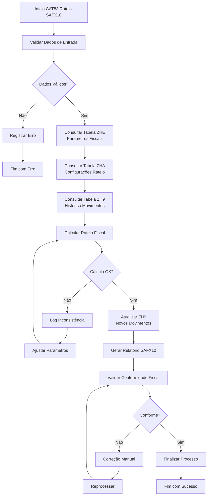
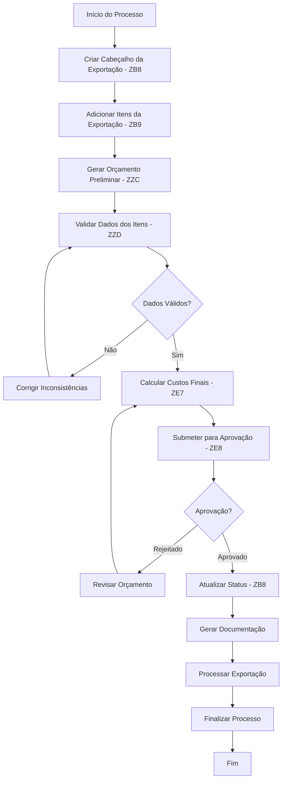
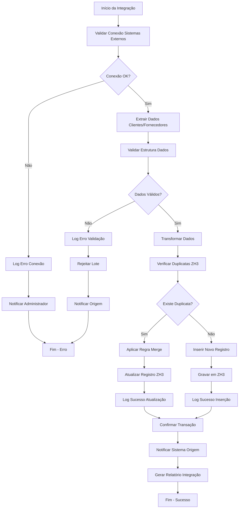

# Processos de Negocio Protheus — Detectados por Analise

> Fonte: Deteccao automatica de processos (extraiRPO)
> Total: 52 processos

---

## 🟡 Aprovação SA - EPI
- **Tipo:** workflow
- **Criticidade:** media
- **Score:** 0.84
- **Tabelas:** ["ZG6"]
- **Descricao:** Workflow de aprovação de solicitações de EPI

## 🟡 Aprovação de Aparência e Peças
- **Tipo:** qualidade
- **Criticidade:** media
- **Score:** 0.77
- **Tabelas:** ["QK4", "QK1"]
- **Descricao:** Controle de aprovação de aparência e cadastro de peças

## 🟡 Armazém vs Unidades
- **Tipo:** logistica
- **Criticidade:** media
- **Score:** 0.81
- **Tabelas:** ["SZ4"]
- **Descricao:** Controle de relacionamento entre armazéns e unidades

## 🟡 Cargas Externas Multi
- **Tipo:** logistica
- **Criticidade:** media
- **Score:** 0.8
- **Tabelas:** ["ZJQ"]
- **Descricao:** Controle de cargas externas com múltiplas origens

## 🟡 Caução E-Commerce
- **Tipo:** outro
- **Criticidade:** media
- **Score:** 0.78
- **Tabelas:** ["ZE6"]
- **Descricao:** Controle de cauções para operações de e-commerce

## 🟡 Comprometimento com Viabilidade
- **Tipo:** qualidade
- **Criticidade:** media
- **Score:** 0.71
- **Tabelas:** ["QKF"]
- **Descricao:** Processo de comprometimento com viabilidade de projetos

## 🟡 Controle Integração Funcionários ARGO
- **Tipo:** integracao
- **Criticidade:** media
- **Score:** 0.83
- **Tabelas:** ["ZN1"]
- **Descricao:** Integração de dados de funcionários com sistema ARGO

## 🟡 Controle de Especificações e Operações
- **Tipo:** qualidade
- **Criticidade:** media
- **Score:** 0.83
- **Tabelas:** ["QQK", "QP6", "QP7", "QE6", "QE7"]
- **Descricao:** Gestão de especificações de produtos e operações com ensaios

## 🟡 Controle de Instrumentos e Calibração
- **Tipo:** qualidade
- **Criticidade:** media
- **Score:** 0.85
- **Tabelas:** ["QM2", "QM4", "QM6"]
- **Descricao:** Gestão de instrumentos, calibração e repetibilidade/reprodutibilidade

## 🟡 Controle de Pallets
- **Tipo:** logistica
- **Criticidade:** media
- **Score:** 0.85
- **Tabelas:** ["Z01"]
- **Descricao:** Sistema de controle e rastreamento de pallets

## 🟡 Credit Note
- **Tipo:** outro
- **Criticidade:** media
- **Score:** 0.8
- **Tabelas:** ["ZI7"]
- **Descricao:** Controle de notas de crédito para clientes

## 🟡 Inspeção de Entradas
- **Tipo:** qualidade
- **Criticidade:** media
- **Score:** 0.81
- **Tabelas:** ["QEK", "QEL", "QEP"]
- **Descricao:** Controle de entradas, laudos e entregas importadas

## 🟡 Integração Fornecedores SLP
- **Tipo:** integracao
- **Criticidade:** media
- **Score:** 0.81
- **Tabelas:** ["ZL2"]
- **Descricao:** Integração de fornecedores com sistema SLP

## 🟡 Itens Pré-Cálculo Exportação
- **Tipo:** pricing
- **Criticidade:** media
- **Score:** 0.83
- **Tabelas:** ["ZEE"]
- **Descricao:** Controle de itens para pré-cálculo de exportação

## 🟡 Log Integração Produto Commerce
- **Tipo:** integracao
- **Criticidade:** media
- **Score:** 0.81
- **Tabelas:** ["ZFU"]
- **Descricao:** Log de integração de produtos com plataforma de comércio

## 🟡 Movimento Expense ARGO
- **Tipo:** integracao
- **Criticidade:** media
- **Score:** 0.82
- **Tabelas:** ["ZJ8"]
- **Descricao:** Integração de movimentos de despesas com sistema ARGO

## 🟡 Movimentos Gerados Aprovação
- **Tipo:** workflow
- **Criticidade:** media
- **Score:** 0.82
- **Tabelas:** ["ZGC"]
- **Descricao:** Controle de movimentos gerados para processo de aprovação

## 🟡 PSA e VDA
- **Tipo:** qualidade
- **Criticidade:** media
- **Score:** 0.79
- **Tabelas:** ["QL0", "QL1"]
- **Descricao:** Processo de amostras iniciais e folha de capa VDA

## 🟡 RAMI - Gestão de Ativos
- **Tipo:** automacao
- **Criticidade:** media
- **Score:** 0.82
- **Tabelas:** ["ZAV"]
- **Descricao:** Sistema RAMI para gestão de ativos e recursos

## 🟡 Regras Elimina Resíduos
- **Tipo:** automacao
- **Criticidade:** media
- **Score:** 0.79
- **Tabelas:** ["ZK5"]
- **Descricao:** Sistema de regras para eliminação automática de resíduos

## 🟡 Seguro RCTRC
- **Tipo:** regulatorio
- **Criticidade:** media
- **Score:** 0.8
- **Tabelas:** ["ZBS"]
- **Descricao:** Controle de seguros RCTRC para transporte

## 🟡 Tabela Integradora
- **Tipo:** integracao
- **Criticidade:** media
- **Score:** 0.77
- **Tabelas:** ["ZD1"]
- **Descricao:** Tabela genérica para integração entre sistemas

## 🟡 Tabela Intermediária PC
- **Tipo:** integracao
- **Criticidade:** media
- **Score:** 0.78
- **Tabelas:** ["ZJU"]
- **Descricao:** Tabela intermediária para integração de pedidos de compra

## 🟡 Títulos Caixinha
- **Tipo:** outro
- **Criticidade:** media
- **Score:** 0.79
- **Tabelas:** ["ZE0"]
- **Descricao:** Controle de títulos do sistema caixinha

## 🟢 Documentos Winprint
- **Tipo:** automacao
- **Criticidade:** baixa
- **Score:** 0.72
- **Tabelas:** ["ZMV"]
- **Descricao:** Controle de documentos para impressão via Winprint

## 🟢 Envio Data Inicial Carga
- **Tipo:** logistica
- **Criticidade:** baixa
- **Score:** 0.74
- **Tabelas:** ["ZHJ"]
- **Descricao:** Controle de envio de data inicial para cargas

## 🟢 Gestão de Documentos Qualidade
- **Tipo:** qualidade
- **Criticidade:** baixa
- **Score:** 0.75
- **Tabelas:** ["QDH", "QDP", "QAA"]
- **Descricao:** Controle de documentos, solicitações e usuários do sistema qualidade

## 🟢 Histórico Origem x Destino
- **Tipo:** auditoria
- **Criticidade:** baixa
- **Score:** 0.76
- **Tabelas:** ["ZEK"]
- **Descricao:** Controle de histórico de origem e destino de produtos

## 🟢 Medições e Dados Genéricos
- **Tipo:** qualidade
- **Criticidade:** baixa
- **Score:** 0.73
- **Tabelas:** ["QPR", "QER"]
- **Descricao:** Controle de medições e dados genéricos para produtos e processos

## 🔴 APQP e Certificação de Submissão
- **Tipo:** qualidade
- **Criticidade:** alta
- **Score:** 0.9
- **Tabelas:** ["QKJ", "QKI", "QKH", "QK9"]
- **Descricao:** Processo APQP com certificados, aprovação interina e capabilidade

## 🔴 Automação de Transferência
- **Tipo:** automacao
- **Criticidade:** alta
- **Score:** 0.88
- **Tabelas:** ["SZ5"]
- **Descricao:** Sistema de automação para transferências entre unidades

## 🔴 CAT83 Rateio SAFX10
- **Tipo:** fiscal
- **Criticidade:** alta
- **Score:** 0.91
- **Tabelas:** ["ZHE", "ZHA", "ZH9"]
- **Descricao:** Sistema CAT83 para rateio e controle fiscal SAFX10

Fluxo:

## 🔴 Cabeçalho Pedidos SFA
- **Tipo:** integracao
- **Criticidade:** alta
- **Score:** 0.89
- **Tabelas:** ["ZC5"]
- **Descricao:** Integração de cabeçalho de pedidos com Sales Force Automation

## 🔴 Cargas Inbound Integradas
- **Tipo:** logistica
- **Criticidade:** alta
- **Score:** 0.87
- **Tabelas:** ["ZJA"]
- **Descricao:** Integração de cargas de entrada com sistemas logísticos

## 🔴 Certificação Sanitária
- **Tipo:** regulatorio
- **Criticidade:** alta
- **Score:** 0.84
- **Tabelas:** ["ZZR"]
- **Descricao:** Controle de certificações sanitárias para produtos

## 🔴 Dados CTE
- **Tipo:** fiscal
- **Criticidade:** alta
- **Score:** 0.86
- **Tabelas:** ["ZDL"]
- **Descricao:** Controle de dados do Conhecimento de Transporte Eletrônico

## 🔴 FMEA de Processo e Projeto
- **Tipo:** qualidade
- **Criticidade:** alta
- **Score:** 0.87
- **Tabelas:** ["QK8", "QK6"]
- **Descricao:** Análise de modo e efeito de falha para processos e projetos

## 🔴 Gestão de Exportação
- **Tipo:** workflow
- **Criticidade:** alta
- **Score:** 0.95
- **Tabelas:** ["ZB8", "ZB9", "ZZC", "ZZD", "ZE7", "ZE8"]
- **Descricao:** Processo completo de exportação com cabeçalho, itens, orçamentos e aprovações

Fluxo:

## 🔴 Gestão de Não Conformidades
- **Tipo:** qualidade
- **Criticidade:** alta
- **Score:** 0.88
- **Tabelas:** ["QI2", "QI3", "QI5"]
- **Descricao:** Controle de não conformidades e ações corretivas no sistema de qualidade

## 🔴 Integração Cargas Outbound
- **Tipo:** logistica
- **Criticidade:** alta
- **Score:** 0.89
- **Tabelas:** ["ZJR"]
- **Descricao:** Integração de cargas de saída com sistemas logísticos

## 🔴 Integração Cliente e Fornecedor
- **Tipo:** integracao
- **Criticidade:** alta
- **Score:** 0.88
- **Tabelas:** ["ZH3"]
- **Descricao:** Integração de dados de clientes e fornecedores com sistemas externos

Fluxo:

## 🔴 Integração Financeira
- **Tipo:** integracao
- **Criticidade:** alta
- **Score:** 0.86
- **Tabelas:** ["ZF7"]
- **Descricao:** Integração de dados financeiros com sistemas externos

## 🔴 Integração TAURA Produção
- **Tipo:** integracao
- **Criticidade:** alta
- **Score:** 0.91
- **Tabelas:** ["ZZE", "ZFZ"]
- **Descricao:** Integração com sistema TAURA para controle de produção

## 🔴 Integração XML de Carga
- **Tipo:** integracao
- **Criticidade:** alta
- **Score:** 0.92
- **Tabelas:** ["ZHP", "ZHO"]
- **Descricao:** Processamento de XMLs de carga com cabeçalho e itens para logística

## 🔴 Itens REINF Eventos
- **Tipo:** fiscal
- **Criticidade:** alta
- **Score:** 0.89
- **Tabelas:** ["ZMA"]
- **Descricao:** Controle de itens para eventos REINF 4010/4020

## 🔴 Lançamentos Contábeis GESPLAN
- **Tipo:** outro
- **Criticidade:** alta
- **Score:** 0.85
- **Tabelas:** ["QLX"]
- **Descricao:** Lançamentos contábeis integrados com sistema GESPLAN

## 🔴 Monitor de Integrações
- **Tipo:** integracao
- **Criticidade:** alta
- **Score:** 0.9
- **Tabelas:** ["SZ1"]
- **Descricao:** Sistema de monitoramento de integrações entre sistemas

## 🔴 Movimentos ARGO
- **Tipo:** integracao
- **Criticidade:** alta
- **Score:** 0.9
- **Tabelas:** ["ZJ2", "ZJ8"]
- **Descricao:** Integração de movimentos e expenses com sistema ARGO

## 🔴 Pedido de Abate Mestre
- **Tipo:** outro
- **Criticidade:** alta
- **Score:** 0.87
- **Tabelas:** ["ZZM"]
- **Descricao:** Controle de pedidos de abate no processo produtivo

## 🔴 Pedidos Compra Ariba
- **Tipo:** integracao
- **Criticidade:** alta
- **Score:** 0.92
- **Tabelas:** ["ZLZ"]
- **Descricao:** Integração de pedidos de compra com plataforma Ariba

## 🔴 RAME - Manutenção
- **Tipo:** workflow
- **Criticidade:** alta
- **Score:** 0.89
- **Tabelas:** ["ZGX"]
- **Descricao:** Sistema RAME para controle de manutenção com workflow de aprovação

## 🔴 Regras Aprovação Automática
- **Tipo:** automacao
- **Criticidade:** alta
- **Score:** 0.88
- **Tabelas:** ["ZEA"]
- **Descricao:** Sistema de regras para aprovação automática de processos
