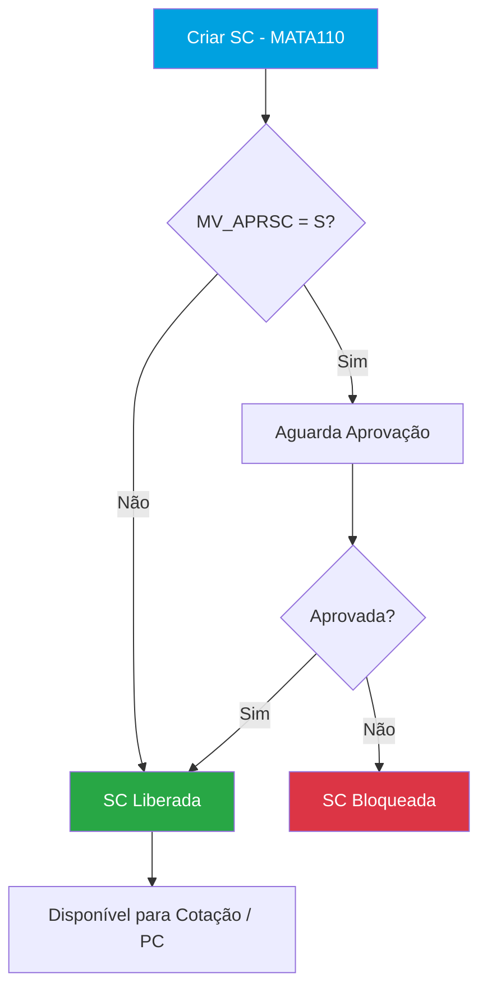
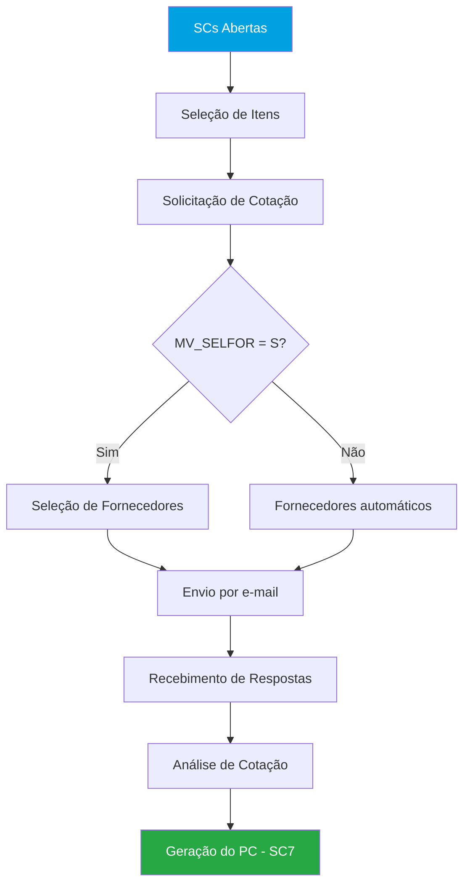
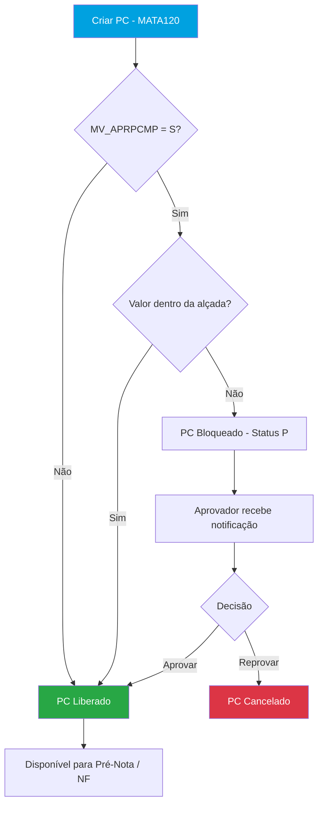
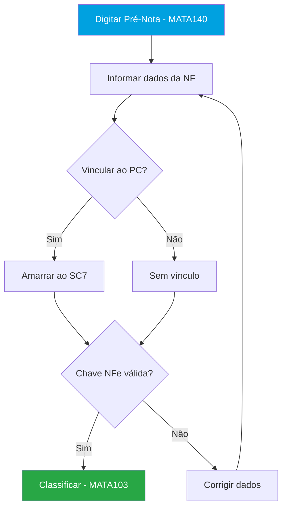
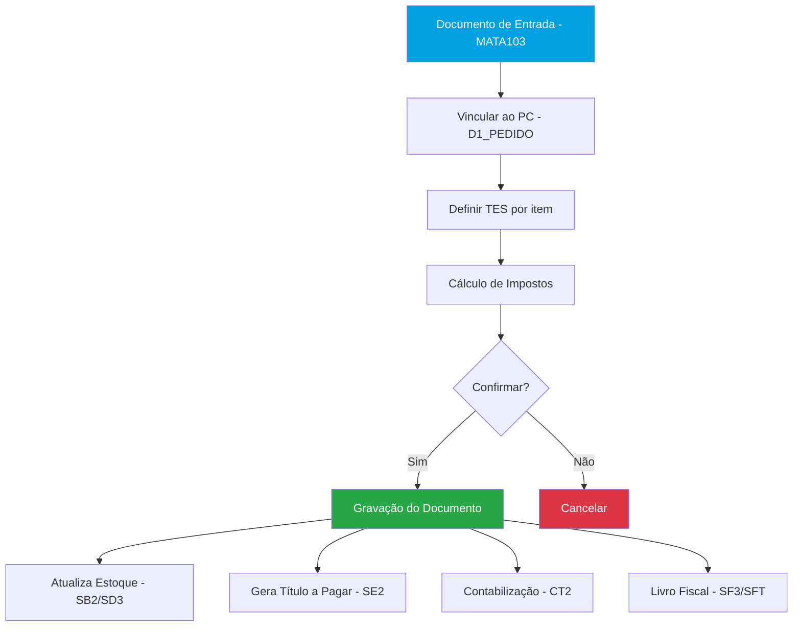
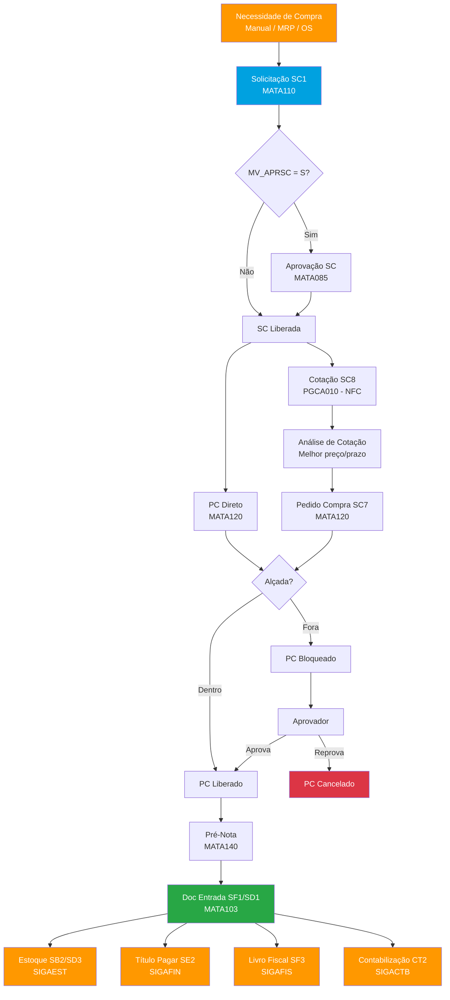
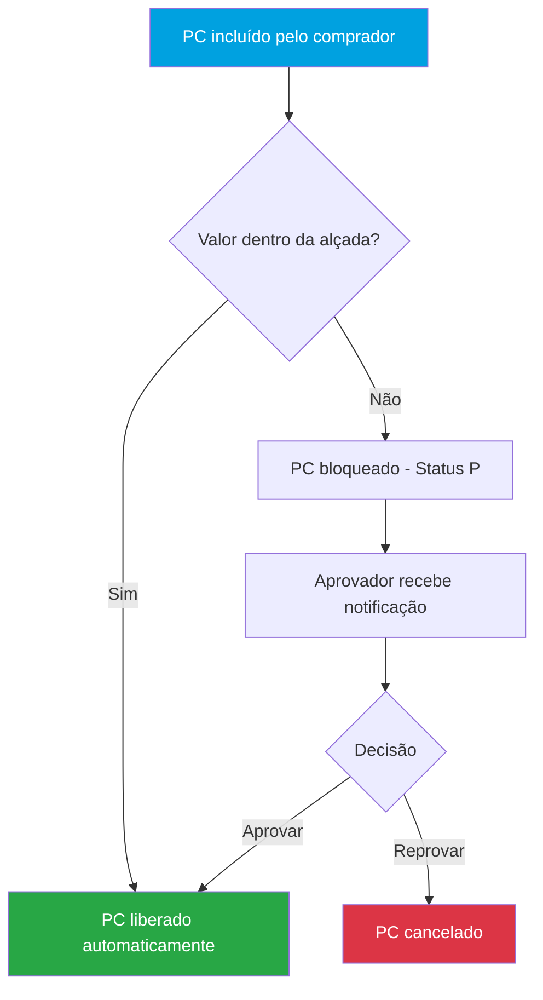
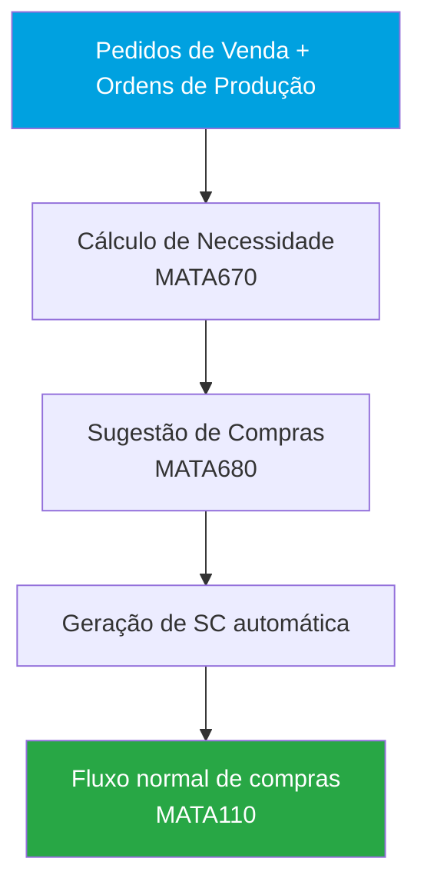

# SIGACOM – Fluxo Completo de Compras no Protheus

## 1. Objetivo do Módulo

O **SIGACOM** (Gestão de Compras) é o módulo do Protheus responsável por todo o ciclo de aquisição da empresa: desde a necessidade de compra até o recebimento da mercadoria e a geração do título financeiro a pagar.

**Objetivos principais:**
- Controle e rastreabilidade das compras (SC → PC → NF)
- Controle de alçadas e aprovações por hierarquia
- Integração com Estoque (SIGAEST), Financeiro (SIGAFIN), Fiscal (SIGAFIS) e MRP (SIGAPCP)
- Suporte a cotações com múltiplos fornecedores
- Controle de contratos de parceria

**Sigla:** SIGACOM
**Menu principal:** Atualizações > Compras
**Integra com:** SIGAEST (estoque), SIGAFIN (financeiro), SIGAFIS (fiscal), SIGACTB (contábil)

**Nomenclatura do módulo:**

| Sigla | Significado |
|-------|------------|
| SC | Solicitação de Compras |
| PC | Pedido de Compras |
| NF | Nota Fiscal |
| PE | Ponto de Entrada |
| LP | Lançamento Padrão |
| NFC | Novo Fluxo de Compras |
| CTE | Conhecimento de Transporte Eletrônico |

---

## 2. Parametrização Geral do Módulo

Parâmetros MV_ que afetam o módulo como um todo (não específicos de uma rotina).

| Parâmetro | Descrição | Padrão | Tipo | Impacto |
|-----------|-----------|--------|------|---------|
| `MV_ESTADO` | UF da empresa | SP | C(2) | Cálculo fiscal em todas as rotinas |
| `MV_IPISC` | IPI compõe custo do produto | N | L | Afeta custo de todos os itens |
| `MV_ICMSST` | Utiliza ICMS-ST nas entradas | N | L | Cálculo de substituição tributária |
| `MV_PISENT` | PIS nas entradas | N | L | Cálculo de PIS em todas as NFs |
| `MV_COFENT` | COFINS nas entradas | N | L | Cálculo de COFINS em todas as NFs |

> ⚠️ **Atenção:** Alteração de parâmetros globais afeta TODAS as rotinas do módulo.
> Teste em ambiente de homologação antes de alterar em produção.

---

## 3. Cadastros Fundamentais

Cadastros que precisam estar preenchidos antes de usar o módulo.

### 3.1 Fornecedores — MATA020 (SA2)

**Menu:** Atualizações > Cadastros > Fornecedores
**Tabela:** `SA2` — Cadastro de Fornecedores

Cadastro de todos os fornecedores da empresa. Suporta tipos PF, PJ ou Exterior.

| Campo | Descrição | Tipo | Obrigatório |
|-------|-----------|------|-------------|
| A2_COD | Código do Fornecedor | C(6) | Sim |
| A2_LOJA | Loja | C(2) | Sim |
| A2_NOME | Razão Social | C(40) | Sim |
| A2_NREDUZ | Nome Fantasia | C(20) | Sim |
| A2_CGC | CNPJ/CPF | C(14) | Sim |
| A2_TIPO | Tipo (PF/PJ/Ext) | C(1) | Sim |

### 3.2 Produtos — MATA010 (SB1)

**Menu:** Atualizações > Cadastros > Produtos
**Tabela:** `SB1` — Cadastro de Produtos

Cadastro de produtos e serviços. Define unidade, grupo e TES padrão.

| Campo | Descrição | Tipo | Obrigatório |
|-------|-----------|------|-------------|
| B1_COD | Código do Produto | C(15) | Sim |
| B1_DESC | Descrição | C(40) | Sim |
| B1_UM | Unidade de Medida | C(2) | Sim |
| B1_GRUPO | Grupo do Produto | C(4) | Sim |
| B1_TE | TES Padrão de Entrada | C(3) | Não |

> **Nota:** Compartilhada com SIGAEST e SIGAFAT.

### 3.3 Armazéns — MATA050 (NNR)

**Menu:** Atualizações > Cadastros > Armazéns
**Tabela:** `NNR` — Cadastro de Armazéns

Define os armazéns de destino para recebimento de materiais.

### 3.4 TES – Tipo de Entrada/Saída — MATA061 (SF4)

**Menu:** Atualizações > Cadastros > TES
**Tabela:** `SF4` — Tipos de Entrada e Saída

Define o comportamento fiscal e contábil de cada operação. Determina impostos, geração de estoque e financeiro.

### 3.5 Condições de Pagamento — MATA090 (SE4)

**Menu:** Atualizações > Cadastros > Condições de Pagamento
**Tabela:** `SE4` — Condições de Pagamento

Prazo e forma de pagamento aplicados aos pedidos e notas fiscais.

### 3.6 Compradores — MATA082 (SA6)

**Menu:** Atualizações > Adm. Compras > Compradores
**Tabela:** `SA6` — Cadastro de Compradores

Cadastro de compradores vinculados a grupos de compras e níveis de aprovação.

### 3.7 Grupo de Compras — MATA083 (SQB)

**Menu:** Atualizações > Adm. Compras > Grupos de Compras
**Tabela:** `SQB` — Grupos de Compras

Restrição e alçada por comprador. Vincula aprovadores ao grupo.

### 3.8 Natureza Financeira — MATA070 (SED)

**Menu:** Atualizações > Cadastros > Naturezas
**Tabela:** `SED` — Naturezas Financeiras

Classificação de custo para integração financeira.

### 3.9 Centro de Custo — CTBA010 (CTT)

**Menu:** Atualizações > Cadastros > Centro de Custo
**Tabela:** `CTT` — Centros de Custo

Para rateio contábil nos documentos de entrada.

---

## 4. Rotinas

### 4.1 MATA110 — Solicitação de Compras

**Objetivo:** Registrar a necessidade de compra de um produto ou serviço. Ponto de partida do ciclo de compras.
**Menu:** Atualizações > Solicitações de Compra > Solicitações de Compra
**Tipo:** Inclusão / Manutenção

#### Tabelas

| Tabela | Alias | Descrição | Tipo |
|--------|-------|-----------|------|
| SC1 | SC1 | Solicitações de Compras | Principal |
| SC6 | SC6 | Itens da Solicitação de Compras | Complementar |

#### Campos Principais

| Campo | Descrição | Tipo | Obrigatório | Validação/Observação |
|-------|-----------|------|-------------|---------------------|
| `C1_NUM` | Número da Solicitação | C(6) | Sim | Automático (GetSX8Num) |
| `C1_ITEM` | Item da Solicitação | C(4) | Sim | Sequencial |
| `C1_PRODUTO` | Código do Produto | C(15) | Sim | ExistCpo("SB1") |
| `C1_DESCRI` | Descrição | C(40) | - | Gatilho de SB1 |
| `C1_DATPRF` | Data de necessidade | D | Sim | >= Data atual |
| `C1_QUANT` | Quantidade solicitada | N(12,2) | Sim | > 0 |
| `C1_QUJE` | Qtd já empenhada (em pedido) | N(12,2) | - | Atualizado automaticamente |
| `C1_UM` | Unidade de medida | C(2) | - | Gatilho de SB1 |
| `C1_LOCAL` | Armazém de destino | C(2) | Sim | ExistCpo("NNR") |
| `C1_SOLICIT` | Solicitante | C(25) | - | - |
| `C1_EMISSAO` | Data de emissão | D | Sim | Automático |
| `C1_OBS` | Observações | C(60) | - | - |
| `C1_APROVA` | Flag de aprovação | C(1) | - | S=Aprovada, N=Não aprovada |
| `C1_CONAPRO` | Condição de aprovação | C(1) | - | Alçada de aprovação |
| `C1_GRUPCOM` | Grupo de compras | C(6) | - | Vincula ao comprador/grupo |

#### Status / Tipos

| Cor | Status | Comportamento |
|-----|--------|---------------|
| Verde | Atendida totalmente | SC totalmente empenhada em PCs |
| Amarelo | Atendida parcialmente | Parte da quantidade em PC |
| Vermelho | Não atendida / Bloqueada | Aguardando aprovação ou sem PC |
| Cinza | Cancelada | SC cancelada |

#### Parâmetros MV_ desta Rotina

| Parâmetro | Descrição | Padrão | Tipo | Quando usar |
|-----------|-----------|--------|------|-------------|
| `MV_APRSC` | Ativa aprovação de SC | N | L | Quando precisa de alçada para SC |
| `MV_SC1MULT` | Permite SC com múltiplos armazéns | S | L | Controle por armazém |
| `MV_SC1COMP` | Exige campo comprador na SC | N | L | Rastreabilidade por comprador |

#### Pontos de Entrada

| Ponto de Entrada | Momento de Execução | Descrição | Parâmetros |
|-----------------|---------------------|-----------|------------|
| `MT110OKB` | Antes de gravar | Validação antes de gravar a SC | - |
| `MT110OK` | Validação de campos | Validação de campos da SC | - |
| `MT110CAN` | Cancelamento | Executado no cancelamento da SC | - |
| `MT110DEL` | Exclusão | Executado na exclusão da SC | - |
| `A110BNTSC` | Inicialização | Adiciona botões à rotina de SC | - |
| `SC1100I` | Após inclusão | Executado após inclusão da SC na tabela | - |
| `SC1100E` | Antes de deletar | Executado antes de deletar SC | - |

#### Fluxo da Rotina

---

### 4.2 PGCA010 — Cotação – Novo Fluxo de Compras (NFC)

**Objetivo:** Processo completo de cotação de preços com múltiplos fornecedores, do envio à análise e geração do PC.
**Menu:** SIGACOM > Novo Fluxo de Compras
**Tipo:** Processamento

> ⚠️ **A partir da release 12.1.2510, as rotinas `MATA131`/`MATA150`/`MATA160`/`MATA161` foram descontinuadas. Use o Novo Fluxo de Compras (NFC).**

#### Tabelas

| Tabela | Alias | Descrição | Tipo |
|--------|-------|-----------|------|
| SC1 | SC1 | Solicitações de Compras (leitura) | Origem |
| SC7 | SC7 | Pedido de Compras (gerado) | Destino |
| SC8 | SC8 | Cotação de Compras | Principal |

#### Etapas do NFC

1. **Necessidade de Compra** — visualização das SCs abertas e pendentes
2. **Seleção de itens** — selecionar SCs para cotar
3. **Solicitação de Cotação** — definir apelido do grupo, prazo para recebimento, informações de entrega, observações por produto
4. **Seleção de Fornecedores** — ativa com `MV_SELFOR = S`
   - Aba "Todos os fornecedores" — lista completa do SA2
   - Aba "Últimos fornecedores" — baseado nas últimas NFs por produto
   - Permite incluir "fornecedor participante" (não cadastrado no SA2) com nome e e-mail
5. **Envio de Cotação** — disparo via e-mail (workflow) para fornecedores
6. **Recebimento de Respostas** — preenchimento dos preços pelos fornecedores
7. **Análise de Cotação** — comparativo de preços e geração do Pedido de Compras

**Aglutinação de produtos:** quando duas SCs possuem o mesmo produto, data, conta contábil, etc., o NFC agrupa automaticamente. Controle via `MV_COTRATP`.

#### Parâmetros MV_ desta Rotina

| Parâmetro | Descrição | Padrão | Tipo | Quando usar |
|-----------|-----------|--------|------|-------------|
| `MV_SELFOR` | Habilita tela de seleção de fornecedores | S | L | Sempre recomendado |
| `MV_COTRATP` | Aglutinação de produtos na cotação | | C | Controle de agrupamento |
| `MV_COTAENV` | Envio de cotação por e-mail | S | L | Cotação via workflow |
| `MV_APRCOTC` | Aprovação de cotações | N | L | Quando exige alçada na cotação |

#### Pontos de Entrada

| Ponto de Entrada | Momento de Execução | Descrição | Parâmetros |
|-----------------|---------------------|-----------|------------|
| `AVALCOT` | Análise de cotação | Edição dos PCs gerados via análise de cotação | - |
| `AVALCOPC` | Análise de cotação | Edição dos itens dos PCs gerados na análise | - |
| `NFCFILFOR` | Seleção de fornecedores | Filtrar fornecedores conforme regras customizadas | - |

> ⚠️ Os pontos de entrada das rotinas legadas (`MATA131`, `MATA150`, `MATA161`) **não são válidos** no NFC. Para customizar o Novo Fluxo, utilizar apenas os PEs listados acima.

#### Fluxo da Rotina

---

### 4.3 MATA131 / MATA160 — Cotação – Fluxo Legado

**Objetivo:** Geração e análise de cotação de compras (fluxo descontinuado).
**Menu:** Atualizações > Cotações
**Tipo:** Processamento

> ⚠️ **Descontinuado desde 30/06/2025 (release 12.1.2410). Não disponível a partir de 12.1.2510.**

#### Tabelas

| Tabela | Alias | Descrição | Tipo |
|--------|-------|-----------|------|
| SCJ | SCJ | Cabeçalho da Cotação | Principal |
| SCK | SCK | Itens da Cotação | Complementar |

#### Rotinas do Fluxo Legado

| Rotina | Função |
|--------|--------|
| `MATA131` | Geração de Cotação |
| `MATA150` | Atualização de Cotação (preenchimento de preços) |
| `MATA160` | Análise de Cotação |
| `MATA161` | Análise de Cotação (por pesos) |

---

### 4.4 MATA120 / MATA121 — Pedido de Compras

**Objetivo:** Registrar o documento formal de compra enviado ao fornecedor. Pode ser gerado manualmente, via cotação ou via ExecAuto.
**Menu:** Atualizações > Pedidos de Compra > Pedidos de Compra
**Tipo:** Inclusão / Manutenção (`MATA120`) | Visualização (`MATA121`)

#### Tabelas

| Tabela | Alias | Descrição | Tipo |
|--------|-------|-----------|------|
| SC7 | SC7 | Pedido de Compras | Principal |

#### Campos Principais

| Campo | Descrição | Tipo | Obrigatório | Validação/Observação |
|-------|-----------|------|-------------|---------------------|
| `C7_NUM` | Número do Pedido | C(6) | Sim | Automático (GetSX8Num) |
| `C7_ITEM` | Item | C(4) | Sim | Sequencial |
| `C7_PRODUTO` | Código do Produto | C(15) | Sim | ExistCpo("SB1") |
| `C7_DESCRI` | Descrição | C(40) | - | Gatilho de SB1 |
| `C7_QUANT` | Quantidade | N(12,2) | Sim | > 0 |
| `C7_PRECO` | Preço unitário | N(14,2) | Sim | > 0 |
| `C7_TOTAL` | Total do item | N(14,2) | - | Calculado |
| `C7_FORNECE` | Código do Fornecedor | C(6) | Sim | ExistCpo("SA2") |
| `C7_LOJA` | Loja do Fornecedor | C(2) | Sim | - |
| `C7_EMISSAO` | Data de emissão | D | Sim | Automático |
| `C7_DATPRF` | Data de previsão de entrega | D | Sim | >= Data atual |
| `C7_LOCAL` | Armazém de destino | C(2) | Sim | ExistCpo("NNR") |
| `C7_TPFRETE` | Tipo de frete | C(1) | - | C=CIF, F=FOB |
| `C7_COND` | Condição de pagamento | C(3) | Sim | ExistCpo("SE4") |
| `C7_CONAPRO` | Status de aprovação | C(1) | - | P=Pendente, A=Aprovado, R=Reprovado |
| `C7_QUJE` | Quantidade já recebida | N(12,2) | - | Atualizado automaticamente |
| `C7_RESP` | Responsável / Comprador | C(6) | - | Vincula ao SA6 |
| `C7_GRUPCOM` | Grupo de Compras | C(6) | - | Vincula ao SQB |
| `C7_FILENT` | Filial de entrega | C(2) | - | Para entrega em outra filial |
| `C7_XAPROVA` | Campo de aprovação customizável | C(1) | - | Customização |

#### Status / Tipos

| Status | Descrição | Comportamento |
|--------|-----------|---------------|
| Aberto | Aguardando recebimento | PC pode gerar Pré-Nota/NF |
| Parcial | Recebido parcialmente | Parte da quantidade recebida |
| Encerrado | Recebido totalmente | PC concluído |
| Bloqueado | Aguardando aprovação | Alçada pendente (C7_CONAPRO = P) |
| Cancelado | Pedido cancelado | PC inativo |

**Status de aprovação (C7_CONAPRO):**

| Valor | Descrição | Comportamento |
|-------|-----------|---------------|
| (vazio) | Sem necessidade de aprovação | PC já liberado |
| P | Pendente de aprovação | Aguardando aprovador |
| A | Aprovado | PC liberado para uso |
| R | Reprovado | PC bloqueado pelo aprovador |

#### Parâmetros MV_ desta Rotina

| Parâmetro | Descrição | Padrão | Tipo | Quando usar |
|-----------|-----------|--------|------|-------------|
| `MV_ALTEPEDC` | Permite alterar PC já atendido | N | L | Quando precisa alterar PC parcialmente atendido |
| `MV_PCEXCOT` | Restaura cotação ao excluir PC | 1 | N | Controle de vínculo cotação/PC |
| `MV_PCFILEN` | Controle de numeração por filial de entrega | F | C | Multifilial |
| `MV_120COMP` | Obriga comprador no pedido | S | L | Rastreabilidade por comprador |
| `MV_REQPC` | Exige SC amarrada ao PC | N | L | Quando todo PC deve ter SC prévia |
| `MV_APRPCMP` | Ativa aprovação do pedido | N | L | Quando precisa de alçada para PC |
| `MV_HISTAPC` | Histórico de aprovações (tabela SGV) | N | L | Auditoria de aprovações |

#### Pontos de Entrada

| Ponto de Entrada | Momento de Execução | Descrição | Parâmetros |
|-----------------|---------------------|-----------|------------|
| `MT120BLK` | Inicialização | Bloqueio/desbloqueio de campos no PC | - |
| `MT120OK` | Antes de gravar | Validação geral do PC antes de gravar | - |
| `MT120OKB` | Antes de gravar (item) | Validação antes de gravar (nível item) | - |
| `MT120F` | Após gravação | Manipula dados gravados na tabela SC7 | - |
| `MT120USR` | Inicialização | Restringe entrada de PC sem SC amarrada | - |
| `MT120CUR` | Validação | Validação de usuário (restrição sem SC) | - |
| `MT120ABU` | Inicialização | Exclusão/alteração de botões na rotina | - |
| `WFW120P` | Após gravação | Manipulação dos dados gravados na SC7 | - |
| `C7_100I` | Após inclusão item | Executado após inclusão do item no SC7 | - |
| `C7_100E` | Antes exclusão item | Executado antes da exclusão do item | - |

#### Fluxo da Rotina

**Formas de geração do PC:**
1. Manualmente via `MATA120`
2. Automaticamente via análise de cotação (NFC / `PGCA010`)
3. Via ExecAuto (automação ADVPL)

---

### 4.5 MATA140 — Pré-Nota de Entrada

**Objetivo:** Cadastrar previamente a Nota Fiscal do fornecedor antes da classificação fiscal.
**Menu:** Atualizações > Movimentos > Pré-Nota de Entrada
**Tipo:** Inclusão / Manutenção

#### Tabelas

| Tabela | Alias | Descrição | Tipo |
|--------|-------|-----------|------|
| SF1 | SF1 | Cabeçalho da Pré-Nota | Principal |
| SD1 | SD1 | Itens da Pré-Nota | Complementar |

#### Campos Principais

| Campo | Descrição | Tipo | Obrigatório | Validação/Observação |
|-------|-----------|------|-------------|---------------------|
| `F1_DOC` | Número da NF | C(9) | Sim | Chave do documento |
| `F1_SERIE` | Série da NF | C(3) | Sim | - |
| `F1_FORNECE` | Código do Fornecedor | C(6) | Sim | ExistCpo("SA2") |
| `F1_LOJA` | Loja do Fornecedor | C(2) | Sim | - |
| `F1_EMISSAO` | Data de emissão | D | Sim | - |
| `F1_CHVNFE` | Chave NFe (44 dígitos) | C(44) | - | Validação SEFAZ via `MV_NFEVAL` |
| `F1_VALBRUT` | Valor Bruto Total | N(14,2) | Sim | - |

#### Etapas

1. Informar dados da NF: chave, série, CNPJ do emitente, data, valor
2. Vincular ao Pedido de Compras (SC7) — opcional mas recomendado
3. Validação da chave NFe (campo `F1_CHVNFE`)
4. Classificar → gera Documento de Entrada (`MATA103`)

#### Parâmetros MV_ desta Rotina

| Parâmetro | Descrição | Padrão | Tipo | Quando usar |
|-----------|-----------|--------|------|-------------|
| `MV_NFEVAL` | Valida NF junto à SEFAZ | N | L | Validação automática de chave NFe |

#### Pontos de Entrada

| Ponto de Entrada | Momento de Execução | Descrição | Parâmetros |
|-----------------|---------------------|-----------|------------|
| `SF1140I` | Após gravação | Atualização do cabeçalho da Pré-Nota | - |
| `MT100GRV` | Estorno | Validação no estorno da classificação | - |
| `MTA140MNU` | Inicialização | Adiciona botões ao menu principal | - |

#### Fluxo da Rotina

> **Dica:** A chave NFe pode ser validada automaticamente via SEFAZ com parâmetro `MV_NFEVAL`.

---

### 4.6 MATA103 — Documento de Entrada

**Objetivo:** Classificação fiscal completa da Nota Fiscal recebida. Efetua todas as integrações: estoque, financeiro, contabilização e impostos.
**Menu:** Atualizações > Movimentos > Documento de Entrada
**Tipo:** Inclusão / Manutenção / Processamento

#### Tabelas

| Tabela | Alias | Descrição | Tipo |
|--------|-------|-----------|------|
| SF1 | SF1 | Cabeçalho do Documento de Entrada | Principal |
| SD1 | SD1 | Itens do Documento de Entrada | Complementar |
| SB2 | SB2 | Saldo em Estoque | Atualizado |
| SD3 | SD3 | Movimentação de Estoque | Gerado |
| SE2 | SE2 | Títulos a Pagar | Gerado |
| CT2 | CT2 | Lançamentos Contábeis | Gerado |

#### Campos Principais — SF1 (Cabeçalho)

| Campo | Descrição | Tipo | Obrigatório | Validação/Observação |
|-------|-----------|------|-------------|---------------------|
| `F1_DOC` | Número da NF | C(9) | Sim | Chave do documento |
| `F1_SERIE` | Série da NF | C(3) | Sim | - |
| `F1_FORNECE` | Fornecedor | C(6) | Sim | ExistCpo("SA2") |
| `F1_LOJA` | Loja do Fornecedor | C(2) | Sim | - |
| `F1_EMISSAO` | Data de Emissão | D | Sim | - |
| `F1_DTDIGIT` | Data de Digitação | D | Sim | Automático |
| `F1_CHVNFE` | Chave NFe (44 dígitos) | C(44) | - | Validação SEFAZ |
| `F1_COND` | Condição de Pagamento | C(3) | Sim | ExistCpo("SE4") |
| `F1_TPFRETE` | Tipo de Frete | C(1) | - | C=CIF, F=FOB |
| `F1_VALBRUT` | Valor Bruto Total | N(14,2) | - | Calculado |
| `F1_VALFRE` | Valor do Frete | N(14,2) | - | - |
| `F1_VALIPI` | Valor IPI | N(14,2) | - | Calculado |
| `F1_VALICM` | Valor ICMS | N(14,2) | - | Calculado |
| `F1_PICM` | % ICMS | N(5,2) | - | - |
| `F1_VALPIS` | Valor PIS | N(14,2) | - | Calculado |
| `F1_VALCOF` | Valor COFINS | N(14,2) | - | Calculado |
| `F1_VALISS` | Valor ISS | N(14,2) | - | Calculado |
| `F1_ICMSST` | Valor ICMS-ST | N(14,2) | - | Calculado |

#### Campos Principais — SD1 (Itens)

| Campo | Descrição | Tipo | Obrigatório | Validação/Observação |
|-------|-----------|------|-------------|---------------------|
| `D1_COD` | Código do Produto | C(15) | Sim | ExistCpo("SB1") |
| `D1_DESCRI` | Descrição | C(40) | - | Gatilho de SB1 |
| `D1_QUANT` | Quantidade | N(12,2) | Sim | > 0 |
| `D1_VUNIT` | Valor Unitário | N(14,2) | Sim | > 0 |
| `D1_TOTAL` | Valor Total | N(14,2) | - | Calculado |
| `D1_TES` | Tipo de Entrada/Saída | C(3) | Sim | ExistCpo("SF4") |
| `D1_LOCAL` | Armazém | C(2) | Sim | ExistCpo("NNR") |
| `D1_PEDIDO` | Número do Pedido vinculado | C(6) | - | Vínculo com SC7 |
| `D1_ITEMPC` | Item do Pedido | C(4) | - | - |
| `D1_PICM` | % ICMS | N(5,2) | - | Calculado pela TES |
| `D1_VALICM` | Valor ICMS | N(14,2) | - | Calculado |
| `D1_IPI` | Valor IPI | N(14,2) | - | Calculado |
| `D1_PPISVL` | % PIS | N(5,2) | - | Calculado |
| `D1_VALPIS` | Valor PIS | N(14,2) | - | Calculado |
| `D1_PCOFINS` | % COFINS | N(5,2) | - | Calculado |
| `D1_VALCOF` | Valor COFINS | N(14,2) | - | Calculado |

#### Parâmetros MV_ desta Rotina

| Parâmetro | Descrição | Padrão | Tipo | Quando usar |
|-----------|-----------|--------|------|-------------|
| `MV_NFEVAL` | Valida NF junto à SEFAZ | N | L | Validação de chave NFe |
| `MV_ATUVLNF` | Atualiza preço do produto ao receber | N | L | Atualização automática de custo |
| `MV_ESTORNO` | Permite estorno de documento de entrada | S | L | Correção de lançamentos |
| `MV_NOTA` | Geração de título na entrada | S | L | Integração financeira |
| `MV_1DUPNFE` | Bloqueia NF duplicada | S | L | Prevenção de duplicidade |

#### Pontos de Entrada

| Ponto de Entrada | Momento de Execução | Descrição | Parâmetros |
|-----------------|---------------------|-----------|------------|
| `MT103PRE` | Antes do rateio | Retorna dados para rateio externo | - |
| `MT103LOK` | Validação | Validação do rateio por centro de custo | - |
| `MT103ROK` | Validação | Validação do rateio por CC (complementar) | - |
| `MT103FIN` | Validação | Última validação do folder financeiro | - |
| `MT103RET` | Filtro | Complementa filtro ou define retenção na NFe | - |
| `MT103CWH` | Campo WHEN | Permite alterar o WHEN dos campos | - |
| `MT103LCF` | Inicialização | Bloqueio de campos no Documento de Entrada | - |
| `MT103ENEG` | Validação estoque | Permite negatividade no estoque | - |
| `MT103GUIA` | Após gravação | Gerar Guia de ICMS-ST | - |
| `MT103MSD` | Estorno | Exclusão do Banco de Conhecimento no estorno | - |
| `SD1100I` | Após inclusão item | Executado após inclusão do item na SD1 | - |
| `SD1100E` | Por item | Rotatividade para cada item (executa por item) | - |
| `SF1100I` | Validação linha | Verifica se a linha digitada está OK | - |
| `SF1100E` | Antes de deletar | Executado antes de deletar o registro SF1 | - |
| `M103GERT` | Após gravação | Define geração de lançamento futuro | - |
| `M103L665` | Contabilização | Efetua lançamento contábil LP665 | - |
| `CTBVALOK` | Contabilização | Validação dos lançamentos contábeis | - |
| `GQREENTR` | Integração | Integração com Celerina | - |
| `QIEIMPRL` | Integração | Integração com QIE | - |

#### Processo de Classificação

1. Vincular ao PC (via campo `D1_PEDIDO`)
2. Definir TES por item (determina o comportamento fiscal e contábil)
3. Calcular impostos (automático pelo Protheus ou manual)
4. Confirmar → gera movimentação de estoque + título financeiro + contabilização

#### Fluxo da Rotina

---

### 4.7 MATA116 — Conhecimento de Frete

**Objetivo:** Lançamento do CTE (Conhecimento de Transporte Eletrônico) vinculado à NF de compra.
**Menu:** Atualizações > Movimentos > Conhecimento de Frete
**Tipo:** Inclusão

#### Tabelas

| Tabela | Alias | Descrição | Tipo |
|--------|-------|-----------|------|
| SF1 | SF1 | Cabeçalho do Documento de Entrada | Principal |
| SD1 | SD1 | Itens do Documento de Entrada | Complementar |

> **Nota:** Utiliza as mesmas tabelas do Documento de Entrada (`MATA103`), com tipo diferenciado.

**LPs utilizados:** LP 650 (itens) e LP 660 (totais) — mesmos do Documento de Entrada.

---

## 5. Contabilização

### 5.1 Modo de Contabilização

| Modo | Descrição | Parâmetro |
|------|-----------|-----------|
| On-line | Contabiliza automaticamente ao gravar o Documento de Entrada | Padrão |
| Off-line | Contabilização em lote posterior | Rotina `CTBANFE` via Miscelânea > Contabilização Off-Line |

### 5.2 Lançamentos Padrão (LP)

| Código LP | Descrição | Rotina | Débito | Crédito |
|-----------|-----------|--------|--------|---------|
| 650 | Contabilização dos itens da NF de compra | MATA103 | Estoque (SB2) | Fornecedor (SA2) |
| 655 | Estorno dos itens | MATA103 | Fornecedor (SA2) | Estoque (SB2) |
| 660 | Contabilização dos totais da NF | MATA103 | Estoque (SB2) | Fornecedor (SA2) |
| 665 | Estorno dos totais | MATA103 | Fornecedor (SA2) | Estoque (SB2) |

> **Nota:** LPs são configurados em `CTBA080`. Cada LP pode ter múltiplas linhas
> com fórmulas que referenciam campos do documento.

### 5.3 Pré-requisitos

- Cadastro de calendário contábil
- Cadastro de moeda
- Amarração Moeda x Calendário

---

## 6. Tipos e Classificações

### 6.1 TES – Tipo de Entrada/Saída

| Código/Tipo | Descrição | Comportamento | Uso típico |
|-------------|-----------|---------------|------------|
| NF | Nota Fiscal | Gera livro fiscal, estoque e financeiro | Compras normais |
| CT | Conhecimento Transporte | Gera frete | Fretes de compra |
| BF | Beneficiamento | Entrada de retorno | Industrialização por encomenda |
| DE | Devolução | Estorno de compra | Devolução ao fornecedor |

### 6.2 Tipo de Frete

| Valor | Descrição | Comportamento |
|-------|-----------|---------------|
| C | CIF | Frete por conta do fornecedor |
| F | FOB | Frete por conta do comprador |

---

## 7. Tabelas do Módulo

Visão consolidada de todas as tabelas usadas no módulo.

### Tabelas de Cadastro

| Tabela | Descrição | Rotina Principal | Obs |
|--------|-----------|-----------------|-----|
| SA2 | Fornecedores | MATA020 | Compartilhada com FIN |
| SB1 | Produtos | MATA010 | Compartilhada com EST/FAT |
| NNR | Armazéns | MATA050 | Compartilhada com EST |
| SF4 | TES – Tipo de Entrada/Saída | MATA061 | Compartilhada com FAT |
| SE4 | Condições de Pagamento | MATA090 | Compartilhada com FIN/FAT |
| SA6 | Compradores | MATA082 | Específica de COM |
| SQB | Grupos de Compras | MATA083 | Específica de COM |
| SED | Natureza Financeira | MATA070 | Compartilhada com FIN |
| CTT | Centros de Custo | CTBA010 | Compartilhada com CTB |

### Tabelas de Movimento

| Tabela | Descrição | Rotina Principal | Volume |
|--------|-----------|-----------------|--------|
| SC1 | Solicitação de Compras | MATA110 | Alto |
| SC6 | Itens da Solicitação de Compras | MATA110 | Alto |
| SC7 | Pedido de Compras / Autorização de Entrega | MATA120 | Alto |
| SF1 | Cabeçalho do Documento de Entrada | MATA103 | Alto |
| SD1 | Itens do Documento de Entrada | MATA103 | Muito Alto |
| SB2 | Saldo em estoque | — | Muito Alto |
| SD3 | Movimentação de estoque | — | Muito Alto |
| SE2 | Títulos a Pagar | — | Alto |
| CT2 | Lançamentos contábeis | — | Alto |

### Tabelas de Controle

| Tabela | Descrição | Uso |
|--------|-----------|-----|
| SC8 | Cotação de Compras | Cotação de preços (NFC) |
| SCJ | Cabeçalho da Cotação (legado) | Cotação - fluxo descontinuado |
| SCK | Itens da Cotação (legado) | Cotação - fluxo descontinuado |
| SGV | Histórico de Aprovações | Auditoria (se `MV_HISTAPC=S`) |
| SXE/SXF | Controle de numeração | Numeração de documentos |

---

## 8. Fluxo Geral do Módulo

Diagrama completo do fluxo do módulo, mostrando como as rotinas se conectam entre si e com outros módulos.

**Legenda de cores:**
- Azul: Início do processo (SC)
- Verde: Conclusão / Documento final (NF)
- Vermelho: Rejeição / Cancelamento
- Laranja: Integração com outro módulo

---

## 9. Integrações com Outros Módulos

| Módulo | Integração | Tabela Ponte | Direção | Momento |
|--------|-----------|-------------|---------|---------|
| **SIGAEST** | Atualização de saldo e movimentação | SB2 / SD3 | COM → EST | Na classificação da NF (MATA103) |
| **SIGAFIN** | Geração de título a pagar | SE2 | COM → FIN | Na classificação da NF (MATA103) |
| **SIGAFIS** | Cálculo de ICMS, PIS, COFINS, IPI, ICMS-ST | SF3 / SFT | COM → FIS | Na classificação da NF (MATA103) |
| **SIGACTB** | Contabilização automática via LP | CT2 | COM → CTB | On-line ou Off-line |
| **SIGAPCP** | MRP envia necessidades para geração de SC | SC1 | PCP → COM | Após cálculo MRP (MATA670/MATA680) |
| **SIGAMNT** | Compras para manutenção geram SCs | SC1 | MNT → COM | Via solicitação de serviço |
| **SIGATEC** | NF de imobilizado integra ao Ativo Fixo | SF1/SD1 | COM → TEC | Na classificação da NF |
| **TOTVS WF** | Workflow de aprovação de SCs e PCs | — | COM ↔ WF | Aprovação de documentos |
| **NFC-e/SEFAZ** | Validação e importação automática de XML | SF1 | SEFAZ → COM | Via `MV_NFEVAL` |

---

## 10. Controles Especiais

### 10.1 Controle de Alçadas e Aprovação

**Objetivo:** Garantir que documentos de compra passem por aprovação hierárquica conforme valor e responsabilidade.
**Parâmetro ativador:** `MV_APRPCMP` (PC) / `MV_APRSC` (SC) / `MV_APRCOTC` (Cotação)

O Protheus oferece três tipos de aprovação no módulo de compras:

#### Aprovação de Solicitação de Compras

- **Parâmetro:** `MV_APRSC = S`
- Cadastro de aprovadores: Atualizações > Adm. Compras > Aprovadores (`MATA085`)
- Vincula o aprovador a um grupo e nível hierárquico
- SC fica bloqueada até aprovação (campo `C1_APROVA`)
- Pode ter múltiplos níveis

#### Aprovação de Pedido de Compras

**Configuração:**
1. Cadastrar **Aprovadores** (`MATA085`) — usuário, valor máximo que pode aprovar, nível hierárquico
2. Cadastrar **Grupos de Aprovação** (`MATA083`) — vincular aprovadores ao grupo
3. Vincular o **Comprador** ao grupo (`MATA082`) — campo "Grupo de Aprovação" no cadastro do comprador

| Parâmetro | Descrição | Padrão |
|-----------|-----------|--------|
| `MV_APRPCMP` | Ativa aprovação do pedido de compras | N |
| `MV_APRCOTC` | Ativa aprovação de cotações | N |
| `MV_HISTAPC` | Habilita histórico de aprovações (tabela SGV) | N |

**Documentos que passam por alçada:**
- Autorização de Entrega
- Solicitação ao Armazém
- Cotações
- Contrato de Parceria
- Medições
- Nota Fiscal
- Pedido de Compra
- Solicitações de Compra
- Solicitação de Transferência entre Filiais

**Log de aprovação:** via botão "Aprovac." na rotina, ou pelo campo SGV (se `MV_HISTAPC = S`)

### 10.2 MRP — Necessidade de Compras

**Objetivo:** Geração automática de Solicitações de Compras baseada em necessidade de produção e reposição de estoque.
**Parâmetro ativador:** Integração SIGAPCP

O MRP (Material Requirements Planning) integra o SIGAPCP com o SIGACOM para geração automática de SCs.

**Rotina:** `MATA670` (Cálculo MRP) | `MATA680` (Sugestão de Compras)

| Parâmetro | Descrição | Padrão |
|-----------|-----------|--------|
| `MV_MRPDATA` | Data base do cálculo MRP | - |
| `MV_MRPTP` | Tipo de cálculo (1=Regenerativo, 2=Líquido) | 1 |
| `MV_ESTSEG` | Considera estoque de segurança | N |
| `MV_LEADTIM` | Considera lead time do produto | S |

**No Novo Fluxo de Compras (NFC):**
A aba "Necessidade de Compras" já exibe as SCs geradas pelo MRP, integradas ao fluxo de cotação.

---

## 11. Consultas e Relatórios

### Relatórios Oficiais

| Relatório | Rotina | Descrição | Saída |
|-----------|--------|-----------|-------|
| Mapa de Cotações | MATR220 | Comparativo de preços entre fornecedores | PDF/Planilha |
| Pedidos em Aberto | MATR210 | PCs não atendidos ou parcialmente atendidos | PDF/Planilha |

### Consultas

| Consulta | Rotina | Descrição |
|----------|--------|-----------|
| Posição de Compras | MATA130 | Acompanha status de pedidos de compra |

---

## 13. Referências

| Fonte | URL | Descrição |
|-------|-----|-----------|
| TDN – Novo Fluxo de Compras | https://tdn.totvs.com/pages/releaseview.action?pageId=680260500 | Documentação do NFC (PGCA010) |
| TDN – Pedido de Compras (MATA121) | https://tdn.totvs.com/pages/releaseview.action?pageId=306851390 | Documentação oficial do PC |
| TDN – Pontos de Entrada MATA103 | https://centraldeatendimento.totvs.com/hc/pt-br/articles/360006469332 | PEs do Documento de Entrada |
| TDN – Pontos de Entrada MATA120/122 | https://centraldeatendimento.totvs.com/hc/pt-br/articles/360006480572 | PEs do Pedido de Compras |
| TDN – Pontos de Entrada NFC | https://centraldeatendimento.totvs.com/hc/pt-br/articles/24282886904343 | PEs do Novo Fluxo de Compras |
| TDN – Contabilização Compras | https://centraldeatendimento.totvs.com/hc/pt-br/articles/360027616491 | LPs e contabilização |
| TDN – Controle de Alçadas | https://centraldeatendimento.totvs.com/hc/pt-br/articles/255754688 | Configuração de alçadas |

> **Documento gerado para uso interno como referência técnica de desenvolvimento ADVPL/TLPP.**
> Manter atualizado conforme evolução das releases do Protheus.

---

## 14. Enriquecimentos

Seção reservada para informações adicionadas via "Pergunte ao Padrão".
Cada enriquecimento tem marcador de data, fontes e pergunta original.

(seção preenchida automaticamente — não editar manualmente)
