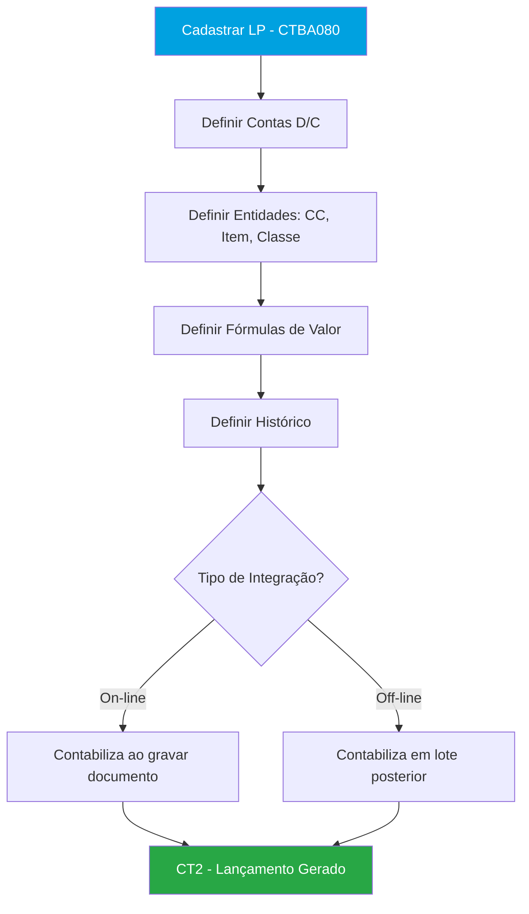
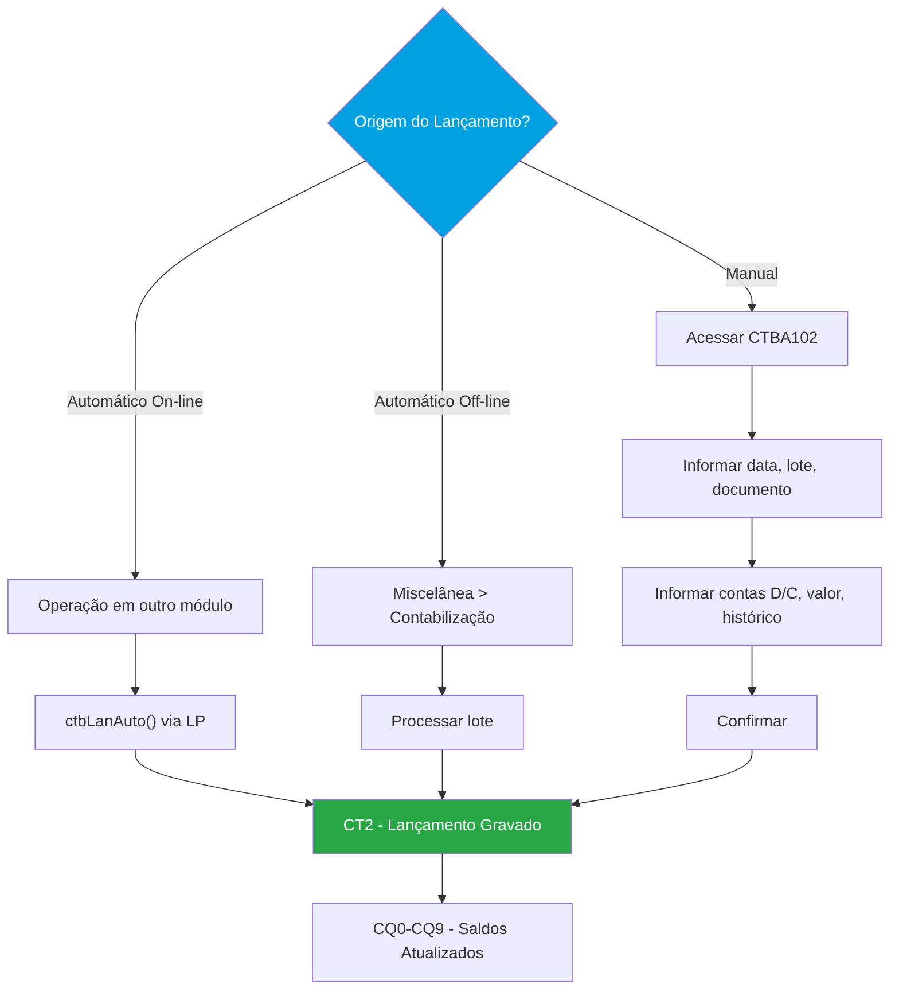
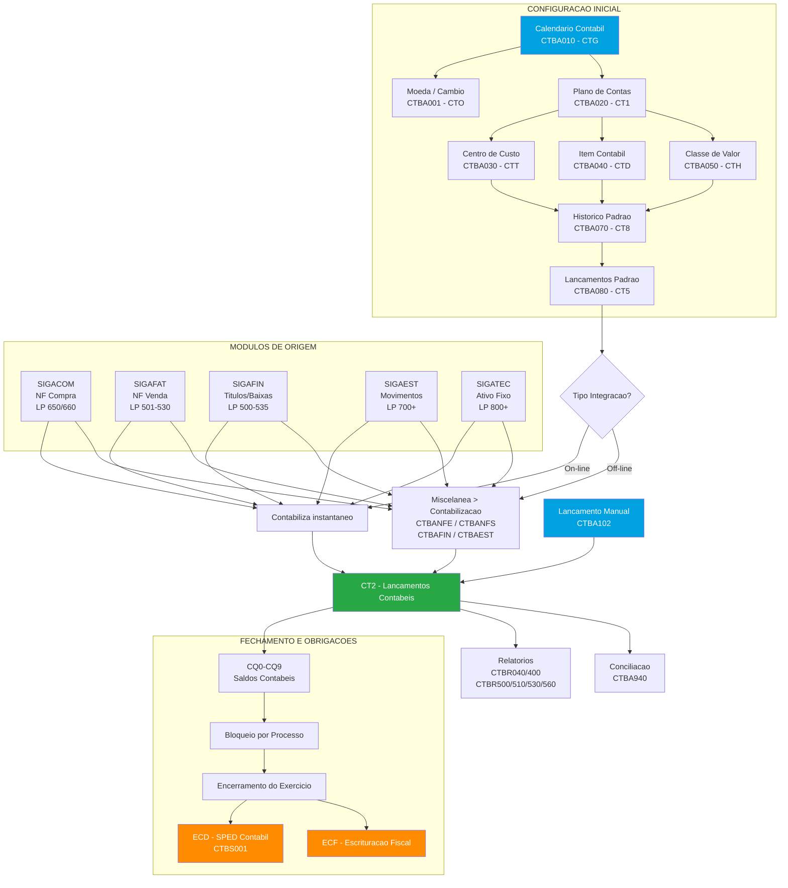
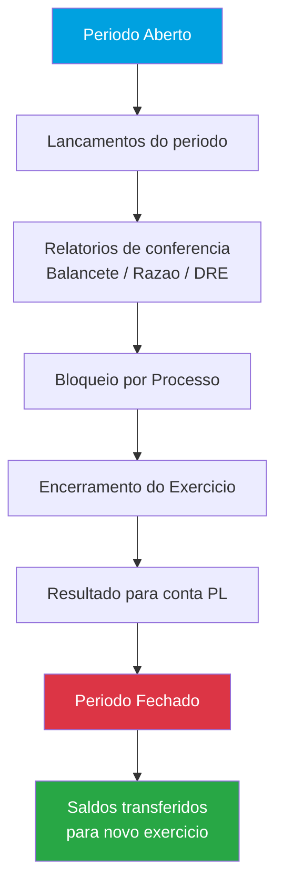

# SIGACTB – Fluxo Completo da Contabilidade Gerencial no Protheus

---

## 1. Objetivo do Módulo

O **SIGACTB** (Contabilidade Gerencial) é o módulo do Protheus responsável por toda a escrituração contábil da empresa. Recebe lançamentos automaticamente dos demais módulos (Faturamento, Compras, Financeiro, Estoque, Ativo Fixo) via **Lançamentos Padrão (LP)**, e permite também lançamentos manuais.

**Objetivos principais:**
- Escrituração contábil completa (plano de contas, lançamentos, razão, balancete)
- Controle por múltiplas entidades contábeis (conta, centro de custo, item contábil, classe de valor)
- Suporte a múltiplas moedas e câmbio
- Controle de períodos contábeis (abertura, fechamento, bloqueio)
- Geração de demonstrações financeiras (Balanço Patrimonial, DRE, DMPL, DFC)
- Entrega de obrigações acessórias: ECD (SPED Contábil) e ECF

**Sigla:** SIGACTB
**Menu principal:** Atualizações > Contabilidade
**Integra com:** SIGACOM (compras), SIGAFAT (faturamento), SIGAFIN (financeiro), SIGAEST (estoque), SIGAFIS (fiscal)

**Nomenclatura do módulo:**

| Sigla | Descrição |
|---|---|
| SIGACTB | Contabilidade Gerencial |
| LP | Lançamento Padrão (regra de contabilização automática) |
| CT2 | Tabela de lançamentos contábeis |
| ECD | Escrituração Contábil Digital (SPED Contábil) |
| ECF | Escrituração Contábil Fiscal |
| PGE | Programa Gerador de Escrituração (validador da Receita Federal) |

---

## 2. Parametrização Geral do Módulo

Parâmetros MV_ que afetam o módulo como um todo (não específicos de uma rotina).

### Controle Geral

| Parâmetro | Descrição | Padrão | Tipo | Impacto |
|---|---|---|---|---|
| `MV_CTBCACH` | Usa cache para entidades e calendário | 1 (ativo) | N | Melhora performance; alterações no calendário podem não ser refletidas imediatamente |
| `MV_CTBFLAG` | Marcação de flags de contabilização nas transações off-line | .T. | L | Controla flags de contabilização off-line |
| `MV_CTBAPLA` | Controle para limpeza de flags de contabilização | 4 | N | Necessário ajustar antes de limpar flags para recontabilização |
| `MV_ALTLCTO` | Exibe tela de contabilização a cada movimento | S | C(1) | N = não exibe a tela de contabilização |
| `MV_NUMLIN` | Quantidade de linhas por lançamento | — | N | Define limite de linhas em lançamentos contábeis |
| `MV_NUMMAN` | Quantidade máxima de linhas no lançamento manual | — | N | Limita linhas no lançamento manual |

### Bloqueio e Validação

| Parâmetro | Descrição | Padrão | Tipo | Impacto |
|---|---|---|---|---|
| `MV_CTBVLDC` | Permite excluir/alterar lançamento já conciliado | — | L | Afeta integridade da conciliação |
| `MV_CTFBLOQ` | Funções de bloqueio de moeda, calendário e câmbio | — | C | Controla bloqueios do módulo |
| `MV_CTVBLOQ` | Bloqueio de validações de moeda, calendário e câmbio | — | C | Controla validações do módulo |
| `MV_CTBCTG` | Bloqueio por amarração Calendário x Moeda x Tipo Saldo | — | L | Impede movimentação sem amarração |
| `MV_FILCONC` | Permite conciliar registros já conciliados em outra configuração | — | L | Flexibiliza conciliação |

### Performance

| Parâmetro | Descrição | Padrão | Tipo | Impacto |
|---|---|---|---|---|
| `MV_CTBCACH` | Cache de entidades e calendário | 1 | N | 1=ativo; reiniciar SmartClient após alterações |
| `MV_CTBRAZB` | Usa banco de dados para Razão Contábil (`CTBR400`) | .F. | L | .T. = gera via procedures SQL (melhor performance) |
| `MV_CTB190D` | Controle de espaço em disco no reprocessamento de saldos | .T. | L | .F. = reduz consumo de disco no reprocessamento |
| `MV_CTBSERZ` | Controle de exclusão do arquivo de semáforo | .T. | L | Controla semáforo de processos contábeis |

> ⚠️ **Atenção:** Alteração de parâmetros globais afeta TODAS as rotinas do módulo.
> Teste em ambiente de homologação antes de alterar em produção.

---

## 3. Cadastros Fundamentais

O SIGACTB requer uma sequência específica de cadastros antes de qualquer lançamento. Sem eles o sistema apresenta o HELP **CTGNOCAD**.

### 3.1 Plano de Contas — `CTBA020` (`CT1`)

**Menu:** `Atualizações > Entidades > Plano de Contas`
**Tabela:** `CT1` — Plano de Contas

O Plano de Contas é a estrutura hierárquica de contas que organiza toda a escrituração.

| Campo | Descrição | Tipo | Obrigatório |
|---|---|---|---|
| `CT1_CONTA` | Código da conta contábil | C | Sim |
| `CT1_DESC01` | Descrição da conta | C | Sim |
| `CT1_TIPO` | Tipo: S=Sintética / A=Analítica | C(1) | Sim |
| `CT1_NORMAL` | Natureza normal: D=Devedora / C=Credora | C(1) | Sim |
| `CT1_CTASUP` | Código da conta superior (conta pai) | C | Sim |
| `CT1_NATCTA` | Natureza da conta (para ECD): 01=Ativo, 02=Passivo, 03=PL, 04=Receita, 05=Custo, 06=Despesa, 09=Compensação | C(2) | Sim (ECD) |
| `CT1_NTSPED` | Natureza SPED (para geração do registro I050 na ECD) | C | Sim (ECD) |
| `CT1_CLASSIF` | Classificação no plano referencial | C | Não |
| `CT1_MOEDREF` | Moeda de referência para a conta | C | Não |
| `CT1_HP` | Código do histórico padrão associado | C | Não |

**Estrutura hierárquica mínima exigida pela ECD:**

```
1         (Sintética – Ativo)              nível 1
  11       (Sintética – Ativo Circulante)  nível 2
    111    (Sintética – Disponível)        nível 3
      11101 (Analítica – Caixa Geral)     nível 4  ← mínimo 4 níveis
```

> ⚠️ **ECD exige mínimo 4 níveis** no plano de contas (Resolução CFC 1299/2010). O campo `CT1_CTASUP` deve estar correto em todos os níveis.

**Validação do plano:** `CTBA170` (Valida Plano de Contas) – emite relatório de inconsistências.

**Tipos de interface:** Estrutura em árvore (recomendada) ou padrão msBrowse.

### 3.2 Centro de Custo — `CTBA030` (`CTT`)

**Menu:** `Atualizações > Entidades > Centro de Custo`
**Tabela:** `CTT` — Centro de Custo

Permite apropriar os lançamentos contábeis a departamentos, projetos ou unidades de negócio.

| Campo | Descrição | Tipo | Obrigatório |
|---|---|---|---|
| `CTT_CUSTO` | Código do centro de custo | C | Sim |
| `CTT_DESC01` | Descrição | C | Sim |
| `CTT_CCSUP` | Centro de custo superior | C | Não |
| `CTT_TIPO` | Tipo: S=Sintético / A=Analítico | C(1) | Sim |
| `CTT_BLOQ` | Bloqueado para novos lançamentos | C(1) | Não |

> ⚠️ O tamanho do campo `CTT_CUSTO` deve ser **idêntico** ao definido no grupo de perguntas CTB211. Inconsistências causam erro na ECD.

### 3.3 Item Contábil — `CTBA040` (`CTD`)

**Menu:** `Atualizações > Entidades > Item Contábil`
**Tabela:** `CTD` — Item Contábil

Classificador contábil adicional para detalhar lançamentos por produto, projeto ou natureza.

| Campo | Descrição | Tipo | Obrigatório |
|---|---|---|---|
| `CTD_ITEM` | Código do item contábil | C | Sim |
| `CTD_DESC01` | Descrição | C | Sim |
| `CTD_ITSUP` | Item superior | C | Não |
| `CTD_TIPO` | Tipo: S=Sintético / A=Analítico | C(1) | Sim |

### 3.4 Classe de Valor — `CTBA050` (`CTH`)

**Menu:** `Atualizações > Entidades > Classe de Valor`
**Tabela:** `CTH` — Classe de Valor

Quarta entidade contábil — usada para segmentação adicional como região, canal de venda, etc.

| Campo | Descrição | Tipo | Obrigatório |
|---|---|---|---|
| `CTH_CLVL` | Código da classe de valor | C | Sim |
| `CTH_DESC01` | Descrição | C | Sim |
| `CTH_CLSUP` | Classe superior | C | Não |
| `CTH_TIPO` | Tipo: S=Sintético / A=Analítico | C(1) | Sim |

### 3.5 Calendário Contábil — `CTBA010` (`CTG`)

**Menu:** `Atualizações > Cadastros > Calendário Contábil`
**Tabela:** `CTG` — Calendário Contábil

Define o exercício social e seus períodos contábeis. É o elemento central que controla quais datas aceitam lançamentos.

**Cadastro (via assistente):**
1. Informar data inicial e final do exercício
2. Selecionar tipo de período (mensal, trimestral, etc.)
3. Confirmar períodos
4. Informar código do calendário e exercício
5. Amarrar moeda(s) ao calendário

**Help CTGNOCAD:** Aparece quando o calendário não está amarrado com a moeda contábil.
Solução: verificar amarração em `Moeda x Calendário` (`CTBA011`).

> ⚠️ **Cache do calendário:** Parâmetro `MV_CTBCACH = 1` faz com que alterações no calendário (como desbloqueio) não sejam refletidas imediatamente. Se o sistema continuar acusando "calendário bloqueado" após desbloqueio, verificar o cache.

### 3.6 Moeda — `CTBA001` (`CTO`)

**Menu:** `Atualizações > Cadastros > Moeda`
**Tabela:** `CTO` — Moeda Cadastrada

O Protheus trabalha com **5 moedas** contábeis. A Moeda 1 é sempre a moeda local (BRL).

**Tabelas relacionadas:**

| Tabela | Descrição |
|---|---|
| `CTO` | Moeda cadastrada |
| `CTE` | Moeda x Calendário (amarração) |
| `CTP` | Câmbio (taxa de conversão por data) |

**Amarração obrigatória:** Toda moeda usada na contabilização deve estar amarrada ao calendário contábil em `CTBA011` (Moeda x Calendário x Tipo de Saldo).

### 3.7 Histórico Padrão — `CTBA070` (`CT8`)

**Menu:** `Atualizações > Cadastros > Histórico Padrão`
**Tabela:** `CT8` — Histórico Padrão

Textos pré-cadastrados utilizados como histórico nos lançamentos contábeis.

> **Nota:** Ao utilizar histórico padrão em Lançamentos Padrão via fórmula (ex: `POSICIONE("CT8",...)`), o gatilho do campo não é disparado automaticamente. A função deve retornar o valor diretamente.

---

## 4. Rotinas

### 4.1 `CTBA080` — Lançamentos Padrão

**Objetivo:** Definir as regras de contabilização automática (LP) que determinam quais contas serão debitadas/creditadas, qual valor será utilizado (por fórmula ADVPL), qual histórico será gerado e de qual módulo/operação o LP é disparado.
**Menu:** `Atualizações > Movimentos > Lançamentos Padrão`
**Tipo:** Cadastro / Configuração

#### Tabelas

| Tabela | Alias | Descrição | Tipo |
|---|---|---|---|
| `CT5` | CT5 | Lançamentos Padrão | Principal |
| `CT2` | CT2 | Lançamentos Contábeis (destino) | Relacionada |

#### Campos Principais

**Pasta Cadastro:**

| Campo | Descrição | Tipo | Obrigatório | Validação/Observação |
|---|---|---|---|---|
| `CT5_LOTE` | Código do lançamento padrão | C | Sim | Identifica o LP |
| `CT5_SEQ` | Sequência (linha do lançamento) | C | Sim | Linha dentro do LP |
| `CT5_STATUS` | Status: Ativo / Inativo | C(1) | Sim | Controla ativação do LP |
| `CT5_TIPO` | Tipo: D=Débito / C=Crédito | C(1) | Sim | Define natureza da linha |
| `CT5_HIST` | Fórmula ADVPL ou código do histórico padrão | C | Não | Histórico do lançamento |
| `CT5_TABORI` | Alias da tabela de origem (para rastreio; ex: "SE5") | C | Não | Rastreamento |
| `CT5_RECORI` | RecNo de origem (para rastreio) | N | Não | Rastreamento |

**Pasta Entidades:**

| Campo | Descrição | Tipo | Obrigatório | Validação/Observação |
|---|---|---|---|---|
| `CT5_CCDEB` | Conta a débito (fórmula ou conta fixa) | C | Sim | Fórmula ADVPL ou conta CT1 |
| `CT5_CCCRED` | Conta a crédito (fórmula ou conta fixa) | C | Sim | Fórmula ADVPL ou conta CT1 |
| `CT5_CCDCC` | Centro de custo a débito | C | Não | Fórmula ou CC fixo |
| `CT5_CCCC` | Centro de custo a crédito | C | Não | Fórmula ou CC fixo |
| `CT5_CCITD` | Item contábil a débito | C | Não | Fórmula ou item fixo |
| `CT5_CCITC` | Item contábil a crédito | C | Não | Fórmula ou item fixo |
| `CT5_CCCVD` | Classe de valor a débito | C | Não | Fórmula ou classe fixa |
| `CT5_CCCVC` | Classe de valor a crédito | C | Não | Fórmula ou classe fixa |

**Pasta Valores:**
- Fórmulas ADVPL que retornam valores numéricos por moeda
- Ex: `SE2->E2_VALOR` para pegar o valor do título a pagar

**Pasta Outros:**
- `CT5_DOCTO` – Histórico do documento (informações adicionais)
- `CT5_CDDIAR` – Código do diário contábil

#### Status / Tipos

**Tipos de Integração:**

| Valor | Descrição | Comportamento |
|---|---|---|
| 1 | On-line | Contabiliza no momento da operação. Dados sempre atualizados. Gera mais estornos quando operações são canceladas. |
| 2 | Off-line | Contabiliza em lote posterior. Menos estornos. Dados contábeis em atraso até processamento. |
| 3 | Ambos | Suporta on-line e off-line |

#### Fontes de Configuração

| Fonte | Descrição |
|---|---|
| `CTBA086` | Monta a árvore de processos/operações para o LP |
| `CTBXCTB` | Determina a tabela de origem do lançamento contábil |
| `CTBA090` | Cadastro de rastreamento (LP -> tabela de origem -> chave) |

#### LPs por Módulo

**SIGACOM – Compras:**

| LP | Descrição |
|---|---|
| 650 | Contabilização dos itens da NF de compra |
| 655 | Estorno dos itens |
| 660 | Contabilização dos totais da NF |
| 665 | Estorno dos totais |

**SIGAFAT – Faturamento:**

| LP | Descrição |
|---|---|
| 501 | Vendas – receita bruta |
| 510 | IPI sobre vendas |
| 515 | ICMS sobre vendas |
| 516 | PIS sobre vendas |
| 517 | COFINS sobre vendas |
| 520 | Custo dos produtos vendidos (CMV) |
| 530 | Comissão de vendas |

**SIGAFIN – Financeiro:**

| LP | Descrição |
|---|---|
| 500 | Liquidação de título a receber (por título gerado) |
| 505 | Baixa de título a receber |
| 510 | Inclusão de título a pagar |
| 511 | Inclusão de título a pagar com rateio externo |
| 515 | Baixa de título a pagar |
| 520 | Liquidação CR – por título baixado |
| 530 | Movimento bancário (crédito) |
| 535 | Movimento bancário (débito) |

**SIGAEST – Estoque:**

| LP | Descrição |
|---|---|
| 700 | Transferência de estoque |
| 710 | Ajuste de estoque |
| 720 | Baixa por produção |

**SIGATEC – Ativo Fixo:**

| LP | Descrição |
|---|---|
| 800 | Depreciação de bens |
| 805 | Amortização |
| 810 | Baixa de ativo fixo |
| 815 | Reavaliação |

#### Parâmetros MV_ desta Rotina

| Parâmetro | Descrição | Padrão | Tipo | Quando usar |
|---|---|---|---|---|
| `MV_CTBFLAG` | Marcação de flags de contabilização nas transações off-line | .T. | L | Controle de contabilização off-line |
| `MV_CTBAPLA` | Controle para limpeza de flags de contabilização | 4 | N | Antes de limpar flags para recontabilização |

#### Pontos de Entrada

| Ponto de Entrada | Momento de Execução | Descrição | Parâmetros |
|---|---|---|---|
| `CTBVALOK` | Validação dos lançamentos | Validação dos lançamentos contábeis antes de gravar | — |
| `CT277BUT` | Menu de amarração | Incluir botões no menu Amarração de Grupos de Rateios | — |
| `CT277GRV` | Após gravação off-line | Após gravar o rateio off-line | — |
| `CT278RFA` | Botão Rec. Formulário | Antes de gravar o fator | — |
| `CT278RFB` | Botão Rec. Formulário | Depois de gravar o fator | — |

#### Fluxo da Rotina



---

### 4.2 `CTBA102` — Lançamentos Contábeis

**Objetivo:** Registrar lançamentos contábeis manuais e automáticos na tabela `CT2`, o coração da contabilidade.
**Menu:** `Atualizações > Movimentos > Lan. Contab. Automat.`
**Tipo:** Inclusão / Manutenção

#### Tabelas

| Tabela | Alias | Descrição | Tipo |
|---|---|---|---|
| `CT2` | CT2 | Lançamentos Contábeis | Principal |
| `CTC` | CTC | Cabeçalho do Lote Contábil | Complementar |

#### Campos Principais

| Campo | Descrição | Tipo | Obrigatório | Validação/Observação |
|---|---|---|---|---|
| `CT2_FILIAL` | Filial | C | Sim | Automático |
| `CT2_DATA` | Data do lançamento | D | Sim | Dentro do período aberto |
| `CT2_LOTE` | Lote contábil | C | Sim | Identifica o lote |
| `CT2_LOTECP` | Lote complementar | C | Não | — |
| `CT2_DOC` | Número do documento | C | Sim | — |
| `CT2_LINHA` | Linha do lançamento | C | Sim | Automático |
| `CT2_DEBITO` | Conta a débito | C | Sim | ExistCpo("CT1") |
| `CT2_CREDIT` | Conta a crédito | C | Sim | ExistCpo("CT1") |
| `CT2_CCD` | Centro de custo débito | C | Não | ExistCpo("CTT") |
| `CT2_CCC` | Centro de custo crédito | C | Não | ExistCpo("CTT") |
| `CT2_ITEMD` | Item contábil débito | C | Não | ExistCpo("CTD") |
| `CT2_ITEMC` | Item contábil crédito | C | Não | ExistCpo("CTD") |
| `CT2_CLVLD` | Classe de valor débito | C | Não | ExistCpo("CTH") |
| `CT2_CLVLC` | Classe de valor crédito | C | Não | ExistCpo("CTH") |
| `CT2_VALOR` | Valor em moeda 1 (BRL) | N | Sim | > 0 |
| `CT2_VALOR2` | Valor em moeda 2 | N | Não | — |
| `CT2_VALOR3` | Valor em moeda 3 | N | Não | — |
| `CT2_HIST` | Histórico do lançamento | C | Sim | — |
| `CT2_MOEDA` | Moeda de referência | C | Não | — |

#### Lançamento Manual

Usado quando a empresa trabalha somente com o módulo contábil, ou para ajustes e reclassificações que não têm origem em outro módulo.

**Processo:**
1. Acessar `CTBA102`
2. Clicar em Incluir
3. Confirmar data, lote e número do documento
4. Informar as linhas: conta débito, conta crédito, valor, histórico
5. Confirmar

**Lançamento de Partida Simples:** Considera apenas o débito ou o crédito de um fato contábil. Requer configuração específica no sistema.

#### Lançamento Automático (Integração)

Os lançamentos são gerados automaticamente pelos outros módulos ao chamar as funções de contabilização.

**Funções ADVPL de contabilização:**

| Função | Descrição |
|---|---|
| `ctbLanAuto()` | Gera lançamento contábil automático |
| `ctbValOK()` | Valida se a contabilização pode ser realizada |
| `CTBVALOK` (PE) | Ponto de entrada para validação dos lançamentos |

**Limpeza de flags de contabilização:**
- Necessária quando se precisa recontabilizar lançamentos já processados
- Configurar `MV_CTBAPLA` antes de limpar os flags
- Excluir os flags via rotina específica

#### Contabilização Off-Line por Módulo

Cada módulo tem uma rotina de contabilização off-line própria, acessível em `Miscelânea`:

| Módulo | Rotina Off-Line | Descrição |
|---|---|---|
| SIGACOM | `CTBANFE` | Contabilização da NF de Entrada |
| SIGAFAT | `CTBANFS` | Contabilização da NF de Saída |
| SIGAFIN | `CTBAFIN` | Contabilização de títulos financeiros |
| SIGAEST | `CTBAEST` | Contabilização de movimentos de estoque |
| SIGATEC | `CTBATEC` | Contabilização de ativo fixo |

#### Parâmetros MV_ desta Rotina

| Parâmetro | Descrição | Padrão | Tipo | Quando usar |
|---|---|---|---|---|
| `MV_ALTLCTO` | Exibe tela de contabilização a cada movimento | S | C(1) | N = não exibe a tela de contabilização |
| `MV_NUMLIN` | Quantidade de linhas por lançamento | — | N | Controle de linhas por lançamento |
| `MV_NUMMAN` | Quantidade máxima de linhas no lançamento manual | — | N | Limitar linhas no lançamento manual |

#### Pontos de Entrada

| Ponto de Entrada | Momento de Execução | Descrição | Parâmetros |
|---|---|---|---|
| `CTBVALOK` | Validação dos lançamentos | Validação dos lançamentos contábeis | — |
| `CONOUTR` | Processamento | Log de processamento com impressão em relatório | — |
| `Ct103Carr` | Carga de dados | Carrega arquivo temporário com dados para MsGetDB | — |
| `CTB110LBC` | Gravação | Permite gravação de informações adicionais no controle de correlativos | — |
| `GRVCV3` | Após gravação | Complementa a gravação do rastreamento de lançamento (campos de usuário na `CV3`) | — |

#### Fluxo da Rotina



---

### 4.3 `CTBA020` — Plano de Contas

**Objetivo:** Manter o plano de contas contábil hierárquico da empresa.
**Menu:** `Atualizações > Entidades > Plano de Contas`
**Tipo:** Cadastro / Manutenção

> **Nota:** Detalhes completos de campos e estrutura na Seção 3.1 (Cadastros Fundamentais).

#### Pontos de Entrada

| Ponto de Entrada | Momento de Execução | Descrição | Parâmetros |
|---|---|---|---|
| `CTBMPLACT` | Antes de ativar/inativar | Validação antes de ativar/inativar conta | — |
| `CT1BLOQ` | Alteração de conta | Bloqueia/desbloqueia alteração de conta contábil | — |

---

### 4.4 `CTBA030` — Centro de Custo

**Objetivo:** Manter os centros de custo para apropriação de lançamentos contábeis.
**Menu:** `Atualizações > Entidades > Centro de Custo`
**Tipo:** Cadastro / Manutenção

> **Nota:** Detalhes completos de campos na Seção 3.2 (Cadastros Fundamentais).

---

### 4.5 `CTBA040` — Item Contábil

**Objetivo:** Manter os itens contábeis como classificador adicional de lançamentos.
**Menu:** `Atualizações > Entidades > Item Contábil`
**Tipo:** Cadastro / Manutenção

> **Nota:** Detalhes completos de campos na Seção 3.3 (Cadastros Fundamentais).

---

### 4.6 `CTBA050` — Classe de Valor

**Objetivo:** Manter as classes de valor como quarta entidade contábil para segmentação adicional.
**Menu:** `Atualizações > Entidades > Classe de Valor`
**Tipo:** Cadastro / Manutenção

> **Nota:** Detalhes completos de campos na Seção 3.4 (Cadastros Fundamentais).

---

### 4.7 `CTBA940` — Conciliação Contábil

**Objetivo:** Confrontar saldos de contas contábeis com documentos de origem (extrato bancário, NFs, títulos).
**Menu:** `Atualizações > Movimentos > Conciliação Contábil`
**Tipo:** Processamento / Consulta

#### Parâmetros MV_ desta Rotina

| Parâmetro | Descrição | Padrão | Tipo | Quando usar |
|---|---|---|---|---|
| `MV_CTBVLDC` | Define se permite excluir/alterar lançamento já conciliado | — | L | Controle de integridade da conciliação |
| `MV_FILCONC` | Permite conciliar registros já conciliados em outra configuração | — | L | Flexibilizar conciliação |

#### Pontos de Entrada

> ⚠️ **Wizard de configuração:** A partir da release 12.1.33, existe um wizard que auxilia na adequação das estruturas de tabelas utilizadas na conciliação.

---

### 4.8 `CTBA190` — Reprocessamento de Saldos

**Objetivo:** Recalcular os saldos contábeis (`CQ0-CQ9`) a partir dos lançamentos (`CT2`), corrigindo inconsistências.
**Menu:** `Miscelânea > Reprocessamento de Saldos`
**Tipo:** Processamento

**Quando usar:**
- Após importação de lançamentos em massa
- Após alteração no plano de contas
- Quando relatórios de saldo apresentam valores inconsistentes

#### Parâmetros MV_ desta Rotina

| Parâmetro | Descrição | Padrão | Tipo | Quando usar |
|---|---|---|---|---|
| `MV_CTB190D` | Controle de espaço em disco no reprocessamento | .T. | L | .F. = reduz consumo de disco se houver lentidão |

> ⚠️ **Performance:** Se houver lentidão no reprocessamento (consumo excessivo de disco), criar o parâmetro `MV_CTB190D = F`.

---

### 4.9 `CTBA090` — Rastreamento de Lançamentos

**Objetivo:** Rastrear de qual documento de outro módulo veio um lançamento contábil específico.
**Menu:** `Atualizações > Movimentos > Rastreamento`
**Tipo:** Configuração / Consulta

#### Tabelas

| Tabela | Alias | Descrição | Tipo |
|---|---|---|---|
| `CTK` | CTK | Rastreamento de Lançamentos | Principal |
| `CV3` | CV3 | Rastreamento de Lançamento (campos de usuário) | Complementar |

**Configuração:**
- Informar: Lançamento Padrão, Chave de Busca (campos da tabela de origem)
- Exemplo: LP 520 (Baixa a receber) -> `E5_FILIAL+E5_TIPODOC+E5_PREFIXO+E5_NUMERO+E5_PARCELA+...`

**Fonte:** `CTBXCTB` (determina a tabela de origem; campos `_DTLANC` e `_LA`)

#### Pontos de Entrada

| Ponto de Entrada | Momento de Execução | Descrição | Parâmetros |
|---|---|---|---|
| `ECDCHVCAB` | Exportação ECD | Manipulação da chave na exportação da tabela `CTC` para a ECD | — |
| `ECDCHVMOV` | Exportação ECD | Manipulação da chave na exportação da tabela `CT2` para a ECD | — |

---

### 4.10 `CTBA161` — Visão Gerencial

**Objetivo:** Estrutura customizável para geração de relatórios gerenciais (DRE gerencial, por exemplo).
**Menu:** `Atualizações > Cadastros > Visão Gerencial`
**Tipo:** Cadastro / Consulta

#### Tabelas

| Tabela | Alias | Descrição | Tipo |
|---|---|---|---|
| `CTS` | CTS | Visões Gerenciais | Principal |
| `CVE` | CVE | Visão Gerencial (estrutura) | Complementar |
| `CVF` | CVF | Estrutura da Visão Gerencial | Complementar |

**Para ECD:** A Visão Gerencial deve ser configurada para geração do registro J150 (DRE no PGE).

---

### 4.11 `CTBA276` — Rateios Off-Line

**Objetivo:** Processamento de rateios contábeis off-line.
**Menu:** `Miscelânea > Rateios Off-Line`
**Tipo:** Processamento

#### Pontos de Entrada

| Ponto de Entrada | Momento de Execução | Descrição | Parâmetros |
|---|---|---|---|
| `CTB276CW1` | Processamento | Ponto de entrada na rotina `CTBA276` | — |

---

### Pontos de Entrada Gerais

| Ponto de Entrada | Descrição |
|---|---|
| `CTBVALOK` | Validação de lançamentos (usado em vários contextos) |
| `PLCTPBUS` | Retorna conta contábil na combinação contábil (PLS) |

---

## 5. Contabilização

### 5.1 Modo de Contabilização

| Modo | Descrição | Parâmetro |
|---|---|---|
| On-line | Contabiliza automaticamente ao gravar o documento no módulo de origem | Tipo integração = 1 no LP |
| Off-line | Contabilização em lote posterior via `Miscelânea > Contabilização` | Tipo integração = 2 no LP |

### 5.2 Lançamentos Padrão (LP)

| Código LP | Descrição | Rotina/Módulo | Débito | Crédito |
|---|---|---|---|---|
| 500 | Liquidação título a receber | SIGAFIN | Banco | Cliente |
| 505 | Baixa título a receber | SIGAFIN | Banco | Cliente |
| 510 | Inclusão título a pagar | SIGAFIN | Despesa/Custo | Fornecedor |
| 515 | Baixa título a pagar | SIGAFIN | Fornecedor | Banco |
| 501 | Vendas – receita bruta | SIGAFAT | Cliente | Receita |
| 520 | CMV | SIGAFAT | CMV | Estoque |
| 530 | Comissão de vendas | SIGAFAT | Comissão | Comissões a Pagar |
| 650 | NF compra – itens | SIGACOM | Estoque | Fornecedor |
| 660 | NF compra – totais | SIGACOM | Estoque/Despesa | Fornecedor |
| 700 | Transferência estoque | SIGAEST | Estoque (destino) | Estoque (origem) |
| 800 | Depreciação | SIGATEC | Depreciação | Deprec. Acumulada |

> **Nota:** LPs são configurados em `CTBA080`. Cada LP pode ter múltiplas linhas
> com fórmulas que referenciam campos do documento.

### 5.3 Contabilização Off-Line por Módulo

| Módulo | Rotina Off-Line | Descrição |
|---|---|---|
| SIGACOM | `CTBANFE` | Contabilização da NF de Entrada |
| SIGAFAT | `CTBANFS` | Contabilização da NF de Saída |
| SIGAFIN | `CTBAFIN` | Contabilização de títulos financeiros |
| SIGAEST | `CTBAEST` | Contabilização de movimentos de estoque |
| SIGATEC | `CTBATEC` | Contabilização de ativo fixo |

---

## 6. Tipos e Classificações

### 6.1 Entidades Contábeis

As quatro entidades contábeis do SIGACTB são usadas em combinação para detalhar cada lançamento:

| Entidade | Tabela | Obrigatório | Uso |
|---|---|---|---|
| Conta Contábil | `CT1` | Sempre | Estrutura principal do plano de contas |
| Centro de Custo | `CTT` | Opcional (configurável) | Apropriação por departamento, projeto ou unidade |
| Item Contábil | `CTD` | Opcional (configurável) | Classificação por produto, projeto ou natureza |
| Classe de Valor | `CTH` | Opcional (configurável) | Segmentação adicional (região, canal de venda) |

**Amarração de Entidades (`CTA`):** Define quais combinações de entidades são válidas — evitando lançamentos em combinações incorretas.

**Tamanho dos campos:** O tamanho dos campos das entidades (conta, CC, item, classe) deve ser **consistente** em todo o ambiente (SX3, tabelas de movimento e cadastro). Inconsistências causam falhas na ECD.

### 6.2 Tipos de Conta (CT1_TIPO)

| Valor | Descrição | Comportamento |
|---|---|---|
| S | Sintética | Conta agrupadora — não recebe lançamentos diretamente |
| A | Analítica | Conta de movimento — recebe lançamentos |

### 6.3 Natureza da Conta (CT1_NORMAL)

| Valor | Descrição | Comportamento |
|---|---|---|
| D | Devedora | Saldo normal a débito (Ativos, Despesas, Custos) |
| C | Credora | Saldo normal a crédito (Passivos, Receitas, PL) |

### 6.4 Natureza da Conta para ECD (CT1_NATCTA)

| Valor | Descrição | Uso típico |
|---|---|---|
| 01 | Ativo | Contas de ativo |
| 02 | Passivo | Contas de passivo |
| 03 | Patrimônio Líquido | Contas de PL |
| 04 | Receita | Contas de receita |
| 05 | Custo | Contas de custo |
| 06 | Despesa | Contas de despesa |
| 09 | Compensação | Contas de compensação |

### 6.5 Status do Período Contábil

| Valor | Descrição | Comportamento |
|---|---|---|
| 1 – Aberto | Aceita lançamentos | Operação normal |
| 2 – Fechado | Encerrado pelo Encerramento do Exercício | Somente consulta |
| 3 – Bloqueado | Temporariamente bloqueado | Somente consulta; pode ser reaberto |

---

## 7. Tabelas do Módulo

Visão consolidada de todas as tabelas usadas no módulo.

### Tabelas de Cadastro

| Tabela | Descrição | Rotina Principal | Obs |
|---|---|---|---|
| `CT1` | Plano de Contas | `CTBA020` | Estrutura hierárquica |
| `CTT` | Centro de Custo | `CTBA030` | Compartilhada com outros módulos |
| `CTD` | Item Contábil | `CTBA040` | — |
| `CTH` | Classe de Valor | `CTBA050` | — |
| `CT8` | Histórico Padrão | `CTBA070` | — |
| `CT5` | Lançamentos Padrão (LP) | `CTBA080` | Regras de contabilização |
| `CTA` | Amarração de Entidades | — | Combinações válidas |
| `CTG` | Calendário Contábil | `CTBA010` | Períodos do exercício |
| `CTE` | Moeda x Calendário | `CTBA011` | Amarração obrigatória |
| `CTO` | Moeda Cadastrada | `CTBA001` | 5 moedas suportadas |
| `CTP` | Câmbio | — | Taxa de conversão por data |
| `CQD` | Bloqueio do Calendário Contábil | — | Bloqueio por processo |
| `CVD` | Plano de Contas Referencial | — | Para ECD/ECF |
| `CTS` | Visões Gerenciais | `CTBA161` | DRE gerencial |
| `CVE` | Visão Gerencial (estrutura) | `CTBA161` | — |
| `CVF` | Estrutura da Visão Gerencial | `CTBA161` | — |

### Tabelas de Movimento

| Tabela | Descrição | Rotina Principal | Volume |
|---|---|---|---|
| `CT2` | Lançamentos Contábeis | `CTBA102` | Muito Alto |
| `CTC` | Cabeçalho do Lote Contábil | `CTBA102` | Alto |
| `CTF` | Saldo de Entidades (auxiliar) | — | Alto |
| `CQ0-CQ9` | Saldos Contábeis por período/moeda | `CTBA190` | Alto |

### Tabelas de Controle

| Tabela | Descrição | Uso |
|---|---|---|
| `CTK` | Rastreamento de Lançamentos | `CTBA090` — rastreio de origem |
| `CV3` | Rastreamento (campos de usuário) | Complemento do rastreamento |
| `CV4` | Rateio Externo (do Financeiro) | `FINA050` |

### Tabelas ECD

| Tabela | Descrição | Uso |
|---|---|---|
| `CQ0-CQ9` | Saldos contábeis (De/Para para ECD: CSx) | Registros I155 |
| `CT2` | Lançamentos (exportados para registro I155) | Movimento |
| `CTC` | Cabeçalho de lotes (exportado) | Lotes |

### Compartilhamento de Tabelas (CRITICO)

> ⚠️ O compartilhamento incorreto das tabelas causa erros graves na ECD e na contabilização.

**Regras obrigatórias:**

| Tabelas | Devem ter mesmo compartilhamento |
|---|---|
| `CT2`, `CTC`, `CQ0-CQ9`, `CTF` | Entre si (movimento contábil) |
| `CTG`, `CTE`, `CQD`, `CTO`, `CTP` | Entre si (calendário e moeda) |
| `CTT`, `CTD`, `CTH` | Entidades contábeis — mesmo nível |
| `CQD` | Igual a `CTG` |
| `FKF`, `FKG` (complemento título) | Igual a `SE1`/`SE2` |

**Tamanho dos campos:** Os campos `CTT_CUSTO`, `CTD_ITEM` e `CTH_CLVL` na tabela SX3 devem ter **exatamente o mesmo tamanho** que os campos nas tabelas de movimento (`CT2`).

**Cache (`CQD`):** Se o compartilhamento de `CQD` for diferente de `CTG`, ajustar para igual e verificar o parâmetro `MV_CTBCACH`.

---

## 8. Fluxo Geral do Módulo



**Legenda de cores:**
- Azul: Inicio do processo / Entrada de dados
- Verde: Documento central (CT2)
- Laranja: Obrigacoes acessorias / Integracao externa

---

## 9. Integrações com Outros Módulos

| Módulo | Integração | Tabela Ponte | Direção | Momento | LP |
|---|---|---|---|---|---|
| **SIGACOM** | NFs de compra -> CT2 via LPs 650/660 | `CT2` | COM -> CTB | On-line ou off-line (`CTBANFE`) | 650/660 |
| **SIGAFAT** | NFs de venda -> CT2 via LPs 501-530 | `CT2` | FAT -> CTB | On-line ou off-line (`CTBANFS`) | 501-530 |
| **SIGAFIN** | Títulos, baixas, movimentos bancários -> CT2 | `CT2` | FIN -> CTB | On-line ou off-line (`CTBAFIN`) | 500-535 |
| **SIGAEST** | Movimentos de estoque -> CT2 | `CT2` | EST -> CTB | On-line ou off-line (`CTBAEST`) | 700-720 |
| **SIGATEC** | Depreciação, baixa, reavaliação de ativos -> CT2 | `CT2` | TEC -> CTB | On-line ou off-line (`CTBATEC`) | 800-815 |
| **SIGAFIS** | ECD e ECF recebem dados de apuração de impostos | — | FIS -> CTB | Geração das obrigações | — |
| **SIGAMNT** | Manutenção pode gerar lançamentos contábeis de custos | `CT2` | MNT -> CTB | On-line | — |

---

## 10. Controles Especiais

### 10.1 Período Contábil e Fechamento

**Objetivo:** Controlar quais períodos aceitam lançamentos e gerenciar o ciclo de vida do exercício contábil.
**Parâmetro ativador:** `MV_CTBCACH` (cache do calendário)

#### Status do Calendário

| Status | Como Alterar | O Que Permite |
|---|---|---|
| Aberto | Manual via `CTBA010` | Lançamentos, consultas, relatórios |
| Fechado | Gerado pelo Encerramento do Exercício | Somente consultas e relatórios |
| Bloqueado | Manual via `CTBA010` | Somente consultas e relatórios; pode ser reaberto |

**Para reabrir período bloqueado:**
`CTBA010 > Posicionar no período > Alterar > Status: 1 (Aberto)`

> ⚠️ **Cache:** Após alterar o status, se o parâmetro `MV_CTBCACH = 1`, o sistema pode continuar usando o valor em cache. Reiniciar o SmartClient ou aguardar expiração do cache.

#### Bloqueio por Processo

Permite bloquear processos de **outros módulos** durante o fechamento contábil, garantindo integridade.

**Módulos/processos que podem ser bloqueados:**
- Faturamento (novas NFs de saída)
- Compras (novas NFs de entrada)
- Financeiro (baixas, lançamentos)
- Estoque (movimentações)

**Como ativar:**
`CTBA010 > Outras Ações > Bloqueio de Processo > Selecionar período e processos > Bloquear`

Ao tentar executar o processo bloqueado em outro módulo, o sistema impede e exibe mensagem de bloqueio.

**Tabelas envolvidas:** `CQD` (Bloqueio do Calendário Contábil)

#### Encerramento do Exercício

Processo que fecha o período contábil anual e inicia o novo exercício:
1. Verificar que todos os lançamentos do exercício estão corretos
2. Gerar as demonstrações financeiras (Balancete, BP, DRE)
3. Executar o Encerramento do Exercício (lança o resultado do exercício na conta de PL)
4. Status dos períodos muda para "Fechado"
5. Saldos são transferidos para o novo exercício



### 10.2 Conciliação Contábil — `CTBA940`

**Objetivo:** Confrontar saldos de contas contábeis com documentos de origem (extrato bancário, NFs, títulos).
**Parâmetro ativador:** `MV_CTBVLDC`

| Parâmetro | Descrição | Padrão |
|---|---|---|
| `MV_CTBVLDC` | Define se permite excluir/alterar lançamento já conciliado | — |
| `MV_FILCONC` | Permite conciliar registros já conciliados em outra configuração | — |

> ⚠️ **Wizard de configuração:** A partir da release 12.1.33, existe um wizard que auxilia na adequação das estruturas de tabelas utilizadas na conciliação.

### 10.3 Reprocessamento de Saldos — `CTBA190`

**Objetivo:** Recalcular os saldos contábeis (`CQ0-CQ9`) a partir dos lançamentos (`CT2`), corrigindo inconsistências.
**Parâmetro ativador:** `MV_CTB190D`

**Quando usar:**
- Após importação de lançamentos em massa
- Após alteração no plano de contas
- Quando relatórios de saldo apresentam valores inconsistentes

| Parâmetro | Descrição | Padrão |
|---|---|---|
| `MV_CTB190D` | Controle de espaço em disco no reprocessamento | .T. |

> ⚠️ **Performance:** Se houver lentidão no reprocessamento (consumo excessivo de disco), criar o parâmetro `MV_CTB190D = F`.

### 10.4 Rastreamento de Lançamentos — `CTBA090`

**Objetivo:** Rastrear de qual documento de outro módulo veio um lançamento contábil específico.

**Configuração:**
- Informar: Lançamento Padrão, Chave de Busca (campos da tabela de origem)
- Exemplo: LP 520 (Baixa a receber) -> `E5_FILIAL+E5_TIPODOC+E5_PREFIXO+E5_NUMERO+E5_PARCELA+...`

**Tabela de rastreamento:** `CTK`
**Fonte:** `CTBXCTB` (determina a tabela de origem; campos `_DTLANC` e `_LA`)

---

## 11. Consultas e Relatórios

### Relatórios Oficiais

| Relatório | Rotina | Descrição | Saída |
|---|---|---|---|
| Balancete Modelo 1 | `CTBR040` | Balancete analítico/sintético com saldos por conta | PDF/Planilha |
| Diário Contábil | `CTBR110` | Livro Diário contábil | PDF/Planilha |
| Razão Contábil | `CTBR400` | Movimentações por conta com totalizador | PDF/Planilha |
| Balanço Patrimonial | `CTBR500` | Ativo, Passivo e PL | PDF/Planilha |
| DRE | `CTBR510` | Demonstração do Resultado do Exercício | PDF/Planilha |
| DMPL | `CTBR530` | Demonstração das Mutações do Patrimônio Líquido | PDF/Planilha |
| DFC | `CTBR560` | Demonstração do Fluxo de Caixa | PDF/Planilha |

> ⚠️ **Descontinuação:** O relatório `CTBR050` (Balancete Modelo 2) foi descontinuado e substituído pelo `CTBR040` (Modelo 1).

**Razão Contábil (`CTBR400`):**
Para melhor performance, criar o parâmetro `MV_CTBRAZB = .T.` — gera o relatório usando tabela temporária no banco de dados (procedures SQL) em vez de processamento local.

### Consultas — Visão Gerencial

| Consulta | Rotina | Descrição |
|---|---|---|
| Visão Gerencial | `CTBA161` | Estrutura customizável para geração de relatórios gerenciais (DRE gerencial, etc.) |

**Tabelas da Visão Gerencial:**

| Tabela | Descrição |
|---|---|
| `CTS` | Visões Gerenciais |
| `CVE` | Visão Gerencial (estrutura) |
| `CVF` | Estrutura da Visão Gerencial |

**Para ECD:** A Visão Gerencial deve ser configurada para geração do registro J150 (DRE no PGE).

---

## 12. Obrigações Acessórias

### 12.1 ECD — Escrituração Contábil Digital (SPED Contábil)

**Rotina:** `CTBS001`
**Periodicidade:** Anual
**Menu:** `Miscelânea > SPED > ECD`

A **ECD** (SPED Contábil) é a escrituração contábil em formato digital exigida pela Receita Federal.

#### Pré-requisitos

**1. Calendário Contábil (`CTBA010`):**
- Layout 1 a 6: calendário **anual** (independente da forma de apuração)
- ECF: calendário **trimestral** (4 períodos)
- Para situações especiais (fusão, extinção): calendário separado sem amarração de moeda

**2. Plano de Contas (`CT1`):**
- Campos obrigatórios preenchidos: `CT1_NATCTA`, `CT1_NTSPED`, `CVN_CLASSE`, `CVD_NATCTA`
- Mínimo 4 níveis hierárquicos
- Plano Referencial: mapeamento facultativo (mas recomendado)

**3. Contabilista (`CTBA015`):**
- Identificação do signatário da escrituração -> registro J930

**4. Participantes (`CTBA016`):**
- Cadastro de participantes -> registro 0150

**5. Visão Gerencial (`CTBA161`):**
- Configurada para geração do J150 (DRE)
- Deve existir pelo menos um J100 (Balanço) e um J150 (DRE) para cada J005

**6. Compartilhamento das tabelas:**
- Tabelas `CQ0-CQ9, CT2, CTC` com mesmo compartilhamento
- Consultar tabela De/Para CTx -> CSx para ECD

#### Registros ECD

| Registro | Descrição | Tabela Fonte |
|---|---|---|
| 0000 | Abertura do arquivo ECD | Empresa |
| 0150 | Cadastro de participantes (clientes/fornecedores) | SA1/SA2 |
| I010 | Identificação da empresa | Empresa |
| I050 | Plano de contas | `CT1` |
| I100 | Centros de custos | `CTT` |
| I150/I155 | Movimentação de contas | `CT2` |
| I200 | Lançamentos extemporâneos | `CT2` |
| J005 | Demonstrações contábeis obrigatórias | Configuração |
| J100 | Balanço Patrimonial | `CQ0-CQ9` |
| J150 | DRE (Demonstração do Resultado) | `CTS`/`CVE`/`CVF` |
| J930 | Identificação dos signatários | `CTBA015` |
| 9999 | Encerramento do arquivo | — |

#### Erros Comuns no Validador PGE

| Erro | Causa | Solução |
|---|---|---|
| I050: 5 – NIVEL | Plano com menos de 4 níveis | Revisar hierarquia `CT1_CTASUP` |
| J100 sem 2 linhas nível 1 | BP sem Ativo e Passivo separados | Verificar `CT1_NATCTA` das contas |
| BALANCETE PARCIAL | Período do calendário não fecha o exercício | Verificar datas do calendário |
| I155 com contas zeradas | Contas com movimentação em anos anteriores | Verificar saldos residuais |

### 12.2 ECF — Escrituração Contábil Fiscal

**Rotina:** Rotina específica ECF
**Periodicidade:** Anual
**Prazo:** Último dia útil de julho do ano seguinte

A **ECF** (SPED Fiscal) é obrigatória para empresas tributadas pelo IRPJ.

**Pré-requisitos específicos:**
- Calendário trimestral (4 períodos) para a ECF
- Plano de contas mapeado para o plano referencial fiscal
- Dados de IRPJ e CSLL configurados

**Integração com SIGAFIS:** A ECF integra dados de apuração de impostos do Livros Fiscais.

---

## 13. Referências

| Fonte | URL | Descrição |
|---|---|---|
| TDN – Contabilidade Gerencial P12 | https://tdn.totvs.com/display/public/PROT/Controladoria+-+Contabilidade+Gerencial+-+Protheus+12 | Documentação oficial do módulo |
| TDN – Lançamentos Padrão (CTBA080) | https://tdn.totvs.com/pages/releaseview.action?pageId=728631781 | LP completo |
| TDN – Criação de LP | https://tdn.totvs.com/pages/releaseview.action?pageId=780015567 | Guia de criação de LP |
| TDN – Artigos e FAQs Contabilidade | https://tdn.totvs.com/display/public/PROT/Artigos+e+FAQs+-+Contabilidade+Gerencial | Artigos de suporte |
| Central TOTVS – Plano de Contas (CTBA020) | https://centraldeatendimento.totvs.com/hc/pt-br/articles/1500011068541 | Plano de contas |
| Central TOTVS – Calendário Contábil (CTBA010) | https://centraldeatendimento.totvs.com/hc/pt-br/articles/4421520556311 | Calendário |
| Central TOTVS – Bloqueio por Processo | https://centraldeatendimento.totvs.com/hc/pt-br/articles/360035066073 | Bloqueio |
| Central TOTVS – ECD Pré-requisitos | https://centraldeatendimento.totvs.com/hc/pt-br/articles/360028834291 | ECD |
| Central TOTVS – Cache contábil (MV_CTBCACH) | https://centraldeatendimento.totvs.com/hc/pt-br/articles/360000666227 | Cache |
| Central TOTVS – Compartilhamento tabelas | https://centraldeatendimento.totvs.com/hc/pt-br/articles/360006878452 | Compartilhamento |
| Mastersiga – ECD pré-requisitos | https://mastersiga.tomticket.com/kb/contabilidade-gerencial/cross-segmento-backoffice-linha-protheus-sigactb-ctbs001-ecd-pre-requisitos-para-entrega | ECD |
| User Function – Integrar ERP ao SIGACTB | https://userfunction.com.br/controladoria/sigactb/como-integrar-contabilidade-com-os-modulos/ | Integração |

> **Documento gerado para uso interno como referência técnica de desenvolvimento ADVPL/TLPP.**
> Manter atualizado conforme evolução das releases do Protheus.

---

## 14. Enriquecimentos

Seção reservada para informações adicionadas via "Pergunte ao Padrão".
Cada enriquecimento tem marcador de data, fontes e pergunta original.

(seção preenchida automaticamente — não editar manualmente)
