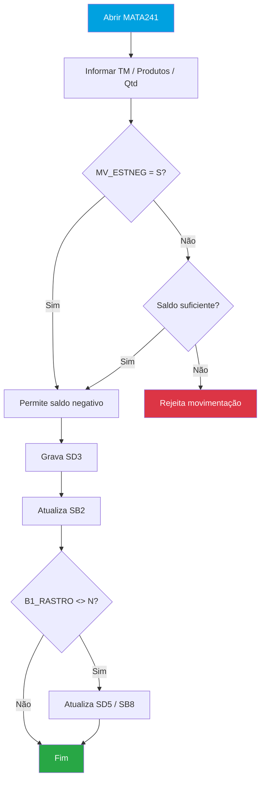
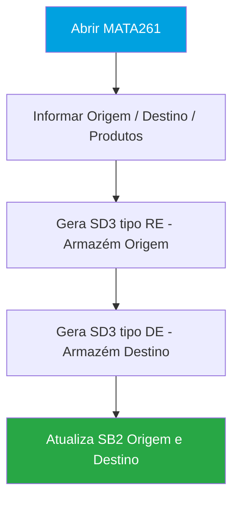
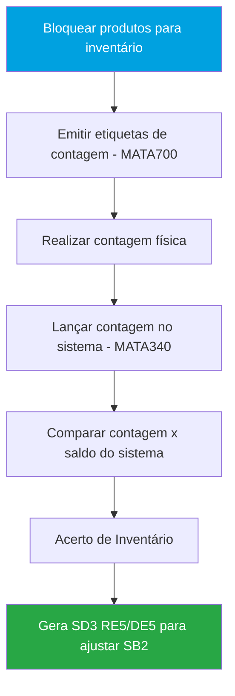
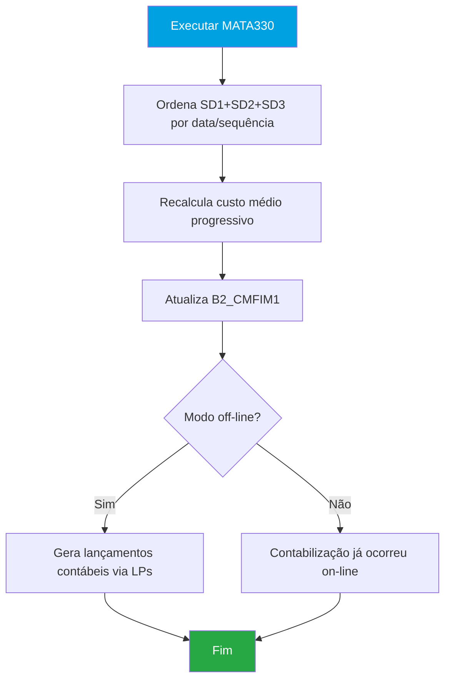
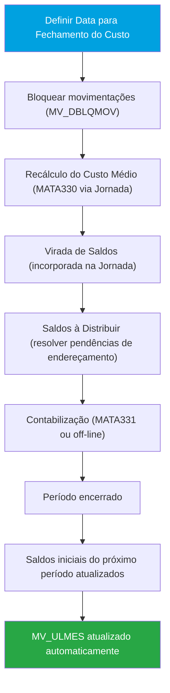
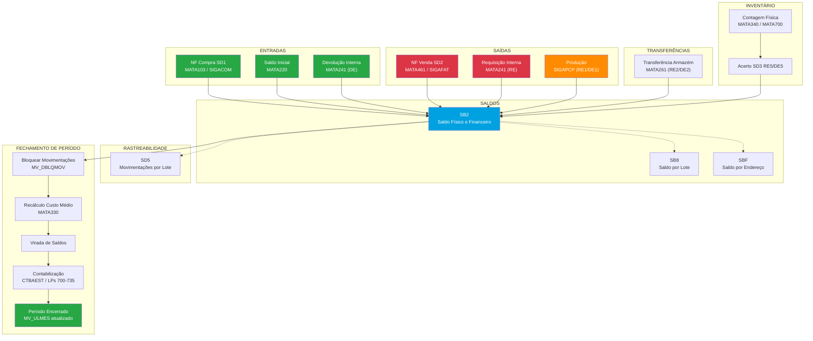
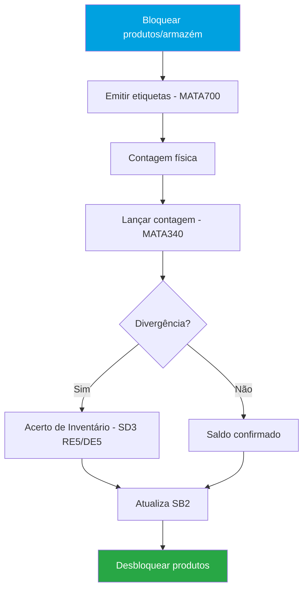

## 1. Objetivo do Módulo

O **SIGAEST** (Estoque e Custos) é o módulo do Protheus responsável pelo controle físico e financeiro dos estoques da empresa. Registra todas as entradas e saídas de produtos, calcula o custo médio ponderado e gera as informações de custo para a Contabilidade, Produção e demais módulos.

**Sigla:** SIGAEST
**Menu principal:** Atualizações > Estoque
**Integra com:** SIGACOM (compras), SIGAFAT (faturamento), SIGAFIS (fiscal), SIGACTB (contábil), SIGAPCP (produção)

**Objetivos principais:**
- Controle de saldo físico e financeiro de produtos por armazém
- Registro de todas as movimentações internas (requisições, devoluções, transferências)
- Controle de rastreabilidade por lote, sublote e endereço
- Cálculo do custo médio ponderado (por armazém, filial ou empresa)
- Fechamento de período (jornada de fechamento com Acompanha Custos)
- Processo de inventário físico
- Contabilização das movimentações via Lançamentos Padrão

**Módulos que movimentam o estoque:**

| Origem | Movimentação | Tabela |
|---|---|---|
| SIGACOM (NF Entrada) | Entrada no estoque | SD1 → SB2 |
| SIGAFAT (NF Saída) | Saída do estoque | SD2 → SB2 |
| SIGAEST (Interno) | Requisição / Devolução / Transferência | SD3 → SB2 |
| SIGAPCP (Produção) | Requisição de MP / Entrada de PA | SD3 → SB2 |

**Nomenclatura do módulo:**

| Sigla | Significado |
|-------|------------|
| SB2 | Saldo Físico e Financeiro |
| SD3 | Movimentações Internas |
| TM | Tipo de Movimentação |
| RE | Requisição (saída) |
| DE | Devolução (entrada) |
| LP | Lançamento Padrão |
| PE | Ponto de Entrada |

---

## 2. Parametrização Geral do Módulo

Parâmetros `MV_` que afetam o módulo como um todo.

### Custo e Fechamento

| Parâmetro | Descrição | Padrão | Tipo | Impacto |
|-----------|-----------|--------|------|---------|
| `MV_CUSMED` | Método de apuração: M=Mensal / D=Diário / S=Sequencial | M | C(1) | Define como o custo médio é calculado em todo o módulo |
| `MV_CUSFIL` | Aglutinação do custo: A=Armazém / F=Filial / E=Empresa | F | C(1) | Define nível de aglutinação do custo para todas as rotinas |
| `MV_ULMES` | Data do último fechamento (não manipular manualmente) | 20070101 | C(8) | Controla período aberto/fechado para movimentações |
| `MV_DBLQMOV` | Bloqueia movimentações durante o fechamento | N | L | Impede movimentações enquanto o fechamento está em andamento |
| `MV_CMDBLQV` | Controle automático de bloqueio de movimentações (`MATA038`) | | C | Ativação do bloqueio automático na Jornada de Fechamento |

### Rastreabilidade

| Parâmetro | Descrição | Padrão | Tipo | Impacto |
|-----------|-----------|--------|------|---------|
| `MV_RASTRO` | Ativa controle de rastreabilidade global | N | L | Habilita rastreamento por lote/sublote em todo o módulo |
| `MV_LOGMOV` | Gera LOG de desbalanceamento de lote/endereço | N | L | Gera arquivo LOG (pasta System, prefixo `CM??????.LOG`) com fotografia do estado das tabelas |

### Movimentações

| Parâmetro | Descrição | Padrão | Tipo | Impacto |
|-----------|-----------|--------|------|---------|
| `MV_ESTNEG` | Permite estoque negativo | N | L | Permite movimentações que gerem saldo negativo em SB2 |
| `MV_QEMPV` | Considera empenhado para produção como indisponível | N | L | Afeta cálculo de saldo disponível |
| `MV_LOCPAD` | Armazém padrão de entrada | 01 | C(2) | Armazém utilizado quando não informado na movimentação |
| `MV_LOCALIZ` | Usa controle de endereçamento | N | L | Habilita WMS básico em todo o módulo |

### Contabilização

| Parâmetro | Descrição | Padrão | Tipo | Impacto |
|-----------|-----------|--------|------|---------|
| `MV_AGLHIST` | Aglutina histórico de lançamentos do `MATA330` | T | C(1) | Consolida lançamentos contábeis no fechamento |
| `MV_AGLPROC` | Define rotina que aglutina histórico | MATA330 | C | Define qual rotina é responsável pela aglutinação |

> ⚠️ **Atenção:** Alteração de parâmetros globais afeta TODAS as rotinas do módulo.
> Teste em ambiente de homologação antes de alterar em produção.

> ⚠️ **MV_ULMES:** Este parâmetro deve ser exclusivo por filial. Se compartilhado, pode causar erros graves no fechamento de múltiplas filiais.

---

## 3. Cadastros Fundamentais

### 3.1 Produtos — `MATA010` (`SB1`)

**Menu:** Atualizações > Cadastros > Produtos
**Tabela:** `SB1` — Cadastro de Produtos

O cadastro de produtos é compartilhado com outros módulos (SIGACOM, SIGAFAT).

| Campo | Descrição | Tipo | Obrigatório |
|-------|-----------|------|-------------|
| `B1_COD` | Código do produto | C(15) | Sim |
| `B1_DESC` | Descrição | C(40) | Sim |
| `B1_TIPO` | Tipo: PA, MP, PI, ME, BN, SC... | C(2) | Sim |
| `B1_UM` | Unidade de medida principal | C(2) | Sim |
| `B1_GRUPO` | Grupo do produto | C(4) | Sim |
| `B1_LOCAL` | Armazém padrão | C(2) | - |
| `B1_LOCPAD` | Armazém padrão de saída | C(2) | - |
| `B1_RASTRO` | Controle de rastreabilidade: L=Lote, S=Sublote, N=Nenhum | C(1) | - |
| `B1_LOCALIZ` | Controla endereçamento: S=Sim / N=Não | C(1) | - |
| `B1_MSBLQL` | Motivo de bloqueio | C(6) | - |
| `B1_BLOQ` | Produto bloqueado para movimentação | C(1) | - |
| `B1_CM1` | Custo médio 1 (moeda 1) | N | - |
| `B1_CUSTD` | Custo padrão | N | - |
| `B1_CUSTM` | Custo de reposição | N | - |
| `B1_PE` | Ponto de pedido | N | - |
| `B1_EMIN` | Estoque mínimo | N | - |
| `B1_EMAX` | Estoque máximo | N | - |
| `B1_ESTSEG` | Estoque de segurança | N | - |
| `B1_CC` | Centro de custo padrão | C | - |
| `B1_TS` | Tipo de saída padrão (TES) | C | - |
| `B1_INSS` | Calcula INSS | C(1) | - |
| `B1_POSIPI` | Posição fiscal IPI | C(10) | - |

### 3.2 Armazéns — `MATA050` (`NNR`)

**Menu:** Atualizações > Cadastros > Armazéns
**Tabela:** `NNR` — Armazéns

| Campo | Descrição | Tipo | Obrigatório |
|-------|-----------|------|-------------|
| `NNR_CODIGO` | Código do armazém (2 caracteres, ex: 01, 02, CQ) | C(2) | Sim |
| `NNR_DESCRI` | Descrição | C(30) | Sim |
| `NNR_LOCALI` | Endereçamento habilitado: S/N | C(1) | - |
| `NNR_CQ` | Armazém de Centro de Qualidade: S/N | C(1) | - |
| `NNR_BLEST` | Bloqueado para movimentações: S/N | C(1) | - |

> ⚠️ **Armazém CQ (Centro de Qualidade):** Produtos em quarentena ficam neste armazém aguardando liberação. Não realizar acerto de custo neste armazém — sem saldo físico, o custo não pode ser calculado corretamente.

### 3.3 Grupos de Produtos — `MATA040` (`SBM`)

**Menu:** Atualizações > Cadastros > Grupos
**Tabela:** `SBM` — Grupos de Produtos

Classifica os produtos para relatórios e lançamentos contábeis.

### 3.4 Tipos de Movimentação Interna — `MATA230` (`SD6`)

**Menu:** Atualizações > Cadastros > Movimentações > Internas
**Tabela:** `SD6` — Tipos de Movimentação Interna

Define os tipos de movimento interno que podem ser realizados no estoque.

| Campo | Descrição | Tipo | Obrigatório |
|-------|-----------|------|-------------|
| `TM_COD` | Código do tipo de movimentação | C(3) | Sim |
| `TM_DESC` | Descrição | C(30) | Sim |
| `TM_TIPO` | Tipo: RE=Requisição (saída) / DE=Devolução (entrada) | C(2) | Sim |
| `TM_ESTATI` | Atualiza estatísticas de vendas: S/N | C(1) | - |
| `TM_TERC` | Movimentação de terceiros: S/N | C(1) | - |

> ⚠️ Os códigos **499** e **999** são **reservados para uso interno** do Protheus e não podem ser cadastrados manualmente.

### 3.5 Tabelas de Saldo

As tabelas de saldo são o coração do SIGAEST. Elas registram a posição atual do estoque.

| Tabela | Descrição | Atualizada por |
|---|---|---|
| **SB2** | Saldo físico e financeiro por produto/armazém | Toda movimentação (SD1/SD2/SD3) |
| **SB8** | Saldo por lote/sublote | Movimentações com rastreabilidade |
| **SBF** | Saldo por endereço (WMS) | Movimentações com endereçamento |

**Campos importantes — SB2:**

| Campo | Descrição |
|---|---|
| `B2_FILIAL` | Filial |
| `B2_COD` | Código do produto |
| `B2_LOCAL` | Armazém |
| `B2_QATU` | Quantidade atual em estoque |
| `B2_QMIN` | Quantidade mínima |
| `B2_QMAX` | Quantidade máxima |
| `B2_EMPENHO` | Quantidade empenhada (pedidos em aberto) |
| `B2_RESERVA` | Quantidade reservada |
| `B2_CM1` | Custo médio atual (moeda 1) |
| `B2_CMFIM1` | Custo médio final do período (após recálculo) |
| `B2_QINI1` | Quantidade inicial do período |
| `B2_VINI1` | Valor inicial do período |
| `B2_QFIM1` | Quantidade final do período (após fechamento) |
| `B2_VFIM1` | Valor final do período (após fechamento) |

> ⚠️ **Relação entre campos de custo:**
> - `B2_CM1` = custo médio atual (atualizado pelo Refaz Saldos)
> - `B2_CMFIM1` = custo médio final do período (atualizado pelo Recálculo do Custo Médio)
> - O `B2_CM1` é a referência para valoração de saídas (SD2) e movimentos internos (SD3)

---

## 4. Rotinas

### 4.1 `MATA220` — Saldo Inicial

**Objetivo:** Lançar o saldo inicial de produtos ao implantar o sistema ou ao iniciar uso de novos produtos.
**Menu:** Atualizações > Saldos > Saldo Inicial
**Tipo:** Inclusão

#### Tabelas

| Tabela | Alias | Descrição | Tipo |
|--------|-------|-----------|------|
| SB2 | SB2 | Saldo Físico e Financeiro | Principal |
| SB8 | SB8 | Saldo por Lote | Complementar |
| SBF | SBF | Saldo por Endereço | Complementar |

#### Fluxo da Rotina

- Informa produto, armazém, quantidade e custo unitário
- Alimenta `SB2` e, se configurado, `SB8` (lote) e `SBF` (endereço)
- Não gera movimentação nas tabelas SD1/SD2/SD3

---

### 4.2 `MATA241` — Movimentação Interna Múltipla

**Objetivo:** Principal rotina de movimentação interna — permite lançar múltiplos itens em um único documento.
**Menu:** Atualizações > Movimentações > Internas > Movimentação Múltipla
**Tipo:** Inclusão / Manutenção

> ⚠️ **A rotina `MATA240` (Movimentação Simples) foi descontinuada.** Usar apenas `MATA241`.

#### Tabelas

| Tabela | Alias | Descrição | Tipo |
|--------|-------|-----------|------|
| SD3 | SD3 | Movimentações Internas | Principal |
| SB2 | SB2 | Saldo Físico e Financeiro | Atualizada |
| SB8 | SB8 | Saldo por Lote | Atualizada (se rastreável) |
| SBF | SBF | Saldo por Endereço | Atualizada (se endereçável) |
| SD5 | SD5 | Movimentações por Lote | Atualizada (se rastreável) |

#### Campos Principais

| Campo | Descrição | Tipo | Obrigatório | Validação/Observação |
|-------|-----------|------|-------------|---------------------|
| `D3_FILIAL` | Filial | C(2) | Sim | Automático |
| `D3_COD` | Código do produto | C(15) | Sim | ExistCpo("SB1") |
| `D3_LOCAL` | Armazém de origem | C(2) | Sim | ExistCpo("NNR") |
| `D3_QUANT` | Quantidade | N(12,2) | Sim | > 0 |
| `D3_UM` | Unidade de medida | C(2) | - | Herdado do SB1 |
| `D3_TM` | Tipo de movimentação (código) | C(3) | Sim | ExistCpo("SD6") |
| `D3_CF` | Código RE/DE/PR/ER (tipo de operação) | C(3) | - | Definido pelo TM |
| `D3_CUSTO1` | Custo unitário (moeda 1) | N(14,2) | - | Calculado a partir de `B2_CM1` |
| `D3_TOTAL1` | Custo total | N(14,2) | - | `D3_QUANT * D3_CUSTO1` |
| `D3_EMISSAO` | Data de emissão | D | Sim | |
| `D3_DTLANC` | Data de lançamento contábil | D | - | Recebe data do processamento MATA330 |
| `D3_NUMSEQ` | Sequência | C(6) | - | Automático |
| `D3_OP` | Ordem de produção vinculada | C(14) | - | Quando vinculada a OP |
| `D3_CC` | Centro de custo | C(9) | - | Para contabilização |
| `D3_LOTE` | Lote do produto | C(10) | - | Obrigatório se `B1_RASTRO <> N` |
| `D3_NUMLOT` | Número do lote (rastreabilidade) | C(10) | - | Rastreabilidade |

**Como o custo `D3_CUSTO1` é calculado:**
- Usa o `B2_CM1` (custo médio atual) do produto no armazém de origem no momento da movimentação
- Após o Recálculo do Custo Médio (`MATA330`), os valores são atualizados para refletir o custo correto do período

#### Perguntas F12

| Pergunta | Descrição |
|---|---|
| Mostra lançamentos contábeis? | Exibe LP gerado a cada movimento |
| Aglutina lançamentos contábeis? | Aglutina LPs por tipo de movimento |
| Considera saldo de Terceiro? | Inclui saldo De/Em poder de terceiros |

#### Parâmetros MV_ desta Rotina

| Parâmetro | Descrição | Padrão | Tipo | Quando usar |
|-----------|-----------|--------|------|-------------|
| `MV_ESTNEG` | Permite estoque negativo | N | L | Quando necessário permitir saldos negativos |
| `MV_LOCPAD` | Armazém padrão de entrada | 01 | C(2) | Armazém default quando não informado |

#### Pontos de Entrada

| Ponto de Entrada | Momento de Execução | Descrição | Parâmetros |
|-----------------|---------------------|-----------|------------|
| `M241OK` | Antes de confirmar | Validação antes de confirmar a movimentação | - |
| `M241GRV` | Após gravar item | Executado após gravar cada item da movimentação (SD3) | - |
| `M241BRW` | No browse | Manipulação do browse da rotina | - |
| `M241CAB` | Antes do cabeçalho | Manipulação do cabeçalho antes de incluir | - |
| `M241ITM` | Antes de gravar item | Manipulação de cada item antes de gravar | - |
| `M241TOT` | Após totalizar | Após totalizar os valores da movimentação | - |
| `MSFILTER` | No filtro | Filtro customizado para seleção de produtos | - |

#### Fluxo da Rotina

---

### 4.3 `MATA261` — Transferência entre Armazéns

**Objetivo:** Movimentar saldo de um armazém para outro dentro da mesma empresa/filial.
**Menu:** Atualizações > Movimentações > Internas > Transferência Múltipla
**Tipo:** Processamento

#### Tabelas

| Tabela | Alias | Descrição | Tipo |
|--------|-------|-----------|------|
| SD3 | SD3 | Movimentações Internas | Principal |
| SB2 | SB2 | Saldo Físico e Financeiro | Atualizada |

#### Fluxo da Rotina

- Gera saída no armazém de origem (SD3 tipo RE) e entrada no armazém destino (SD3 tipo DE)
- Também pode transferir saldo entre produtos diferentes (ex: recipientes x litros)

**Transferência entre filiais:** Realizada via Documento de Entrada (`MATA103`) + Nota Fiscal de Saída (`MATA461`) com TES específico de transferência.

#### Parâmetros MV_ desta Rotina

| Parâmetro | Descrição | Padrão | Tipo | Quando usar |
|-----------|-----------|--------|------|-------------|
| `MV_ESTNEG` | Permite estoque negativo na origem | N | L | Quando necessário permitir transferência sem saldo |
| `MV_CUSFIL` | Aglutinação do custo (afeta custo da transferência) | F | C(1) | Define se custo é por armazém, filial ou empresa |

#### Pontos de Entrada

| Ponto de Entrada | Momento de Execução | Descrição | Parâmetros |
|-----------------|---------------------|-----------|------------|
| `M261OK` | Antes de confirmar | Validação antes de confirmar a transferência | - |
| `M261GRV` | Após gravação | Após gravar os registros de transferência | - |
| `M261ITM` | Antes de gravar item | Manipulação dos itens antes de gravar | - |

---

### 4.4 `MATA410` / `MATA411` / `MATA412` — Solicitação ao Armazém

**Objetivo:** Gerar pré-requisições de materiais não vinculadas a uma Ordem de Produção — útil para departamentos que solicitam materiais ao almoxarifado.
**Menu:** Atualizações > Movimentações > Internas > Solicitação ao Armazém
**Tipo:** Inclusão / Processamento

#### Rotinas envolvidas

| Rotina | Descrição |
|--------|-----------|
| `MATA410` | Solicitar materiais |
| `MATA411` | Gerar Pré-Requisição |
| `MATA412` | Baixar Pré-Requisição — efetiva a movimentação em SD3 |

**Aprovação:** Pode ter controle de alçada configurado via grupo de aprovação do SIGACOM.

---

### 4.5 Poder de Terceiros

**Objetivo:** Controlar materiais enviados/recebidos de terceiros (remessas para industrialização, beneficiamento, conserto).
**Tipo:** Processamento

**Conceito:**
- **Material De Terceiros em nosso poder:** produto do fornecedor que está fisicamente em nosso armazém mas não é de nossa propriedade
- **Nosso Material em poder de Terceiros:** produto nosso que está fisicamente no fornecedor

**Rotinas:** Remessa e devolução via NF com TES específico de "Remessa para Industrialização" / "Devolução de Remessa"

---

### 4.6 `MATA340` / `MATA700` — Inventário

**Objetivo:** Contar fisicamente o estoque e ajustar as divergências com os saldos do sistema.
**Menu:** Atualizações > Movimentações > Internas > Inventário / Miscelânea > Processamentos > Inventário
**Tipo:** Processamento

#### Tabelas

| Tabela | Alias | Descrição | Tipo |
|--------|-------|-----------|------|
| SD3 | SD3 | Movimentações de Ajuste (RE5/DE5) | Gerada |
| SB2 | SB2 | Saldo Físico e Financeiro | Atualizada |

#### Etapas do Processo

**Relatório de conferência:** `MATR285` / `MATR900` — para verificar itens ajustados após o processamento.

**Tipos de bloqueio:**
- Por produto específico: bloqueia individualmente
- Por armazém completo: bloqueia todo o armazém via `AGRA045`
- Por data calculada: bloqueia produtos com base em regra de data

**Como zerar saldo de um armazém a desativar:**
1. Realizar inventário informando quantidade zero para todos os produtos
2. Executar Acerto de Inventário — gera movimentações RE5 zerando os saldos
3. Com SB2 zerado, o armazém pode ser excluído sem que o Refaz Saldos recrie os registros

#### Parâmetros MV_ desta Rotina

| Parâmetro | Descrição | Padrão | Tipo | Quando usar |
|-----------|-----------|--------|------|-------------|
| `MV_DBLQMOV` | Bloqueia movimentações durante inventário/fechamento | N | L | Para impedir movimentações durante contagem |

#### Pontos de Entrada

| Ponto de Entrada | Momento de Execução | Descrição | Parâmetros |
|-----------------|---------------------|-----------|------------|
| `M340OK` | Na validação | Validação no inventário | - |
| `M340GRV` | Após gravação | Após gravação dos registros de inventário | - |
| `M700INC` | Na inclusão | Inclusão no processamento do inventário | - |

---

### 4.7 `MATA330` — Recálculo do Custo Médio

**Objetivo:** Reprocessar o custo de todas as movimentações do período, aplicando o método de apuração configurado.
**Menu:** Miscelânea > Cálculos > Custo Médio
**Tipo:** Processamento

#### Tabelas

| Tabela | Alias | Descrição | Tipo |
|--------|-------|-----------|------|
| SD1 | SD1 | Itens NF Entrada | Leitura |
| SD2 | SD2 | Itens NF Saída | Leitura |
| SD3 | SD3 | Movimentações Internas | Leitura/Atualizada |
| SB2 | SB2 | Saldo Físico e Financeiro | Atualizada (`B2_CMFIM1`) |
| CT2 | CT2 | Lançamentos Contábeis | Gerada (se off-line) |

#### O que o `MATA330` faz

1. Ordena todas as movimentações do período (SD1, SD2, SD3) pela data e sequência
2. Recalcula o custo médio progressivo de cada movimentação
3. Atualiza `B2_CMFIM1` (custo médio final do período)
4. Gera os lançamentos contábeis das movimentações (se modo off-line)

#### Perguntas Importantes

| Pergunta | Opção | Descrição |
|---|---|---|
| Processa SD3 (movimentos internos)? | S/N | Deve ser S para incluir requisições/devoluções |
| Mov. interno valorizado | Antes / Depois | Define posição dos movimentos valorizados na ordenação |
| Gera estrutura pela movimentação? | S/N | Recalcula níveis da estrutura do produto |
| Método de apropriação | Mensal/Sequencial/Diário | Deve corresponder ao `MV_CUSMED` |

**Relatório de conferência:** `MATR900` com `Doc Sequência = S` e `Sequência de impressão = Cálculo`

> ⚠️ Recursividade: Produtos que são MP e PA ao mesmo tempo podem gerar recursividade no cálculo. Relatório `MATRXXX` lista movimentos recursivos.

#### Parâmetros MV_ desta Rotina

| Parâmetro | Descrição | Padrão | Tipo | Quando usar |
|-----------|-----------|--------|------|-------------|
| `MV_CUSMED` | Método de apuração (M/D/S) | M | C(1) | Definido na implantação |
| `MV_CUSFIL` | Aglutinação do custo (A/F/E) | F | C(1) | Definido na implantação |
| `MV_AGLHIST` | Aglutina histórico de lançamentos | T | C(1) | Quando necessário consolidar lançamentos |
| `MV_AGLPROC` | Define rotina que aglutina histórico | MATA330 | C | Vinculado ao `MV_AGLHIST` |

#### Pontos de Entrada

| Ponto de Entrada | Momento de Execução | Descrição | Parâmetros |
|-----------------|---------------------|-----------|------------|
| `MT330INC` | Antes do processamento | Executado antes do processamento do recálculo | - |
| `MT330FIM` | Após processamento | Executado ao final do processamento | - |
| `MT330PRO` | Durante processamento | Permite alterar a sequência de cálculo do custo médio | - |

> ⚠️ PEs do `MATA330` que abrem interface não funcionam dentro da Jornada de Fechamento (`MATA038`), pois as rotinas são executadas via thread apartada (ExecAuto).

#### Fluxo da Rotina

---

### 4.8 `MATA350` — Refaz Saldos

**Objetivo:** Recalcular o saldo atual (`B2_QATU` e `B2_CM1`) a partir das movimentações históricas.
**Menu:** Miscelânea > Processamentos > Refaz Saldos
**Tipo:** Processamento

#### Tabelas

| Tabela | Alias | Descrição | Tipo |
|--------|-------|-----------|------|
| SD1 | SD1 | Itens NF Entrada | Leitura |
| SD2 | SD2 | Itens NF Saída | Leitura |
| SD3 | SD3 | Movimentações Internas | Leitura |
| SB2 | SB2 | Saldo Físico e Financeiro | Atualizada (`B2_QATU`, `B2_CM1`) |

#### Quando usar

- Após corrigir movimentações incorretas
- Quando `B2_CM1` está desatualizado após acerto de custo
- Quando há divergência entre o Kardex e o Saldo Atual

> **Nota:** O `MATA330` atualiza `B2_CMFIM1`. O `MATA350` atualiza `B2_CM1` (saldo atual). Ambos são necessários para que o estoque esteja consistente.

---

### 4.9 `MATA038` — Acompanha Custos (Jornada de Fechamento)

**Objetivo:** Painel central que concentra e orquestra todo o processo de fechamento de estoque.
**Menu:** SIGAEST > Acompanha Custos
**Tipo:** Processamento

A partir da **release 12.1.33**, o Acompanha Custos é o painel central de fechamento.

> ⚠️ **Virada de Saldos (`MATA280`) foi descontinuada a partir da release 12.1.2210.** O processo agora é feito exclusivamente pela Jornada de Fechamento no `MATA038`.

#### Funcionalidades

- Painel com composição de custos por produto
- Alertas para monitoramento de produtos com custo fora do esperado
- Jornada de Fechamento centralizada (substitui `MATA280` + `MATA330` + contabilização)
- Reabertura de estoque (permite reabrir período após fechamento)

#### Pré-requisitos

- Porta Multiprotocolo configurada no `appserver.ini`
- Rotina adicionada ao menu via SIGACFG
- Parâmetro `MV_CMDBLQV` configurado para controle automático de bloqueio

#### Parâmetros MV_ desta Rotina

| Parâmetro | Descrição | Padrão | Tipo | Quando usar |
|-----------|-----------|--------|------|-------------|
| `MV_ULMES` | Data do último fechamento | 20070101 | C(8) | Atualizado automaticamente — não manipular |
| `MV_DBLQMOV` | Bloqueia movimentações durante fechamento | N | L | Configurar conforme documentação antes de fechar |
| `MV_CUSMED` | Método de apuração (M/D/S) | M | C(1) | Definido na implantação |
| `MV_CUSFIL` | Aglutinação do custo (A/F/E) | F | C(1) | Definido na implantação |
| `MV_CMDBLQV` | Controle automático de bloqueio | | C | Para ativação do bloqueio automático |

#### Fluxo da Jornada de Fechamento

**Perguntas frequentes sobre o fechamento:**
- **Pode fechar com saldos desbalanceados?** Sim, eles vão para "Saldos à Distribuir"
- **Funciona via Schedule?** Não — o fechamento não pode ser agendado
- **Precisa estar na database do mês de fechamento?** No método M (off-line), não — basta informar a data no pergunte

#### Reabertura de Estoque

Disponível a partir da release 12.1.33 via Acompanha Custos (`MATA038`).

**Permite:** Reverter o fechamento de um período e reprocessar movimentações.

> ⚠️ **Impacto nas Ordens de Produção:** A reabertura pode gerar inconsistências nos campos `C2_VINI1` e `C2_VFIM1` das Ordens de Produção (`SC2`), afetando o custo repassado para os apontamentos de produção. Avaliar cuidadosamente antes de executar.

---

### 4.10 `MATA910` — Nota Fiscal Manual de Entrada

**Objetivo:** Registrar NFs de entrada somente nos Livros Fiscais — sem movimentar estoque nem financeiro.
**Menu:** Atualizações > Movimentações > Fiscais > NF Manual Entrada
**Tipo:** Inclusão

**Diferença da `MATA103` (Documento de Entrada):**
- `MATA103`: integra estoque, financeiro, fiscal e contábil
- `MATA910`: apenas registro fiscal, sem integrações

**Quando usar:** NFs que não precisam movimentar o ERP (ex: notas de remessa sem valor, NFs de prestação de serviços que já foram registradas manualmente).

---

### 4.11 `MATA920` — Nota Fiscal Manual de Saída

**Objetivo:** Registrar NFs de saída apenas nos Livros Fiscais — sem integração com ERP.
**Menu:** Atualizações > Movimentações > Fiscais > NF Manual Saída
**Tipo:** Inclusão

**Quando usar:**
- NF de devolução já emitida pelo fornecedor que precisa ser lançada apenas nos livros fiscais
- NFs autorizadas na SEFAZ que foram excluídas indevidamente do sistema (sem cancelamento)

---

## 5. Contabilização

### 5.1 Modo de Contabilização

A contabilização das movimentações de estoque pode ser on-line ou off-line, definida pelo parâmetro `MV_CUSMED`.

| Modo | Descrição | Parâmetro |
|------|-----------|-----------|
| On-line | Contabiliza automaticamente ao gravar o documento (método D — Diário) | `MV_CUSMED=D` |
| Off-line | Contabilização em lote posterior (método M — Mensal) | Rotina `CTBAEST` |

**Rotina off-line:** `CTBAEST` — acesso via `Miscelânea > Contabilização Off-Line` no SIGAEST

**Verificar LP durante a movimentação:** F12 dentro do `MATA241` → "Mostra lançamentos contábeis = S"

### 5.2 Lançamentos Padrão (LP)

| Código LP | Descrição | Rotina | Débito | Crédito |
|-----------|-----------|--------|--------|---------|
| 700 | Transferência entre armazéns | MATA261 | Estoque destino | Estoque origem |
| 705 | Estorno de transferência | MATA261 | Estoque origem | Estoque destino |
| 710 | Ajuste de estoque por inventário | MATA340 | Estoque / Ajuste | Ajuste / Estoque |
| 715 | Estorno de ajuste de inventário | MATA340 | Ajuste / Estoque | Estoque / Ajuste |
| 720 | Requisição de material (consumo) | MATA241 | Despesa (CC) | Estoque (SB2) |
| 725 | Devolução de material (consumo) | MATA241 | Estoque (SB2) | Despesa (CC) |
| 730 | Requisição para OP (MP para Produção) | MATA241 | Produtos em Processo | Estoque MP |
| 735 | Devolução de OP (PA para Estoque) | MATA241 | Estoque PA | Produtos em Processo |

> **Nota:** LPs são configurados em `CTBA080`. Cada LP pode ter múltiplas linhas com fórmulas que referenciam campos do documento.

### 5.3 Aglutinação e Data de Lançamento

**Aglutinação de histórico contábil:**
- Parâmetro `MV_AGLHIST = T` — aglutina histórico de lançamentos do `MATA330`
- Parâmetro `MV_AGLPROC = MATA330` — define qual rotina aglutina

**Data de lançamento contábil:**
Campo `D3_DTLANC` recebe a data do processamento ("Data limite final") do Recálculo do Custo Médio — não a data da movimentação original.

> **Nota:** Contabilização por consumo: Movimentos RE0 (sem OP associada), RE6 e DE6 são contabilizados como consumo (despesa direta).

---

## 6. Tipos e Classificações

### 6.1 Tipos de Movimentação Interna (RE/DE/PR/ER)

O campo `D3_CF` na tabela SD3 identifica o tipo de movimentação:

| Código | Tipo | Descrição | Comportamento | Uso típico |
|--------|------|-----------|---------------|------------|
| RE0 | Requisição Manual | Saída manual sem OP | Gera saída em SB2, contabiliza como consumo | Consumo de materiais diversos |
| RE1 | Requisição Automática | Saída automática para OP | Gera saída em SB2, vinculada a OP | Produção — requisição de MP |
| RE2 | Requisição de Transferência | Saída de transferência entre armazéns | Gera saída no armazém origem | Transferência via MATA261 |
| RE3 | Requisição de Venda | Saída por Pedido de Venda | Gera saída em SB2 | Baixa de estoque por venda |
| RE5 | Requisição de Inventário | Saída gerada pelo acerto de inventário | Ajuste negativo em SB2 | Inventário — saldo físico menor |
| RE6 | Requisição de Consumo | Saída de consumo (material de uso) | Gera saída em SB2, contabiliza como consumo | Material de uso e consumo |
| DE0 | Devolução Manual | Entrada manual | Gera entrada em SB2, contabiliza como crédito | Devolução de materiais diversos |
| DE1 | Devolução Automática | Entrada automática de OP (produto acabado) | Gera entrada em SB2, vinculada a OP | Produção — entrada de PA |
| DE2 | Devolução de Transferência | Entrada de transferência | Gera entrada no armazém destino | Transferência via MATA261 |
| DE5 | Devolução de Inventário | Entrada gerada pelo acerto de inventário | Ajuste positivo em SB2 | Inventário — saldo físico maior |
| DE6 | Devolução de Consumo | Devolução de material de consumo | Gera entrada em SB2 | Retorno de material de uso |
| PR | Produção | Apontamento de produção | Entrada de PA em SB2 | Apontamento de produção |
| ER | Estorno de Produção | Estorno de apontamento | Reverte entrada de PA | Correção de apontamento |

### 6.2 Faixas de Código para Tipos de Movimentação (TM)

| Tipo | Código | Faixa |
|---|---|---|
| Requisição (saída) | RE | 501 a 999 |
| Devolução (entrada) | DE | 001 a 499 |
| Uso interno | – | – |

> ⚠️ Os códigos **499** e **999** são **reservados para uso interno** do Protheus e não podem ser cadastrados manualmente.

### 6.3 Acerto de Custo

Processo para corrigir o custo médio de produtos com custo incorreto, sem precisar cancelar movimentações.

**Como funciona:**
1. Cadastrar TM (Tipo de Movimentação) valorizado específico para ajuste de custo (DE e RE)
2. Calcular o valor de ajuste necessário: `custo_desejado x saldo_fisico = valor_total` → `valor_ajuste = valor_total - valor_atual`
3. Executar movimentação valorizada com o TM de ajuste via `MATA241`
4. Executar Refaz Saldos (`MATA350`) para atualizar `B2_CM1`

> ⚠️ **Acerto de custo no armazém CQ:** Não realizar! Sem saldo físico disponível, não há base para calcular o custo médio.

---

## 7. Tabelas do Módulo

Visão consolidada de todas as tabelas usadas no módulo.

### Tabelas de Cadastro

| Tabela | Descrição | Rotina Principal | Obs |
|--------|-----------|-----------------|-----|
| SB1 | Cadastro de Produtos | `MATA010` | Compartilhada com COM/FAT |
| SBM | Grupos de Produtos | `MATA040` | Classificação para relatórios e contábil |
| NNR | Armazéns | `MATA050` | |
| SD6 | Tipos de Movimentação Interna | `MATA230` | |
| NNS | Endereços do Armazém (WMS) | – | Usado quando endereçamento ativo |

### Tabelas de Saldo

| Tabela | Descrição | Rotina Principal | Volume |
|--------|-----------|-----------------|--------|
| SB2 | Saldo Físico e Financeiro (principal) | SD1/SD2/SD3 | Alto |
| SB8 | Saldo por Lote/Sublote | SD5 | Alto (se rastreável) |
| SBF | Saldo por Endereço (WMS) | `MATA265` / movimentações | Alto (se endereçável) |

### Tabelas de Movimento

| Tabela | Descrição | Rotina Principal | Volume |
|--------|-----------|-----------------|--------|
| SD1 | Itens de NF de Entrada | `MATA103` / SIGACOM | Muito Alto |
| SD2 | Itens de NF de Saída | `MATA461` / SIGAFAT | Muito Alto |
| SD3 | Movimentações Internas | `MATA241` / `MATA261` / SIGAPCP | Muito Alto |
| SD5 | Movimentações de Lote/Sublote | SD1+SD2+SD3 (com rastreabilidade) | Alto |
| SDA | Saldo de Lote por Armazém | – | Médio |
| SDB | Saldo de Lote por Produto | – | Médio |

### Tabelas de Custo e Fechamento

| Tabela | Descrição | Uso |
|--------|-----------|-----|
| SB2 (`B2_CMFIM1`) | Custo médio final do período | Atualizado pelo `MATA330` |
| SB2 (`B2_CM1`) | Custo médio atual | Atualizado pelo `MATA350` |
| SC2 | Ordens de Produção | Impactadas pelo custo médio |

---

## 8. Fluxo Geral do Módulo

**Legenda de cores:**
- Azul: Tabela central (SB2)
- Verde: Entradas / Conclusão
- Vermelho: Saídas
- Laranja: Integração com outro módulo (SIGAPCP)

---

## 9. Integrações com Outros Módulos

| Módulo | Integração | Tabela Ponte | Direção | Momento |
|--------|-----------|-------------|---------|---------|
| **SIGACOM** | NF de compra → entrada no estoque (SB2+SD1) | SD1 → SB2 | COM → EST | Na classificação da NF de entrada |
| **SIGAFAT** | NF de venda → saída do estoque (SB2+SD2) | SD2 → SB2 | FAT → EST | Na emissão da NF de saída |
| **SIGAPCP** | OP: requisição de MP → SD3 (RE1); entrada de PA → SD3 (DE1) | SD3 → SB2 | PCP → EST | No apontamento de produção |
| **SIGACTB** | Movimentações geram lançamentos contábeis via LPs 700-735 | CT2 | EST → CTB | On-line ou Off-line (MATA330/CTBAEST) |
| **SIGAFIN** | Custo do estoque impacta o CMV e o custo de compras | – | EST → FIN | Na apuração de resultados |
| **SIGATEC** | Baixa de ativo fixo pode gerar movimentação interna de peças | SD3 | TEC → EST | Na baixa do ativo |
| **SIGAMNT** | Ordens de serviço consomem materiais via SD3 | SD3 → SB2 | MNT → EST | Na execução da OS |
| **SIGAFIS** | Inventário e movimentações alimentam o SPED Fiscal | – | EST → FIS | Na geração do SPED |

---

## 10. Controles Especiais

### 10.1 Controle de Rastreabilidade (Lote/Sublote/Endereço)

**Objetivo:** Rastrear movimentações de estoque por lote, sublote e/ou endereço físico.

#### Controle de Lote — SB8/SD5

**Parâmetro ativador:** `MV_RASTRO` — ativa globalmente o controle de rastreabilidade

**Ativação por produto:** Campo `B1_RASTRO` no produto:
- `L` = Controle por Lote
- `S` = Controle por Sublote (mais detalhado: Lote + Sublote)
- `N` = Sem rastreabilidade

**Tabelas:**

| Tabela | Descrição |
|---|---|
| SB8 | Saldo por Lote/Sublote (quantidade atual por lote) |
| SD5 | Movimentações por Lote (histórico de movimentações por lote) |

**Fluxo de rastreabilidade:**
- NF de Entrada (SD1) → gera registro em SD5 + atualiza SB8
- NF de Saída (SD2) → gera registro em SD5 + atualiza SB8
- Movimentação Interna (SD3) → gera registro em SD5 + atualiza SB8

**Manutenção de Lotes:** `MATA390`
Para situações onde existem saldos em SB2 sem lote associado — permite criar o lote e alimentar o SB8.

#### Controle de Endereçamento — SBF

Controle de localização física dentro do armazém (WMS básico do Protheus).

**Ativação:**
- Campo `NNR_LOCALI = S` no armazém
- Campo `B1_LOCALIZ = S` no produto

**Tabela:** `SBF` — Saldo por Endereço

**Rotinas:**
- `MATA265` (Endereçar) — distribui saldo físico nos endereços do armazém
- `MATA266` (Movimentação com Endereço) — movimenta considerando endereço de origem/destino

**Rebalanceamento de endereços:** Se há saldo em SBF sem correspondência no SB2, executar `MATA265` para endereçar os saldos pendentes.

#### Desbalanceamento SB2 x SB8 x SBF

Um dos problemas mais comuns no SIGAEST é o desbalanceamento entre as tabelas de saldo.

**Monitoramento:** Parâmetro `MV_LOGMOV = S` — gera arquivo LOG (pasta System, prefixo `CM??????.LOG`) com "fotografia" do estado das tabelas no momento da movimentação.

**Checagens realizadas quando `MV_LOGMOV = S`:**
- Diferença entre lote movimentado e gravado em SD5/SDA/SDB
- Diferença entre quantidade movimentada e gravada em SD5/SDA/SDB
- Diferença de saldo entre SB2, SB8 e SBF

**Soluções por cenário:**

| Cenário | Causa | Solução |
|---|---|---|
| SB8 > SB2 | Saldos sem lote em SB2 | `MATA390` (Manutenção de Lotes) — cria lote e alimenta SB8 |
| SBF > SB2 | Saldos sem endereço em SB2 | `MATA265` (Endereçamento) — distribui saldo nos endereços |
| SB2 sem correspondente em SB8/SBF | Movimentação sem rastreabilidade | Refaz Saldos (`MATA350`) — tenta equalizar |

### 10.2 Inventário

**Objetivo:** Contar fisicamente o estoque e ajustar as divergências com os saldos do sistema.
**Parâmetro ativador:** `MV_DBLQMOV` (para bloqueio durante contagem)

O inventário permite contar fisicamente o estoque e ajustar as divergências. Ver detalhes completos na Seção 4.6 (`MATA340` / `MATA700`).

**Bloqueio de Produtos para Inventário:**

Impede que outros usuários movimentem os produtos enquanto estão sendo inventariados.

| Parâmetro/Rotina | Descrição |
|-----------|-----------|
| `MATA340` (opção de bloqueio) | Bloqueia por produto específico |
| `AGRA045` | Bloqueia armazém completo |

### 10.3 Custo Médio e Fechamento de Estoque

**Objetivo:** Calcular o custo médio ponderado e realizar o fechamento de período.

#### Métodos de Apuração de Custo

Definido pelo parâmetro `MV_CUSMED`:

| Valor | Método | Descrição |
|---|---|---|
| M | Mensal (Off-line) | Custo calculado no fechamento do período (mais comum) |
| D | Diário (On-line) | Custo atualizado a cada movimentação |
| S | Sequencial | Custo calculado na sequência das movimentações |

> ⚠️ O método `M` (Mensal) é o mais utilizado. Durante o mês, as saídas são valoradas com o custo da abertura do período. Somente após o fechamento (`MATA330`) o custo é recalculado corretamente.

#### Custo Aglutinado por

Definido pelo parâmetro `MV_CUSFIL`:

| Valor | Aglutinação | Descrição |
|---|---|---|
| A | Por Armazém | Cada armazém tem seu próprio custo médio |
| F | Por Filial | Todos os armazéns de uma filial compartilham o custo |
| E | Por Empresa | Todos os armazéns de todas as filiais da empresa compartilham o custo |

**Análise no relatório `MATR900`:**
- Por armazém: informar o código do armazém no pergunte "Qual armazém?"
- Por filial: informar `**`
- Por empresa: informar `##`

Ver detalhes completos das rotinas de fechamento na Seção 4.7 (`MATA330`), Seção 4.8 (`MATA350`) e Seção 4.9 (`MATA038`).

---

## 11. Consultas e Relatórios

### Consultas

| Consulta | Rotina | Descrição |
|----------|--------|-----------|
| Kardex Diário | – | Histórico de movimentações por produto e armazém (físico e financeiro) |
| Kardex por Lote/Sublote | `MATR435` | Histórico de movimentações por lote |
| Saldo Atual | – | Posição atual de estoque com custo médio (`B2_QATU` / `B2_CM1`) |
| Posição de Estoque por Lote | – | Saldo atual por lote |
| Consumo Mês a Mês | – | Consumo dos últimos 12 meses por produto |

### Relatórios Principais

| Relatório | Rotina | Descrição | Saída |
|-----------|--------|-----------|-------|
| Kardex Físico-Financeiro | `MATR900` | Referência principal para análise de custo | PDF/Planilha |
| Conferência pós-Inventário | `MATR285` | Verificar itens ajustados após inventário | PDF/Planilha |
| Consumo Mês a Mês | `MATR340` | Conceito e interpretação do consumo mensal | PDF/Planilha |
| Materiais De/Em Terceiros | `MATR430` | Relação de materiais de terceiros e em terceiros | PDF/Planilha |
| Kardex por Lote/Sublote | `MATR435` | Movimentações rastreadas por lote | PDF/Planilha |
| Balancete de Estoque | – | Valor total do estoque por período | PDF/Planilha |
| Relação de NFs de Compras | – | Listagem de NFs de compra por período | PDF/Planilha |

> ⚠️ **Relatórios diferentes não produzem resultados idênticos** — foram projetados para finalidades diferentes. Nunca comparar relatórios distintos esperando valores exatamente iguais.

---

## 13. Referências

| Fonte | URL | Descrição |
|-------|-----|-----------|
| TDN | https://tdn.totvs.com/display/public/PROT/Acompanha+Custos | Acompanha Custos (MATA038) |
| TDN | https://tdn.totvs.com/pages/releaseview.action?pageId=745742843 | Relatórios SIGAEST |
| Central TOTVS | https://centraldeatendimento.totvs.com/hc/pt-br/articles/17143292484759 | Fechamento de Estoque (MATA038) |
| Central TOTVS | https://centraldeatendimento.totvs.com/hc/pt-br/articles/360048372754 | Roteiro Fechamento (legado) |
| Central TOTVS | https://centraldeatendimento.totvs.com/hc/pt-br/articles/4403903077143 | Controle de Estoque (geral) |
| Central TOTVS | https://centraldeatendimento.totvs.com/hc/pt-br/articles/360026614194 | Movimentação Múltipla (MATA241) |
| Central TOTVS | https://centraldeatendimento.totvs.com/hc/pt-br/articles/1500004558141 | PEs MATA241 |
| Central TOTVS | https://centraldeatendimento.totvs.com/hc/pt-br/articles/4402491211159 | Desbalanceamento Lote/Endereço |
| Central TOTVS | https://centraldeatendimento.totvs.com/hc/pt-br/articles/235078488 | Lotes e Sublotes (SD5/SB8) |
| Central TOTVS | https://centraldeatendimento.totvs.com/hc/pt-br/articles/360057292614 | Acerto de Custo |
| Central TOTVS | https://centraldeatendimento.totvs.com/hc/pt-br/articles/4405082704791 | Contabilização SIGAEST |
| Central TOTVS | https://centraldeatendimento.totvs.com/hc/pt-br/articles/360007057091 | Tipos RE/DE |
| User Function | https://userfunction.com.br/materiais/sigaest/ajustar-custos-de-produtos-protheus/ | Ajustar Custos |

> **Documento gerado para uso interno como referência técnica de desenvolvimento ADVPL/TLPP.**
> Manter atualizado conforme evolução das releases do Protheus.

---

## 14. Enriquecimentos

Seção reservada para informações adicionadas via "Pergunte ao Padrão".
Cada enriquecimento tem marcador de data, fontes e pergunta original.

(seção preenchida automaticamente — não editar manualmente)
