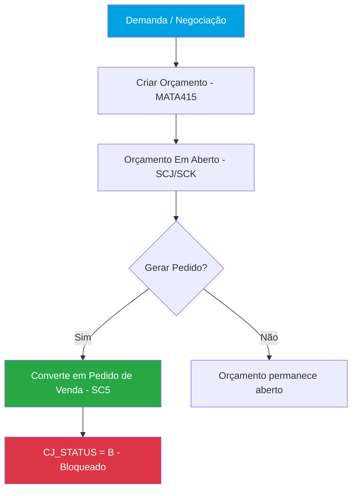
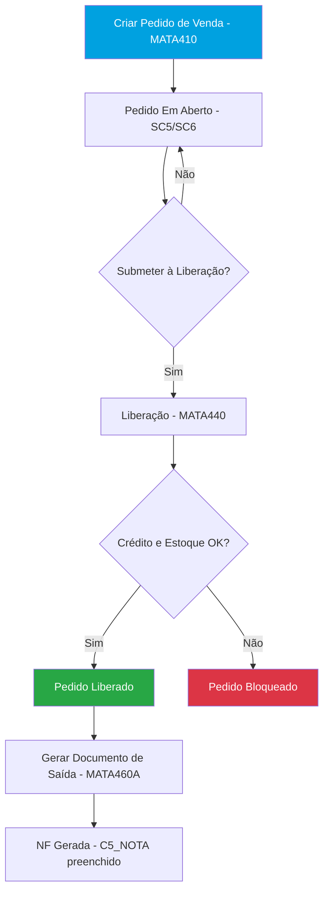
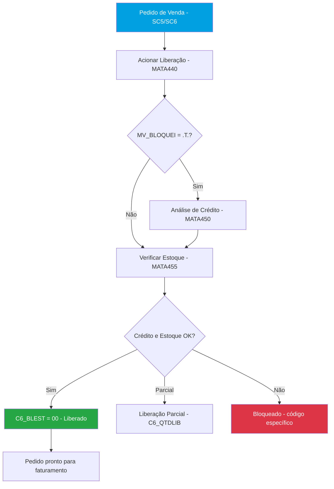
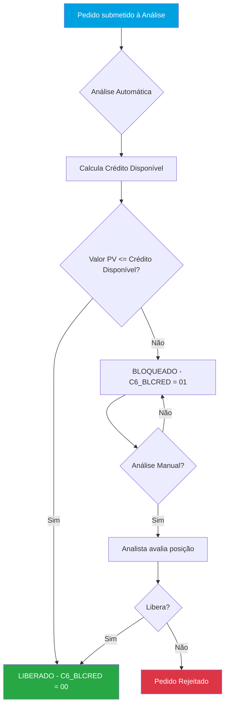
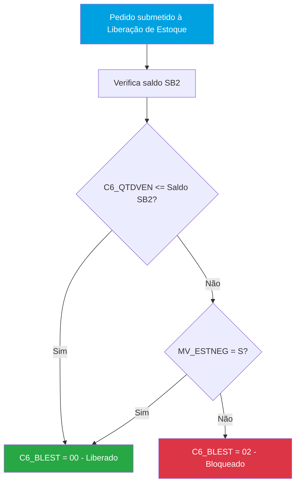
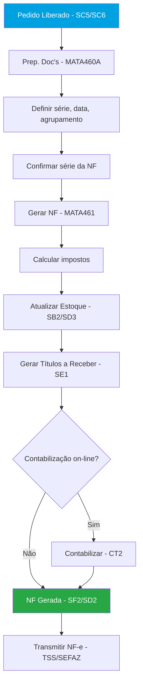
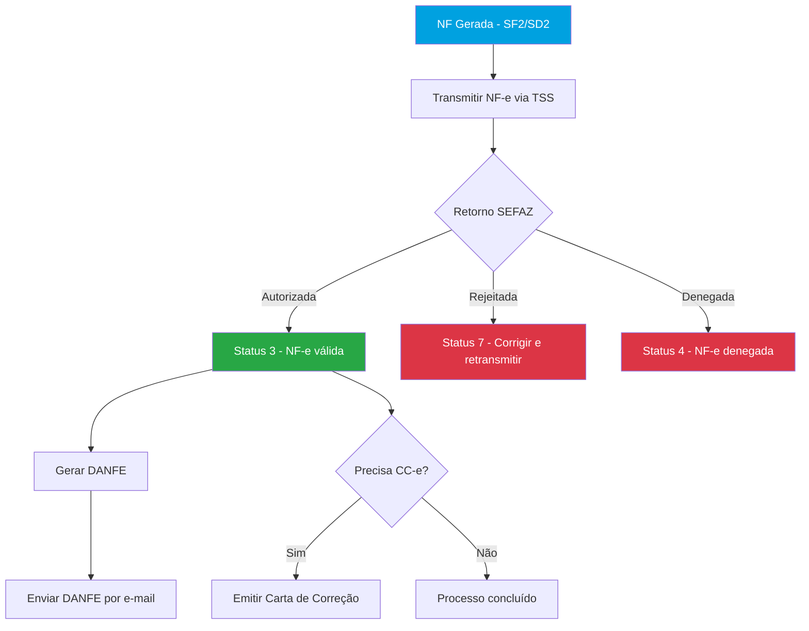
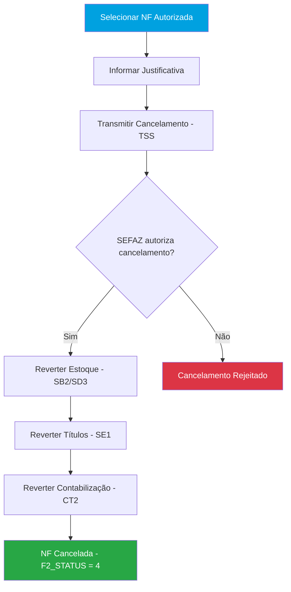
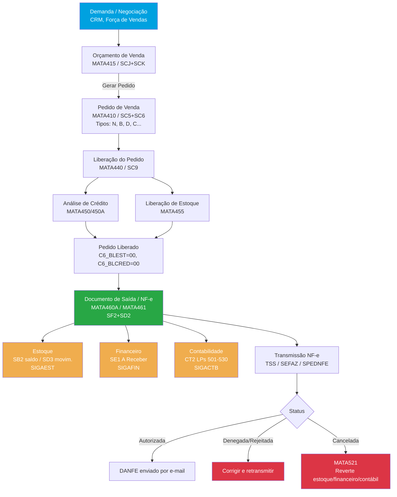

# SIGAFAT – Fluxo Completo de Faturamento no Protheus

> Versão de referência: Protheus 12.1.2x | Módulo: SIGAFAT
> Última atualização: 2026-03-20

---

## Sumário

1. [Objetivo do Módulo](#1-objetivo-do-módulo)
2. [Parametrização Geral do Módulo](#2-parametrização-geral-do-módulo)
3. [Cadastros Fundamentais](#3-cadastros-fundamentais)
4. [Rotinas](#4-rotinas)
   - 4.1 [Orçamento de Venda — MATA415](#41-orçamento-de-venda--mata415)
   - 4.2 [Pedido de Venda — MATA410](#42-pedido-de-venda--mata410)
   - 4.3 [Liberação de Pedido — MATA440](#43-liberação-de-pedido--mata440)
   - 4.4 [Análise de Crédito — MATA450/MATA450A](#44-análise-de-crédito--mata450mata450a)
   - 4.5 [Liberação de Estoque — MATA455](#45-liberação-de-estoque--mata455)
   - 4.6 [Documento de Saída / NF-e — MATA460A/MATA461](#46-documento-de-saída--nf-e--mata460amata461)
   - 4.7 [Transmissão NF-e — SEFAZ](#47-transmissão-nf-e--sefaz)
   - 4.8 [Cancelamento e Exclusão de NF — MATA521](#48-cancelamento-e-exclusão-de-nf--mata521)
5. [Contabilização](#5-contabilização)
6. [Tipos e Classificações](#6-tipos-e-classificações)
7. [Tabelas do Módulo](#7-tabelas-do-módulo)
8. [Fluxo Geral do Módulo](#8-fluxo-geral-do-módulo)
9. [Integrações com Outros Módulos](#9-integrações-com-outros-módulos)
10. [Controles Especiais](#10-controles-especiais)
    - 10.1 [Controle de Crédito](#101-controle-de-crédito)
    - 10.2 [TES — Tipo de Entrada/Saída no Faturamento](#102-tes--tipo-de-entradasaída-no-faturamento)
    - 10.3 [Tabela de Preços e Descontos](#103-tabela-de-preços-e-descontos)
    - 10.4 [Comissão de Vendedores](#104-comissão-de-vendedores)
    - 10.5 [Devoluções](#105-devoluções)
13. [Referências](#13-referências)
14. [Enriquecimentos](#14-enriquecimentos)

---

## 1. Objetivo do Módulo

O **SIGAFAT** (Faturamento) é o módulo do Protheus responsável pelo ciclo de vendas da empresa: desde o orçamento comercial até a emissão e transmissão da Nota Fiscal de Saída (NF-e), com integração completa ao estoque, financeiro e fiscal.

**Objetivos principais:**
- Cadastro e gestão de pedidos de venda com controle de status
- Análise e liberação de crédito de clientes
- Controle de disponibilidade de estoque para faturamento
- Geração do Documento de Saída (NF-e) com cálculo automático de impostos
- Transmissão eletrônica de NF-e via TSS/SEFAZ
- Integração com Estoque (SIGAEST), Financeiro (SIGAFIN), Fiscal (SIGAFIS) e Contabilidade (SIGACTB)

**Sigla:** SIGAFAT
**Menu principal:** Atualizações > Faturamento
**Integra com:** SIGAEST (estoque), SIGAFIN (financeiro), SIGAFIS (fiscal), SIGACTB (contábil), SIGAPCP (produção), SIGAVENDA (CRM)

**Nomenclatura dos módulos relacionados:**

| Sigla | Módulo |
|---|---|
| SIGAFAT | Faturamento |
| SIGAVENDA | Gestão de Vendas (CRM / Força de Vendas) |
| SIGAEST | Estoque e Custos |
| SIGAFIN | Financeiro |
| SIGAFIS | Livros Fiscais |
| SIGACTB | Contabilidade Gerencial |

---

## 2. Parametrização Geral do Módulo

Parâmetros MV_ que afetam o módulo como um todo (não específicos de uma rotina).

| Parâmetro | Descrição | Padrão | Tipo | Impacto |
|-----------|-----------|--------|------|---------|
| `MV_ESTADO` | UF da empresa | SP | C(2) | Cálculo fiscal em todas as rotinas |
| `MV_ICMSST` | Utiliza ICMS-ST nas saídas | | L | Afeta cálculo de ICMS-ST em todas as NFs |
| `MV_DIFAL` | Calcula DIFAL (Diferencial de Alíquota) | | L | Afeta cálculo fiscal em operações interestaduais |
| `MV_PISVEND` | Calcula PIS nas saídas | | L | Afeta cálculo de PIS em todas as NFs |
| `MV_COFVEND` | Calcula COFINS nas saídas | | L | Afeta cálculo de COFINS em todas as NFs |
| `MV_IPIINCL` | IPI incluso no preço | | L | Afeta cálculo de IPI em todas as NFs |
| `MV_TIPOPER` | Tipo de operação padrão no pedido | N | C | Define tipo de operação padrão para todos os pedidos |
| `MV_IFATDPR` | Integração Faturamento x Desenvolvimento de Produtos | N | L | Integração entre módulos |
| `MV_LIMFTAL` | Limite para clientes não contribuintes (AL) | | C | Regra fiscal específica por estado |

> ⚠️ **Atenção:** Alteração de parâmetros globais afeta TODAS as rotinas do módulo.
> Teste em ambiente de homologação antes de alterar em produção.

---

## 3. Cadastros Fundamentais

Antes de operar o fluxo de faturamento, os seguintes cadastros devem estar configurados:

### 3.1 Clientes — MATA030/CRMA980 (SA1)

**Menu:** Atualizações > Cadastros > Clientes
**Tabela:** `SA1` — Cadastro de Clientes

Cadastro principal de clientes com dados fiscais, limite de crédito e risco.

| Campo | Descrição | Observação |
|---|---|---|
| `A1_COD` | Código do Cliente | Chave primária |
| `A1_LOJA` | Loja do Cliente | Complementa a chave |
| `A1_LC` | Limite de Crédito | Usado na análise de crédito |
| `A1_RISCO` | Risco do Cliente (A-E) | Determina comportamento na liberação |
| `A1_EMAIL` | E-mail | Envio de DANFE |
| `A1_CGC` | CNPJ/CPF do Cliente | Documento fiscal (F=CPF, J=CNPJ) |
| `A1_INSCR` | Inscrição Estadual | Obrigatório para contribuintes |
| `A1_INSCM` | Inscrição Municipal | Usado para ISS/NFS-e |
| `A1_PESSOA` | Tipo de Pessoa (F/J) | F=Física, J=Jurídica |
| `A1_SUFRAMA` | Inscrição SUFRAMA | Zona Franca de Manaus |
| `A1_COD_MUN` | Código do Município | IBGE, usado na NF-e |
| `A1_END` | Endereço do Cliente | Logradouro |
| `A1_BAIRRO` | Bairro | Bairro do endereço |
| `A1_MUN` | Município | Nome do município |
| `A1_EST` | Estado | UF (2 caracteres) |
| `A1_CEP` | CEP | Código postal |
| `A1_NUM` | Número | Número do endereço |
| `A1_COMP` | Complemento | Complemento do endereço |
| `A1_ULTCOM` | Data da última compra do cliente | Atualizado automaticamente pelo sistema ao faturar pedido/NF de venda |
| `A1_PRICOM` | Data da primeira compra do cliente | Preenchido automaticamente na primeira venda faturada |

### 3.2 Produtos — MATA010 (SB1)

**Menu:** Atualizações > Cadastros > Produtos
**Tabela:** `SB1` — Cadastro de Produtos

| Campo | Descrição | Observação |
|---|---|---|
| `B1_COD` | Código do Produto | Chave primária |
| `B1_DESC` | Descrição | |
| `B1_TS` | Tipo de Saída (TES) | TES padrão do produto |
| `B1_UM` | Unidade de Medida | |
| `B1_GRUPO` | Grupo do Produto | |

### 3.3 TES — MATA061 (SF4/SX5)

**Tabela:** `SF4` / `SX5` — Tipo de Entrada/Saída

Define impostos, estoque, financeiro para cada operação.

### 3.4 Condições de Pagamento — MATA360 (SE4)

**Tabela:** `SE4` — Condições de Pagamento

Tipos 1 a 9, parcelamento, adiantamento.

### 3.5 Tabela de Preços — MATA116/MATC102 (DA0/DA1)

**Tabela:** `DA0` (cabeçalho) / `DA1` (itens) — Tabelas de Preços

Preços por produto/cliente/grupo.

### 3.6 Vendedores — MATA080 (SA3)

**Tabela:** `SA3` — Cadastro de Vendedores

Código, comissão, supervisor.

### 3.7 Transportadoras — MATA050 (SA4)

**Tabela:** `SA4` — Cadastro de Transportadoras

Frete, RNTRC.

### 3.8 Natureza Financeira — MATA070 (SED)

**Tabela:** `SED` — Naturezas Financeiras

Classificação de títulos a receber.

### 3.9 Produtos x Clientes — MATA370 (SBZ)

**Tabela:** `SBZ` — Produtos x Clientes

Histórico de preços por cliente.

### 3.10 Séries de NF — SX5 tabela 01

**Tabela:** `SX5` — Série e numeração das notas fiscais.

### 3.11 Certificado Digital — TSS

Para transmissão NF-e/NFS-e.

---

## 4. Rotinas

### 4.1 Orçamento de Venda — MATA415

**Objetivo:** Documento inicial do processo comercial, representando uma proposta ao cliente antes da confirmação da venda.
**Menu:** Atualizações > Pedidos > Orçamentos de Venda
**Tipo:** Inclusão / Manutenção

#### Tabelas

| Tabela | Alias | Descrição | Tipo |
|--------|-------|-----------|------|
| SCJ | SCJ | Cabeçalho do Orçamento de Venda | Principal |
| SCK | SCK | Itens do Orçamento de Venda | Principal |

#### Campos Principais — SCJ (cabeçalho)

| Campo | Descrição | Tipo | Obrigatório | Validação/Observação |
|-------|-----------|------|-------------|---------------------|
| `CJ_NUM` | Número do Orçamento | C | Sim | Automático |
| `CJ_CLIENT` | Código do Cliente | C | Sim | ExistCpo("SA1") |
| `CJ_LOJA` | Loja do Cliente | C | Sim | |
| `CJ_EMISSAO` | Data de Emissão | D | Sim | |
| `CJ_VALIDA` | Data de Validade | D | | |
| `CJ_CONDPAG` | Condição de Pagamento | C | | |
| `CJ_STATUS` | Status | C | | vazio=Aberto, B=Gerou Pedido |
| `CJ_VEND1` | Código do Vendedor | C | | |
| `CJ_TOTAL` | Valor Total | N | | |

#### Status / Tipos

| Valor (CJ_STATUS) | Descrição | Comportamento |
|--------------------|-----------|---------------|
| (vazio) | Em aberto | Orçamento disponível para conversão |
| B | Pedido já gerado | Orçamento bloqueado, pedido criado em SC5 |

**Conversão em Pedido:**
Via botão "Gerar Pedido" na rotina `MATA415`. O orçamento passa para status `B` (bloqueado) e é criado automaticamente o Pedido de Venda na tabela SC5.

**Planilha Financeira:** Ponto de Entrada `A415PLAN` permite manipular a planilha financeira na tela de orçamento.

#### Parâmetros MV_ desta Rotina

> ⚠️ A verificar — não há parâmetros MV_ específicos documentados para esta rotina.

#### Pontos de Entrada

| Ponto de Entrada | Momento de Execução | Descrição | Parâmetros |
|-----------------|---------------------|-----------|------------|
| `A415LIOK` | Validação | Validação do processo de orçamento de venda | - |
| `A415PLAN` | Tela | Planilha financeira na rotina de orçamentos | - |
| `A415TBPR` | Tela | Tabela de preços da proposta comercial | - |
| `MT415PC` | Processamento | Orçamento de venda — número de parcelas x compras do cliente | - |
| `MA415OPOR` | Processamento | Manipula informações do orçamento a partir da oportunidade de venda | - |
| `MA415RVP` | Tela | Altera valores ou inibe demonstração de valores | - |

#### Fluxo da Rotina



---

### 4.2 Pedido de Venda — MATA410

**Objetivo:** Documento central do faturamento. Representa a confirmação formal da venda ao cliente.
**Menu:** Atualizações > Pedidos > Pedido de Venda
**Tipo:** Inclusão / Manutenção

#### Tabelas

| Tabela | Alias | Descrição | Tipo |
|--------|-------|-----------|------|
| SC5 | SC5 | Cabeçalho do Pedido de Venda | Principal |
| SC6 | SC6 | Itens do Pedido de Venda | Principal |

#### Campos Principais — SC5 (cabeçalho)

| Campo | Descrição | Tipo | Obrigatório | Validação/Observação |
|-------|-----------|------|-------------|---------------------|
| `C5_NUM` | Número do Pedido | C | Sim | Automático |
| `C5_TIPO` | Tipo do Pedido | C | Sim | N, B, D, C, L, M... |
| `C5_CLIENT` | Código do Cliente | C | Sim | ExistCpo("SA1") |
| `C5_LOJACLI` | Loja do Cliente | C | Sim | |
| `C5_EMISSAO` | Data de Emissão | D | Sim | |
| `C5_FECENT` | Data de Entrega | D | | |
| `C5_CONDPAG` | Condição de Pagamento | C | | |
| `C5_VEND1` | Vendedor Principal | C | | |
| `C5_VEND2` | Vendedor Secundário | C | | |
| `C5_VEND3` | Vendedor Terciário | C | | |
| `C5_TABELA` | Tabela de Preços | C | | |
| `C5_TRANSP` | Transportadora | C | | |
| `C5_TPFRETE` | Tipo de Frete | C | | C=CIF / F=FOB |
| `C5_TOTAL` | Valor Total do Pedido | N | | |
| `C5_LIBEROK` | Flag de Liberação | C | | |
| `C5_NOTA` | Número da NF gerada | C | | |
| `C5_TIPOCLI` | Tipo de Cliente | C | | F=Final, R=Revenda |
| `C5_MENNOTA` | Mensagem na NF | C | | |
| `C5_OBS` | Observações | C | | |

#### Campos Principais — SC6 (itens)

| Campo | Descrição | Tipo | Obrigatório | Validação/Observação |
|-------|-----------|------|-------------|---------------------|
| `C6_ITEM` | Sequencial do item | C | Sim | |
| `C6_PRODUTO` | Código do Produto | C | Sim | ExistCpo("SB1") |
| `C6_DESCRI` | Descrição | C | | |
| `C6_QTDVEN` | Quantidade Vendida | N | Sim | > 0 |
| `C6_QTDLIB` | Quantidade Liberada para faturamento | N | | |
| `C6_PRCVEN` | Preço Unitário de Venda | N | Sim | |
| `C6_TOTAL` | Total do Item | N | | |
| `C6_TES` | Tipo de Saída | C | | |
| `C6_LOCAL` | Armazém de saída | C | | |
| `C6_DESC1` | % Desconto item | N | | |
| `C6_BLEST` | Código de bloqueio de estoque | C | | |
| `C6_BLCRED` | Código de bloqueio de crédito | C | | |
| `C6_BLQ` | Bloqueio manual | C | | |
| `C6_NFISCAL` | Número da NF gerada | C | | |

#### Status / Tipos

| Cor | Status | Condição |
|---|---|---|
| Verde | Em Aberto | Não submetido à liberação (C5_LIBEROK em branco) |
| Amarelo | Liberado Parcialmente | Alguns itens liberados |
| Vermelho | Encerrado/Faturado | 100% faturado ou resíduo eliminado (C5_NOTA preenchido) |
| Cinza | Cancelado | Pedido cancelado |

#### Parâmetros MV_ desta Rotina

| Parâmetro | Descrição | Padrão | Tipo | Quando usar |
|-----------|-----------|--------|------|-------------|
| `MV_AGRUPAR` | Agrupa pedidos em uma única NF | S | L | Quando deseja agrupar pedidos do mesmo cliente |
| `MV_ALTERPC` | Permite alterar pedido já faturado | N | L | Quando precisa alterar pedidos após faturamento |
| `MV_REQPV` | Exige solicitação para o pedido de venda | N | L | Quando todo PV deve ter solicitação prévia |
| `MV_TESVEND` | TES padrão para vendas de produtos | | C | Define TES padrão para itens de venda |
| `MV_TESSERV` | TES padrão para serviços/RPS | | C | Define TES padrão para itens de serviço |

#### Pontos de Entrada

| Ponto de Entrada | Momento de Execução | Descrição | Parâmetros |
|-----------------|---------------------|-----------|------------|
| `MT410BRW` | Antes do Browse | Antes da chamada da função de Browse | - |
| `M410ALOK` | Antes alteração | Antes da alteração do pedido de venda | - |
| `M410GET` | Antes da tela | Antes de montar a tela de alteração de pedidos | - |
| `MT410INC` | Antes de gravar | Após preenchimento dos campos, antes de gravar (inclusão) | - |
| `MTA410T` | Após gravação SC5 | Após a atualização dos registros no SC5 | - |
| `MTA410I` | Após gravação SC6 | Após gravação do SC6 (itens do pedido) | - |
| `MA410DEL` | Na exclusão | Na chamada da função de exclusão dos registros do SC5 | - |
| `A410BONU` | Na bonificação | Na função que trata a regra de bonificação | - |
| `A410BLCO` | Na bonificação | Alteração da linha do aCols dos itens bonificados | - |
| `A410RNF` | Na devolução | Alterar filtro de pesquisa de NFs de entrada na devolução | - |
| `MA410BOM` | Na estrutura | Inclusão de produtos na estrutura do pedido | - |
| `MA410COR` | Na tela | Alterar cores do cadastro de status do pedido | - |
| `M410VCT` | Na planilha | Alteração das duplicatas na planilha financeira | - |
| `M410FLDR` | Na tela | Inibir o folder Rentabilidade | - |
| `M410PLNF` | No cabeçalho | Após indicação dos valores do cabeçalho | - |
| `M410TIP9` | Na validação | Na entrada da função de validação da condição de pagamento Tipo 9 | - |
| `A410TAB` | No preço | Na função que retorna o preço de lista considerando grade de produtos | - |
| `MTA410BR` | Na validação | Na validação do código do produto ou código de barras | - |
| `GEM410PV` | Na cópia | Copia condição de venda vinculada à condição de pagamento | - |
| `MAAVSC5` | Após avaliação | Após execução da rotina de avaliação dos eventos do cabeçalho do PV | - |

#### Fluxo da Rotina



---

### 4.3 Liberação de Pedido — MATA440

**Objetivo:** Processo que submete o pedido à análise de crédito e reserva de estoque.
**Menu:** Atualizações > Faturamento > Liberação de Pedido de Venda
**Tipo:** Processamento

#### Tabelas

| Tabela | Alias | Descrição | Tipo |
|--------|-------|-----------|------|
| SC9 | SC9 | Pedidos Liberados / Em Liberação | Principal |
| SC5 | SC5 | Cabeçalho do Pedido de Venda | Complementar |
| SC6 | SC6 | Itens do Pedido de Venda | Complementar |

**Processo:**
1. Usuário aciona "Liberar" no pedido
2. Sistema verifica crédito (`MATA450`) e estoque (`MATA455`)
3. Itens aprovados ficam com `C6_BLEST = 00` (liberado)
4. Itens bloqueados ficam com código de bloqueio específico

#### Status / Tipos — Códigos de Bloqueio (C6_BLEST / C6_BLCRED)

| Código | Descrição | Comportamento |
|--------|-----------|---------------|
| 00 | Liberado | Item disponível para faturamento |
| 01 | Bloqueio de crédito | Aguarda liberação de crédito |
| 02 | Bloqueio de estoque | Aguarda disponibilidade de estoque |
| 03 | Bloqueio de crédito e estoque | Ambos os bloqueios ativos |
| 04 | Bloqueio manual | Bloqueado manualmente pelo usuário |
| 05 | Bloqueio por regra | Bloqueado por regra customizada |
| 10 | Pedido faturado | Não pode ser desbloqueado manualmente |

**Liberação parcial:**
Possível via campo `C6_QTDLIB` — altera a quantidade liberada sem encerrar o pedido. O pedido permanece "Em Aberto" na `MATA410` até ser totalmente faturado.

#### Parâmetros MV_ desta Rotina

| Parâmetro | Descrição | Padrão | Tipo | Quando usar |
|-----------|-----------|--------|------|-------------|
| `MV_BLOQUEI` | Submete liberações à análise de crédito | .T. | L | Quando precisa de análise de crédito automática |
| `MV_GRVBLQ2` | Gera nova liberação bloqueada na liberação parcial | N | L | Quando liberação parcial deve gerar novo bloqueio |

#### Pontos de Entrada

| Ponto de Entrada | Momento de Execução | Descrição | Parâmetros |
|-----------------|---------------------|-----------|------------|
| `A440BUT` | Na tela | Criação de botões na rotina de Liberação de Pedidos de Venda | - |

#### Fluxo da Rotina



---

### 4.4 Análise de Crédito — MATA450/MATA450A

**Objetivo:** Avalia a situação financeira do cliente para liberar ou bloquear o pedido.
**Menu:** Atualizações > Faturamento > Análise de Crédito
**Tipo:** Processamento

**Rotinas:**
- `MATA450` — Análise por pedido
- `MATA450A` — Análise por cliente (multi-pedido, multi-filial)

#### Tabelas

| Tabela | Alias | Descrição | Tipo |
|--------|-------|-----------|------|
| SA1 | SA1 | Clientes (limite, risco, saldos) | Principal |
| SC5 | SC5 | Cabeçalho do Pedido de Venda | Complementar |
| SE1 | SE1 | Títulos a Receber | Complementar |

**Fórmula de avaliação automática:**

```
Crédito Disponível = A1_LC (limite cadastrado)
                   - A1_SALPEDL (pedidos já liberados)
                   - A1_SALDUP (títulos em aberto)

Se valor do pedido > Crédito Disponível → BLOQUEADO por crédito
```

**Observações importantes:**
- Títulos do tipo NCC e RA (notas de crédito/recibo de adiantamento) alimentam `A1_SALDUP` como **negativos** (são créditos do cliente, não débitos)
- A liberação **Automática** respeita todas as configurações
- A liberação **Manual** ignora as configurações e força a liberação (deve ser usada com cautela)
- A liberação por cliente (`MATA450A`) funciona mesmo com SA1 compartilhada e SC5/SC6 exclusivas

**Análise Manual (quando automática bloqueia):**
1. Posicionar no cliente desejado
2. Selecionar "Manual"
3. Sistema exibe: dados do cliente, risco, limite, vencimento do limite
4. Abas: **Posição** (consulta financeira), **Pedidos** (pedidos liberados), **Condições** (forma de liberação)
5. Opções: "Libera" ou "Rejeita"

#### Parâmetros MV_ desta Rotina

| Parâmetro | Descrição | Padrão | Tipo | Quando usar |
|-----------|-----------|--------|------|-------------|
| `MV_BLOQUEI` | Submete liberações à análise de crédito | .T. | L | Ativa a análise de crédito automática |
| `MV_CREDCLI` | Controle por loja (L) ou por cliente (C) | C | C | Define granularidade da análise de crédito |
| `MV_LIBNODP` | Avalia crédito para pedido sem duplicata | N | L | Quando pedidos sem financeiro devem ser avaliados |
| `MV_BLOQCRED` | Bloqueia crédito junto com bloqueio de estoque | N | L | Quando bloqueio de estoque deve impactar crédito |

#### Pontos de Entrada

| Ponto de Entrada | Momento de Execução | Descrição | Parâmetros |
|-----------------|---------------------|-----------|------------|
| `MAAVSC5` | Após avaliação padrão | Permite regra customizada de crédito após avaliação padrão do sistema | - |

#### Fluxo da Rotina



---

### 4.5 Liberação de Estoque — MATA455

**Objetivo:** Verifica a disponibilidade de produtos para atender o pedido.
**Menu:** Atualizações > Faturamento > Liberação de Estoque
**Tipo:** Processamento

#### Tabelas

| Tabela | Alias | Descrição | Tipo |
|--------|-------|-----------|------|
| SB2 | SB2 | Saldo em Estoque | Principal |
| SC6 | SC6 | Itens do Pedido de Venda | Complementar |

**Processo:**
1. Sistema compara `C6_QTDVEN` com saldo disponível em `SB2`
2. Se há estoque → libera (`C6_BLEST = 00`)
3. Se não há → bloqueia (`C6_BLEST = 02`)
4. Pedido com bloqueio de estoque **não pode ser faturado**

#### Parâmetros MV_ desta Rotina

| Parâmetro | Descrição | Padrão | Tipo | Quando usar |
|-----------|-----------|--------|------|-------------|
| `MV_BLOQUEI` | Submete liberações à aprovação de crédito | .T. | L | Se `.T.`, submete todas as liberações |
| `MV_GRVBLQ2` | Gera nova liberação bloqueada na parcial | N | L | Se liberação parcial, gera nova liberação bloqueada |
| `MV_QEMPV` | Considera empenhado para produção como indisponível | N | L | Quando quantidade empenhada deve ser descontada |
| `MV_BLOQCRED` | Bloqueia crédito quando há bloqueio de estoque | N | L | Quando bloqueio de estoque impacta crédito |
| `MV_ESTNEG` | Permite estoque negativo | N | L | Quando aceita faturar mesmo sem saldo |

#### Pontos de Entrada

| Ponto de Entrada | Momento de Execução | Descrição | Parâmetros |
|-----------------|---------------------|-----------|------------|
| `MTA455E` | Na liberação | Validação da liberação "automática" de bloqueio de estoque | - |

#### Fluxo da Rotina



---

### 4.6 Documento de Saída / NF-e — MATA460A/MATA461

**Objetivo:** Geração da Nota Fiscal de Saída (NF-e) a partir do pedido liberado.
**Menu:** Atualizações > Faturamento > Documento de Saída
**Tipo:** Processamento

#### Tabelas

| Tabela | Alias | Descrição | Tipo |
|--------|-------|-----------|------|
| SF2 | SF2 | Cabeçalho da NF de Saída | Principal |
| SD2 | SD2 | Itens da NF de Saída | Principal |
| SC5 | SC5 | Cabeçalho do Pedido (origem) | Complementar |
| SC6 | SC6 | Itens do Pedido (origem) | Complementar |
| SE1 | SE1 | Títulos a Receber (gerado) | Complementar |
| SB2 | SB2 | Saldo em Estoque (atualizado) | Complementar |
| SD3 | SD3 | Movimentação de Estoque (gerada) | Complementar |
| CT2 | CT2 | Lançamentos Contábeis (gerado) | Complementar |

#### Campos Principais — SF2 (cabeçalho NF saída)

| Campo | Descrição | Tipo | Obrigatório | Validação/Observação |
|-------|-----------|------|-------------|---------------------|
| `F2_DOC` | Número da NF | C | Sim | Automático |
| `F2_SERIE` | Série da NF | C | Sim | |
| `F2_CLIENTE` | Cliente | C | Sim | |
| `F2_LOJA` | Loja do Cliente | C | Sim | |
| `F2_EMISSAO` | Data de Emissão | D | Sim | |
| `F2_CHVNFE` | Chave NFe (44 dígitos) | C | | Gerada automaticamente |
| `F2_TIPNF` | Tipo da NF | C | | |
| `F2_VALBRUT` | Valor Bruto Total | N | | |
| `F2_VALFRE` | Valor do Frete | N | | |
| `F2_VALIPI` | Valor do IPI | N | | |
| `F2_VALICM` | Valor do ICMS | N | | |
| `F2_PICM` | % ICMS | N | | |
| `F2_VALPIS` | Valor PIS | N | | |
| `F2_VALCOF` | Valor COFINS | N | | |
| `F2_ICMSST` | Valor ICMS-ST | N | | |
| `F2_MENNOTA` | Mensagem na NF | C | | |
| `F2_STATUS` | Status da NF | C | | 0=Normal, 4=Cancelada... |
| `F2_XSTATUS` | Status NFe | C | | autorizada, denegada, etc. |

#### Campos Principais — SD2 (itens NF saída)

| Campo | Descrição | Tipo | Obrigatório | Validação/Observação |
|-------|-----------|------|-------------|---------------------|
| `D2_COD` | Código do Produto | C | Sim | |
| `D2_DESCRI` | Descrição | C | | |
| `D2_QUANT` | Quantidade | N | Sim | |
| `D2_PRCVEN` | Preço Unitário | N | Sim | |
| `D2_TOTAL` | Total do Item | N | | |
| `D2_TES` | Tipo de Saída | C | | |
| `D2_LOCAL` | Armazém de saída | C | | |
| `D2_PEDIDO` | Número do Pedido vinculado | C | | |
| `D2_ITEMPED` | Item do Pedido | C | | |
| `D2_PICM` | % ICMS | N | | |
| `D2_VALICM` | Valor ICMS | N | | |
| `D2_IPI` | Valor IPI | N | | |
| `D2_PPISVL` | % PIS | N | | |
| `D2_VALPIS` | Valor PIS | N | | |
| `D2_PCOFINS` | % COFINS | N | | |
| `D2_VALCOF` | Valor COFINS | N | | |

**Etapas da geração:**
1. Selecionar o(s) pedido(s) liberado(s)
2. Clicar em **"Prep. Doc's"** (preparar documentos)
3. Definir parâmetros: série, data de emissão, agrupamento
4. Confirmar série da NF
5. Sistema gera NF, calcula impostos, atualiza estoque e financeiro

**O que acontece ao gerar o Documento de Saída:**
- Cálculo das datas de vencimento (condição de pagamento)
- Cálculo dos impostos (IPI, ICMS, PIS, COFINS, ICMS-ST, ISS)
- Cálculo de preços, descontos e reajustes
- **Atualização do estoque** (SB2 → débito, SD3 → movimentação)
- **Geração de títulos a receber** (SE1)
- Registro em movimentos de venda (para estatísticas, SPED, custos)
- Contabilização (CT2) se configurado on-line
- Atualização de Produtos x Clientes (SBZ) com último preço praticado

**Agrupamento de pedidos em uma NF:**
É possível agrupar múltiplos pedidos do mesmo cliente em uma única NF, desde que tenham a mesma série, TES, condição de pagamento e transportadora. Controlado pelo parâmetro `MV_AGRUPAR`.

#### Parâmetros MV_ desta Rotina

| Parâmetro | Descrição | Padrão | Tipo | Quando usar |
|-----------|-----------|--------|------|-------------|
| `MV_TPNRNFS` | Tipo de numeração do Documento de Saída | | C | Define regra de numeração |
| `MV_NFISCAL` | Série padrão da NF de saída | | C | Série padrão utilizada |
| `MV_SERNFSI` | Série inicial para controle de numeração | | C | Controle de séries |
| `MV_NOTA` | Gera duplicata na emissão da NF | | L | Geração automática de títulos |
| `MV_ATUVLNF` | Atualiza preço no cadastro Produtos x Clientes | | L | Manter histórico de preços |
| `MV_NFEVAL` | Valida NF na SEFAZ | | L | Validação prévia antes da transmissão |
| `MV_1DUPNFE` | Bloqueia NF duplicada | | L | Prevenir duplicidade de NFs |
| `MV_AGRUPAR` | Agrupa pedidos em uma única NF | S | L | Agrupar pedidos do mesmo cliente |

#### Pontos de Entrada

| Ponto de Entrada | Momento de Execução | Descrição | Parâmetros |
|-----------------|---------------------|-----------|------------|
| `CHGX5FIL` | Na série | Utiliza tabela 01 exclusiva em SX5 compartilhada (controle de séries) | - |
| `F040FRT` | No cálculo | Manipulação de filiais no cálculo de impostos | - |
| `F440COM` | Na comissão | Cálculo da comissão para títulos de adiantamento | - |
| `FATTRAVSA1` | Na trava | Trava/Destrava os registros da tabela SA1 | - |
| `MTASF2` | Após SF2 | Geração de registros em SF2 (executado após atualização de campos) | - |
| `MTAITNFS` | Na NF | Altera número máximo de itens por NF | - |
| `SX5NOTA` | Na validação | Validar séries de NFs de saída | - |
| `M461LEG` | No Browse | Alteração dos títulos das legendas do Browse | - |
| `M461SLD` | Na validação | Valida saldo de produtos de Lote/Endereço | - |
| `F040TRVSA1` | Na trava | Trava/Destrava registros da SA1 na rotina de Clientes (MATA030) | - |

#### Fluxo da Rotina



---

### 4.7 Transmissão NF-e — SEFAZ

**Objetivo:** Transmitir a NF-e gerada à SEFAZ via TSS (TOTVS Service SOA) para autorização.
**Menu:** Atualizações > NF-e e NFS-e > NF-e SEFAZ
**Tipo:** Processamento

**Rotina:** `SPEDNFE`

#### Status de transmissão

| Status | Descrição | Comportamento |
|--------|-----------|---------------|
| 0 | Não transmitida | Aguardando envio |
| 1 | Aguardando transmissão | Em fila de envio |
| 2 | Aguardando retorno do lote | Enviada, aguarda processamento |
| 3 | Autorizada | NF-e válida |
| 4 | Denegada | NF-e denegada pela SEFAZ |
| 5 | Cancelada | NF-e cancelada |
| 6 | Inutilizada | Numeração inutilizada |
| 7 | Rejeitada | NF-e rejeitada pela SEFAZ |

**DANFE:**
- Gerado automaticamente após autorização
- Envio por e-mail via TSS (configurar no Cadastro de Clientes `A1_EMAIL`)
- Parâmetro para envio automático via ERP: rotina `SPEDNFE` com configuração de e-mail no TSS

**Carta de Correção Eletrônica (CC-e):**
Para correções que não implicam cancelamento, emitida via rotina de CC-e integrada ao TSS.

**Cancelamento:**
Prazo de 24h após autorização (ou conforme legislação vigente). Realizado via `MATA521` + TSS.

#### Fluxo da Rotina



---

### 4.8 Cancelamento e Exclusão de NF — MATA521

**Objetivo:** Cancelar NF-e autorizada na SEFAZ e reverter os impactos no sistema.
**Menu:** Atualizações > NF-e e NFS-e > Cancelamento NF-e
**Tipo:** Processamento

**Processo:**
1. Selecionar NF autorizada
2. Informar justificativa de cancelamento (mínimo 15 caracteres)
3. Transmitir cancelamento via TSS
4. SEFAZ retorna autorização do cancelamento
5. Sistema reverte: estoque, títulos a receber e contabilização

> ⚠️ **Atenção:** NFs autorizadas pela SEFAZ e excluídas indevidamente do sistema (sem cancelamento) exigem procedimento especial de restauração.

#### Parâmetros MV_ desta Rotina

> ⚠️ A verificar — não há parâmetros MV_ específicos documentados para esta rotina além dos parâmetros globais de NF-e.

#### Pontos de Entrada

| Ponto de Entrada | Momento de Execução | Descrição | Parâmetros |
|-----------------|---------------------|-----------|------------|
| `M521TRAN` | Na transmissão | Valida transmissão de cancelamento de NF de Saída | - |

#### Fluxo da Rotina



---

## 5. Contabilização

A contabilização pode ocorrer de duas formas:

### 5.1 Modo de Contabilização

| Modo | Descrição | Parâmetro |
|------|-----------|-----------|
| On-line | Contabiliza automaticamente ao gerar o Documento de Saída | Configurado na TES (`F4_CTASAIDA`) e nos Lançamentos Padrão |
| Off-line | Contabilização em lote posterior | Rotina `CTBANFE` — Miscelânea > Contabilização Off-Line |

> ⚠️ **Atenção:** Usuários que utilizam recálculo de custo médio **não devem** ativar a contabilização on-line de custo.

### 5.2 Lançamentos Padrão (LP)

| Código LP | Descrição | Rotina | Débito | Crédito |
|-----------|-----------|--------|--------|---------|
| 501 | Vendas — receita bruta | MATA460A/MATA461 | Clientes (SA1) | Receita de Vendas |
| 510 | IPI sobre vendas | MATA460A/MATA461 | IPI s/ Vendas | IPI a Recolher |
| 515 | ICMS sobre vendas | MATA460A/MATA461 | ICMS s/ Vendas | ICMS a Recolher |
| 516 | PIS sobre vendas | MATA460A/MATA461 | PIS s/ Vendas | PIS a Recolher |
| 517 | COFINS sobre vendas | MATA460A/MATA461 | COFINS s/ Vendas | COFINS a Recolher |
| 520 | Custo dos produtos vendidos (CMV) | MATA460A/MATA461 | CMV | Estoque (SB2) |
| 530 | Comissão de vendas | MATA460A/MATA461 | Comissão s/ Vendas | Comissão a Pagar |

> **Nota:** LPs são configurados em `CTBA080`. Cada LP pode ter múltiplas linhas
> com fórmulas que referenciam campos do documento.

---

## 6. Tipos e Classificações

### 6.1 Tipos de Pedido de Venda

O campo `C5_TIPO` define o comportamento do pedido no sistema:

| Código/Tipo | Descrição | Comportamento | Uso típico |
|-------------|-----------|---------------|------------|
| N | Normal | Venda padrão de mercadorias/serviços | Vendas regulares |
| B | Bonificação | Gera NF sem cobrança (TES sem financeiro) | Brindes, amostras |
| D | Devolução de Compras | Exige NF de origem. Gera NF de saída para devolver ao fornecedor | Devoluções |
| C | Complemento de Preço | Quantidade zero, complementa valor de NF anterior | Ajustes de preço |
| L | Demonstração | Produto enviado em demonstração, sem faturamento | Demonstrações |
| M | Consignação | Mercadoria enviada em consignação | Consignações |
| R | Remessa | Remessa de mercadoria (sem valor fiscal) | Remessas |
| S | Simples Remessa | Transferência entre filiais sem valor | Transferências |
| A | Armazenagem | Remessa para depósito de terceiros | Armazenagem |
| E | Exportação | Operação de exportação (isento ICMS/IPI) | Exportações |
| I | Importação | Pedido de venda com origem importada | Importações |

**Devolução de Compras (Tipo D):**
- Exige preenchimento do número da NF de origem (via tecla F4)
- Série e item de origem devem ser informados para integridade fiscal
- SEFAZ exige relacionamento com NF original (evitar rejeições 327/328)
- Alternativa sem integração ERP: `MATA920` (NF Manual de Saída)

---

## 7. Tabelas do Módulo

Visão consolidada de todas as tabelas usadas no módulo.

### Tabelas de Cadastro

| Tabela | Descrição | Rotina Principal | Obs |
|--------|-----------|-----------------|-----|
| SA1 | Clientes | MATA030 / CRMA980 | Limite de crédito, risco, dados fiscais |
| SA3 | Vendedores | MATA080 | Código, comissão, supervisor |
| SA4 | Transportadoras | MATA050 | Frete, RNTRC |
| SB1 | Produtos | MATA010 | Tipo de saída (TES), unidade, grupo |
| SE4 | Condições de Pagamento | MATA360 | Tipos 1 a 9, parcelamento, adiantamento |
| SED | Natureza Financeira | MATA070 | Classificação de títulos a receber |
| SF4/SX5 | Tipos de Entrada/Saída (TES) | MATA061 | Define impostos, estoque, financeiro |
| DA0 | Cabeçalho das Tabelas de Preços | MATC102 | |
| DA1 | Itens das Tabelas de Preços | MATC102 | |
| SBZ | Produtos x Clientes (histórico preços) | MATA370 | Atualizado no faturamento |

### Tabelas de Movimento

| Tabela | Descrição | Rotina Principal | Volume |
|--------|-----------|-----------------|--------|
| SCJ | Cabeçalho do Orçamento de Venda | MATA415 | Médio |
| SCK | Itens do Orçamento de Venda | MATA415 | Médio |
| SC5 | Cabeçalho do Pedido de Venda | MATA410 | Alto |
| SC6 | Itens do Pedido de Venda | MATA410 | Muito Alto |
| SF2 | Cabeçalho da NF de Saída | MATA460A | Alto |
| SD2 | Itens da NF de Saída | MATA460A | Muito Alto |
| SE1 | Títulos a Receber (gerado na NF de saída) | — | Alto |
| SB2 | Saldo em estoque (debitado na emissão) | — | Alto |
| SD3 | Movimentação de estoque | — | Muito Alto |
| CT2 | Lançamentos contábeis | — | Alto |

### Tabelas de Controle

| Tabela | Descrição | Uso |
|--------|-----------|-----|
| SC9 | Pedidos Liberados (liberação de crédito/estoque) | MATA440 |
| SXE/SXF | Controle de numeração de documentos | SIGACFG |

**Vínculo entre tabelas (rastreabilidade):**
```
SCJ (Orçamento) → SC5 (Pedido) → SC9 (Liberação) → SF2/SD2 (NF) → SE1 (A Receber)
```

---

## 8. Fluxo Geral do Módulo

Diagrama completo do fluxo do módulo, mostrando como as rotinas se conectam
entre si e com outros módulos.



**Legenda de cores:**
- Azul: Inicio do processo
- Verde: Conclusao / Documento final
- Vermelho: Rejeicao / Cancelamento
- Laranja: Integracao com outro modulo

---

## 9. Integrações com Outros Módulos

| Módulo | Integração | Tabela Ponte | Direção | Momento |
|--------|-----------|-------------|---------|---------|
| **SIGAEST** | Débito de estoque (SB2) e movimentação (SD3) na emissão da NF | SB2/SD3 | FAT → EST | Na geração do Documento de Saída |
| **SIGAFIN** | Geração de título a receber (SE1) com duplicatas e vencimentos | SE1 | FAT → FIN | Na geração do Documento de Saída |
| **SIGAFIS** | Cálculo e registro de ICMS, PIS, COFINS, IPI, ICMS-ST, ISS; livros fiscais (SF3) | SF3/SFT | FAT → FIS | Na geração do Documento de Saída |
| **SIGACTB** | Contabilização automática (CT2) via Lançamentos Padrão (LP 501-530) | CT2 | FAT → CTB | On-line (na geração) ou Off-line (CTBANFE) |
| **SIGAPCP** | Empenha estoque para ordens de produção (`MV_QEMPV`) | SB2 | PCP → FAT | Na liberação de estoque (MATA455) |
| **SIGAVENDA** | CRM: oportunidades viram orçamentos (SCJ) que viram pedidos (SC5) | SCJ/SC5 | VENDA → FAT | Na conversão de oportunidade |
| **SIGATEC** | Ativos: NF de venda de imobilizado integra ao módulo de ativos | SN1 | FAT → TEC | Na geração do Documento de Saída |
| **SIGALOJA** | PDV: pedidos do SIGALOJA integram ao SIGAFAT para faturamento | SC5/SC6 | LOJA → FAT | Na geração de pedido via PDV |
| **TSS/SEFAZ** | Autorização, cancelamento e CC-e de NF-e; envio de DANFE por e-mail | SF2 | FAT ↔ SEFAZ | Após geração do Documento de Saída |
| **NF-e/NFS-e** | Transmissão eletrônica conforme legislação federal e municipal | SF2 | FAT → SEFAZ | Após geração do Documento de Saída |

---

## 10. Controles Especiais

### 10.1 Controle de Crédito

**Objetivo:** Avaliar a situação financeira do cliente para liberar ou bloquear pedidos de venda.
**Parâmetro ativador:** `MV_BLOQUEI`

#### Cadastro do Cliente (SA1)

Os campos determinantes para o controle de crédito estão no Cadastro de Clientes:

| Campo | Descrição |
|---|---|
| `A1_LC` | Limite de Crédito |
| `A1_VENCRED` | Vencimento do Limite de Crédito |
| `A1_RISCO` | Risco do Cliente (A, B, C, D, E) |
| `A1_CLASSE` | Classe do Cliente |
| `A1_SALPEDL` | Saldo de pedidos já liberados |
| `A1_SALDUP` | Saldo de títulos em aberto |
| `A1_MSBLQL` | Motivo de bloqueio |
| `A1_BLCRED` | Flag de bloqueio de crédito |

#### Parâmetros de Controle de Crédito

| Parâmetro | Descrição | Padrão |
|---|---|---|
| `MV_BLOQUEI` | Submete liberações à análise de crédito | .T. |
| `MV_CREDCLI` | Controle de crédito por loja ou por cliente | C |
| `MV_LIBNODP` | Avalia crédito para pedido sem duplicata | N |
| `MV_BLOQCRED` | Bloqueia crédito quando há bloqueio de estoque | N |
| `MV_GRVBLQ2` | Gera nova liberação bloqueada na liberação parcial | N |
| `MV_QEMPV` | Considera empenhado para produção como indisponível | N |

#### Risco do Cliente

| Risco | Comportamento |
|---|---|
| A | Melhor risco — liberação facilitada |
| B | Bom risco |
| C | Risco médio |
| D | Alto risco — exige atenção |
| E | Bloqueado — não fatura |

---

### 10.2 TES — Tipo de Entrada/Saída no Faturamento

**Objetivo:** Elemento central que define o comportamento fiscal, contábil e de estoque de cada item da NF.
**Rotina de cadastro:** `MATA061`
**Tabela:** `SF4` / `SX5`

#### Campos determinantes no TES de saída

| Campo | Descrição | Efeito |
|---|---|---|
| `F4_ESTOQUE` | Atualiza Estoque | S/N — se S, debita do SB2 |
| `F4_DUPLIC` | Gera Duplicata (título a receber) | S/N — se S, cria registro em SE1 |
| `F4_FINANC` | Movimenta Financeiro | S/N |
| `F4_CALC_IC` | Calcula ICMS | S/N |
| `F4_CALCPI` | Calcula PIS | S/N |
| `F4_CALCCF` | Calcula COFINS | S/N |
| `F4_CALCIPI` | Calcula IPI | S/N |
| `F4_ICMSST` | Calcula ICMS-ST | S/N |
| `F4_ISS` | Calcula ISS | S/N |
| `F4_AGRVAL` | Agrega valor (frete compõe BC impostos) | S/N |
| `F4_MATCONS` | Indica material de consumo | S/N |
| `F4_CTASAIDA` | Conta contábil de saída | — |

#### TES Inteligente

Sistema automático de sugestão de TES com base em regras cadastradas. Busca na seguinte ordem:
1. `MaTesInt()` — regras específicas cadastradas
2. Tabela `SBZ` (indicadores de produto)
3. Campo `B1_TS` (Tipo de Saída no cadastro do produto)
4. Parâmetro `MV_TESSERV` (para serviços/RPS)
5. Parâmetro `MV_TESVEND` (genérico para produtos)

---

### 10.3 Tabela de Preços e Descontos

**Objetivo:** Gestão de preços e descontos aplicáveis ao processo de faturamento.

#### Tabela de Preços

- Cadastrada em `DA0` (tabelas) e `DA1` (preços por produto)
- Vinculada ao pedido pelo campo `C5_TABELA`
- Pode variar por cliente, grupo de cliente, data de validade

#### Produtos x Clientes (MATA370 — SBZ)

- Cadastro de preços específicos por cliente
- Atualizado automaticamente no faturamento da NF de saída (via `MATA460A`)
- Relatório via `MATR785` (Lista de Preços por Clientes)

#### Tipos de Desconto

| Nível | Campo | Descrição |
|---|---|---|
| Item | `C6_DESC1` | Desconto por item do pedido |
| Cabeçalho | `C5_DESC1` | Desconto geral no pedido |
| Tabela | DA1 | Desconto definido na tabela de preços |
| Comissão | — | Pode ser usada como desconto negociado |

---

### 10.4 Comissão de Vendedores

**Objetivo:** Controle de comissões geradas automaticamente na emissão do Documento de Saída.

#### Configuração

- Cadastro do vendedor: `MATA080` (tabela SA3)
  - Campo `A3_COMIS1` (% comissão)
  - Campo `A3_COMIS2` (% comissão adicional)
- Geração automática na emissão do Documento de Saída
- Tabelas de comissão: podem variar por produto, grupo, região

#### Múltiplos Vendedores

O pedido suporta até 3 vendedores:
- `C5_VEND1` / `C6_VEND1` — Vendedor principal
- `C5_VEND2` / `C6_VEND2` — Vendedor 2
- `C5_VEND3` / `C6_VEND3` — Vendedor 3

#### Parâmetros de Comissão

| Parâmetro | Descrição |
|---|---|
| `MV_TPCOMIS` | Tipo de comissão (1=sobre faturamento, 2=sobre recebimento) |
| `MV_COMREP` | Comissão para representante |
| `MV_COMIS` | % de comissão padrão |

---

### 10.5 Devoluções

**Objetivo:** Processos de devolução de venda e de compra no contexto do faturamento.

#### Devolução de Venda (Cliente devolve para empresa)

**Processo:**
1. Criar Pedido de Venda do tipo **D** (Devolução de Compras, no contexto do cliente devolvendo)
2. Informar a NF de origem (F4 → preenche série, número e item original)
3. Liberar o pedido
4. Gerar Documento de Saída (gera NF de devolução)
5. Sistema reverte: estoque (entrada), financeiro (nota de crédito)

**Relacionamento obrigatório com NF original:**
Campos `C5_NFSUBST` (NF substituída), `C5_SERIEOR` e `C6_ITEMORI` — necessário para emissão correta do XML e validação no SEFAZ.

#### Devolução de Compra (empresa devolve ao fornecedor)

Registrada no **SIGACOM** via `MATA103` (Documento de Entrada com TES de devolução).
No SIGAFAT, a Devolução de Compras gera NF de saída com Pedido tipo D vinculado ao NF de compra de origem.

#### NF Manual de Saída (MATA920)

Para casos onde não há integração com ERP (sem movimentar estoque/financeiro):
- Registro direto nos Livros Fiscais
- Usado quando fornecedor emite a devolução e precisa ser lançada apenas fiscalmente

---

## 13. Referências

| Fonte | URL | Descrição |
|-------|-----|-----------|
| TDN – Faturamento Protheus 12 | https://tdn.totvs.com/display/public/PROT/Faturamento+-+Protheus+12 | Documentação oficial do módulo |
| TDN – Documento de Saída (MATA460A) | https://tdn.totvs.com/pages/releaseview.action?pageId=789976570 | Rotina de geração de NF |
| TDN – Análise de Crédito (MATA450) | https://tdn.totvs.com/pages/releaseview.action?pageId=366649441 | Análise de crédito por pedido |
| TDN – Análise de Crédito por Cliente (MATA450A) | https://tdn.totvs.com/pages/releaseview.action?pageId=366649889 | Análise de crédito multi-pedido |
| TDN – Pontos de Entrada Faturamento | https://tdn.totvs.com/display/public/PROT/Pontos+de+Entrada+-+Faturamento+-+Protheus+12 | PEs do módulo FAT |
| Central TOTVS – PEs MATA410 | https://centraldeatendimento.totvs.com/hc/pt-br/articles/7381576110871 | Pontos de entrada do Pedido de Venda |
| Central TOTVS – PEs MATA460/461 | https://centraldeatendimento.totvs.com/hc/pt-br/articles/7224837938327 | Pontos de entrada do Documento de Saída |
| Central TOTVS – Vínculo de tabelas | https://centraldeatendimento.totvs.com/hc/pt-br/articles/20759367519895 | Rastreabilidade Orçamento → Título |
| Central TOTVS – Bloqueio de Crédito | https://centraldeatendimento.totvs.com/hc/pt-br/articles/360017748031 | Controle de crédito |
| Central TOTVS – Liberação de Estoque | https://mastersiga.tomticket.com/kb/faturamento/liberacao-de-estoque-mata455-sigafat | MATA455 |

> **Documento gerado para uso interno como referência técnica de desenvolvimento ADVPL/TLPP.**
> Manter atualizado conforme evolução das releases do Protheus.

---

## 14. Enriquecimentos

Seção reservada para informações adicionadas via "Pergunte ao Padrão".
Cada enriquecimento tem marcador de data, fontes e pergunta original.

(seção preenchida automaticamente — não editar manualmente)


- **20/03/2026** — Adicionados campos de endereço do cliente no cadastro SA1. (Seção: 3.1 Clientes — MATA030/CRMA980 (SA1)) | Fontes: Base Padrão

- **20/03/2026** — Adicionados campos `A1_ULTCOM` e `A1_PRICOM` da tabela SA1, com explicação sobre atualização automática. (Seção: 3.1 Clientes — MATA030/CRMA980 (SA1)) | Fontes: https://centraldeatendimento.totvs.com/hc/pt-br/articles/4403547425175-Cross-Segmento-TOTVS-Backoffice-Linha-Protheus-SIGAFAT-Nota-sobre-os-Campos-A1-ULTCOM-e-A1-PRICOM