## 1. Objetivo do Módulo

O **SIGAFIN** (Financeiro) é o módulo central de gestão de caixa e fluxo financeiro do Protheus. Controla o ciclo completo de recebimentos e pagamentos, desde a geração de títulos (originados no faturamento e nas compras) até a conciliação bancária e o fluxo de caixa.

**Objetivos principais:**
- Controle de títulos a receber (SE1) e a pagar (SE2)
- Gestão de carteiras e boletos bancários (CNAB)
- Controle de movimentação bancária (SE5/SE8)
- Conciliação bancária (manual e automática)
- Controle de adiantamentos (PA / RA)
- Fluxo de caixa e posição financeira por cliente/fornecedor
- Integração com Faturamento (SIGAFAT), Compras (SIGACOM) e Contabilidade (SIGACTB)

**Sigla:** SIGAFIN
**Menu principal:** Atualizações > Financeiro
**Integra com:** SIGAFAT (faturamento), SIGACOM (compras), SIGACTB (contabilidade), SIGAFIS (fiscal)

**Nomenclatura do módulo:**

| Sigla | Significado |
|-------|------------|
| CR | Contas a Receber |
| CP | Contas a Pagar |
| MB | Movimentação Bancária |
| CNAB | Centro Nacional de Automação Bancária |
| LP | Lançamento Padrão |
| PE | Ponto de Entrada |

**Divisão principal do módulo:**

| Área | Descrição |
|------|-----------|
| Contas a Receber | Títulos gerados por vendas, recebimentos, cobranças |
| Contas a Pagar | Títulos gerados por compras, despesas, obrigações |
| Movimentação Bancária | Entrada e saída de recursos nas contas bancárias |
| Conciliação Bancária | Confronto do extrato bancário com os lançamentos do sistema |
| Gestor Financeiro | Dashboard moderno com fluxo de caixa e indicadores (`FINA710`) |

---

## 2. Parametrização Geral do Módulo

Parâmetros `MV_` que afetam o módulo como um todo (não específicos de uma rotina).

### Controle Geral

| Parâmetro | Descrição | Padrão | Tipo | Impacto |
|-----------|-----------|--------|------|---------|
| `MV_DATAFIN` | Data inicial das movimentações financeiras | | D | Define marco zero do financeiro |
| `MV_BXDTFIN` | Define se operações respeitam a data financeira | N | L | Afeta todas as operações de baixa |
| `MV_1DUP` | Tamanho do campo parcela (`E1_PARCELA` / `E2_PARCELA`) | 1 | N | Afeta geração de parcelas em CR e CP |
| `MV_MOEDA` | Moeda padrão do sistema | 1 | N | Afeta todos os títulos e movimentações |

### Crédito

| Parâmetro | Descrição | Padrão | Tipo | Impacto |
|-----------|-----------|--------|------|---------|
| `MV_BLOQUEI` | Submete liberações à análise de crédito | | L | Bloqueia faturamento se crédito excedido |
| `MV_CREDCLI` | Controle por loja (L) ou por cliente (C) | | C(1) | Define granularidade da análise de crédito |
| `MV_LIBNODP` | Avalia crédito para pedido sem duplicata | | L | Afeta pedidos de venda sem título vinculado |

### Bancário / CNAB

| Parâmetro | Descrição | Padrão | Tipo | Impacto |
|-----------|-----------|--------|------|---------|
| `MV_TPNRNFS` | Controle de numeração de NF de saída | | N | Afeta geração de nosso número |
| `MV_NFISCAL` | Série padrão NF | | C | Afeta CNAB de cobrança |
| `MV_NUMBCO` | Forma de geração do Nosso Número (boleto) | | C | Define algoritmo do nosso número por banco |

> ⚠️ **Atenção:** Alteração de parâmetros globais afeta TODAS as rotinas do módulo. Teste em ambiente de homologação antes de alterar em produção.

---

## 3. Cadastros Fundamentais

Cadastros que precisam estar preenchidos antes de usar o módulo.

### 3.1 Clientes — MATA030 / CRMA980 (SA1)

**Menu:** Atualizações > Cadastros > Clientes
**Tabela:** SA1 — Cadastro de Clientes

Cadastro de clientes com dados de limite de crédito e dados bancários. Compartilhado com SIGAFAT.

| Campo | Descrição | Tipo | Obrigatório |
|-------|-----------|------|-------------|
| `A1_COD` | Código do cliente | C(6) | Sim |
| `A1_LOJA` | Loja | C(2) | Sim |
| `A1_NOME` | Nome/Razão social | C(40) | Sim |
| `A1_SALDUP` | Saldo de duplicatas | N | - |

> **Nota:** Títulos NCC e RA alimentam `A1_SALDUP` como negativos (são créditos do cliente).

### 3.2 Fornecedores — MATA020 (SA2)

**Menu:** Atualizações > Cadastros > Fornecedores
**Tabela:** SA2 — Cadastro de Fornecedores

Cadastro de fornecedores com CNPJ, dados bancários e conta corrente. Compartilhado com SIGACOM.

| Campo | Descrição | Tipo | Obrigatório |
|-------|-----------|------|-------------|
| `A2_COD` | Código do fornecedor | C(6) | Sim |
| `A2_LOJA` | Loja | C(2) | Sim |
| `A2_NOME` | Nome/Razão social | C(40) | Sim |

### 3.3 Bancos — FINA010 / MATA092 (SA6)

**Menu:** Atualizações > Cadastros > Bancos
**Tabela:** SA6 — Cadastro de Bancos

Cadastro de bancos com código FEBRABAN, agência e conta corrente.

| Campo | Descrição | Tipo | Obrigatório |
|-------|-----------|------|-------------|
| `A6_COD` | Código do banco no Protheus | C(3) | Sim |
| `A6_NOME` | Nome do banco | C(30) | Sim |
| `A6_NUMBAN` | Número do banco (FEBRABAN) | C(3) | Sim |
| `A6_AGENCI` | Agência | C(5) | Sim |
| `A6_NUMCON` | Conta corrente | C(10) | Sim |
| `A6_BCOOFI` | Código oficial banco (FEBRABAN) | C(3) | - |
| `A6_SALDO` | Saldo atual (atualizado pelas movimentações) | N | - |
| `A6_CFGBOLP` | Configuração do layout de boleto | C | - |
| `A6_CFGAPIP` | Habilitado para API bancária | C | - |

### 3.4 Parâmetros de Banco — FINA130 (SEE)

**Menu:** Atualizações > Cadastros > Parâmetros de Banco
**Tabela:** SEE — Parâmetros de Banco

Configuração CNAB por banco (layout de remessa e retorno).

### 3.5 Natureza Financeira — MATA070 (SED)

**Menu:** Atualizações > Cadastros > Natureza Financeira
**Tabela:** SED — Naturezas Financeiras

Classificação de receitas e despesas para relatórios, fluxo de caixa e contabilização.

| Campo | Descrição | Tipo | Obrigatório |
|-------|-----------|------|-------------|
| `ED_CODIGO` | Código da natureza | C(10) | Sim |
| `ED_DESCRIC` | Descrição | C(30) | Sim |
| `ED_TIPO` | Tipo (R=Receita / D=Despesa) | C(1) | Sim |
| `ED_CSTPIS` | CST do PIS | C(2) | - |
| `ED_CSTCOF` | CST do COFINS | C(2) | - |
| `ED_CC` | Centro de custo padrão | C(9) | - |

### 3.6 Condições de Pagamento — MATA360 (SE4)

**Menu:** Atualizações > Cadastros > Condições de Pagamento
**Tabela:** SE4 — Condições de Pagamento

Tipos 1 a 9, parcelamento e regras de vencimento.

### 3.7 Motivos de Baixa — FINA080

**Menu:** Atualizações > Cadastros > Motivos de Baixa

Códigos para identificar tipo de baixa (dinheiro, cheque, débito, transferência, compensação).

> ⚠️ **Atenção:** As alterações nos motivos de baixa padrão devem ser feitas com muita cautela, pois o sistema os utiliza para operações internas. Alterar a carteira de um motivo (de Pagar para Receber) pode impedir o cancelamento de baixas anteriores.

### 3.8 Ocorrências CNAB — FINA140

**Menu:** Atualizações > Cadastros > Ocorrências CNAB

Amarração entre ocorrência do banco e ocorrência do sistema.

### 3.9 Rateio Externo — FINA050 aba Contábil (CV4)

**Tabela:** CV4 — Rateio Externo de Títulos

Rateio por centro de custo/conta contábil nos títulos a pagar.

---

## 4. Rotinas

### 4.1 FINA040 — Contas a Receber (Inclusão)

**Objetivo:** Inclusão manual de títulos a receber na tabela SE1.
**Menu:** Atualizações > Contas a Receber > Contas a Receber
**Tipo:** Inclusão / Manutenção

#### Tabelas

| Tabela | Alias | Descrição | Tipo |
|--------|-------|-----------|------|
| SE1 | SE1 | Títulos a Receber | Principal |
| SE5 | SE5 | Movimentações Bancárias | Complementar |

#### Campos Principais

| Campo | Descrição | Tipo | Obrigatório | Validação/Observação |
|-------|-----------|------|-------------|---------------------|
| `E1_FILIAL` | Filial | C(2) | Sim | Automático |
| `E1_PREFIXO` | Prefixo do título (ex: NF, REC) | C(3) | Sim | |
| `E1_NUM` | Número do título | C(9) | Sim | |
| `E1_PARCELA` | Parcela (ex: A, B, C ou 001, 002) | C(1) | Sim | Tamanho definido por `MV_1DUP` |
| `E1_TIPO` | Tipo do título (DUP, NCC, RA...) | C(3) | Sim | Ver seção 6 |
| `E1_CLIENTE` | Código do cliente | C(6) | Sim | ExistCpo("SA1") |
| `E1_LOJA` | Loja do cliente | C(2) | Sim | |
| `E1_NOMCLI` | Nome do cliente | C(40) | - | Gatilho automático |
| `E1_EMISSAO` | Data de emissão | D | Sim | |
| `E1_VENCTO` | Data de vencimento | D | Sim | |
| `E1_VALOR` | Valor original | N(16,2) | Sim | > 0 |
| `E1_SALDO` | Saldo em aberto | N(16,2) | - | Automático |
| `E1_ACRESC` | Acréscimos (juros/multa) | N(16,2) | - | |
| `E1_DECRES` | Decréscimos (desconto) | N(16,2) | - | |
| `E1_NUMBCO` | Nosso número (boleto) | C(15) | - | Definido por `MV_NUMBCO` |
| `E1_PORTADO` | Banco portador | C(3) | - | ExistCpo("SA6") |
| `E1_NATUREZ` | Natureza financeira | C(10) | - | ExistCpo("SED") |
| `E1_SITUACA` | Situação | C(1) | - | A=Aberto, B=Baixado, V=Vencido |
| `E1_MOEDA` | Moeda | N(2) | - | Default `MV_MOEDA` |
| `E1_ORIGEM` | Origem do título | C(1) | - | F=Faturamento, M=Manual |

#### Status / Tipos

| Valor (`E1_SITUACA`) | Descrição | Comportamento |
|----------------------|-----------|---------------|
| A | Aberto | Título disponível para baixa/cobrança |
| B | Baixado | Título liquidado |
| V | Vencido | Título com vencimento ultrapassado |

#### Parâmetros MV_ desta Rotina

| Parâmetro | Descrição | Padrão | Tipo | Quando usar |
|-----------|-----------|--------|------|-------------|
| `MV_1DUP` | Tamanho do campo parcela | 1 | N | Definição do formato de parcela |
| `MV_MOEDA` | Moeda padrão | 1 | N | Moeda default dos títulos |

#### Pontos de Entrada

| Ponto de Entrada | Momento de Execução | Descrição | Parâmetros |
|-----------------|---------------------|-----------|------------|
| `F040OK` | Antes de gravar | Validação antes de gravar o título a receber | - |
| `F040BROW` | No browse | Manipulação do browse da rotina | - |
| `F040DELC` | No cancelamento | Acionado no cancelamento da liquidação de título já contabilizado | - |
| `DEFFI2` | Na manipulação | Manipulação de dados do título a receber | - |
| `F040FRT` | No cálculo fiscal | Manipulação de filiais no cálculo de impostos | - |
| `F040TRVSA1` | Na trava de registros | Trava/Destrava registros da SA1 | - |

#### Fluxo da Rotina

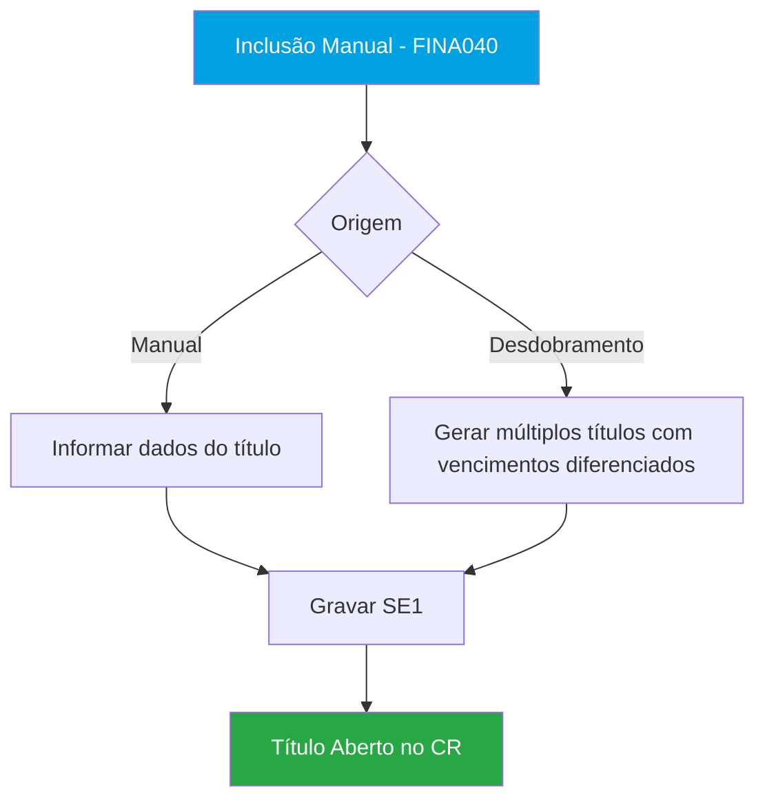
```mermaid
flowchart TD
    A[Inclusão Manual - FINA040] --> B{Origem}
    B -->|Manual| C[Informar dados do título]
    B -->|Desdobramento| D[Gerar múltiplos títulos com vencimentos diferenciados]
    C --> E[Gravar SE1]
    D --> E
    E --> F[Título Aberto no CR]
    style A fill:#00a1e0,color:#fff
    style F fill:#28a745,color:#fff
```

> **Nota:** Permite gerar desdobramentos — múltiplos títulos com datas de vencimento diferenciadas a partir de uma única inclusão (útil para aluguéis, mensalidades fixas).

---

### 4.2 FINA070 — Baixa a Receber (Manual)

**Objetivo:** Baixar manualmente títulos a receber, registrando o recebimento.
**Menu:** Atualizações > Contas a Receber > Baixas a Receber
**Tipo:** Processamento

#### Tabelas

| Tabela | Alias | Descrição | Tipo |
|--------|-------|-----------|------|
| SE1 | SE1 | Títulos a Receber | Principal |
| SE5 | SE5 | Movimentações Bancárias | Gerada |
| SE8 | SE8 | Saldos Bancários | Atualizada |

#### Parâmetros MV_ desta Rotina

| Parâmetro | Descrição | Padrão | Tipo | Quando usar |
|-----------|-----------|--------|------|-------------|
| `MV_CARTEIR` | Bancos para baixa por lote (separados por `;`) | | C | Quando utilizar baixa por lote |
| `MV_CXFIN` | Contas bancárias para baixa por lote | | C | Complemento do `MV_CARTEIR` |
| `MV_JUROS` | Taxa de juros padrão para financiamentos | | N | Cálculo automático de juros |
| `MV_MULTA` | Percentual de multa por atraso padrão | | N | Cálculo automático de multa |
| `MV_DESCMAX` | Desconto máximo permitido na baixa | | N | Controle de desconto na baixa |

#### Pontos de Entrada

| Ponto de Entrada | Momento de Execução | Descrição | Parâmetros |
|-----------------|---------------------|-----------|------------|
| `F070ACRE` | Antes da confirmação | Execução antes da confirmação da baixa a receber | - |
| `F070AltV` | Na validação | Validação da data da baixa | - |
| `F070BAUT` | No ExecAuto | Valida ExecAuto da baixa | - |
| `F070BROW` | No browse | Pré-validação de dados da baixa | - |
| `F070BTOK` | Na confirmação | Confirmação da baixa a receber | - |
| `F070BXPC` | Na exibição | Exibição automática da tela de baixas | - |
| `F70GRSE1` | Após o processo | Executado após todo o processo de baixa (posicionado em SE1 e SE5) | - |

#### Fluxo da Rotina

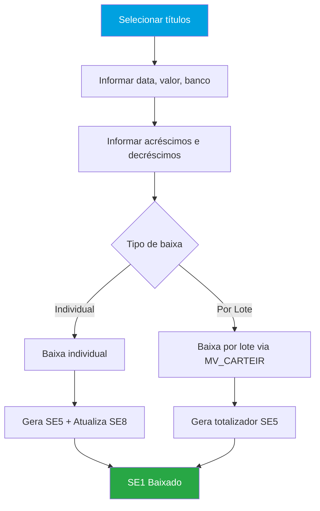
```mermaid
flowchart TD
    A[Selecionar títulos] --> B[Informar data, valor, banco]
    B --> C[Informar acréscimos e decréscimos]
    C --> D{Tipo de baixa}
    D -->|Individual| E[Baixa individual]
    D -->|Por Lote| F[Baixa por lote via MV_CARTEIR]
    E --> G[Gera SE5 + Atualiza SE8]
    F --> H[Gera totalizador SE5]
    G --> I[SE1 Baixado]
    H --> I
    style A fill:#00a1e0,color:#fff
    style I fill:#28a745,color:#fff
```

> ⚠️ **Atenção:** Banco configurado em `MV_CARTEIR` fica impedido de gerar cheques no Contas a Pagar. Para cancelamento de baixas por lote, usar `FINA110 > Outras Ações > Cancelamento de Baixa Automática`.

---

### 4.3 FINA110 — Baixa Automática a Receber

**Objetivo:** Processar baixas em massa com base em arquivo de retorno bancário ou regras parametrizadas.
**Menu:** Atualizações > Contas a Receber > Baixas Automáticas
**Tipo:** Processamento

#### Tabelas

| Tabela | Alias | Descrição | Tipo |
|--------|-------|-----------|------|
| SE1 | SE1 | Títulos a Receber | Principal |
| SE5 | SE5 | Movimentações Bancárias | Gerada |
| SE8 | SE8 | Saldos Bancários | Atualizada |

#### Fluxo da Rotina

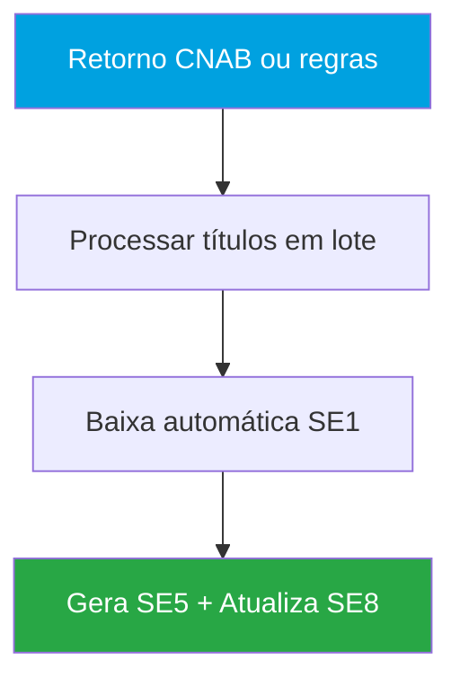
```mermaid
flowchart TD
    A[Retorno CNAB ou regras] --> B[Processar títulos em lote]
    B --> C[Baixa automática SE1]
    C --> D[Gera SE5 + Atualiza SE8]
    style A fill:#00a1e0,color:#fff
    style D fill:#28a745,color:#fff
```

---

### 4.4 FINA060 — Transferência / Borderô CR

**Objetivo:** Transferir títulos de um banco/carteira para outro, preparando para envio de remessa CNAB ou geração de boleto.
**Menu:** Atualizações > Contas a Receber > Transferência/Borderô
**Tipo:** Processamento

#### Tabelas

| Tabela | Alias | Descrição | Tipo |
|--------|-------|-----------|------|
| SE1 | SE1 | Títulos a Receber | Principal |
| SEA | SEA | Borderôs | Gerada |

#### Fluxo da Rotina

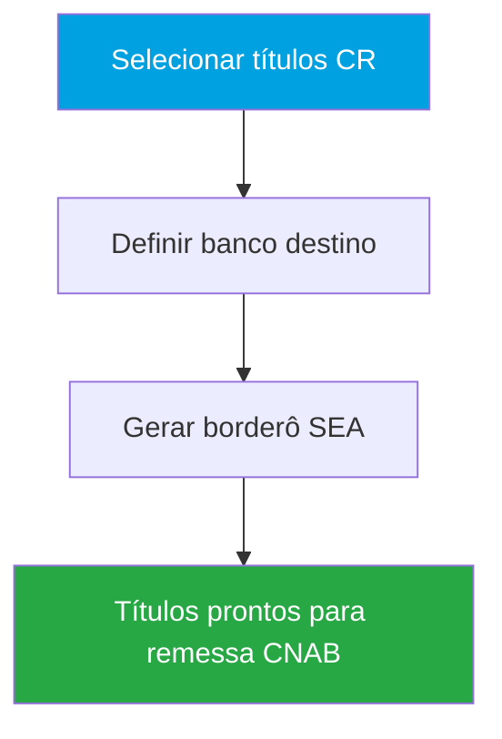
```mermaid
flowchart TD
    A[Selecionar títulos CR] --> B[Definir banco destino]
    B --> C[Gerar borderô SEA]
    C --> D[Títulos prontos para remessa CNAB]
    style A fill:#00a1e0,color:#fff
    style D fill:#28a745,color:#fff
```

---

### 4.5 FINA150 — CNAB Remessa Cobrança

**Objetivo:** Gerar arquivo de remessa bancária (`.REM`) para envio ao banco, contendo os títulos a cobrar (boletos).
**Menu:** Atualizações > Contas a Receber > CNAB – Remessa Cobrança
**Tipo:** Processamento

#### Tabelas

| Tabela | Alias | Descrição | Tipo |
|--------|-------|-----------|------|
| SE1 | SE1 | Títulos a Receber | Principal |
| SEA | SEA | Borderôs | Leitura |
| SEE | SEE | Parâmetros de Banco | Leitura |

#### Configuração de Layout CNAB

- Arquivo de configuração: `{banco}RREM.2RE` (ex: `341RREM.2RE` para Itaú)
- Cadastrado em `FINA130` (Parâmetros de Banco)
- Ocorrências do banco configuradas em `FINA140`

#### Principais Bancos e Códigos FEBRABAN

| Banco | Código FEBRABAN |
|-------|-----------------|
| Banco do Brasil | 001 |
| Santander | 033 |
| Caixa Econômica Federal | 104 |
| Bradesco | 237 |
| Itaú | 341 |
| Sicredi | 748 |
| Sicoob | 756 |

#### Fluxo da Rotina

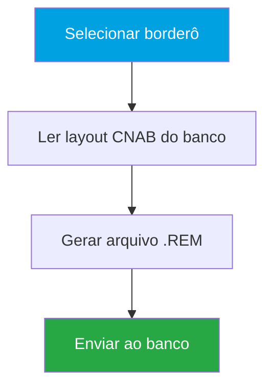
```mermaid
flowchart TD
    A[Selecionar borderô] --> B[Ler layout CNAB do banco]
    B --> C[Gerar arquivo .REM]
    C --> D[Enviar ao banco]
    style A fill:#00a1e0,color:#fff
    style D fill:#28a745,color:#fff
```

---

### 4.6 FINA200 — CNAB Retorno Cobrança

**Objetivo:** Processar arquivo de retorno bancário (`.RET`) com confirmações de pagamento, liquidações e rejeições.
**Menu:** Atualizações > Contas a Receber > CNAB – Retorno Cobrança
**Tipo:** Processamento

#### Tabelas

| Tabela | Alias | Descrição | Tipo |
|--------|-------|-----------|------|
| SE1 | SE1 | Títulos a Receber | Atualizada |
| SE5 | SE5 | Movimentações Bancárias | Gerada |
| SE8 | SE8 | Saldos Bancários | Atualizada |

#### Configuração

- Arquivo de configuração: `{banco}RRET.2RR` (ex: `341RRET.2RR` para Itaú)

#### Fluxo da Rotina

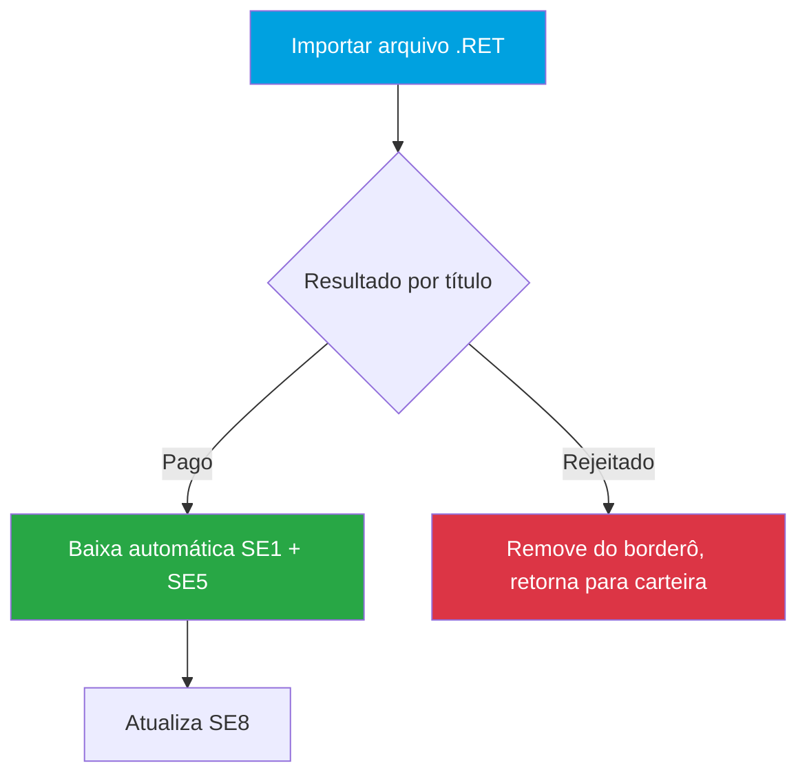
```mermaid
flowchart TD
    A[Importar arquivo .RET] --> B{Resultado por título}
    B -->|Pago| C[Baixa automática SE1 + SE5]
    B -->|Rejeitado| D[Remove do borderô, retorna para carteira]
    C --> E[Atualiza SE8]
    style A fill:#00a1e0,color:#fff
    style C fill:#28a745,color:#fff
    style D fill:#dc3545,color:#fff
```

---

### 4.7 FINA460 — Liquidação CR

**Objetivo:** Negociação e renegociação de títulos a receber: alteração de vencimento, geração de novos títulos com juros/multa, desconto.
**Menu:** Atualizações > Contas a Receber > Liquidação
**Tipo:** Processamento

#### Tabelas

| Tabela | Alias | Descrição | Tipo |
|--------|-------|-----------|------|
| SE1 | SE1 | Títulos a Receber | Atualizada |
| FO0 | FO0 | Cabeçalho da Liquidação | Gerada |
| FO1 | FO1 | Títulos Originais da Liquidação | Gerada |
| FO2 | FO2 | Títulos Gerados na Liquidação | Gerada |

#### Campos Principais

| Campo | Descrição | Tipo | Obrigatório | Validação/Observação |
|-------|-----------|------|-------------|---------------------|
| `FO1_TXJUR` | Taxa de juros | N | - | Percentual |
| `FO1_VLJUR` | Valor de juros | N | - | Calculado |
| `FO1_TXMUL` | Taxa de multa | N | - | Percentual |
| `FO1_VLMUL` | Valor de multa | N | - | Calculado |
| `FO1_DESCON` | Valor de desconto | N | - | Abatimento |

#### Fluxo da Rotina

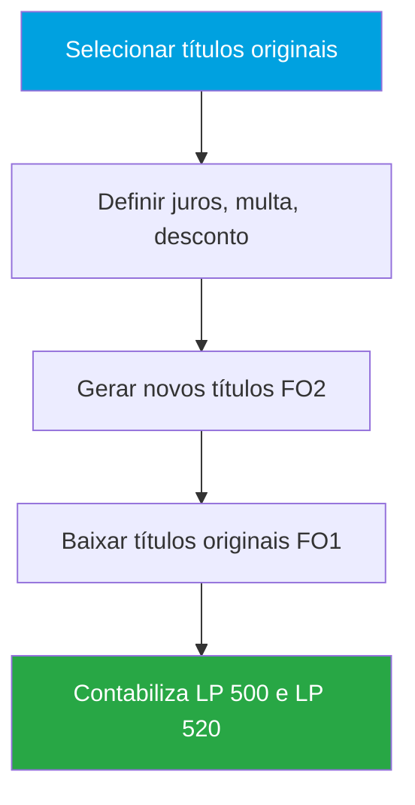
```mermaid
flowchart TD
    A[Selecionar títulos originais] --> B[Definir juros, multa, desconto]
    B --> C[Gerar novos títulos FO2]
    C --> D[Baixar títulos originais FO1]
    D --> E[Contabiliza LP 500 e LP 520]
    style A fill:#00a1e0,color:#fff
    style E fill:#28a745,color:#fff
```

> **Nota:** Lançamentos Padrão: LP 500 (por título gerado) e LP 520 (por título baixado).

---

### 4.8 FINA330 — Compensação CR

**Objetivo:** Compensação de títulos a receber com títulos de mesma natureza — por exemplo, cruzar um NCC (nota de crédito) com uma DUP (duplicata) do mesmo cliente, zerando os saldos.
**Menu:** Atualizações > Contas a Receber > Compensação CR
**Tipo:** Processamento

#### Tabelas

| Tabela | Alias | Descrição | Tipo |
|--------|-------|-----------|------|
| SE1 | SE1 | Títulos a Receber | Atualizada |

#### Fluxo da Rotina

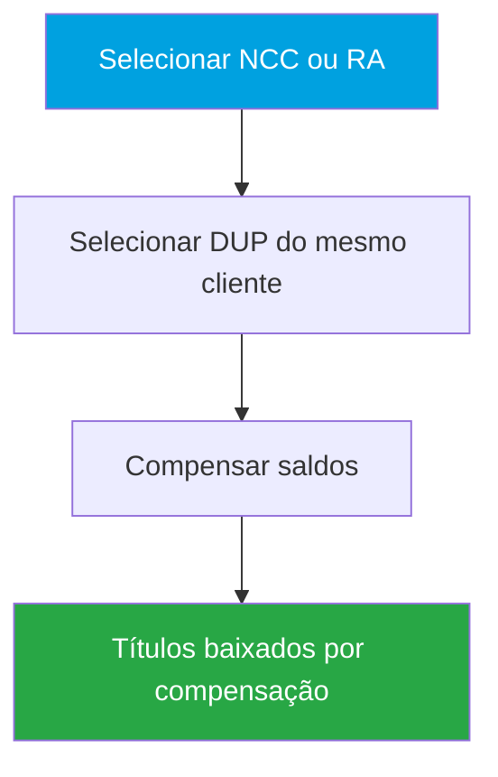
```mermaid
flowchart TD
    A[Selecionar NCC ou RA] --> B[Selecionar DUP do mesmo cliente]
    B --> C[Compensar saldos]
    C --> D[Títulos baixados por compensação]
    style A fill:#00a1e0,color:#fff
    style D fill:#28a745,color:#fff
```

---

### 4.9 FINA050 — Contas a Pagar (Inclusão)

**Objetivo:** Inclusão manual de títulos a pagar na tabela SE2.
**Menu:** Atualizações > Contas a Pagar > Contas a Pagar
**Tipo:** Inclusão / Manutenção

#### Tabelas

| Tabela | Alias | Descrição | Tipo |
|--------|-------|-----------|------|
| SE2 | SE2 | Títulos a Pagar | Principal |
| CV4 | CV4 | Rateio Externo | Complementar |

#### Campos Principais

| Campo | Descrição | Tipo | Obrigatório | Validação/Observação |
|-------|-----------|------|-------------|---------------------|
| `E2_FILIAL` | Filial | C(2) | Sim | Automático |
| `E2_PREFIXO` | Prefixo do título | C(3) | Sim | |
| `E2_NUM` | Número do título | C(9) | Sim | |
| `E2_PARCELA` | Parcela | C(1) | Sim | Tamanho definido por `MV_1DUP` |
| `E2_TIPO` | Tipo do título (DUP, PA, PR...) | C(3) | Sim | Ver seção 6 |
| `E2_FORNECE` | Código do fornecedor | C(6) | Sim | ExistCpo("SA2") |
| `E2_LOJA` | Loja do fornecedor | C(2) | Sim | |
| `E2_NOMFOR` | Nome do fornecedor | C(40) | - | Gatilho automático |
| `E2_EMISSAO` | Data de emissão | D | Sim | |
| `E2_VENCTO` | Data de vencimento real | D | Sim | |
| `E2_VENCREA` | Data de vencimento ajustada | D | - | Cálculo automático |
| `E2_VALOR` | Valor original | N(16,2) | Sim | > 0 |
| `E2_SALDO` | Saldo em aberto | N(16,2) | - | Automático |
| `E2_NATUREZ` | Natureza financeira | C(10) | - | ExistCpo("SED") |
| `E2_MOEDA` | Moeda | N(2) | - | Default `MV_MOEDA` |
| `E2_BAIXA` | Data da baixa | D | - | Preenchido na baixa |
| `E2_DATALIB` | Data de liberação para baixa | D | - | Preenchido por `FINA580` |
| `E2_STATLIB` | Status de liberação | C(2) | - | 03=Liberado |
| `E2_USUALIB` | Usuário que liberou | C(15) | - | Preenchido por `FINA580` |
| `E2_PORTADO` | Banco para pagamento | C(3) | - | ExistCpo("SA6") |

#### Parâmetros MV_ desta Rotina

| Parâmetro | Descrição | Padrão | Tipo | Quando usar |
|-----------|-----------|--------|------|-------------|
| `MV_PABRUTO` | Adiantamento com valor bruto (1) ou líquido (2) | 1 | N | Quando gerar PA |

#### Pontos de Entrada

| Ponto de Entrada | Momento de Execução | Descrição | Parâmetros |
|-----------------|---------------------|-----------|------------|
| `FA050INC` | Após "Tudo OK", antes de gravar | Validação na inclusão do título a pagar | - |
| `F050MCP` | Na alteração | Incluir novos campos na opção Alterar do Contas a Pagar | - |
| `F050TMP1` | No rateio | Rateio customizado | - |
| `F050RAUT` | No ExecAuto | Gravação de rateio pré-configurado via ExecAuto | - |
| `F050HEAD` | No rateio substituição | Adiciona novos campos no Rateio (opção Substituição) | - |
| `F50CARTMP1` | Na carga do rateio | Incluir campos de usuários na carga do rateio simples | - |
| `F050LRCT` | Na validação do rateio | Validação da linha do rateio online | - |
| `F0502RAT` | No rateio | Validações adicionais no rateio sem desviar do padrão | - |

#### Fluxo da Rotina

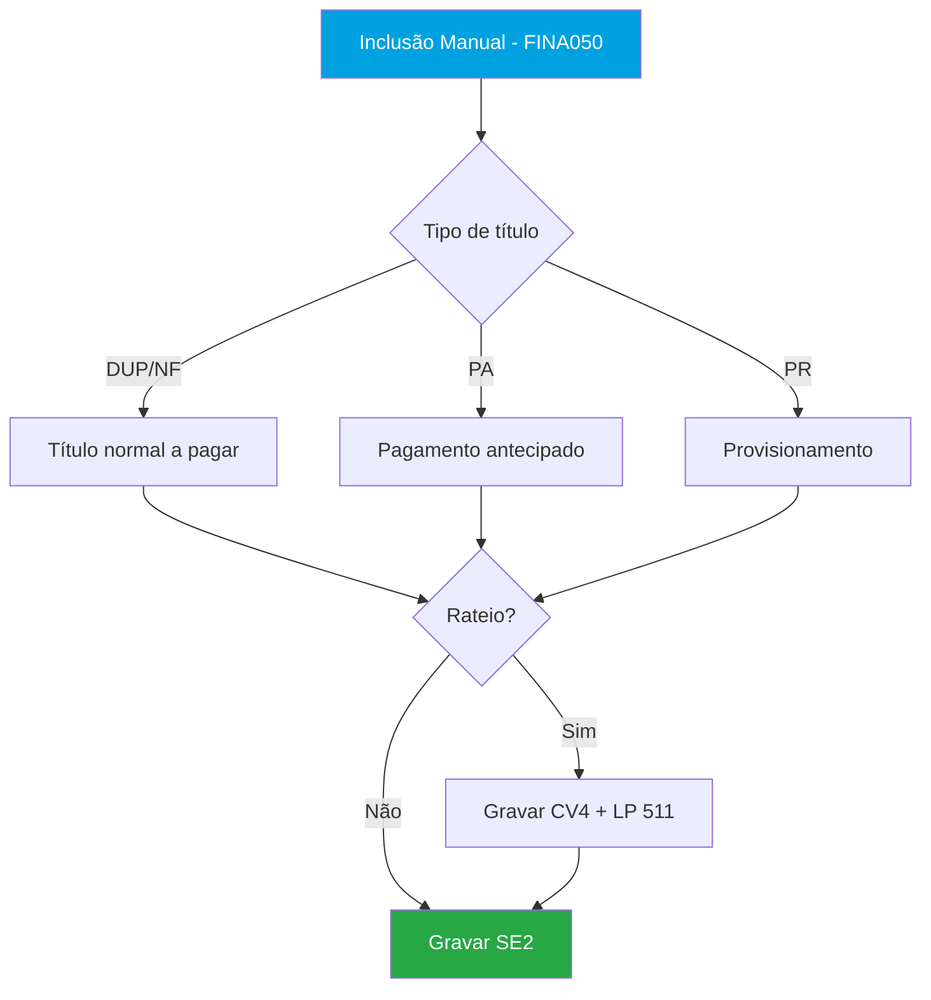
```mermaid
flowchart TD
    A[Inclusão Manual - FINA050] --> B{Tipo de título}
    B -->|DUP/NF| C[Título normal a pagar]
    B -->|PA| D[Pagamento antecipado]
    B -->|PR| E[Provisionamento]
    C --> F{Rateio?}
    D --> F
    E --> F
    F -->|Sim| G[Gravar CV4 + LP 511]
    F -->|Não| H[Gravar SE2]
    G --> H
    style A fill:#00a1e0,color:#fff
    style H fill:#28a745,color:#fff
```

> **Nota:** Rateio Externo: habilitar campo "Rateio" = Sim na aba Contábil. Requer Lançamento Padrão **511** ativo no `CTBA080`. Dados gravados na tabela **CV4**.

---

### 4.10 FINA090 — Baixa a Pagar (Manual)

**Objetivo:** Baixar manualmente títulos a pagar, registrando o pagamento.
**Menu:** Atualizações > Contas a Pagar > Baixas a Pagar
**Tipo:** Processamento

#### Tabelas

| Tabela | Alias | Descrição | Tipo |
|--------|-------|-----------|------|
| SE2 | SE2 | Títulos a Pagar | Principal |
| SE5 | SE5 | Movimentações Bancárias | Gerada |
| SE8 | SE8 | Saldos Bancários | Atualizada |

#### Parâmetros MV_ desta Rotina

| Parâmetro | Descrição | Padrão | Tipo | Quando usar |
|-----------|-----------|--------|------|-------------|
| `MV_CTLIPAG` | Controla liberação prévia para baixa a pagar | F | C(1) | Quando exige aprovação antes do pagamento |

#### Pontos de Entrada

| Ponto de Entrada | Momento de Execução | Descrição | Parâmetros |
|-----------------|---------------------|-----------|------------|
| `F090OK` | Antes de confirmar | Validação antes de confirmar a baixa a pagar | - |
| `F090BROW` | No browse | Manipulação do browse da rotina | - |
| `F090BTOK` | Na confirmação | Confirmação da baixa a pagar | - |
| `F090GRV` | Após gravação | Executado após a gravação da baixa | - |

#### Fluxo da Rotina

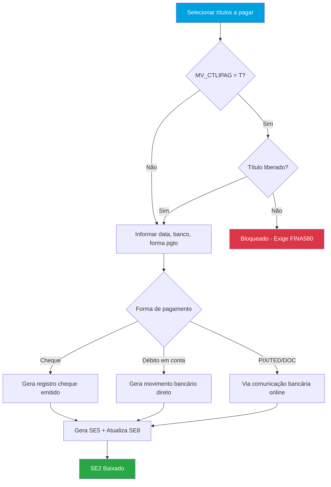
```mermaid
flowchart TD
    A[Selecionar títulos a pagar] --> B{MV_CTLIPAG = T?}
    B -->|Sim| C{Título liberado?}
    B -->|Não| D[Informar data, banco, forma pgto]
    C -->|Sim| D
    C -->|Não| E[Bloqueado - Exige FINA580]
    D --> F{Forma de pagamento}
    F -->|Cheque| G[Gera registro cheque emitido]
    F -->|Débito em conta| H[Gera movimento bancário direto]
    F -->|PIX/TED/DOC| I[Via comunicação bancária online]
    G --> J[Gera SE5 + Atualiza SE8]
    H --> J
    I --> J
    J --> K[SE2 Baixado]
    style A fill:#00a1e0,color:#fff
    style K fill:#28a745,color:#fff
    style E fill:#dc3545,color:#fff
```

---

### 4.11 FINA240 — Borderô de Pagamentos

**Objetivo:** Agrupar títulos a pagar em um borderô para envio ao banco (remessa CNAB de pagamento).
**Menu:** Atualizações > Contas a Pagar > Borderô de Pagamentos
**Tipo:** Processamento

#### Tabelas

| Tabela | Alias | Descrição | Tipo |
|--------|-------|-----------|------|
| SE2 | SE2 | Títulos a Pagar | Leitura |
| SEA | SEA | Borderôs | Gerada |

#### Fluxo da Rotina

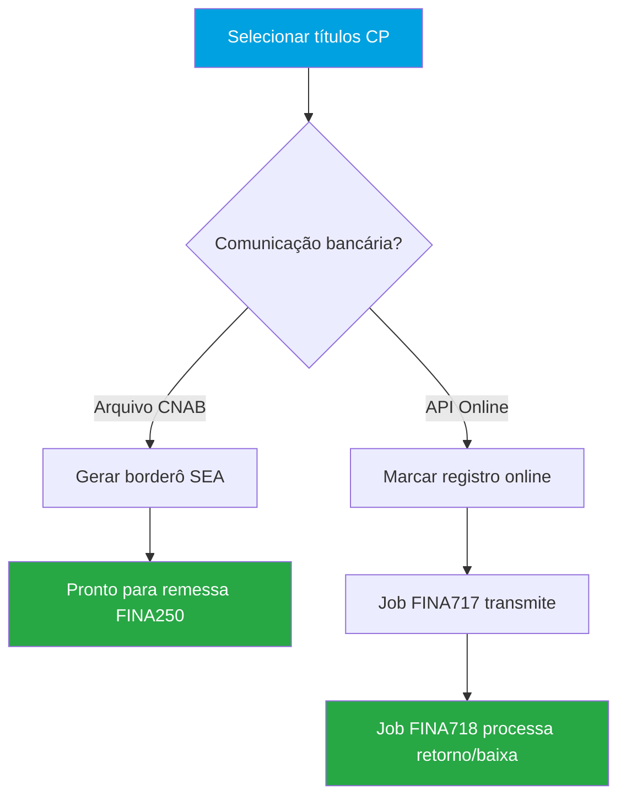
```mermaid
flowchart TD
    A[Selecionar títulos CP] --> B{Comunicação bancária?}
    B -->|Arquivo CNAB| C[Gerar borderô SEA]
    B -->|API Online| D[Marcar registro online]
    C --> E[Pronto para remessa FINA250]
    D --> F[Job FINA717 transmite]
    F --> G[Job FINA718 processa retorno/baixa]
    style A fill:#00a1e0,color:#fff
    style E fill:#28a745,color:#fff
    style G fill:#28a745,color:#fff
```

> **Nota:** Para comunicação bancária online (API): marcar checkbox "Registro de pagamentos online" ao gerar o borderô. Requer configuração do Job `FINA717` (transmissão) e `FINA718` (retorno/baixa). Rotina de impressão: `FINA241`.

---

### 4.12 FINA250 — CNAB Remessa Pagamento

**Objetivo:** Gerar o arquivo de remessa de pagamento para o banco (transferências, pagamentos de boletos, tributos via SISPAG).
**Menu:** Atualizações > Contas a Pagar > CNAB – Remessa Pagamento
**Tipo:** Processamento

#### Tabelas

| Tabela | Alias | Descrição | Tipo |
|--------|-------|-----------|------|
| SE2 | SE2 | Títulos a Pagar | Leitura |
| SEA | SEA | Borderôs | Leitura |
| SEE | SEE | Parâmetros de Banco | Leitura |

#### Configuração

- Arquivo de configuração: `{banco}PREM.2PE` (ex: `341PREM.2PE` para Itaú)

#### Pontos de Entrada

| Ponto de Entrada | Momento de Execução | Descrição | Parâmetros |
|-----------------|---------------------|-----------|------------|
| `F240ALMOD` | Na geração | Pagamentos especiais SISPAG (tributos com código de barras) | - |

#### Fluxo da Rotina

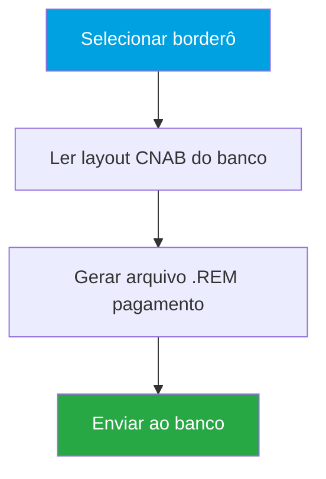
```mermaid
flowchart TD
    A[Selecionar borderô] --> B[Ler layout CNAB do banco]
    B --> C[Gerar arquivo .REM pagamento]
    C --> D[Enviar ao banco]
    style A fill:#00a1e0,color:#fff
    style D fill:#28a745,color:#fff
```

> **Nota:** Pagamentos especiais (SISPAG): tributos com código de barras requerem PE `F240ALMOD`. GPS / FGTS / GRU usam segmentos específicos por tipo.

---

### 4.13 FINA430 — CNAB Retorno Pagamento

**Objetivo:** Processar o arquivo de retorno do banco com confirmações ou rejeições de pagamento.
**Menu:** Atualizações > Contas a Pagar > CNAB – Retorno Pagamento
**Tipo:** Processamento

#### Tabelas

| Tabela | Alias | Descrição | Tipo |
|--------|-------|-----------|------|
| SE2 | SE2 | Títulos a Pagar | Atualizada |
| SE5 | SE5 | Movimentações Bancárias | Gerada |
| SE8 | SE8 | Saldos Bancários | Atualizada |

#### Configuração

- Arquivo de configuração: `{banco}PRET.2PR` (ex: `341PRET.2PR` para Itaú)

#### Fluxo da Rotina

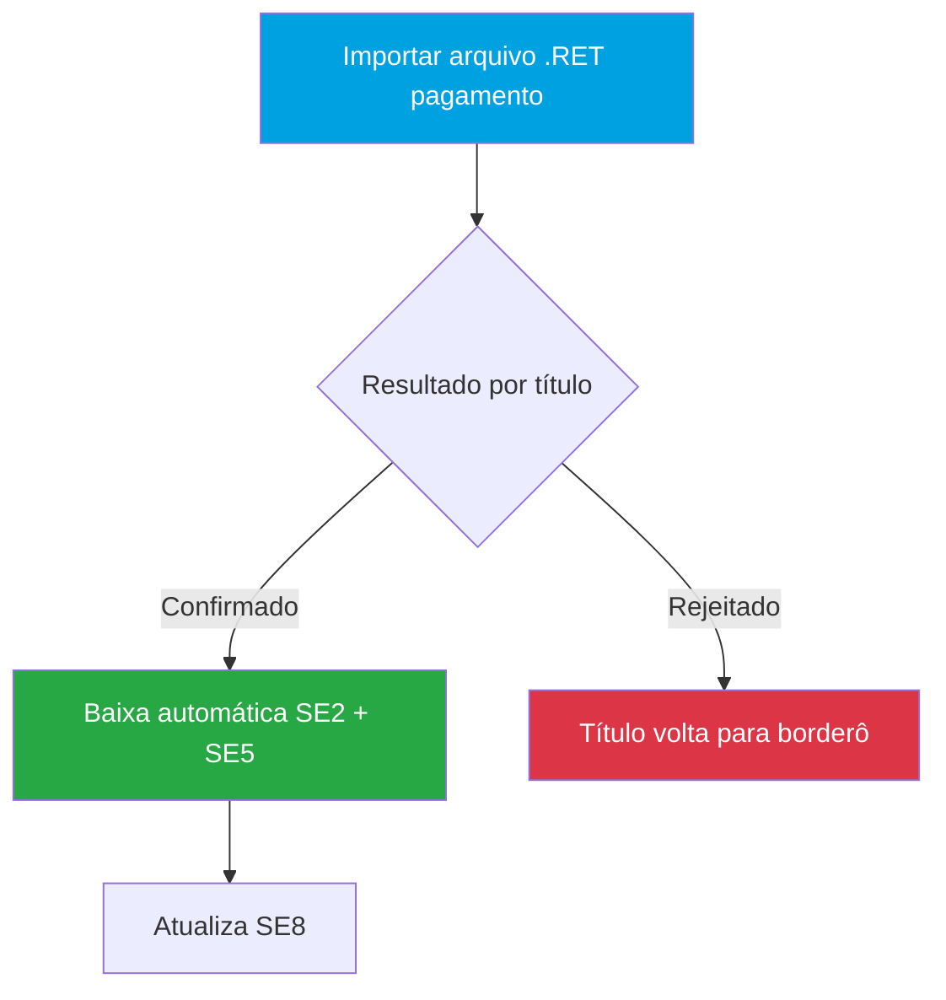
```mermaid
flowchart TD
    A[Importar arquivo .RET pagamento] --> B{Resultado por título}
    B -->|Confirmado| C[Baixa automática SE2 + SE5]
    B -->|Rejeitado| D[Título volta para borderô]
    C --> E[Atualiza SE8]
    style A fill:#00a1e0,color:#fff
    style C fill:#28a745,color:#fff
    style D fill:#dc3545,color:#fff
```

---

### 4.14 FINA580 — Liberação para Baixa

**Objetivo:** Controlar quais títulos estão autorizados para pagamento antes da baixa.
**Menu:** Atualizações > Contas a Pagar > Liberação para Baixa
**Tipo:** Processamento

#### Tabelas

| Tabela | Alias | Descrição | Tipo |
|--------|-------|-----------|------|
| SE2 | SE2 | Títulos a Pagar | Atualizada |

#### Campos Principais

| Campo | Descrição | Tipo | Obrigatório | Validação/Observação |
|-------|-----------|------|-------------|---------------------|
| `E2_STATLIB` | Status de liberação | C(2) | - | 03 = Liberado |
| `E2_DATALIB` | Data da liberação | D | - | Preenchido automaticamente |
| `E2_USUALIB` | Usuário que liberou | C(15) | - | Preenchido automaticamente |

#### Parâmetros MV_ desta Rotina

| Parâmetro | Descrição | Padrão | Tipo | Quando usar |
|-----------|-----------|--------|------|-------------|
| `MV_CTLIPAG` | Ativa controle de liberação prévia para baixa a pagar | F | C(1) | Valor `T` para ativar |

#### Fluxo da Rotina

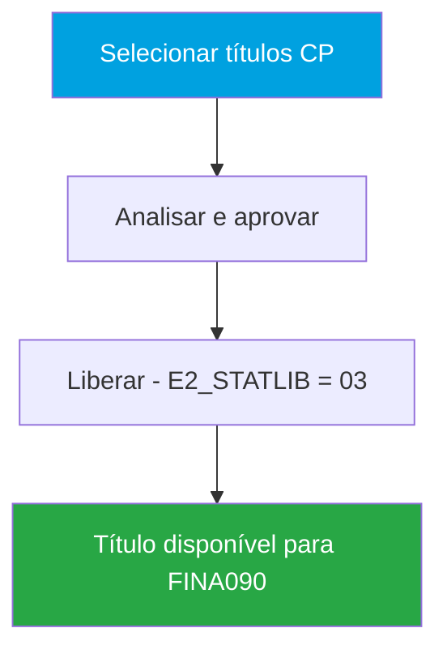
```mermaid
flowchart TD
    A[Selecionar títulos CP] --> B[Analisar e aprovar]
    B --> C[Liberar - E2_STATLIB = 03]
    C --> D[Título disponível para FINA090]
    style A fill:#00a1e0,color:#fff
    style D fill:#28a745,color:#fff
```

---

### 4.15 FINA340 — Compensação CP

**Objetivo:** Compensação entre títulos a pagar e adiantamentos (PA) — cruza um PA com uma DUP do mesmo fornecedor para abater o valor.
**Menu:** Atualizações > Contas a Pagar > Compensação CP
**Tipo:** Processamento

#### Tabelas

| Tabela | Alias | Descrição | Tipo |
|--------|-------|-----------|------|
| SE2 | SE2 | Títulos a Pagar | Atualizada |

#### Parâmetros MV_ desta Rotina

| Parâmetro | Descrição | Padrão | Tipo | Quando usar |
|-----------|-----------|--------|------|-------------|
| `MV_BX10925` | Comportamento da compensação (1=Baixa / 2=Emissão) | | N | Define data base para contabilização |

#### Fluxo da Rotina

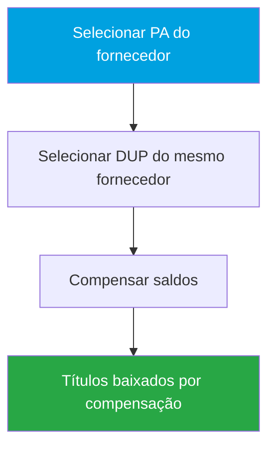
```mermaid
flowchart TD
    A[Selecionar PA do fornecedor] --> B[Selecionar DUP do mesmo fornecedor]
    B --> C[Compensar saldos]
    C --> D[Títulos baixados por compensação]
    style A fill:#00a1e0,color:#fff
    style D fill:#28a745,color:#fff
```

> ⚠️ **Help NOTITSEL:** Ocorre quando há inconsistência na chave `Prefixo+Número+Parcela+Tipo` entre SE2 e SE5, ou quando o título não está com status "Liberado" (`MV_CTLIPAG = T`).

---

### 4.16 FINA290 — Faturas a Pagar

**Objetivo:** Agrupamento de múltiplos títulos a pagar de fornecedores diferentes em uma única fatura para pagamento centralizado.
**Menu:** Atualizações > Contas a Pagar > Faturas a Pagar
**Tipo:** Processamento

#### Tabelas

| Tabela | Alias | Descrição | Tipo |
|--------|-------|-----------|------|
| SE2 | SE2 | Títulos a Pagar | Atualizada |

#### Fluxo da Rotina

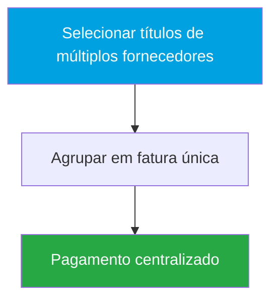
```mermaid
flowchart TD
    A[Selecionar títulos de múltiplos fornecedores] --> B[Agrupar em fatura única]
    B --> C[Pagamento centralizado]
    style A fill:#00a1e0,color:#fff
    style C fill:#28a745,color:#fff
```

> **Nota:** Para gerar faturas para fornecedores diferentes: pressionar F12 e desabilitar "Considera Lojas".

---

### 4.17 FINA100 — Movimentos Bancários

**Objetivo:** Lançamentos manuais diretos nas contas bancárias (entrada, saída, transferência).
**Menu:** Atualizações > Movimentos Bancários > Movimentos Bancários
**Tipo:** Inclusão / Manutenção

#### Tabelas

| Tabela | Alias | Descrição | Tipo |
|--------|-------|-----------|------|
| SE5 | SE5 | Movimentações Bancárias | Principal |
| FK5 | FK5 | Movimentos Bancários (reestruturação SE5) | Complementar |
| SE8 | SE8 | Saldos Bancários | Atualizada |
| FKA | FKA | Rastreio de Movimentos Bancários | Gerada |

#### Pontos de Entrada

| Ponto de Entrada | Momento de Execução | Descrição | Parâmetros |
|-----------------|---------------------|-----------|------------|
| `FA100NAT` | Na validação | Não valida CST de Crédito na natureza financeira | - |
| `F100BROW` | No browse | Manipulação do browse de movimentos | - |
| `F100OK` | Antes de gravar | Validação antes de gravar o movimento bancário | - |
| `F100GRV` | Após gravação | Executado após gravação do movimento bancário | - |

#### Fluxo da Rotina

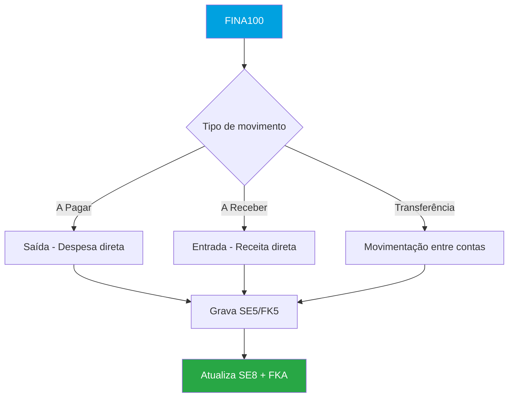
```mermaid
flowchart TD
    A[FINA100] --> B{Tipo de movimento}
    B -->|A Pagar| C[Saída - Despesa direta]
    B -->|A Receber| D[Entrada - Receita direta]
    B -->|Transferência| E[Movimentação entre contas]
    C --> F[Grava SE5/FK5]
    D --> F
    E --> F
    F --> G[Atualiza SE8 + FKA]
    style A fill:#00a1e0,color:#fff
    style G fill:#28a745,color:#fff
```

> ⚠️ **Atenção:** Para corrigir valores errados, lançar o inverso (A Receber se foi A Pagar, e vice-versa). Todos os movimentos ficam registrados (sem exclusão física, apenas estorno).

> **Nota:** Se a natureza financeira tiver CST de PIS/COFINS de crédito e o campo `E5_CLIFOR` estiver em branco, o sistema exibe um alerta. PE `FA100NAT` suprime essa validação.

---

### 4.18 FINA210 — Recálculo de Saldos Bancários

**Objetivo:** Recalcular o saldo bancário (SE8) a partir das movimentações (SE5), corrigindo inconsistências.
**Menu:** Miscelânea > Recálculo de Saldos Bancários
**Tipo:** Processamento

#### Tabelas

| Tabela | Alias | Descrição | Tipo |
|--------|-------|-----------|------|
| SE5 | SE5 | Movimentações Bancárias | Leitura |
| SE8 | SE8 | Saldos Bancários | Atualizada |

#### Fluxo da Rotina

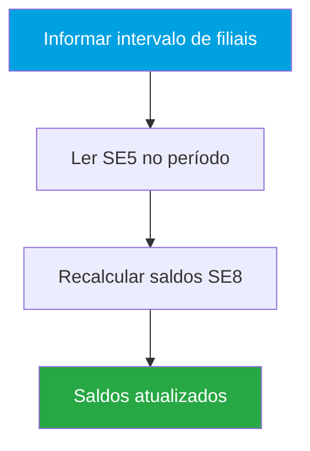
```mermaid
flowchart TD
    A[Informar intervalo de filiais] --> B[Ler SE5 no período]
    B --> C[Recalcular saldos SE8]
    C --> D[Saldos atualizados]
    style A fill:#00a1e0,color:#fff
    style D fill:#28a745,color:#fff
```

> ⚠️ **Atenção crítica:** Ao executar o recálculo, informar exatamente o intervalo de filiais que compartilham o cadastro de banco (SA6/SE8). Filiais incorretas podem causar **sobreposição de saldos** e inconsistências. Regra: Informar apenas filiais com o mesmo nível de compartilhamento do cadastro de bancos.

---

### 4.19 FINA450 — Compensação entre Carteiras

**Objetivo:** Compensação cruzada entre títulos de Contas a Receber e Contas a Pagar.
**Menu:** Atualizações > Financeiro > Compensação entre Carteiras
**Tipo:** Processamento

#### Tabelas

| Tabela | Alias | Descrição | Tipo |
|--------|-------|-----------|------|
| SE1 | SE1 | Títulos a Receber | Atualizada |
| SE2 | SE2 | Títulos a Pagar | Atualizada |

#### Pontos de Entrada

| Ponto de Entrada | Momento de Execução | Descrição | Parâmetros |
|-----------------|---------------------|-----------|------------|
| `F450BROW` | No browse | Manipula campos do browse na compensação | - |
| `lFA450BU` | Na interface | Criação de botão na rotina | - |
| `F450ValCon` | Após seleção | Validação após seleção de títulos | - |
| `F450SE5` | Após compensação | Executado após a compensação de todos os títulos selecionados | - |
| `F450FIL` | No filtro | Customização do filtro da IndRegua (TopConnect) | - |
| `F450OWN1` | No filtro | Monta expressão de filtro adicional para SE2 | - |
| `F450ORDEM` | Na exibição | Alteração da ordem dos títulos apresentados para seleção | - |
| `F450GRAVA` | Na gravação | Manipula dados temporários da tabela TRB | - |
| `F450Conf` | Na marcação | Valida marcação do título para compensação | - |
| `F450valid` | Na tela | Valida informações da tela de compensação | - |

#### Fluxo da Rotina

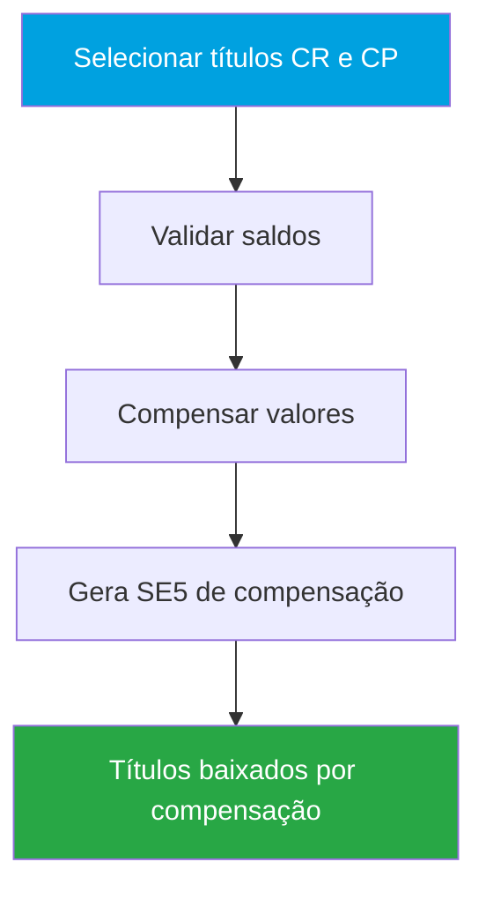
```mermaid
flowchart TD
    A[Selecionar títulos CR e CP] --> B[Validar saldos]
    B --> C[Compensar valores]
    C --> D[Gera SE5 de compensação]
    D --> E[Títulos baixados por compensação]
    style A fill:#00a1e0,color:#fff
    style E fill:#28a745,color:#fff
```

---

## 5. Contabilização

### 5.1 Modo de Contabilização

| Modo | Descrição | Parâmetro |
|------|-----------|-----------|
| On-line | Contabiliza automaticamente ao gravar o documento | Automático nas rotinas financeiras |
| Off-line | Contabilização em lote posterior | Rotina `CTBANFE` (Miscelânea > Contabilização Off-Line) |

### 5.2 Lançamentos Padrão (LP)

| Código LP | Descrição | Rotina | Débito | Crédito |
|-----------|-----------|--------|--------|---------|
| 500 | Liquidação de título a receber (por título gerado) | `FINA460` | Clientes (SA1) | Receitas |
| 505 | Baixa de título a receber | `FINA070` / `FINA110` | Banco (SA6) | Clientes (SA1) |
| 510 | Inclusão de título a pagar | `FINA050` | Despesas | Fornecedores (SA2) |
| 511 | Inclusão de título a pagar com rateio externo | `FINA050` | Múltiplos CC/Contas (CV4) | Fornecedores (SA2) |
| 515 | Baixa de título a pagar | `FINA090` | Fornecedores (SA2) | Banco (SA6) |
| 520 | Liquidação de título a receber (por título baixado) | `FINA460` | Receitas | Clientes (SA1) |
| 530 | Movimento bancário (crédito) | `FINA100` | Banco (SA6) | Contrapartida |
| 535 | Movimento bancário (débito) | `FINA100` | Contrapartida | Banco (SA6) |

> **Nota:** LPs são configurados em `CTBA080`. Cada LP pode ter múltiplas linhas com fórmulas que referenciam campos do documento.

### 5.3 Rastreamento de Títulos

A partir da release 12.1.25, o Protheus oferece rastreamento completo de um título — desde sua origem (NF, pedido) até o recebimento/pagamento final. Acessível via "Rastreio" nas rotinas financeiras. Tabelas: `FI7` e `FI8`.

> ⚠️ O compartilhamento das tabelas `FI7` e `FI8` deve ser **idêntico** ao compartilhamento de SE1 e SE2.

---

## 6. Tipos e Classificações

### 6.1 Tipos de Título a Receber (SE1 — E1_TIPO)

| Código/Tipo | Descrição | Comportamento | Uso típico |
|-------------|-----------|---------------|------------|
| DUP | Duplicata mercantil | Gerada por NF de venda | Vendas normais |
| NF | Nota fiscal de serviços | Gerada por NF de serviço | Prestação de serviços |
| CH | Cheque | Cheque recebido | Recebimento em cheque |
| CC | Carnê | Parcelamento tipo carnê | Vendas parceladas |
| RC | Recibo | Recibo de pagamento | Receitas diversas |
| NCC | Nota de crédito ao cliente | Crédito para o cliente (saldo negativo em `A1_SALDUP`) | Devoluções, abatimentos |
| RA | Recebimento antecipado | Adiantamento recebido (saldo negativo em `A1_SALDUP`) | Sinal, antecipação |
| REC | Receita diversa | Receita avulsa | Receitas não vinculadas a NF |
| BOL | Boleto avulso | Boleto gerado avulso | Cobranças avulsas |
| AP | Antecipação de parcela | Antecipação de parcela futura | Pagamento antecipado pelo cliente |

### 6.2 Tipos de Título a Pagar (SE2 — E2_TIPO)

| Código/Tipo | Descrição | Comportamento | Uso típico |
|-------------|-----------|---------------|------------|
| DUP | Duplicata a pagar | Gerada por NF de compra | Compras normais |
| NF | Nota fiscal de serviços | Gerada por NF de serviço | Serviços contratados |
| CH | Cheque emitido | Cheque emitido pela empresa | Pagamento em cheque |
| PA | Pagamento antecipado | Adiantamento pago ao fornecedor | Sinal, antecipação |
| NDF | Nota de débito de fornecedor | Débito do fornecedor | Cobranças adicionais |
| PR | Provisório | Provisionamento de despesa | Provisões contábeis |
| TX | Taxa / tributo | Tributo a recolher | Impostos, taxas |
| CS | Custo / despesa | Despesa diversa | Despesas operacionais |
| LC | Letra de câmbio | Instrumento financeiro | Operações financeiras |
| DP | Débito em conta | Débito automático | Débitos bancários |
| GP | GPS / FGTS / obrigações trabalhistas | Obrigação trabalhista | Encargos sociais |

### 6.3 Motivos de Baixa (Padrão do Sistema)

| Motivo | Sigla | Carteira | Uso típico |
|--------|-------|----------|------------|
| Recebimento em Dinheiro | DIN | Receber | Baixa em espécie |
| Cheque Recebido | CHQ | Receber | Baixa com cheque |
| Débito em Conta Corrente | DEB | Pagar | Débito automático |
| Transferência Bancária | TRF | Pagar/Receber | PIX, TED, DOC |
| Compensação | COMP | Pagar/Receber | Compensação entre títulos |

> ⚠️ **Atenção:** As alterações nos motivos de baixa padrão devem ser feitas com muita cautela, pois o sistema os utiliza para operações internas. Alterar a carteira de um motivo (de Pagar para Receber) pode impedir o cancelamento de baixas anteriores.

---

## 7. Tabelas do Módulo

Visão consolidada de todas as tabelas usadas no módulo.

### Tabelas de Cadastro

| Tabela | Descrição | Rotina Principal | Obs |
|--------|-----------|-----------------|-----|
| SA1 | Clientes | MATA030 / CRMA980 | Compartilhada com FAT |
| SA2 | Fornecedores | MATA020 | Compartilhada com COM |
| SA6 | Bancos | FINA010 / MATA092 | Código FEBRABAN, agência, conta |
| SED | Natureza Financeira | MATA070 | Classificação receitas/despesas |
| SE4 | Condições de Pagamento | MATA360 | Tipos 1 a 9 |
| SEE | Parâmetros de Banco (CNAB) | FINA130 | Configuração CNAB por banco |

### Tabelas de Movimento

| Tabela | Descrição | Rotina Principal | Volume |
|--------|-----------|-----------------|--------|
| SE1 | Títulos a Receber | FINA040 / SIGAFAT | Muito Alto |
| SE2 | Títulos a Pagar | FINA050 / SIGACOM | Muito Alto |
| SE5 | Movimentações Bancárias | FINA100 / baixas | Muito Alto |
| FK5 | Movimentos Bancários (reestruturação SE5) | – | Muito Alto |
| SE8 | Saldos Bancários | Atualizado automaticamente | Médio |
| SEA | Borderôs (Remessa / Pagamento) | FINA060 / FINA240 | Alto |
| CV4 | Rateio Externo de Títulos | FINA050 (aba Contábil) | Médio |
| CT2 | Lançamentos Contábeis | SIGACTB | Muito Alto |

### Tabelas de Controle

| Tabela | Descrição | Uso |
|--------|-----------|-----|
| FO0 | Cabeçalho da Liquidação | Liquidação CR (`FINA460`) |
| FO1 | Títulos Originais da Liquidação | Liquidação CR (`FINA460`) |
| FO2 | Títulos Gerados na Liquidação | Liquidação CR (`FINA460`) |
| FI7 | Rastreamento financeiro (origem) | Rastreio de títulos |
| FI8 | Rastreamento financeiro (destino) | Rastreio de títulos |
| FKA | Rastreio de Movimentos Bancários | Rastreio SE5 |
| SIF/SIG | Registros de extrato bancário importado | Conciliação (`FINA473`) |
| QLC/QLD | Dados do Novo Conciliador TOTVS | Novo Gestor (`FINA710`) |

### Compartilhamento Obrigatório

- SE1 e SE2 → mesmo compartilhamento
- SE5, FK5, FKA e SE8 → mesmo compartilhamento entre si
- SA6 e SE8 → compatíveis (afetam `FINA210` e `FINR470`)
- FI7 e FI8 → mesmo que SE1/SE2
- FKF e FKG (complemento de título) → mesmo que SE1/SE2
- ⚠️ **Nunca** ter SA1/SA2 exclusivos e SE1/SE2/SE5 compartilhados

> ⚠️ **Reestruturação SE5:** A tabela SE5 cresceu muito ao longo das versões. A família de tabelas FKx foi criada para dar continuidade à evolução. Todas as tabelas da família SE5 devem ter o **mesmo compartilhamento**.

---

## 8. Fluxo Geral do Módulo

Diagrama completo do fluxo do módulo, mostrando como as rotinas se conectam entre si e com outros módulos.

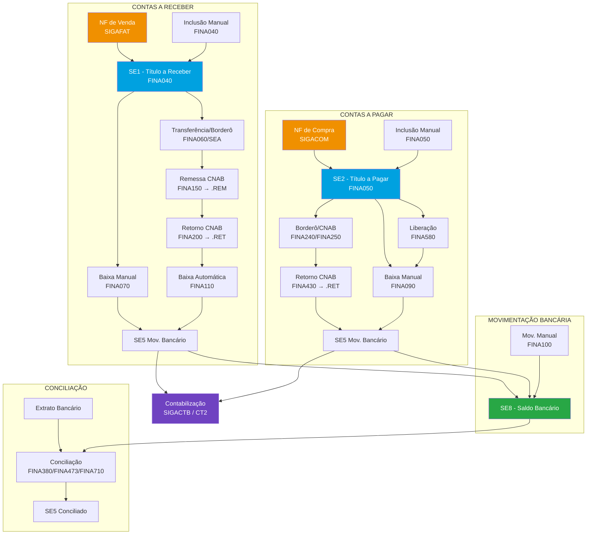
```mermaid
flowchart TD
    subgraph CR["CONTAS A RECEBER"]
        NF_VENDA["NF de Venda\nSIGAFAT"] --> SE1["SE1 - Título a Receber\nFINA040"]
        MANUAL_CR["Inclusão Manual\nFINA040"] --> SE1
        SE1 --> TRANSF["Transferência/Borderô\nFINA060/SEA"]
        SE1 --> BAIXA_CR["Baixa Manual\nFINA070"]
        TRANSF --> REMESSA_CR["Remessa CNAB\nFINA150 → .REM"]
        REMESSA_CR --> RETORNO_CR["Retorno CNAB\nFINA200 → .RET"]
        RETORNO_CR --> BAIXA_AUTO["Baixa Automática\nFINA110"]
        BAIXA_CR --> SE5_CR["SE5 Mov. Bancário"]
        BAIXA_AUTO --> SE5_CR
    end

    subgraph CP["CONTAS A PAGAR"]
        NF_COMPRA["NF de Compra\nSIGACOM"] --> SE2["SE2 - Título a Pagar\nFINA050"]
        MANUAL_CP["Inclusão Manual\nFINA050"] --> SE2
        SE2 --> LIBERA["Liberação\nFINA580"]
        SE2 --> BAIXA_CP["Baixa Manual\nFINA090"]
        LIBERA --> BAIXA_CP
        SE2 --> BORDERO_CP["Borderô/CNAB\nFINA240/FINA250"]
        BORDERO_CP --> RETORNO_CP["Retorno CNAB\nFINA430 → .RET"]
        RETORNO_CP --> SE5_CP["SE5 Mov. Bancário"]
        BAIXA_CP --> SE5_CP
    end

    subgraph BANCO["MOVIMENTAÇÃO BANCÁRIA"]
        SE5_CR --> SE8["SE8 - Saldo Bancário"]
        SE5_CP --> SE8
        FINA100["Mov. Manual\nFINA100"] --> SE8
    end

    subgraph CONC["CONCILIAÇÃO"]
        EXTRATO["Extrato Bancário"] --> CONCILIA["Conciliação\nFINA380/FINA473/FINA710"]
        SE8 --> CONCILIA
        CONCILIA --> CONCILIADO["SE5 Conciliado"]
    end

    SE5_CR --> CTB["Contabilização\nSIGACTB / CT2"]
    SE5_CP --> CTB

    style NF_VENDA fill:#f09000,color:#fff
    style NF_COMPRA fill:#f09000,color:#fff
    style SE1 fill:#00a1e0,color:#fff
    style SE2 fill:#00a1e0,color:#fff
    style SE8 fill:#28a745,color:#fff
    style CTB fill:#6f42c1,color:#fff
```

**Legenda de cores:**
- Azul: Tabelas principais (SE1, SE2)
- Laranja: Integração com outro módulo (SIGAFAT, SIGACOM)
- Verde: Conclusão / Saldo bancário
- Roxo: Contabilização

**Vínculo entre tabelas (rastreabilidade):**

```mermaid
flowchart LR
    SF2["SF2/SD2\nNF Venda"] --> SE1["SE1\nA Receber"] --> SE5a["SE5\nMov. Bancário"] --> SE8a["SE8\nSaldo"]
    SF1["SF1/SD1\nNF Compra"] --> SE2["SE2\nA Pagar"] --> SE5b["SE5\nMov. Bancário"] --> SE8b["SE8\nSaldo"]
    style SF2 fill:#f09000,color:#fff
    style SF1 fill:#f09000,color:#fff
    style SE1 fill:#00a1e0,color:#fff
    style SE2 fill:#00a1e0,color:#fff
    style SE8a fill:#28a745,color:#fff
    style SE8b fill:#28a745,color:#fff
```

---

## 9. Integrações com Outros Módulos

| Módulo | Integração | Tabela Ponte | Direção | Momento |
|--------|-----------|-------------|---------|---------|
| **SIGAFAT** | Geração automática de SE1 (títulos a receber) | SE1 | FAT → FIN | Na emissão da NF de saída |
| **SIGACOM** | Geração automática de SE2 (títulos a pagar) | SE2 | COM → FIN | Na classificação da NF de compra |
| **SIGACTB** | Contabilização dos lançamentos financeiros | CT2 | FIN → CTB | On-line ou Off-line (LPs 500-535) |
| **SIGAFIS** | Impostos retidos na fonte (PIS, COFINS, IRRF, INSS, ISS) | SFT | FIN → FIS | Integração ao SPED |
| **SIGAEST** | Custo de compras e estoque afeta o financeiro | SB2 | EST → FIN | Via SIGACOM |
| **SIGATEC** | Pagamentos de manutenção e ativos podem gerar SE2 | SE2 | TEC → FIN | Na geração de OS/ativos |
| **TSS/Bancos** | CNAB remessa/retorno, boletos online, Open Banking, PIX | SE5 | FIN ↔ Banco | Remessa e retorno CNAB |
| **EFD-Reinf** | Naturezas de rendimento integram ao REINF | FKE/FKX/FKZ | FIN → FIS | Via SIGAFIS |

---

## 10. Controles Especiais

### 10.1 Adiantamentos (PA / RA)

**Objetivo:** Controle de pagamentos e recebimentos antecipados antes da geração do documento fiscal.

#### Pagamento Antecipado — PA (SE2)

- Tipo `PA` no Contas a Pagar
- Representa um adiantamento feito pela empresa ao fornecedor
- Posterior compensação via `FINA340` ao receber a NF/duplicata
- Gerado automaticamente por Pedido de Compras com adiantamento, ou manualmente

| Parâmetro | Descrição | Padrão |
|-----------|-----------|--------|
| `MV_PABRUTO` | Valor `1` (Bruto) → gera PA com valor bruto (sem desconto de impostos). Valor `2` (Líquido) → gera PA com valor líquido (impostos descontados) | 1 |

#### Recebimento Antecipado — RA (SE1)

- Tipo `RA` no Contas a Receber
- Representa um adiantamento recebido do cliente antes do faturamento
- Posterior compensação via `FINA330` com a duplicata gerada pela NF
- Gerado por Pedido de Venda com adiantamento, ou manualmente

**Comportamento especial:**
- Títulos NCC e RA alimentam `A1_SALDUP` como **negativos** (são créditos do cliente)
- Não bloqueiam a análise de crédito automática do cliente

**Baixa de RA/NCC:**
- Ao baixar tipo NCC ou RA com "Gera Cheque p/ Adiantamento" = **Não**: `E5_TIPODOC = VL` (movimenta banco)
- Com "Gera Cheque p/ Adiantamento" = **Sim**: `E5_TIPODOC = BA` (não atualiza saldo bancário imediatamente)

```mermaid
flowchart TD
    A["Pedido de Compra\n(com adiantamento)"] --> B["PA em SE2"]
    C["Pedido de Venda\n(com adiantamento)"] --> D["RA em SE1"]
    B --> E["Baixa PA\nFINA090"]
    D --> F["Baixa RA\nFINA070"]
    E --> G["NF Compra gera DUP"]
    F --> H["NF Venda gera DUP"]
    G --> I["Compensação PA x DUP\nFINA340"]
    H --> J["Compensação RA x DUP\nFINA330"]
    style B fill:#00a1e0,color:#fff
    style D fill:#00a1e0,color:#fff
    style I fill:#28a745,color:#fff
    style J fill:#28a745,color:#fff
```

---

### 10.2 Rateio Contábil

**Objetivo:** Distribuir o valor de um título a pagar entre múltiplos centros de custo e contas contábeis.

**Como ativar:**
1. Na inclusão do título (`FINA050`), aba "Contábil" → habilitar "Rateio = Sim"
2. Lançamento Padrão **511** deve estar **Ativo** no `CTBA080`
3. Dados gravados na tabela `CV4`

**Visualização do rateio:** `FINA050` → Outras Ações → "Visualizar Rateio"

| Parâmetro | Descrição | Padrão |
|-----------|-----------|--------|
| LP 511 | Inclusão de título a pagar com rateio externo | Configurar no `CTBA080` |

---

### 10.3 Conciliação Bancária

**Objetivo:** Confrontar o extrato bancário (extraído do banco) com os lançamentos registrados no sistema (SE5).

#### Conciliação Manual — FINA380

**Menu:** Movimentos Bancários > Conciliação Bancária
**Rotina:** `FINA380`

O usuário confronta manualmente cada movimento do extrato bancário com os registros do sistema. Atualiza SE5 com o status "Conciliado" e data de conciliação.

> ⚠️ **Descontinuação parcial:** Para releases a partir de 12.1.2210, a TOTVS recomenda migrar para o Novo Conciliador TOTVS disponível no Novo Gestor Financeiro. A `FINA380` permanece disponível, mas sem novas evoluções.

#### Conciliação Automática — FINA473

**Rotina:** `FINA473`

Conciliação automatizada via importação de extrato bancário (arquivo OFX ou layout específico).

**O que atualiza:**
- SE5/FK5 → status "Conciliado" + data de conciliação
- SE8 → saldos bancários
- SIF/SIG → registros de importação do extrato

**Layout de extrato:** Configurado via `FIN0003_CAUT_Layout_para_Conciliacao_Automatica`

> ⚠️ **Atenção:** Movimentos conciliados pela `FINA380`/`FINA473` aparecem como "Não Conciliados" no Novo Conciliador (pois utilizam tabelas diferentes: QLC, QLD). Não é necessário reconciliar movimentos já tratados.

#### Novo Conciliador TOTVS

Disponível no **Novo Gestor Financeiro (`FINA710`)**, substitui as rotinas legadas `FINA380` e `FINA473`.

**Vantagens:**
- Interface moderna (PO UI)
- Suporte a API bancária (extrato via Open Banking)
- Monitor de boletos com pendências
- Gestão de regras de conciliação automática

**Tabelas específicas:** QLC, QLD (não utilizadas pelas rotinas legadas)

```mermaid
flowchart TD
    A["Extrato Bancário"] --> B{Método}
    B -->|Manual| C["FINA380\n(legado)"]
    B -->|Automático| D["FINA473\n(legado)"]
    B -->|Novo Conciliador| E["FINA710\n(recomendado)"]
    C --> F["SE5 → Conciliado"]
    D --> F
    E --> G["QLC/QLD → Conciliado"]
    F --> H["SE8 atualizado"]
    G --> H
    style E fill:#28a745,color:#fff
    style C fill:#f09000,color:#fff
    style D fill:#f09000,color:#fff
```

---

### 10.4 Novo Gestor Financeiro — FINA710

**Objetivo:** Dashboard moderno com fluxo de caixa e indicadores financeiros, substituindo rotinas legadas.
**Parâmetro ativador:** Wizard de configuração (configura Job `FINA711`)

O **Novo Gestor Financeiro** (disponível desde a release 12.1.33) substituiu as rotinas legadas de fluxo de caixa e indicadores financeiros.

**Menu:** Atualizações > Novo Gestor Financeiro
**Rotina:** `FINA710`

> ⚠️ As rotinas `FINC021` (fluxo de caixa), `FINC022` e `FINC024` (fluxos por natureza) foram **descontinuadas em 20/08/2022** em todas as releases vigentes. Migrar para `FINA710`/`FATA900`.

**Funcionalidades:**

| Área | Descrição |
|------|-----------|
| Painel de Controle | Visão geral: títulos vencidos CR/CP, saldos bancários, pendências de boleto |
| Painel de Movimentações | Fluxo de caixa: saldo inicial, entradas, saídas; simulação de movimentações |
| Monitor de Boletos | Para controle de boletos via CNAB API; status de transmissão |
| Novo Conciliador | Conciliação bancária moderna (substitui `FINA380`/`FINA473`) |
| Configuração de Contas | Configuração de contas bancárias para comunicação online |

**Pré-requisitos:**
- Executar wizard de configuração (configura Job `FINA711`)
- Schedule ativo para Jobs automáticos

**Jobs do Financeiro:**

| Job | Descrição |
|-----|-----------|
| `FINA711` | Gestor financeiro (atualização de painéis) |
| `FINA717` | Transmissão de pagamentos online (API bancária) |
| `FINA718` | Retorno/baixa automática de pagamentos online |

### 10.5 Liberação para Baixa a Pagar

**Objetivo:** Controlar quais títulos estão autorizados para pagamento antes da baixa.
**Parâmetro ativador:** `MV_CTLIPAG = T`

Quando ativado, todos os títulos a pagar precisam ser liberados via `FINA580` antes de poderem ser baixados pela `FINA090`. Campos atualizados: `E2_STATLIB` (03=Liberado), `E2_DATALIB`, `E2_USUALIB`.

---

## 11. Consultas e Relatórios

### Relatórios Oficiais

| Relatório | Rotina | Descrição | Saída |
|-----------|--------|-----------|-------|
| Impressão de Borderô | `FINA241` | Impressão do borderô de pagamentos | PDF |
| Recálculo de Saldos | `FINA210` | Recálculo de saldos bancários | Processamento |

### Consultas

| Consulta | Rotina | Descrição |
|----------|--------|-----------|
| Posição Financeira | `FINA710` | Fluxo de caixa e indicadores (Novo Gestor) |
| Transferência entre Bancos | Mov. Bancários | Movimentação entre contas da empresa |

---

## 13. Referências

| Fonte | URL | Descrição |
|-------|-----|-----------|
| TDN – Movimentos Bancários (FINA100) | https://tdn.totvs.com/pages/releaseview.action?pageId=501480542 | Documentação oficial FINA100 |
| TDN – Análise de Crédito (MATA450) | https://tdn.totvs.com/pages/releaseview.action?pageId=366649441 | Documentação análise de crédito |
| TDN – Retorno CNAB a Pagar (FINA430) | https://tdn.totvs.com/pages/releaseview.action?pageId=312166838 | Documentação retorno CNAB |
| TDN – Comunicação Bancária Online | https://tdn.totvs.com/pages/releaseview.action?pageId=734394071 | API bancária e Open Banking |
| TDN – Fluxos Financeiros descontinuados | https://tdn.engpro.totvs.com.br/pages/releaseview.action?pageId=666465458 | FINC021 descontinuado |
| Central TOTVS – PEs FINA070 | https://centraldeatendimento.totvs.com/hc/pt-br/articles/360047688774 | Pontos de entrada da baixa CR |
| Central TOTVS – PEs FINA050 | https://centraldeatendimento.totvs.com/hc/pt-br/articles/360031234634 | Pontos de entrada CP |
| Central TOTVS – PEs FINA450 | https://centraldeatendimento.totvs.com/hc/pt-br/articles/360050384814 | Pontos de entrada compensação |
| Central TOTVS – Compartilhamento de tabelas | https://centraldeatendimento.totvs.com/hc/pt-br/articles/26627156327191 | Regras de compartilhamento |
| Central TOTVS – FINA210 Recálculo | https://centraldeatendimento.totvs.com/hc/pt-br/articles/360018852211 | Recálculo de saldos |
| Central TOTVS – Motivos de baixa | https://tdn.totvs.com/display/public/PROT/FIN0082_Tabela+de+motivos+de+baixa+-+Contas+a+Pagar+e+Receber | Tabela de motivos |
| Central TOTVS – Rateio Externo | https://centraldeatendimento.totvs.com/hc/pt-br/articles/360016073632 | Rateio externo FINA050 |
| User Function – Novo Gestor Financeiro | https://userfunction.com.br/sigafin/novo-gestor-financeiro-do-protheus/ | Artigo sobre FINA710 |

> **Documento gerado para uso interno como referência técnica de desenvolvimento ADVPL/TLPP.**
> Manter atualizado conforme evolução das releases do Protheus.

---

## 14. Enriquecimentos

Seção reservada para informações adicionadas via "Pergunte ao Padrão".
Cada enriquecimento tem marcador de data, fontes e pergunta original.

(seção preenchida automaticamente — não editar manualmente)
