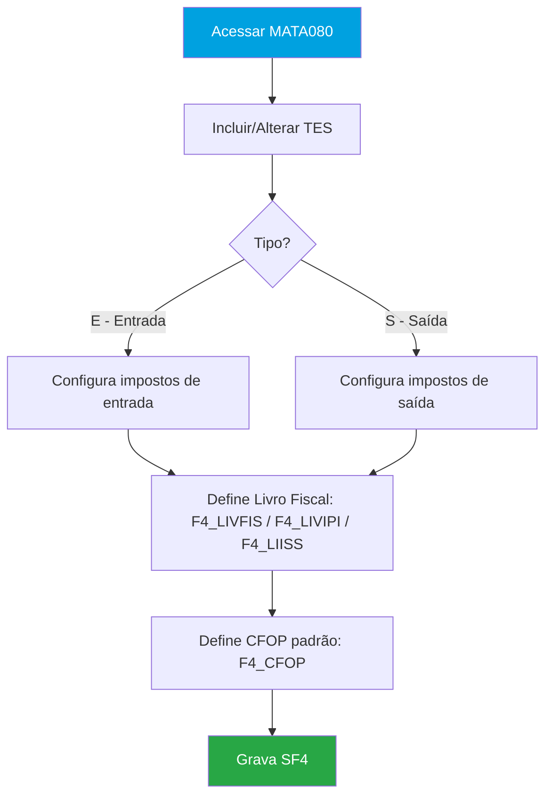
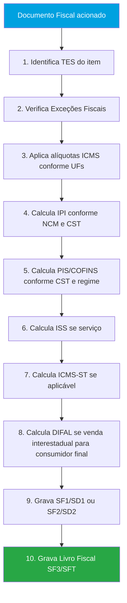
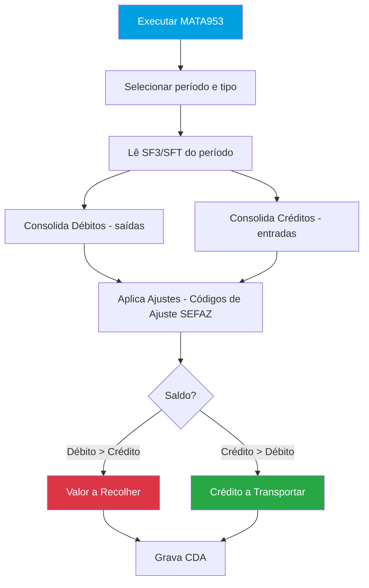
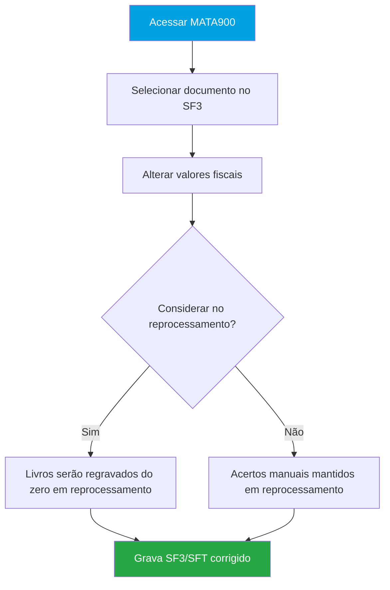
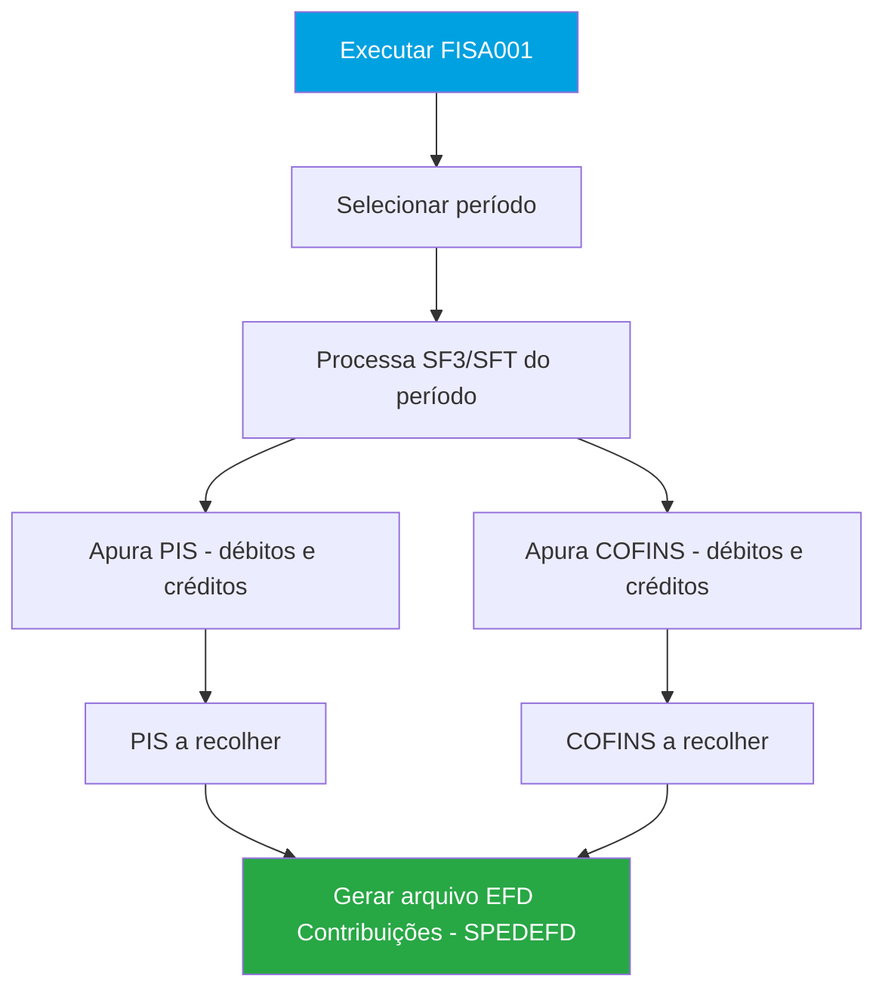
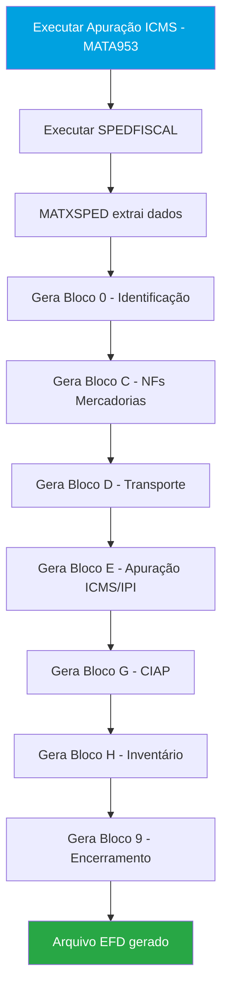
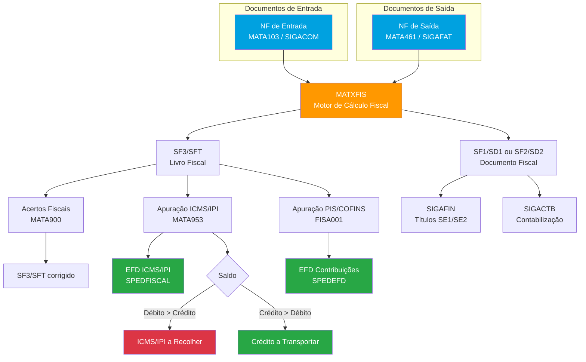
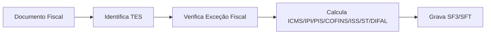

# SIGAFIS — Fluxo Completo dos Livros Fiscais no Protheus

## 1. Objetivo do Módulo

O **SIGAFIS** (Livros Fiscais) é o módulo do Protheus responsável pela escrituração fiscal da empresa. Recebe os documentos fiscais dos demais módulos (SIGACOM, SIGAFAT), calcula e apura os impostos incidentes (ICMS, IPI, PIS, COFINS, ISS, ICMS-ST, DIFAL) e gera as obrigações acessórias exigidas pelo Fisco (EFD ICMS/IPI, EFD Contribuições, GIA, SINTEGRA, entre outras).

**Sigla:** SIGAFIS
**Menu principal:** Atualizações > Livros Fiscais
**Integra com:** SIGACOM (compras), SIGAFAT (faturamento), SIGAFIN (financeiro), SIGACTB (contábil)

**Objetivos principais:**
- Escrituração dos Livros Fiscais de Entrada e Saída (SF3/SFT)
- Cálculo automático de ICMS, IPI, PIS, COFINS, ISS, ICMS-ST e DIFAL
- Apuração mensal de impostos (ICMS/IPI, PIS/COFINS)
- Geração de arquivos magnéticos (EFD Fiscal, EFD Contribuições, SINTEGRA, GIA)
- Controle de exceções fiscais por produto/cliente/fornecedor/UF
- Acertos manuais nos livros fiscais (`MATA900`)

**Nomenclatura do módulo:**

| Sigla | Significado |
|-------|------------|
| TES | Tipo de Entrada/Saída — regra fiscal que define cálculo de impostos por operação |
| CFOP | Código Fiscal de Operações e Prestações — natureza da operação |
| CST | Código de Situação Tributária — situação de cada imposto no item |
| NCM | Nomenclatura Comum do Mercosul — classificação fiscal do produto |
| EFD | Escrituração Fiscal Digital — arquivo SPED obrigatório |
| MATXFIS | Motor de Cálculo Fiscal — engine central que calcula todos os impostos |

---

## 2. Parametrização Geral do Módulo

Parâmetros MV_ que afetam o módulo como um todo (não específicos de uma única rotina).

### ICMS e Geral

| Parâmetro | Descrição | Padrão | Tipo | Impacto |
|-----------|-----------|--------|------|---------|
| `MV_ESTADO` | UF da empresa (define intra/interestadual) | SP | C(2) | Cálculo fiscal em todas as rotinas |
| `MV_ALIQICM` | Alíquota padrão ICMS interna | 18 | N | Alíquota ICMS quando não definida por UF |
| `MV_ICMS7` | Alíquota ICMS interestadual 7% | 7 | N | Operações Sul/Sudeste → N/NE/CO/ES |
| `MV_ICMS12` | Alíquota ICMS interestadual 12% | 12 | N | Operações Sul/Sudeste → Sul/Sudeste |
| `MV_ICMSST` | Utiliza ICMS-ST nas operações | — | L | Habilita substituição tributária |
| `MV_DIFAL` | Calcula DIFAL (EC 87/2015) | — | L | Diferencial de alíquota interestadual |
| `MV_CODRSEF` | Códigos de retorno SEFAZ válidos para apuração | — | C | Controla quais NFs entram na apuração ICMS |

### PIS e COFINS

| Parâmetro | Descrição | Padrão | Tipo | Impacto |
|-----------|-----------|--------|------|---------|
| `MV_PISVEND` | Calcula PIS nas saídas | — | L | Habilita débito PIS nas saídas |
| `MV_COFVEND` | Calcula COFINS nas saídas | — | L | Habilita débito COFINS nas saídas |
| `MV_PISENT` | Calcula PIS nas entradas | — | L | Habilita crédito PIS nas entradas |
| `MV_COFENT` | Calcula COFINS nas entradas | — | L | Habilita crédito COFINS nas entradas |
| `MV_CFAREC` | CFOPs adicionais para PIS/COFINS nas saídas | — | C | Inclui CFOPs não listados no padrão |
| `MV_REGPIS` | Regime tributário PIS (Cumulativo/Não Cumulativo) | — | C | Define regime tributário da empresa |

### IPI

| Parâmetro | Descrição | Padrão | Tipo | Impacto |
|-----------|-----------|--------|------|---------|
| `MV_IPISC` | IPI compõe custo do produto na entrada | N | L | Afeta custo de todos os itens |
| `MV_ALIQIPI` | Alíquota padrão de IPI | — | N | Alíquota IPI quando não definida por NCM |

### SPED e Obrigações

| Parâmetro | Descrição | Padrão | Tipo | Impacto |
|-----------|-----------|--------|------|---------|
| `MV_SPED` | Indica uso do SPED Fiscal | — | L | Ativa funcionalidades SPED em todo o módulo |
| `MV_USECDA` | Usa tabela CDA na apuração | T | L | Grava lançamentos por documento fiscal |
| `MV_SPEDPROD` | Livros de sub-apuração × livros SPED | — | C | Relação entre livros internos e SPED |
| `MV_IBPTTIP` | Ente tributário para exibição da carga IBPT no DANFE | — | C | Lei da Transparência Fiscal 12.741/2012 |

### Retenções

| Parâmetro | Descrição | Padrão | Tipo | Impacto |
|-----------|-----------|--------|------|---------|
| `MV_ALIQIR` | Alíquota padrão de IRRF | — | N | Retenções na fonte sobre serviços |
| `MV_ALIQINS` | Alíquota padrão de INSS | — | N | Retenções na fonte sobre serviços |
| `MV_ALIQCSLL` | Alíquota padrão de CSLL | — | N | Retenções na fonte sobre serviços |

> ⚠️ **Atenção:** Alteração de parâmetros globais afeta TODAS as rotinas do módulo.
> Teste em ambiente de homologação antes de alterar em produção.

---

## 3. Cadastros Fundamentais

### 3.1 TES — Tipo de Entrada/Saída — `MATA080` (`SF4`)

**Menu:** Atualizações > Cadastros > Tipos de Entrada e Saída
**Tabela:** `SF4` — Tipo de Entrada/Saída

A **TES** é o cadastro mais importante do SIGAFIS. Define, para cada operação fiscal, quais impostos são calculados, como são calculados e como são escriturados nos livros fiscais.

| Campo | Descrição | Tipo | Obrigatório |
|-------|-----------|------|-------------|
| `F4_CODIGO` | Código da TES | C(3) | Sim |
| `F4_DESCRI` | Descrição | C(30) | Sim |
| `F4_TIPO` | Tipo: E=Entrada / S=Saída | C(1) | Sim |
| `F4_ESTOQUE` | Atualiza estoque: S/N | C(1) | Sim |
| `F4_DUPLIC` | Gera duplicata (título financeiro): S/N | C(1) | Sim |
| `F4_FINANC` | Movimenta financeiro: S/N | C(1) | Sim |
| `F4_LIVFIS` | Gera livro fiscal (SF3): S=ICMS / N=Não grava | C(1) | Sim |
| `F4_LIVIPI` | Gera livro fiscal IPI: S/N | C(1) | Sim |
| `F4_LIISS` | Gera livro fiscal ISS: S/N | C(1) | Sim |
| `F4_CALC_IC` | Calcula ICMS: S/N | C(1) | Sim |
| `F4_CALCIPI` | Calcula IPI: S/N | C(1) | Sim |
| `F4_PISCOF` | Calcula PIS/COFINS: A=Ambos / N=Nenhum | C(1) | Sim |
| `F4_PISCRED` | PIS/COF: D=Débito (saída) / C=Crédito (entrada) | C(1) | — |
| `F4_CSTPIS` | CST do PIS (01 a 49=saída / 50 a 66=entrada/crédito) | C(2) | — |
| `F4_CSTCOF` | CST do COFINS | C(2) | — |
| `F4_TPREG` | Regime PIS/COFINS: Cumulativo / Não Cumulativo / Ambos | C(1) | — |
| `F4_CODBCC` | Código da base de crédito PIS/COFINS | C(2) | — |
| `F4_ISS` | Calcula ISS: S/N | C(1) | — |
| `F4_ICMSST` | Calcula ICMS-ST: S/N | C(1) | — |
| `F4_AGRVAL` | Agrega valor (frete compõe BC impostos): S/N | C(1) | — |
| `F4_MATCONS` | Material de consumo: S/N | C(1) | — |
| `F4_SITUA` | Situação tributária do ICMS (CST) | C(3) | — |
| `F4_CODIPI` | Código IPI | C(2) | — |
| `F4_CFOP` | CFOP padrão vinculado à TES | C(5) | — |
| `F4_PISDSZF` | PIS com redução para Zona Franca de Manaus: S/N | C(1) | — |
| `F4_COFDSZF` | COFINS com redução ZFM: S/N | C(1) | — |

**TES na aba Lançamentos da Apuração de ICMS:** Permite configurar lançamentos automáticos com Códigos de Ajuste durante a emissão do documento fiscal — alimentando automaticamente a Apuração de ICMS (`MATA953`) e o SPED Fiscal (registros C197, D197, E111, E220).

> **Nota:** PE relacionado: `MA080BUT` — adiciona botões na tela de TES.

### 3.2 CFOP — Código Fiscal de Operações

O CFOP é o código que identifica a natureza da operação fiscal.

**Cadastro:** Atualizações > Cadastros > Códigos Fiscais (SX5 tabela 13)

| Faixa | Natureza |
|-------|----------|
| 1.xxx | Entrada dentro do estado (interna) |
| 2.xxx | Entrada de outro estado (interestadual) |
| 3.xxx | Entrada do exterior (importação) |
| 5.xxx | Saída dentro do estado (interna) |
| 6.xxx | Saída para outro estado (interestadual) |
| 7.xxx | Saída para o exterior (exportação) |

**CFOPs na TES:** O campo `F4_CFOP` define o CFOP padrão. Pode ser sobreposto por exceção fiscal, UF do cliente/fornecedor ou parâmetros específicos.

### 3.3 NCM — Nomenclatura Comum do Mercosul

Classificação fiscal dos produtos, exigida no XML da NF-e e no SPED.

**Cadastro:** Campo `B1_POSIPI` no cadastro de produtos (`SB1`) — código NCM com 8 dígitos.

**Importância:** A NCM define:
- Alíquota de IPI (por tabela TIPI)
- Sujeição ao ICMS-ST (pauta por NCM)
- Registros do SPED Fiscal (registro 0200)

### 3.4 Exceção Fiscal — `MATA086`

**Menu:** Atualizações > Facilitadores > Exceção Fiscal
**Rotina:** `MATA086`

Permite cadastrar regras fiscais específicas para combinações de produto x cliente/fornecedor x UF, sobrepondo a TES padrão.

**Quando usar:**
- Produtos com ICMS-ST em determinados estados
- Alíquotas diferenciadas por NCM e UF de destino
- Regimes especiais de tributação (ex: Zona Franca de Manaus)
- DIFAL para consumidor final em operações interestaduais

**Hierarquia de busca da TES Inteligente:**
1. Exceção Fiscal específica (produto + cliente/fornecedor + UF)
2. Exceção por NCM
3. TES padrão no cadastro de produtos (`B1_TS`)
4. Parâmetro `MV_TESVEND` / `MV_TESSERV`

### 3.5 Municípios — `FISA010` (`CC2`)

**Menu:** Atualizações > Cadastros > Municípios
**Tabela:** `CC2` — Municípios com código IBGE

Cadastro de municípios com código IBGE — obrigatório para NFS-e (ISS) e para o SPED.

> ⚠️ A tabela `CC2` **não se atualiza automaticamente**. Deve ser atualizada manualmente ou via importação quando há novos municípios ou alteração de códigos IBGE.

### 3.6 Tabela IBPT

Tabela do Instituto Brasileiro de Planejamento Tributário — obrigatória para exibição da carga tributária total no DANFE (Lei da Transparência Fiscal 12.741/2012).

**Importação:** Via rotina específica no SIGAFIS ou via parâmetro de atualização automática.
**Parâmetro:** `MV_IBPTTIP` — define por qual ente tributário exibir (Federal, Estadual, Municipal).

---

## 4. Rotinas

### 4.1 `MATA080` — TES (Tipo de Entrada/Saída)

**Objetivo:** Cadastro do tipo de entrada e saída, definindo regras fiscais para cálculo de impostos e escrituração em livros fiscais.
**Menu:** Atualizações > Cadastros > Tipos de Entrada e Saída
**Tipo:** Cadastro / Manutenção

#### Tabelas

| Tabela | Alias | Descrição | Tipo |
|--------|-------|-----------|------|
| SF4 | SF4 | Tipo de Entrada/Saída | Principal |

#### Campos Principais

Ver seção 3.1 para listagem completa dos campos da `SF4`.

#### Parâmetros MV_ desta Rotina

| Parâmetro | Descrição | Padrão | Tipo | Quando usar |
|-----------|-----------|--------|------|-------------|
| `MV_TESVEND` | TES padrão para vendas | — | C | Quando não há TES no cadastro de produto |
| `MV_TESSERV` | TES padrão para serviços | — | C | Quando não há TES no cadastro de produto de serviço |

#### Pontos de Entrada

| Ponto de Entrada | Momento de Execução | Descrição | Parâmetros |
|-----------------|---------------------|-----------|------------|
| `MA080BUT` | Na abertura da tela | Adiciona botões na rotina de TES | - |

#### Fluxo da Rotina

---

### 4.2 `MATXFIS` — Motor de Cálculo Fiscal

**Objetivo:** Engine central de cálculo fiscal do Protheus. Acionado automaticamente por todas as rotinas que emitem ou recebem documentos fiscais.
**Menu:** Não possui menu — acionado internamente por outras rotinas.
**Tipo:** Processamento (automático)

#### Tabelas

| Tabela | Alias | Descrição | Tipo |
|--------|-------|-----------|------|
| SF4 | SF4 | TES — regra fiscal | Entrada |
| SF3 | SF3 | Livro Fiscal (cabeçalho) | Saída |
| SFT | SFT | Livro Fiscal por Item | Saída |
| SF1 | SF1 | Cabeçalho NF Entrada | Entrada/Saída |
| SD1 | SD1 | Itens NF Entrada | Entrada/Saída |
| SF2 | SF2 | Cabeçalho NF Saída | Entrada/Saída |
| SD2 | SD2 | Itens NF Saída | Entrada/Saída |

#### Rotinas que acionam o MATXFIS

| Rotina | Descrição | Módulo |
|--------|-----------|--------|
| `MATA103` | Documento de Entrada | SIGACOM |
| `MATA461` / `MATA460A` | Documento de Saída | SIGAFAT |
| `MATA410` | Pedido de Venda | SIGAFAT |
| `MATA910` | NF Manual de Entrada | SIGAFIS |
| `MATA920` | NF Manual de Saída | SIGAFIS |
| `FINA050` / `FINA040` | Títulos com retenção de imposto | SIGAFIN |

#### O que o MATXFIS calcula

- ICMS (alíquota intra/interestadual, redução de BC, isenção)
- IPI (por NCM e tabela TIPI)
- PIS e COFINS (cumulativo e não cumulativo, por CST)
- ISS (por código de serviço e município)
- ICMS-ST (por pauta de preço ou MVA)
- DIFAL (Diferencial de Alíquota — EC 87/2015)
- FECP (Fundo de Combate à Pobreza — adicional ICMS até 2% em alguns estados)
- IRRF, INSS, CSLL (retenções na fonte em serviços)

#### Parâmetros MV_ desta Rotina

| Parâmetro | Descrição | Padrão | Tipo | Quando usar |
|-----------|-----------|--------|------|-------------|
| `MV_ESTADO` | UF da empresa | SP | C(2) | Define cálculo intra/interestadual |
| `MV_ALIQICM` | Alíquota padrão ICMS interna | 18 | N | Quando não definida por UF |
| `MV_ICMS7` | Alíquota ICMS interestadual 7% | 7 | N | Operações para N/NE/CO/ES |
| `MV_ICMS12` | Alíquota ICMS interestadual 12% | 12 | N | Operações para S/SE |
| `MV_DIFAL` | Calcula DIFAL (EC 87/2015) | — | L | Venda interestadual para consumidor final |

#### Pontos de Entrada

| Ponto de Entrada | Momento de Execução | Descrição | Parâmetros |
|-----------------|---------------------|-----------|------------|
| `FISXFIS` | Antes de gravar o cálculo | Permite customizar o cálculo fiscal antes de gravar | - |
| `FISBCICM` | Durante cálculo do ICMS | Altera a base de cálculo do ICMS | - |
| `FISBCIPI` | Durante cálculo do IPI | Altera a base de cálculo do IPI | - |
| `FISBCPIS` | Durante cálculo do PIS | Altera a base de cálculo do PIS | - |
| `FISBCCOF` | Durante cálculo do COFINS | Altera a base de cálculo do COFINS | - |
| `FISALICM` | Durante cálculo do ICMS | Altera a alíquota do ICMS | - |
| `FISALIPI` | Durante cálculo do IPI | Altera a alíquota do IPI | - |
| `FISALISS` | Durante cálculo do ISS | Altera a alíquota do ISS | - |

#### Fluxo da Rotina

---

### 4.3 `MATA953` — Apuração de ICMS/IPI

**Objetivo:** Processa e apura o ICMS e IPI do período, consolidando débitos e créditos para calcular o valor a recolher ou crédito a transportar.
**Menu:** Miscelânea > Apurações > Apuração de ICMS
**Tipo:** Processamento

#### Tabelas

| Tabela | Alias | Descrição | Tipo |
|--------|-------|-----------|------|
| SF3 | SF3 | Livro Fiscal (cabeçalho) | Entrada |
| SFT | SFT | Livro Fiscal por Item | Entrada |
| CDA | CDA | Lançamentos de Apuração por Documento Fiscal | Saída |
| CE0 | CE0 | Códigos de Reflexo / Ajuste ICMS | Entrada |

#### Processo

1. Selecionar período e tipo de apuração (ICMS ou IPI)
2. Sistema lê `SF3`/`SFT` do período
3. Consolida débitos (saídas) e créditos (entradas)
4. Aplica ajustes de apuração (Códigos de Ajuste)
5. Calcula saldo a recolher ou crédito

**Abas da apuração:**
- Por Saídas/Prestações com Débito do Imposto
- Por Entradas/Aquisições com Crédito do Imposto
- Ajustes (E111 / E220 no SPED)

**Conferência de Apuração (novidade 12.1.27+):** Habilita browser com detalhamento de quais NFs compõem cada valor na apuração — facilita auditorias e identificação de divergências.

**Divergência `MATA953` x `MATR930` (Regime de Processamento de Dados):** O `MATR930` lista todas as NFs que têm livros fiscais. A `MATA953` só considera NFs com código de retorno SEFAZ válido (`F3_CODRSEF`). Verificar parâmetro `MV_CODRSEF` para reconciliar.

#### Parâmetros MV_ desta Rotina

| Parâmetro | Descrição | Padrão | Tipo | Quando usar |
|-----------|-----------|--------|------|-------------|
| `MV_CODRSEF` | Códigos de retorno SEFAZ válidos para apuração | — | C | Controlar quais NFs entram na apuração |
| `MV_USECDA` | Usa tabela CDA na apuração | T | L | Quando precisa de lançamentos por documento |

#### Pontos de Entrada

| Ponto de Entrada | Momento de Execução | Descrição | Parâmetros |
|-----------------|---------------------|-----------|------------|
| `MA953BF` | Antes do processamento | Executado antes do processamento da apuração | - |
| `MA953AF` | Após o processamento | Executado após o processamento da apuração | - |

#### Fluxo da Rotina

---

### 4.4 `MATA900` — Acertos Fiscais

**Objetivo:** Permite corrigir manualmente os valores escriturados no Livro Fiscal (`SF3`/`SFT`) sem retratar o documento fiscal de origem.
**Menu:** Miscelânea > Acertos > Acertos Fiscais
**Tipo:** Manutenção

#### Tabelas

| Tabela | Alias | Descrição | Tipo |
|--------|-------|-----------|------|
| SF3 | SF3 | Livro Fiscal (cabeçalho) | Alteração |
| SFT | SFT | Livro Fiscal por Item | Alteração |

#### O que pode ser alterado

- CFOP (único campo que é retratado até a NF de origem)
- Data de Entrada/Saída (retratada até a origem)
- Valores de impostos (`SF3`/`SFT` apenas — diverge da NF original)
- Código de Serviço, Observações, Espécie

> ⚠️ Alterações via `MATA900` afetam obrigações acessórias (SINTEGRA, GIA, EFD). O sistema exibe aviso antes de confirmar. Campo "Considerar no reprocessamento?" controla se a nota será reprocessada:
> - **Sim** — Exclui os livros e regera do zero (eliminando acertos anteriores)
> - **Não** — Mantém os acertos manuais no reprocessamento

**Tabelas afetadas:** `SF3`, `SFT` (não afeta `SF1`/`SD1` ou `SF2`/`SD2`)

#### Fluxo da Rotina

---

### 4.5 `FISA001` — Apuração EFD Contribuições

**Objetivo:** Apuração mensal do PIS e COFINS para geração do arquivo EFD Contribuições.
**Menu:** Miscelânea > Apurações > Apuração EFD Contribuições
**Tipo:** Processamento

#### Tabelas

| Tabela | Alias | Descrição | Tipo |
|--------|-------|-----------|------|
| SF3 | SF3 | Livro Fiscal (cabeçalho) | Entrada |
| SFT | SFT | Livro Fiscal por Item | Entrada |

> ⚠️ **Obrigatório executar `FISA001` antes de gerar o arquivo EFD Contribuições.** O arquivo é baseado nas informações processadas pela apuração, não diretamente no `SF3`.

#### Fluxo da Rotina

---

### 4.6 `FISA072` — Códigos de Ajuste e Reflexos (`CE0`)

**Objetivo:** Configurar os Códigos de Ajuste da SEFAZ para lançamentos manuais na Apuração de ICMS, sem depender de homologação da TOTVS.
**Menu:** Atualizações > SPED > Códigos de Reflexo
**Tipo:** Cadastro / Manutenção

#### Tabelas

| Tabela | Alias | Descrição | Tipo |
|--------|-------|-----------|------|
| CE0 | CE0 | Códigos de Reflexo — Apuração de ICMS | Principal |

#### Importação dos códigos

| Rotina | Descrição |
|--------|-----------|
| `UPDFIS` | Atualiza dicionário + importa tabela de códigos ao final |
| `IMPSPED` | Atualiza tabelas de códigos IBGE, BCB e permite importar códigos SPED |

**Lançamentos automáticos:** Configurar na TES (aba Lançamentos da Apuração de ICMS) — o sistema lança automaticamente o Código de Ajuste ao emitir o documento fiscal.

**Reflexos gerados no SPED:**

| Registro | Descrição |
|----------|-----------|
| C197 | Ajustes por documento de saída |
| D197 | Ajustes de documentos de transporte |
| E111 | Ajustes da apuração ICMS |
| E220 | Ajustes da apuração ICMS-ST |

---

### 4.7 `SPEDFISCAL` — Geração EFD ICMS/IPI

**Objetivo:** Gerar o arquivo da Escrituração Fiscal Digital (EFD ICMS/IPI) — obrigação acessória mensal.
**Menu:** Miscelânea > Arq. Magnéticos > Sped Fiscal
**Tipo:** Processamento / Geração de arquivo

#### Tabelas

| Tabela | Alias | Descrição | Tipo |
|--------|-------|-----------|------|
| SF3 | SF3 | Livro Fiscal (cabeçalho) | Entrada |
| SFT | SFT | Livro Fiscal por Item | Entrada |
| CDA | CDA | Lançamentos de Apuração por Documento | Entrada |
| CE0 | CE0 | Códigos de Reflexo | Entrada |

**Pré-requisito:** Executar Apuração de ICMS (`MATA953`) antes de gerar o arquivo.

**Rotinas complementares:**
- `MATXFIS` — motor de cálculo (alimenta `SF3`/`SFT`)
- `MATXSPED` — extração dos dados para o arquivo SPED

#### Parâmetros MV_ desta Rotina

| Parâmetro | Descrição | Padrão | Tipo | Quando usar |
|-----------|-----------|--------|------|-------------|
| `MV_SPED` | Indica uso do SPED Fiscal | — | L | Ativar funcionalidades SPED |
| `MV_USECDA` | Usar tabela CDA na apuração | T | L | Lançamentos por documento |
| `MV_SPEDPROD` | Relação livros sub-apuração x livros SPED | — | C | Sub-apurações fiscais |
| `MV_CODRSEF` | Códigos de retorno SEFAZ válidos | — | C | Filtrar NFs na apuração |

#### Pontos de Entrada

| Ponto de Entrada | Momento de Execução | Descrição | Parâmetros |
|-----------------|---------------------|-----------|------------|
| `ECDCHVCAB` | Durante exportação EFD | Manipulação da chave na exportação para EFD | - |
| `ECDCHVMOV` | Durante exportação EFD | Manipulação da chave de movimentos na EFD | - |

#### Fluxo da Rotina

---

## 6. Tipos e Classificações

### 6.1 CST ICMS (3 dígitos — Origem + Situação)

**Primeiro dígito (Origem da mercadoria):**

| Codigo | Origem |
|--------|--------|
| 0 | Nacional |
| 1 | Estrangeira — importação direta |
| 2 | Estrangeira — adquirida internamente |
| 3 | Nacional — conteúdo de importação > 40% e <= 70% |
| 4 | Nacional — processos produtivos básicos |
| 5 | Nacional — conteúdo importação <= 40% |
| 6 | Estrangeira — sem similar nacional — lista CAMEX |
| 7 | Estrangeira — importação direta — sem similar nacional — lista CAMEX |
| 8 | Nacional — conteúdo importação > 70% |

**Dois ultimos dígitos (Situação Tributária ICMS):**

| CST | Descrição | Comportamento |
|-----|-----------|---------------|
| 00 | Tributada integralmente | ICMS calculado sobre a base integral |
| 10 | Tributada e com cobrança do ICMS-ST | ICMS próprio + ICMS-ST retido |
| 20 | Com redução de BC | ICMS com base reduzida |
| 30 | Isenta ou não tributada e com cobrança ICMS-ST | Sem ICMS próprio, com ICMS-ST |
| 40 | Isenta | Não calcula ICMS |
| 41 | Não tributada | Não calcula ICMS |
| 50 | Suspensão | ICMS suspenso |
| 51 | Diferimento | ICMS diferido para etapa posterior |
| 60 | ICMS cobrado anteriormente por ST | Substituído — ICMS já retido |
| 70 | Redução da BC e cobrança de ICMS-ST | BC reduzida + ICMS-ST |
| 90 | Outros | Situações não previstas nos códigos anteriores |

### 6.2 CST IPI

| CST | Descrição | Uso típico |
|-----|-----------|------------|
| 00 | Entrada com recuperação de crédito | Entradas de insumos industriais |
| 49 | Outras entradas | Entradas sem crédito |
| 50 | Saída tributada | Saída de produtos industrializados |
| 51 | Saída tributada com alíquota zero | Produto com alíquota zero |
| 52 | Saída isenta | Operação isenta de IPI |
| 53 | Saída não tributada | Não incidência de IPI |
| 99 | Outras saídas | Demais situações |

### 6.3 CST PIS/COFINS — Saídas (01 a 49)

| CST | Descrição | Uso típico |
|-----|-----------|------------|
| 01 | Operação tributável com alíquota básica | Vendas tributadas normalmente |
| 02 | Operação tributável com alíquota diferenciada | Produtos com alíquota especial |
| 04 | Operação tributável monofásica — revendedor | Revenda de monofásicos |
| 06 | Operação tributável — alíquota zero | Produtos com alíquota zero |
| 07 | Operação isenta da contribuição | Operações isentas |
| 08 | Operação sem incidência | Não incidência |
| 09 | Operação com suspensão | Suspensão da contribuição |
| 49 | Outras operações de saída | Demais saídas |

### 6.4 CST PIS/COFINS — Entradas (50 a 66)

| CST | Descrição | Uso típico |
|-----|-----------|------------|
| 50 | Crédito vinculado exclusivamente a receita tributada | Entradas com crédito integral |
| 51 | Crédito vinculado exclusivamente a receita não tributada | Entradas sem crédito |
| 52 | Crédito vinculado exclusivamente a receita de exportação | Exportadores |
| 53 | Crédito proporcional | Receita mista |
| 60 | Crédito presumido | Crédito presumido por legislação |
| 66 | Outras operações de entrada com crédito | Demais entradas com crédito |

### 6.5 Impostos — Tipos e Alíquotas

#### ICMS — Alíquotas interestaduais

| Origem | Destino | Alíquota |
|--------|---------|----------|
| Qualquer UF | Qualquer UF (produto estrangeiro) | 4% (Res. 13/2012) |
| Sul/Sudeste | Norte/Nordeste/CO/ES | 7% |
| Sul/Sudeste | Sul/Sudeste (exceto ES) | 12% |
| Qualquer UF | Mesma UF | Alíquota interna (7% a 25%) |

#### PIS/COFINS — Regimes

| Regime | PIS | COFINS | Crédito |
|--------|-----|--------|---------|
| Cumulativo | 0,65% | 3% | Não |
| Não Cumulativo | 1,65% | 7,6% | Sim (nas entradas) |

#### ICMS-ST — Cálculo

Base ST = (Valor produto + IPI + frete + outras despesas) x (1 + MVA%)
ICMS-ST = Base ST x Alíquota ST - ICMS próprio já destacado

**FECP (Fundo de Combate a Pobreza):** Adicional de até 2% no ICMS-ST em alguns estados (ex: RJ, CE, AL). Configurado via parâmetros específicos por UF.

#### DIFAL — Diferencial de Alíquota

DIFAL = (Alíquota interna UF destino - Alíquota interestadual) x Base de cálculo

Aplica-se a operações interestaduais com consumidor final (não contribuinte do ICMS) — EC 87/2015.

#### ISS — Imposto Sobre Serviços

Imposto municipal, incide sobre prestação de serviços. Alíquota definida por código de serviço e município.

**Cadastros necessários:**
- Código de Serviço (tabela municipal) — cadastrado por município
- Município do tomador/prestador (`CC2`)
- NFS-e: configuração via TSS para emissão eletrônica

#### IRRF, INSS, CSLL — Retenções

Retenções na fonte sobre pagamentos de serviços.

**Configuração:**
- Cadastro de Clientes (`SA1`): `A1_RECINSS`, `A1_RECIRRF`
- Cadastro de Fornecedores (`SA2`): `A2_RECINSS`, `A2_RECIRRF`
- Cadastro de Produtos (`SB1`): `B1_INSS`
- TES: campos específicos por imposto de retenção

**Títulos de retenção:** Gerados automaticamente no Contas a Pagar (`SE2`) ou Contas a Receber (`SE1`) quando configurado.

---

## 7. Tabelas do Módulo

Visão consolidada de todas as tabelas usadas no módulo.

### Tabelas de Cadastro

| Tabela | Descrição | Rotina Principal | Obs |
|--------|-----------|-----------------|-----|
| SF4 | TES — Tipo de Entrada/Saída | `MATA080` | Cadastro central do módulo |
| SX5 (tabela 13) | CFOPs | Configurador | Compartilhada |
| CC2 | Municípios (IBGE) | `FISA010` | Obrigatório para NFS-e e SPED |
| CE0 | Códigos de Reflexo — Apuração de ICMS | `FISA072` | Ajustes SEFAZ |
| CD1-CD9 | Complementos fiscais (importação, combustíveis...) | — | Tabelas auxiliares |

### Tabelas de Movimento

| Tabela | Descrição | Rotina Principal | Volume |
|--------|-----------|-----------------|--------|
| SF3 | Livro Fiscal (cabeçalho por NF) | `MATXFIS` (automático) | Alto |
| SFT | Livro Fiscal por Item | `MATXFIS` (automático) | Muito Alto |
| CDA | Lançamentos de Apuração por Documento Fiscal | `MATA953` | Alto |

### Tabelas de Documento Fiscal (origem)

| Tabela | Descrição | Origem |
|--------|-----------|--------|
| SF1 | Cabeçalho NF de Entrada | SIGACOM |
| SD1 | Itens NF de Entrada | SIGACOM |
| SF2 | Cabeçalho NF de Saída | SIGAFAT |
| SD2 | Itens NF de Saída | SIGAFAT |

---

## 8. Fluxo Geral do Módulo

Diagrama completo do fluxo do módulo, mostrando como as rotinas se conectam entre si e com outros módulos.

**Legenda de cores:**
- Azul: Início do processo (documentos de entrada/saída)
- Laranja: Motor de cálculo central
- Verde: Conclusão / Obrigação gerada / Crédito
- Vermelho: Valor a recolher

---

## 9. Integrações com Outros Módulos

| Módulo | Integração | Tabela Ponte | Direção | Momento |
|--------|-----------|-------------|---------|---------|
| SIGACOM | NFs de entrada — MATXFIS calcula impostos | SF3/SFT | COM -> FIS | Na classificação da NF de entrada |
| SIGAFAT | NFs de saída — MATXFIS calcula impostos | SF3/SFT | FAT -> FIS | Na emissão da NF de saída |
| SIGAFIN | Retenções (IRRF, INSS, CSLL) geram títulos; integra ao EFD-Reinf | SE1/SE2 | FIS -> FIN | Na emissão do documento com retenção |
| SIGACTB | ICMS, IPI, PIS, COFINS contabilizados via Lançamentos Padrão | CT2 | FIS -> CTB | On-line ou Off-line |
| SIGAEST | Inventário físico — Bloco H do SPED Fiscal | SB2 | EST -> FIS | Na geração do SPED (`MATR460`) |
| SIGATEC | Controle do Crédito ICMS Ativo Permanente (CIAP) — Bloco G do SPED | — | TEC -> FIS | Na geração do SPED |
| TSS/SEFAZ | Autorização de NF-e; código de retorno gravado em `F3_CODRSEF` | SF3 | FIS <-> TSS | Na transmissão da NF-e |
| EFD-Reinf | Retenções de PIS/COFINS/CSLL/IRRF sobre serviços | — | FIS -> Reinf | Obrigação acessória |

---

## 10. Controles Especiais

### 10.1 Motor de Cálculo Fiscal — `MATXFIS`

**Objetivo:** Engine central que calcula todos os impostos incidentes sobre documentos fiscais no Protheus.
**Parâmetro ativador:** Acionado automaticamente por qualquer rotina de documento fiscal.

O `MATXFIS` é invocado internamente pelas rotinas de entrada (`MATA103`, `MATA910`) e saída (`MATA461`, `MATA920`, `MATA410`) e executa a sequência completa de cálculo fiscal: identifica a TES, verifica exceções fiscais, aplica alíquotas e grava os resultados nos livros fiscais (`SF3`/`SFT`).

**Impostos calculados:** ICMS, IPI, PIS, COFINS, ISS, ICMS-ST, DIFAL, FECP, IRRF, INSS, CSLL.

**Personalização via PEs:** `FISXFIS`, `FISBCICM`, `FISBCIPI`, `FISBCPIS`, `FISBCCOF`, `FISALICM`, `FISALIPI`, `FISALISS`.

### 10.2 Configurador de Tributos

**Objetivo:** Ferramenta avançada que permite configurar o cálculo de impostos que não são suportados nativamente pelas rotinas padrão do SIGAFIS.
**Menu:** Atualizações > Facilitadores > Configurador de Tributos

> ⚠️ **Leia o aviso antes de implantar.** O Configurador de Tributos é uma ferramenta poderosa mas que requer cuidado especial — pode impactar toda a cadeia de cálculo fiscal se configurado incorretamente.

**Quando usar:**
- Novos impostos não previstos no padrão (ex: novos fundos estaduais)
- Regras específicas por UF que não são atendidas pela exceção fiscal
- Cálculos tributários customizados para situações especiais

### 10.3 Extrator Fiscal — `EXTFISXTAF`

**Objetivo:** Integra os documentos fiscais do Protheus com sistemas externos de gestão tributária.
**Menu:** Módulo 09 — Livros Fiscais > Extrator Fiscal
**Rotina:** `EXTFISXTAF`

Exporta os dados fiscais (`SF3`/`SFT` + `SD1`/`SD2`) para formatos compatíveis com ferramentas de compliance fiscal externas (ex: Tax One, Synchro).

### 10.4 Livro Fiscal — Geração automática (`SF3`/`SFT`)

**Objetivo:** Escrituração automática dos livros fiscais a partir dos documentos fiscais.

O Livro Fiscal é gerado automaticamente pelo `MATXFIS` no momento em que o documento fiscal é incluído no sistema.

**Condições para geração (na TES):**
- `F4_LIVFIS` diferente de "N" — gera `SF3` com ICMS
- `F4_LIVIPI` = "S" — gera `SF3` com IPI
- `F4_LIISS` = "S" — gera `SF3` com ISS
- Para PIS/COFINS serem gravados no `SF3`/`SFT`: o campo Livro ICMS ou ISS deve ser diferente de "Não" na TES (regra de dependência)

**Campos Principais — `SF3`:**

| Campo | Descrição |
|-------|-----------|
| `F3_FILIAL` | Filial |
| `F3_DATA` | Data de emissão da NF |
| `F3_DATENT` | Data de entrada/saída |
| `F3_DOC` | Número da NF |
| `F3_SERIE` | Série da NF |
| `F3_FORNECE` | Fornecedor (entradas) |
| `F3_CLIENTE` | Cliente (saídas) |
| `F3_CFOP` | CFOP da operação |
| `F3_VALBRUT` | Valor bruto da operação |
| `F3_BASIMP` | Base de cálculo do ICMS |
| `F3_VALIMP` | Valor do ICMS |
| `F3_ALIMP` | Alíquota do ICMS |
| `F3_BASEIPI` | Base de cálculo do IPI |
| `F3_IPI` | Valor do IPI |
| `F3_ALIGST` | Alíquota ICMS-ST |
| `F3_ICMSST` | Valor ICMS-ST |
| `F3_VALPIS` | Valor do PIS |
| `F3_VALCOF` | Valor do COFINS |
| `F3_ISS` | Valor do ISS |
| `F3_TIPO` | Tipo do livro: E=Entrada / S=Saída |
| `F3_CODRSEF` | Código de retorno SEFAZ (controla inclusão na apuração) |
| `F3_DTLCTO` | Data de lançamento contábil |
| `F3_ESPECIE` | Espécie do documento fiscal (NF, NFS, CT-e...) |

### 10.5 Códigos de Ajuste e Reflexos — `FISA072` (`CE0`)

**Objetivo:** Configurar Códigos de Ajuste da SEFAZ para lançamentos manuais/automáticos na Apuração de ICMS.

**Lançamentos automáticos:** Configurar na TES (aba Lançamentos da Apuração de ICMS) — o sistema lança automaticamente o Código de Ajuste ao emitir o documento fiscal, alimentando registros C197, D197, E111, E220 do SPED.

---

## 11. Consultas e Relatórios

### Relatórios Oficiais

| Relatório | Rotina | Descrição | Saída |
|-----------|--------|-----------|-------|
| Livro Registro de Entradas | `MATR001` | Livro fiscal de entradas | PDF/Planilha |
| Livro Registro de Saídas | `MATR002` | Livro fiscal de saídas | PDF/Planilha |
| Livro Apuração do ICMS | `MATR004` | Apuração do ICMS | PDF/Planilha |
| Livro Apuração do IPI | `MATR005` | Apuração do IPI | PDF/Planilha |
| Livro Registro de Inventário | `MATR009` | Inventário físico | PDF/Planilha |
| Relação de Notas de Compras | `MATR100` | Notas fiscais de compra | PDF/Planilha |
| Registro de Inventário Modelo P7 | `MATR460` | Bloco H do SPED Fiscal | PDF/Planilha |
| Regime de Processamento de Dados | `MATR930` | Todas as NFs com livros fiscais | PDF/Planilha |
| Resumo por CFOP | `MATR940` | Valores consolidados por CFOP | PDF/Planilha |
| Resumo por CST | `MATR950` | Valores consolidados por CST | PDF/Planilha |

> **Nota:** O `MATR460` (Registro de Inventário Modelo P7) com parâmetro `Gerar Exp. SPED FISCAL = SIM` gera o Bloco H do SPED Fiscal. Data de fechamento do estoque = data do último fechamento.

---

## 12. Obrigações Acessórias

### 12.1 EFD ICMS/IPI (SPED Fiscal) — `SPEDFISCAL`

**Rotina:** `SPEDFISCAL`
**Periodicidade:** Mensal
**Prazo:** Definido por cada estado (geralmente até o 5o dia útil do mês seguinte, conforme Ajuste SINIEF 02/09)

A EFD ICMS/IPI (SPED Fiscal) é a escrituração digital obrigatória para contribuintes do ICMS e IPI.

**Pré-requisito:** Executar Apuração de ICMS (`MATA953`) antes de gerar o arquivo.

**Blocos do SPED Fiscal:**

| Bloco | Descrição | Tabela Fonte |
|-------|-----------|-------------|
| 0 | Abertura, identificação e referências | Empresa |
| C | Documentos Fiscais I — Mercadorias (ICMS/IPI) | SF1/SF2/SF3/SFT |
| D | Documentos Fiscais II — Serviços de Transporte | SF3/SFT |
| E | Apuração do ICMS e do IPI | CDA/CE0 |
| G | Controle do Crédito de ICMS do Ativo Permanente (CIAP) | SIGATEC |
| H | Inventário Físico | SB2 (`MATR460`) |
| 1 | Outras Informações | — |
| 9 | Controle e Encerramento do Arquivo | — |

**Registros importantes no Bloco C:**

| Registro | Descrição | Tabela Fonte |
|----------|-----------|-------------|
| C100 | Nota Fiscal (cabeçalho) | SF1/SF2 |
| C170 | Itens da NF | SD1/SD2 |
| C190 | Registro analítico do documento | SFT |
| C195 | Observações do lançamento fiscal | SF3 |
| C197 | Outras obrigações tributárias (ajustes) | CE0/CDA |

### 12.2 EFD Contribuições (PIS/COFINS) — `SPEDEFD`

**Rotina:** `SPEDEFD`
**Periodicidade:** Mensal
**Prazo:** Até o 10o dia útil do 2o mês subsequente ao que se refere a escrituração

Escrituração digital do PIS e COFINS — obrigatória para empresas do Lucro Real.

**Ordem obrigatória:**
1. Executar Apuração EFD Contribuições (`FISA001`)
2. Gerar arquivo EFD Contribuições (`SPEDEFD`)

**Parâmetros de geração:**
- Data inicial e final
- Livro desejado (ou `*` para todos)
- Filiais a processar
- Caminho e nome do arquivo gerado

**CFOPs considerados para PIS/COFINS (saídas):** Listagem padrão: 5101, 5102, 5103... 6101, 6102... Se o CFOP não estiver na lista, adicionar via parâmetro `MV_CFAREC`.

**Dedução de ICMS da BC de PIS/COFINS:** Para excluir o ICMS da base de cálculo do PIS/COFINS, configurar via rotina específica no SIGAFIS.

### 12.3 Escrituração Extemporanea

Documentos escriturados em período diferente da emissão.

**No Protheus:** Identificado na rotina `MATA910` (NF Manual de Entrada), em Complementos — campo "Extemporanea".

> **Regra:** Os campos `DT_DOC` (data do documento) e `DT_E_S` (data de entrada/saída) **não devem pertencer ao período de escrituração** — devem ser anteriores ao período informado no arquivo.

### 12.4 Outras Obrigações

| Obrigação | Descrição |
|-----------|-----------|
| GIA | Guia de Informação e Apuração do ICMS (estadual) |
| SINTEGRA | Sistema Integrado de Informações sobre Operações Interestaduais |
| DIRF | Declaração do Imposto de Renda Retido na Fonte |
| EFD-Reinf | Retenções de PIS/COFINS/CSLL/IRRF sobre serviços |

---

## 13. Referências

| Fonte | URL | Descrição |
|-------|-----|-----------|
| TDN – Fiscal Protheus 12 | https://tdn.totvs.com/display/public/PROT/Fiscal+-+Protheus+12 | Documentação oficial do módulo |
| Central TOTVS – Acertos Fiscais | https://centraldeatendimento.totvs.com/hc/pt-br/articles/360027494872 | MATA900 |
| Central TOTVS – Conferência Apuração | https://centraldeatendimento.totvs.com/hc/pt-br/articles/360032779933 | MATA953 |
| Central TOTVS – PIS/COFINS EFD | https://centraldeatendimento.totvs.com/hc/pt-br/articles/360039582893 | EFD Contribuições |
| Mastersiga – Códigos de Lançamento | https://mastersiga.tomticket.com/kb/livros-fiscais/cadsped-codigos-de-lancamento-e-reflexos-da-apuracao | Reflexos da apuração |
| Mastersiga – PIS/COFINS SF3/SFT | https://mastersiga.tomticket.com/kb/livros-fiscais/configuracao-pis-cofins-via-apuracao-para-correta-gravacao-dos-livros-fiscais-tabelas-sf3-e-sft-na-geracao-do-efd-contribuicoes | Configuração PIS/COFINS |
| Mastersiga – Bloco H SPED | https://mastersiga.tomticket.com/kb/livros-fiscais/sigafis-sped-fiscal-como-gerar-o-bloco-h-do-sped-fiscal | Bloco H do SPED Fiscal |
| Mastersiga – Divergência MATA953 x MATR930 | https://mastersiga.tomticket.com/kb/livros-fiscais/livros-fiscais-rotina-apuracao-de-imcs-rotina-mata953- | Reconciliação apuração |
| Central TOTVS – Leiaute EFD v013 | https://mastersiga.tomticket.com/kb/livros-fiscais/atualizacao-leiaute-efd-icms-ipi-para-versao-013 | Atualização leiaute |
| FBSolutions – SPED Contribuições | http://www.fbsolutions.com.br/erp-totvs-protheus/como-gerar-sped-contribuicoes-no-protheus/ | Como gerar SPED Contribuições |

> **Documento gerado para uso interno como referência técnica de desenvolvimento ADVPL/TLPP.**
> Manter atualizado conforme evolução das releases do Protheus e da legislação tributária brasileira.

---

## 14. Enriquecimentos

Seção reservada para informações adicionadas via "Pergunte ao Padrão".
Cada enriquecimento tem marcador de data, fontes e pergunta original.

(seção preenchida automaticamente — não editar manualmente)